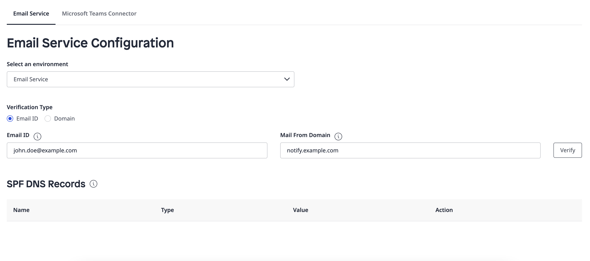
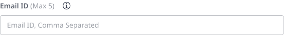
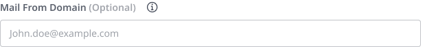
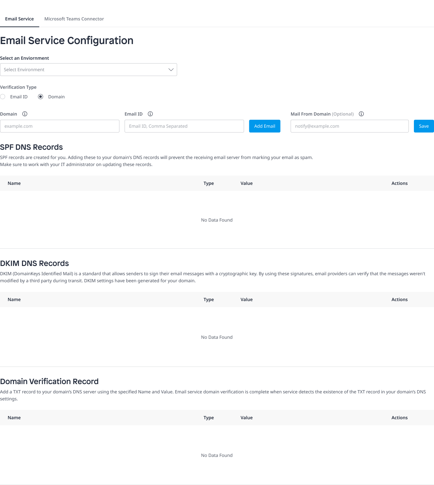
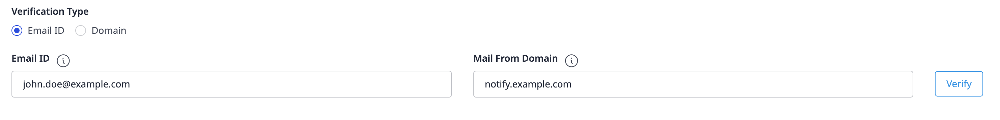
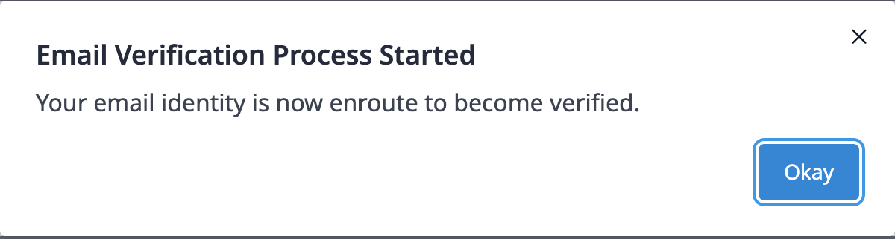
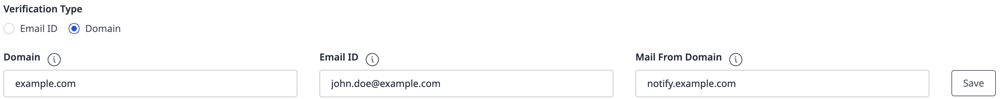
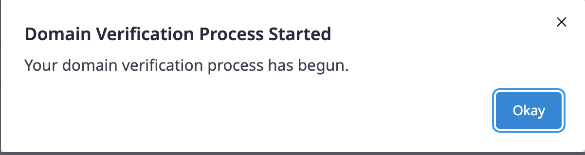
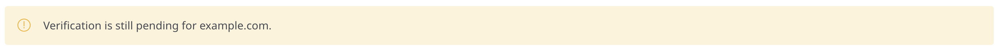

## 1 Introduction

The [Email Service](https://marketplace.mendix.com/link/component/118393) app service enables including an email component in your Mendix application. Just add the minimum required configuration and you are good to go.

The app service works with [Mendix SSO](/appstore/modules/mendix-sso), so no additional authentication changes are required.

### 1.1 Typical Use Cases

* The app service supports sending HTML and plain text messages
* You can add recipients in the "To", "CC", and "BCC" lists to send emails to multiple recipients
* You can send emails with or without attachments

### 1.2 Features

This app service enables doing the following:

* Send HTML and plain text messages to multiple recipients
* Send attachment(s) with a message
* Supports setting up a custom Mail From domain to improve your deliverability

### 1.3 Limitations

* The total number of recipients in the "To", "CC", and "BCC" lists cannot exceed 50
* The cumulative size of the attachment(s) cannot exceed 10 MB
* Certain files, for example, executables, scripts, and macros, are not supported as attachments. For an exhaustive list of unsupported file types, see the [Unsupported File Types for Attachments](#unsupported-file-types) section

### 1.4 Prerequisites

This app service can only be used with Studio Pro 9 versions starting with [9.4](/releasenotes/studio-pro/9.4).

## 2 Installation

### 2.1 Obtaining SecretKey and UserName{#obtain-keys}

Email Service is a premium Mendix product that is subject to a purchase and subscription fee. To successfully use this app service in your app, first you need to start a subscription or a trial to get a SecretKey and a UserName.

#### 2.1.1 Starting a Trial

A trial gives everyone in your company one-month access to the app service. To start a trial, perform the following steps:

1. Go to the [Email Service](https://marketplace.mendix.com/link/component/118393) page in the Marketplace.
2. Click **Try for Free** to open the **Start Your Free Trial** page. Here you can see the **Trial Details** for the app service.
3. Select the check box to agree to the **Terms & Conditions**.
4. Click **Enable Trial**. A page opens and confirms that the your request has been received.
5. Wait until your request is processed. It can take more than at least 15 minutes for the system to process your request. After your request is processed, you will receive an email that says the app service is ready to be used.
6. Click the link in the email to go to the [My Subscriptions](/appstore/general/app-store-overview#my-subscriptions) page and log in there. This page shows all the products that you have trials for.
7. Click **Email Service** to open the [service management dashboard](/appstore/general/app-store-overview#service-management-dashboard).
8.  Follow the instructions in the [Creating Binding Keys](/appstore/general/app-store-overview#creating-binding-keys) section in the *Marketplace Overview* to create a **SecretKey** and a **UserName**. Save the **SecretKey** and the **UserName** somewhere safe. You need to [configure](#configure-keys) them in your app later.

    

#### 2.1.2 Starting a Subscription

1. Go to the [Email Service](https://marketplace.mendix.com/link/component/118393) page in the marketplace.
2. Click **Subscribe** to start a subscription.
3. Select your subscription plan.
4. Fill in **Technical Owner** information (**First Name**, **Last Name**, **Email Address**), billing account information, payments and other required information and then place the order. A page opens and confirms that the your request has been received.
5. Wait until your request is processed. It can take more than 15 minutes for the system to process your request. After your request is processed, the Technical Contact will receive an email that says the app service is ready to be used.
6. Click the link in the email to go to the [Company Subscriptions](/appstore/general/app-store-overview#company-subscriptions) page and log in there. This page gives an overview of all the subscriptions of your organization.
7. Click **Email Service** to open the [service management dashboard](/appstore/general/app-store-overview#service-management-dashboard).
8.  Follow the instructions in the [Creating Binding Keys](/appstore/general/app-store-overview#creating-binding-keys) section in the *Marketplace Overview* to create a **SecretKey** and a **UserName**. Save the **SecretKey** and the **UserName** somewhere safe. You need to [configure](#configure-keys) them in your app later.

    

### 2.2 Installing the Component in Your App

To download and install the Email Service app service in your app, follow the instructions in the [Importing Content from the App Explorer](/appstore/general/app-store-content#import) section in *Use Marketplace Content in Studio Pro*. After the app service is installed, you can find it in the **App Explorer** and also in the **Communication Services** category in the **Toolbox**.

## 3 Configuring SecretKey and UserName {#configure-keys}

Before you deploy an app, you should configure the binding keys in your app as follows:

1.  In the **App Explorer**, go to **SendEmailModule** > **Configurations**. You can see **SecretKey** and **UserName** are defined as constants. 

    

2. For each constant, double-click the constant, enter the key that you saved, and click **OK** to save the changes.

## 4 Usage

### 4.1 Sending Messages to Recipients 

You can use the Email Service in a microflow to send HTML or plain text messages. The Email Service comes bundled with predefined entities **EmailAttr** and **SendEmailResponse**.

You can create a list using the **EmailAttr** entity to specify the **To**, **CC**, **BCC** recipients. For more information, see [Working with Lists in a Microflow](/howto/logic-business-rules/working-with-lists-in-a-microflow).

{}Every email address to whom this message is sent is counted as utilization towards the allocated app service quota. If the email addresses are incorrect, the email will bounce back.{}

This representative microflow contains an entity with the required attributes, an action to send an email that internally calls the Java action, and a placeholder to capture the return code of the sending email action.

To configure the **Send email** activity, double-click the activity and specify the following settings in the **Send Email** dialog box with expression syntax:

* **Required Fields**
    * **From** – Defines the sender's email
    * **To**  – Defines the recipients of the email
    * **Subject**  – Defines the subject of the email
*  **Optional Fields**

    {}For all **Optional Fields**, you must either define a value or select **empty** for the field. Otherwise, you will get an "missing value" error.{}

    * **Cc** – Defines the recipients on the CC list of the email
    * **Bcc** – Defines the recipients on the BCC list of the email
    * **Content type** – Defines whether the email is a **Text** or **HTML** message
    *  **Body** – Defines the body of the email

    {}If you want to send an HTML message, you can generate HTML content, and add the generated HTML string in the **Body** field. For more information, see the [Generating HTML Body Content](#generate-html-body) section below.{}
  
    * **Attachment** – Defines the attachment to the email

After the **Send Email** activity is configured, once the microflow that uses this activity is triggered, the app asynchronously sends out the message to the recipients.

#### 4.1.1 Generating HTML Body Content {#generate-html-body}

The following microflow shows a possible way to generate HTML content using a template. The template contains fixed text with some placeholders for variables.

The second step of the microflow creates an HTML file from the template contents after possible variable substitution.

The third step of the microflow generates a string from this HTML file using the **String from file** action.

In the last step of the microflow, you can add the variable for the generated HTML content into the **Body** field of the **Send email** activity.

### 4.2 Sending Message with Attachment(s) to Recipients

This is a representative microflow that sends emails with file attachments. The file attachments should have the file types that are [supported](#unsupported-file-types).
	

	
The **Attachment** attribute accepts a list of **FileDocumentObject**. You can either use **System.FileDocument** or use [File Dropper](https://marketplace.mendix.com/link/component/111497) to create a list of **FileDocumentObject** that will be sent as attachments with the email.

{}The size of the attached file(s) multiplied by the total number of recipients in the "To", "CC", and "BCC" lists is counted against the Data transfer utilization.{}

#### 4.2.1 Unsupported File Types for Attachments {#unsupported-file-types}

The following file types are not supported as attachments:

*.ade*, *.adp*, *.app*, *.asp*, *.bas*, *.bat*, *.cer*, *.chm*, *.cmd*, *.com*, *.cpl*, *.crt*, *.csh*, *.der*, *.exe*, *.fxp*, *.gadget*, *.hlp*, *.hta*, *.inf*, *.ins*, *.isp*, *.its*, *.js*, *.jse*, *.ksh*, *.lib*, *.lnk*, *.mad*, *.maf*, *.mag*, *.mam*, *.maq*, *.mar*, *.mas*, *.mat*, *.mau*, *.mav*, *.maw*, *.mda*, *.mdb*, *.mde*, *.mdt*, *.mdw*, *.mdz*, *.msc*, *.msh*, *.msh1*, *.msh2*, *.mshxml*, *.msh1xml*, *.msh2xml*, *.msi*, *.msp*, *.mst*, *.ops*, *.pcd*, *.pif*, *.plg*, *.prf*, *.prg*, *.reg*, *.scf*, *.scr*, *.sct*, *.shb*, *.shs*, *.sys*, *.ps1*, *.ps1xml*, *.ps2* *.ps2xml*, *.psc1*, *.psc2*, *.tmp*, *.url*, *.vb*, *.vbe*, *.vbs*, *.vps*, *.vsmacros*, *.vss*, *.vst*, *.vsw*, *.vxd*, *.ws*, *.wsc*, *.wsf*, *.wsh*, .xnk

### 4.3 Checking Statistics on the Usage Dashboard

The **Usage** dashboard shows the real-time statistics about the usage of an app service. For the Email Service, perform the following steps to check the number of emails sent and data transfer usage:

1. Log into the Marketplace.
2. Go to **My Marketplace** and Click [Company Subscriptions](/appstore/general/app-store-overview#company-subscriptions) on the left navigation menu. This page gives an overview of all the subscriptions of your organization.
3.  Click **Email Service** to open the [service management dashboard](/appstore/general/app-store-overview#service-management-dashboard). On the **Overview** tab, the **Usage** dashboard shows the following statistics:

    * **Current Month** – Shows statistics for current month usage
    * **Last Month** – Shows usage statistics for last month
    * **Till date** – Shows usage statistics from the start of the subscription date to today

## 5 Increasing the Deliverability of Your Emails

You can make your emails comply with [Domain-based Message Authentication, Reporting and Conformance (DMARC)](https://dmarc.org/) to increase the deliverability of your emails. This is a protocol that helps mail servers validate whether an incoming email is authorised by the administrators of the sending domain. To comply with DMARC, you can use the Sender Policy Framework (SPF) method.

You can configure your environments with email addresses that you wish to use to send emails by using the Communication Services Console. 

You can use the **Email ID** text input box to provide sender's email address. 

Optionally you can also provide **Mail From Domain** information that you may wish to use with your [Email Service](https://marketplace.mendix.com/link/component/118393) instance. For more details you can check [Configuring the Mail From Domain](#config-mail-from-domain) section. 

You can also opt for the domain configuration by providing the domain address. Along with the domain, you are required to provide sender's email addresses to be used to send emails. 

### 5.1 Configuring the Mail From Domain {#config-mail-from-domain}

Sender Policy Framework (SPF) is an email authentication method. During the delivery of an email, SPF allows the mail server to check whether an incoming email claiming to come from a specific domain is submitted by an IP address authorized by the administrators of that domain. 

To achieve The SPF validation, you must meet these two requirements:

* The domain in the Mail From address of your email must authorize the sending mail server to send the email via a DNS record
* The domain in the From address of your email must match the Mail From domain (the From address is used in the email header and shown to the email recipients, while the Mail From address is used by mail servers to return bounce messages and other error notifications. Both addresses are used to indicate the source of an email.)

If you use the default Mail From domain of the Email Service, you can only meet the first requirement. To meet the second requirement, you must use your own Mail From domain.

To configure your custom Mail From domain, you should work with your IT administrators to add the MX and SPF records.

### 5.2 SPF and MX Records {#spf-and-mx-records}

The SPF record is a list of authorized sending hosts and IP addresses for a domain, which is published in the domain's DNS records.

A mail exchanger record (MX record) shows which mail server is responsible for accepting email messages on behalf of a domain name. It is a resource record in the DNS.

The SPF record and MX record use the formats shown in the following table:

| Name | Format | Value |
| --- | --- | --- |
| notification.domain.com | TXT | "v=spf1 include:amazonses.com ~all" |
|notification.domain.com | MX | 10 feedback-smtp.eu-central-1.amazonses.com|

### 5.3 Verification

You can select either **Email** or **Domain** verification by using the radio option.

#### 5.3.1 Email Id Verification

When you configure email address for your environment, you are required to go through a verification process. You can use the **Verify** button to verify individual email addresses. 

Soon after you should get an alert window indicating that the verification process is in progress.

You should receive an email from `verify-email@notify.mendix.com` to the configured email address. Click on the link provided in the email to complete the process. Until the verification process is complete, you shall continue to see a message saying the verification is **Pending**.

#### 5.3.2 Domain Verification

Similarly, you can opt for domain verification. You can use the **Save** button to verify domain address. 

You should get an alert window indicating that the verification process is in progress.

Until the verification process is complete, you shall continue to see a message saying the verification is **Pending**.

## 6 Read More
* [Send Emails from a Mendix App](https://academy.mendix.com/link/paths/117/Send-Emails-from-a-Mendix-App-)
