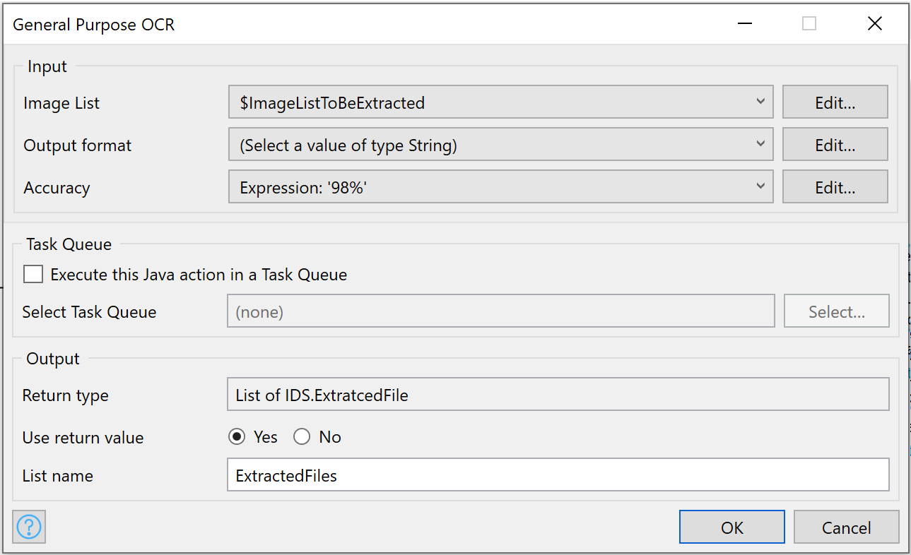

## 1 Introduction
The app service provides a capability to extract the entire text from the images or pdf documents.

### 1.1 Typical Use Case
You can simply use _General Purpose OCR Activity_ to process images in bulk. 

### 1.2 Features
* Extract data from bulk images and get output in JSON or XML formats

## 2 Installation

Follow the instructions in [How to Use App Store Content in Studio Pro](../general/app-store-content) to import the _General Purpose OCR_ module into your app.

## 3 Configuration

### 3.1 General Purpose OCR Activity
Once the module is imported, _General Purpose OCR Activity_ will appear in your toolbox.

Drag and drop _General Purpose OCR Activity_ (_Document Data Capture Services_ Catagory) into your microflow

### 3.2 Image List: 
List of Image objects (Inherited from System.Image)

### 3.3 Output Format: 
JSON or XML

### 3.4 Task Queue: 
Provide Task Queue to execute Extraction action

### 3.5 Output:
Extracted output in selected format (String).
