## 1 Introduction

{}[update doc links on Documentation tabs for components already released ]{}

The [Intelligent Document Service](https://marketplace.mendix.com/link/component/118388) app service uses AI and OCR technologies to extract text and key value pairs from images of documents in bulk. For more information, see the [Technical Provider](#technical-provider) section.

### 1.1 Features

* Extract data from images in bulk and map data to an entity
* Train a model using sample images by marking specific areas in images
* Support [Mendix SSO](/appstore/modules/mendix-sso)

### 1.2 Limitation

* Currently only supports images in JPG and JPEG formats
* Each image file size cannot exceed 50 MB.

### 1.3 Prerequisites

This app service works best with Studio Pro 8 versions starting with [8.18.5](/releasenotes/studio-pro/8.18#8185) and 9 versions starting with [9.0](/releasenotes/studio-pro/9.0).

## 2 Installation

1. Go to the [Intelligent Document Service](https://marketplace.mendix.com/link/component/118388) component page in the Marketplace and download the *.mpk* file.
2.  To add the Intelligent Document Service to your app in Mendix Studio Pro, follow these steps:
    1.  In the **App Explorer** (in Studio Pro 9) or **Project Explorer** (in Studio Pro 8), right-click the app.
    2.  Click **Import module package** and then select the *.mpk* file.

        

        In the **Import Module** dialog box, **Add as a new module** is the default option when the module is being downloaded for the first time, which means that new entities will be created in your app.

        {}If you have made any edits or customization to a module that you have already downloaded, be aware of the **Replace existing module** option. This will override all of your changes with the standard Marketplace content, which will result in the creation of new entities and attributes, the deletion of renamed entities and attributes, and the deletion of their respective tables and columns represented in the database. Therefore, unless you understand the implications of your changes and you will not update your content in the future, making edits to the downloaded modules is not recommended.{}

   3. In the **Import Module** dialog box, click **Import**. 
   4. Wait until a pop-up box states that the module was successfully imported. Click **OK**.
   5. Open the **App Explorer** or **Project Explorer** to view the **IntelligentDocService** module. You can also find the app service in the **Document Data Capture Service** category in the **Toolbox**.

## 3 Configuration

The Intelligent Document Service is a premium Mendix product that is subject to a purchase and subscription fee. To successfully deploy an app that uses the Intelligent Document Service, you need to get a valid combination of certain keys and configure them as constants in the module.

### 3.1  Subscribing to Get Keys

1. On the [Intelligent Document Service](https://marketplace.mendix.com/link/component/118388) component page in the Marketplace, click **Subscribe** to order a subscription or click **Try for Free** to start a trial..
2. Fill in the [Technical Contact](/developerportal/collaborate/app-roles#technical-contact) information (**First Name**, **Last Name**, **Email Address**), billing account information, and other required information, and then place the order. The Technical Contact receives an order confirmation email. 

    For the trial, you do not need to fill in this information.

3. Click the link in the order confirmation email to go to the Marketplace [Subscriptions](/appstore/general/app-store-overview#subscriptions) page and log in with your Mendix account. The **Subscriptions** page gives an overview of all the subscriptions of your organization.
4. Click **Intelligent Document Service** to open the [service management dashboard](/appstore/general/app-store-overview#service-management-dashboard).
5. Follow the instructions in the [Creating Binding Keys](/appstore/general/app-store-overview#creating-binding-keys) section in the *Marketplace Overview* to create binding keys.

### 3.2 Configuring Keys for Application Deployment

1.  In the **App Explorer** or **Project Explorer**, go to **IntelligentDocService** > **Configurations**. **Access_Key**, **Secret_Key** and **Encryption_Key** are defined as constants.

    

2. For each constant, double-click the constant, enter the key that you saved, and click **OK** to save the changes.

## 4. Usage

To use the Intelligent Document Service, first [train a model](#document-model-training) using sample images, then create an [import mapping](#mapping-file) that defines how to map extracted data from images to an entity, and then include the [intelligent document activity](#extraction-activity) in a microflow. This microflow should be set up to accept your trained model and images, extract data from the images in bulk and then map the data to an entity using the import mapping that you created.

### 4.1 Training a Document Model {#document-model-training}

1.  Perform the following steps to log into the **Document Model Training** application:
    1.  Log into the Marketplace with your Mendix account.
    2.  Go to **My Marketplace** and click [Subscriptions](/appstore/general/app-store-overview#subscriptions) on the left navigation menu. The **Subscriptions** page gives an overview of all the subscriptions of your organization.
    3.  Click **Intelligent Document Service** to open the service management dashboard.
    4.  Click **Manage Instance** to open the **Document Model Training** application.

        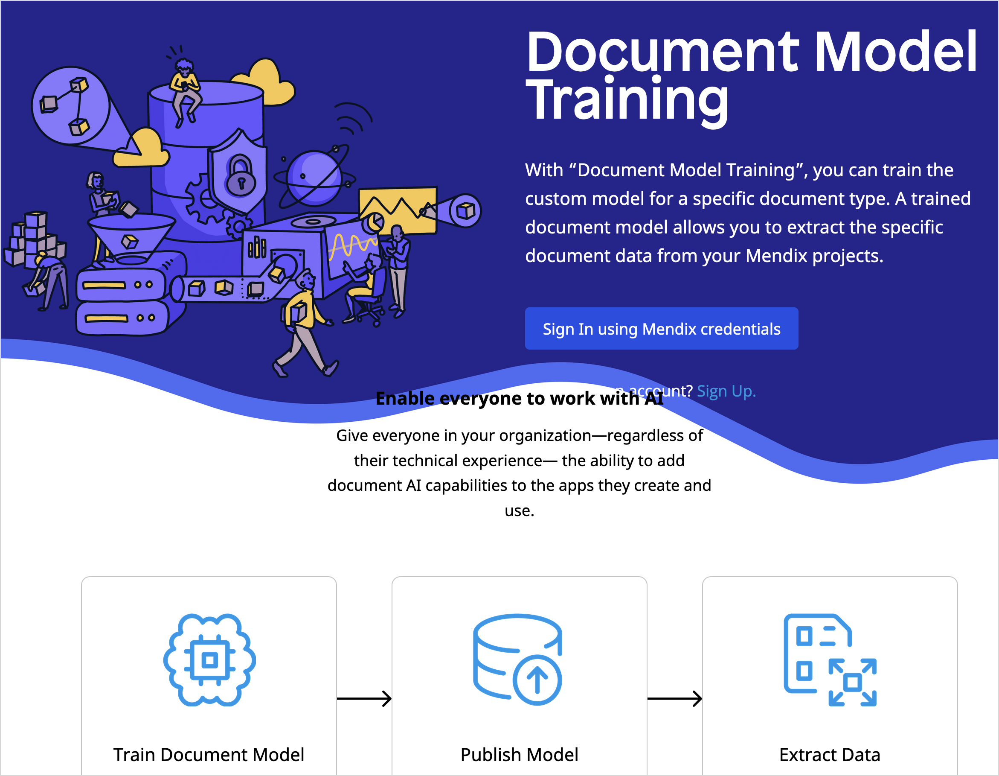

    5. Log into the [Document Model Training](https://datacapture-appservices.mendixcloud.com/login.html) application using your Mendix account.
2.  Click **Environment** to show the **Existing Models** list.

    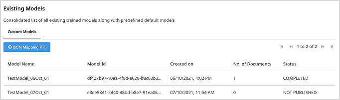

    {} The model is ready to use only when the **Status** of this model is **Published**. {}

3.  To train a new model, click **Create New Model** on the page. The **Create New Model** dialog box opens.

    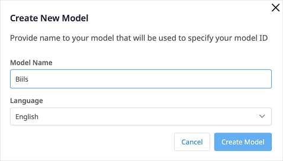

4.  Enter a unique **Model Name**. select a **Language**, and then click **Create Model**.

    {} The model name should not exceed 55 characters. You can only use characters (a-z, A-Z), numbers (0-9), and underscore (\_). {}

5. Wait until the **Import File** page opens.
6.  Drag sample images in JPG or JPEG format into the box where it says **Drag & Drop Image Here**. You can also click the box and select the files.

    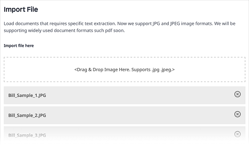
    
    {} Multiple files can be uploaded but individual image file size cannot exceed 50MB. {}
    
7.  Click **Next**. The **Add Marker and IDs** page opens. The status of the images you imported shows **Not Marked**.

    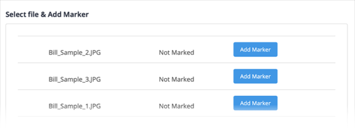

8.  To mark an image, perform the following steps:
    1. Click **Add Markers**. The **Mark Document** dialog box opens.
    2.  In the **Choose fields to mark** pane, select a field of interest from which some meaningful data needs to be extracted.

        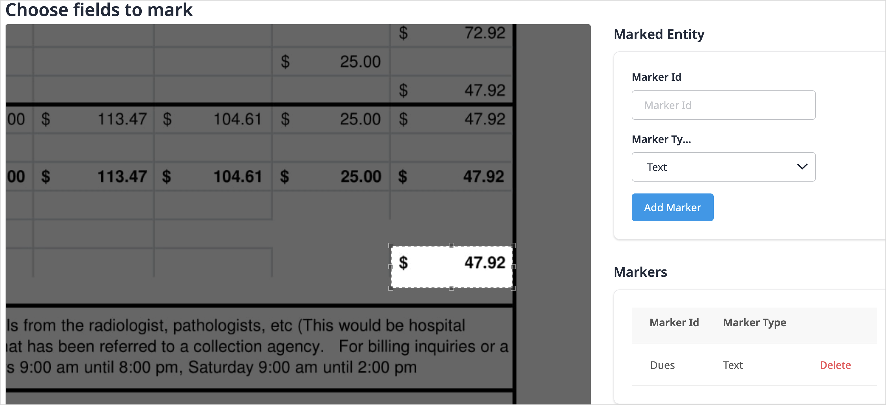

    3. On the right side, enter a **Marker ID** that is used for the area that you selected.
    4.  Select the **Marker Type**. It can be **Text** or **Checkmark**.
    5. Click **Add Marker** to add the marker to the list of **Markers**.
    6. To delete a marker from the **Markers** list, select the marker and click the delete icon on top of the list.
    7.  When you add all the markers for this image, click **Done** to close the **Mark Document** dialog box. The status of the images becomes **Marked**.

        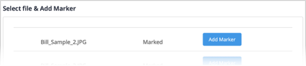

    8. Repeat the steps above until you mark all the images, and then Click **Publish**. The new model appears in the **Existing Models** list with the status **IN PROGRESS**.
9.  Wait until the **Status** of the model becomes **Published**.
10. Once the model is published, this pop-up window opens:
    
    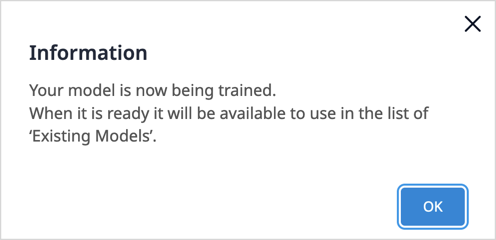
    
    Click **OK** to close the pop-up window. The model is ready to use. 
    
    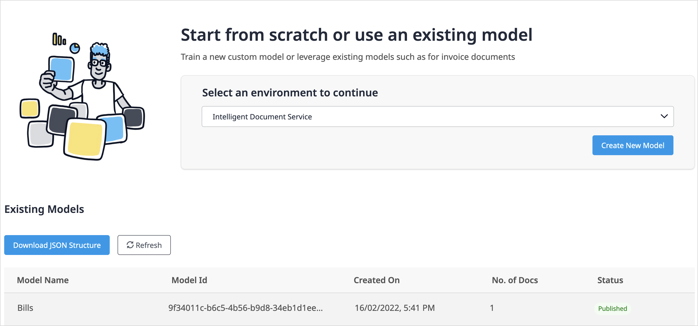

### 4.2 Creating an Import Mapping{#mapping-file}

You need to use an [import mapping](/refguide/mapping-documents#import-mappings) to populate extracted data into an entity. If necessary, you can further process the entity with [event handlers](/refguide/event-handlers).

1.  To create an import mapping, you need a JSON structure. Perform the following steps to generate the JSON structure:
    1.  Log into the [Document Model Training](#document-model-training) application with your Mendix account.
    2.  Click **Environment** to show the **Existing Models** list.
    3.  Select your trained model. Make sure that the **Status** of the model is **Published**. Note down the **Model Id**. You will need it when you [extract data with the trained model ](#extraction-activity).
    4.  Click **Download JSON Structure**. The **Generate JSON Structure** dialog box opens.
    5.  Drag one of the sample images, which you used to train the document model, into the box where it says **Drag & Drop Image Here**.

        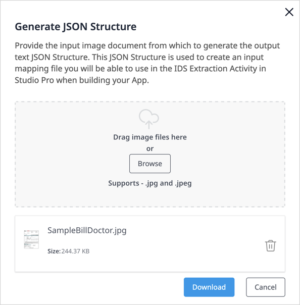

    6. Click **Download** to get the JSON structure.

    {} Generated JSON structure file size cannot exceed 50MB. {}
    
2.  To add the JSON structure to your app, perform the following steps:
    1.  In the **App Explorer** or **Project Explorer**, right-click the module or the folder where you want to add the generated JSON structure.
    2.  From the pop-up menu, select **Add other** > [JSON structure](/refguide/json-structures).

        

    3. In the **Add JSON Structure** dialog box, enter a **Name** for the JSON structure and click **OK**. The **JSON Structure** dialog box opens.
    4. In the **JSON Snippet** box, add the content of the JSON structure that you have generated. The system converts the JSON snippet into a schema structure automatically. You will need this schema structure to create the import mapping.
    5. Click **OK** to save the changes and close the dialog box.
3.  To create the import mapping, perform the following steps:
    1. In the **App Explorer** or **Project Explorer**, right-click the module or the folder where you want to add the import mapping.     
    2. From the pop-up menu, select **Add other** > **Import mapping**.
    3. In the **Add Import Mapping** dialog box, enter a **Name** for the import mapping and click **OK**. The **Select schema elements for import mapping** dialog box opens.    
    4.  For **Schema source**, select **JSON structure** and **Select** the JSON structure that you created.
    
        
    5. Click **OK** to save the changes and close the dialog box.

### 4.3 Extracting the Data with the Trained Document Model {#extraction-activity}

1.  In the **Toolbox**, drag **Intelligent Document Service** activity from the **Document Data Capture Service** category into your microflow.

    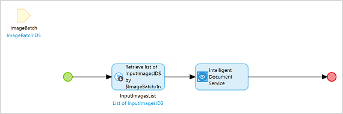

2. Create a list of image that inherits from `System.Image`. Images where data are extracted should be passed as a list, as shown in the microflow above.
3.  Double-click the **Intelligent Document Service** activity to open the dialog box.

    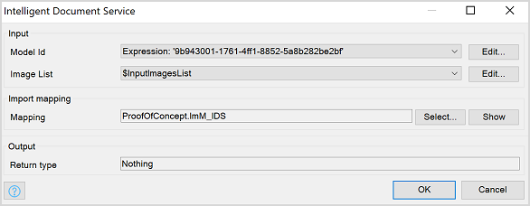

4. For **Model Id**, click **Edit** to enter the **Model Id** of your model.
5. For **Image List**, click **Edit** to select the **Image List** which inherits from `System.Image`.
6. For **Mapping**, **Select** the import mapping that you created to define how extracted data should be mapped into an entity.
7. Click **OK** to save the changes and close the dialog box.

{} Optionally for further automation, add [event handlers](/refguide/event-handlers) on the entity where you populate the extracted data. You can call your own microflow to process the extracted data when inserted into the entity. For example, you can modify, validate, and pass the data to next steps. By doing this, you can achieve full end-to-end automation.{}

### 4.4 Checking Statistics on the Usage Dashboard

The **Usage** dashboard shows the real-time statistics about the usage of an app service. Perform the following steps to check the real-time statistics:

1. Log into the Marketplace.
2. Go to **My Marketplace** and click [Subscriptions](/appstore/general/app-store-overview#subscriptions) on the left navigation menu. The **Subscriptions** page gives an overview of all the subscriptions of your organization.
3. Click **Intelligent Document Service** to open the [service management dashboard](/appstore/general/app-store-overview#service-management-dashboard). On the **Overview** tab, the **Usage** dashboard shows the real-time statistics.

## 5 Technical Provider{#technical-provider}

The AI and OCR technologies used by Intelligent Document Service are powered by [ABBYY&reg;](https://www.abbyy.com). Application includes ABBYY® FlexiCapture® 12 SDK © 2019 ABBYY Production LLC., and also that ABBYY and FLEXICAPTURE are either registered trademarks or trademarks of ABBYY Software Ltd. and cannot be used without prior written consent of ABBYY Software Ltd.

