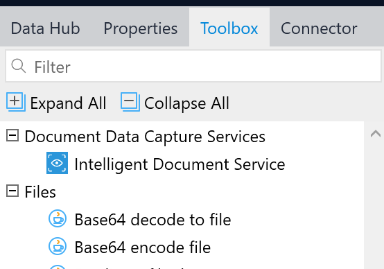
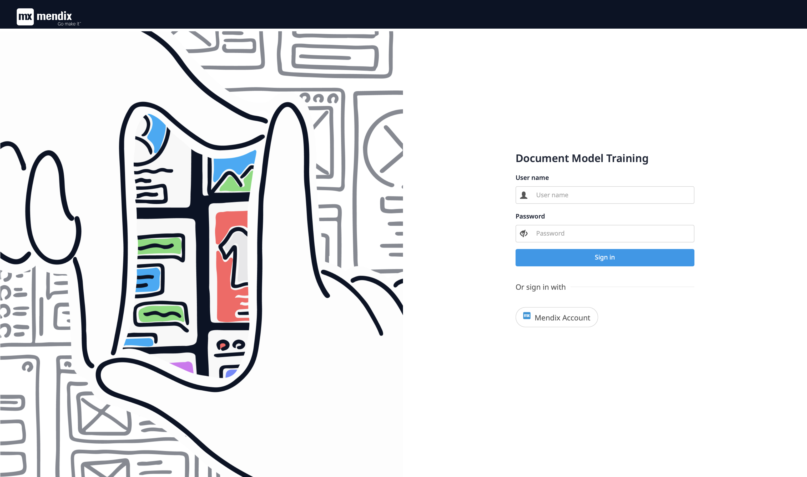
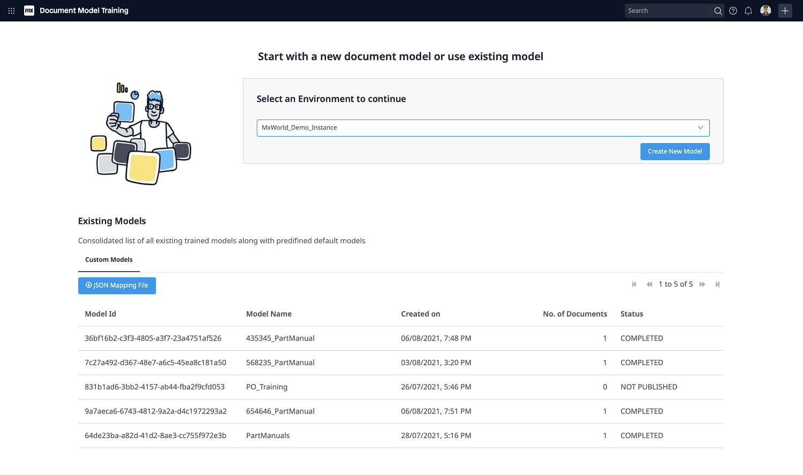
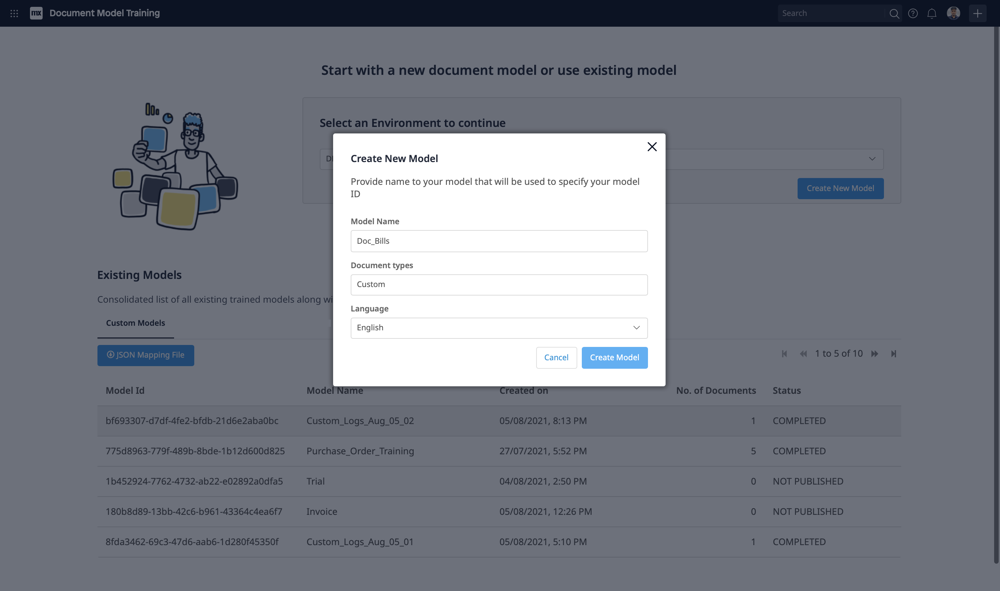
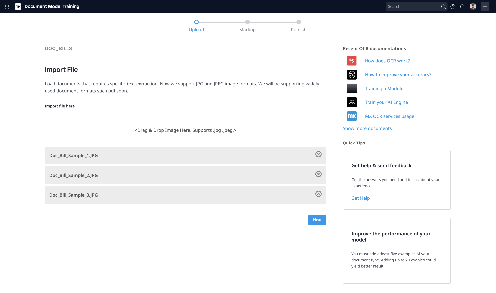
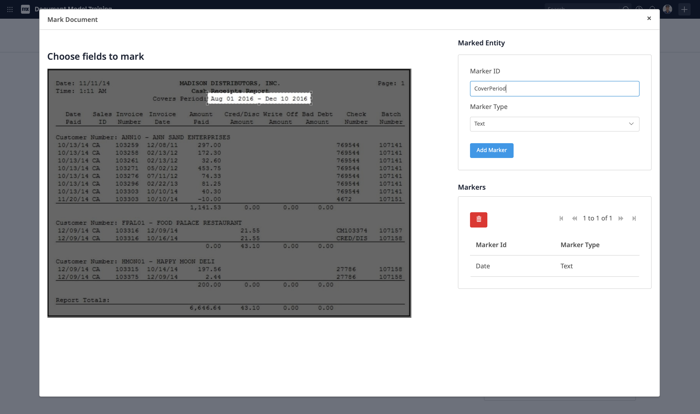
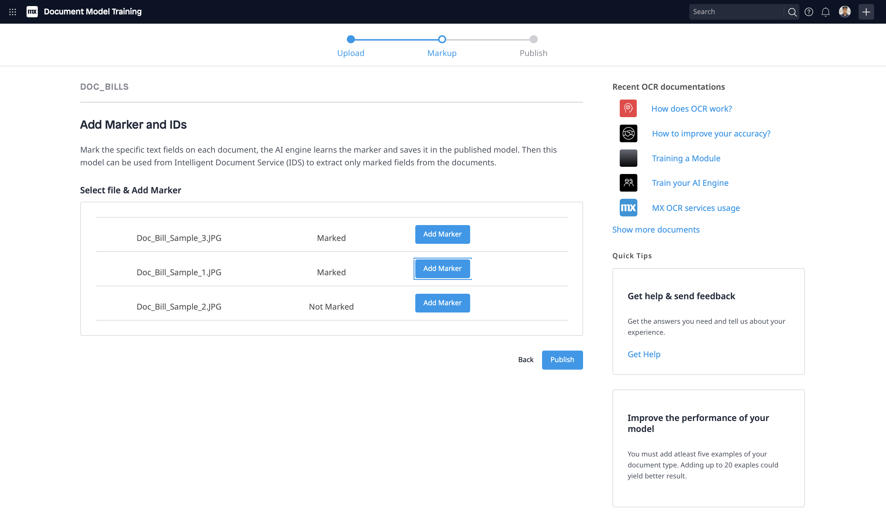
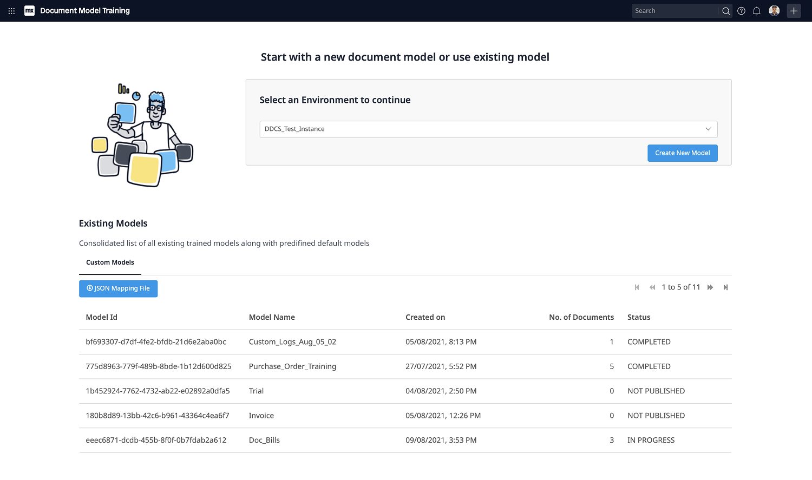
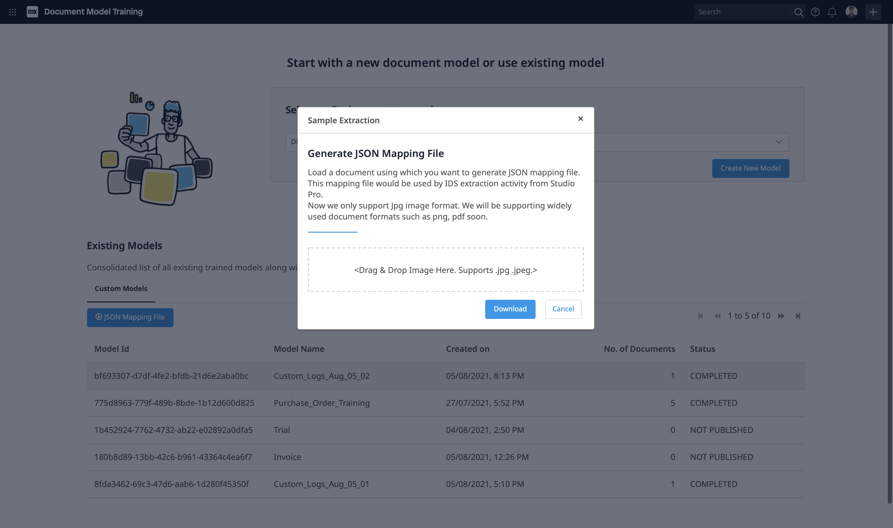

## 1 Introduction
Intelligent Document Service provides text, key value pairs from documents. The app service utilizes many cutting-edge AI technologies along with OCR to extract the specific text from documents.

### 1.1 Typical Use Case
Using _Intelligent Document Service_ in your app is very easy. Maker has to download and include the module in an app. The IDS activity appears in the microflow toolbox. Drag it in the microflow and configure couple of parameters and that’s it. An activity expects a trained model input, use _Document Model Training_ App to create one. Please refer section [4 Document Model Training](#4-document-model-training) for more information. For authentication, service uses Mendix SSO.

### 1.2 Features
* Extract data from bulk images and map to entity
* Train a model using sample images by marking and labeling specific are in the image

### 1.3 Limitation
Supports only jpg / jpeg image formats.

## 2 Installation

Follow the instructions in [How to Use App Store Content in Studio Pro](../general/app-store-content) to import the _Intelligent Document_ module into your app.

## 3 Configuration

### 3.1 Intelligent Document Service Activity
Once the module is imported, _Intelligent Document Service Activity_ will appear in your toolbox.

Drag and drop _Intelligent Document Service Activity_ (_Document Data Capture Services_ Catagory) into your microflow

### 3.2 Model ID: 
Model ID can be used after Model trained and published successfully, refer section [4 Document Model Training](#4-document-model-training).

### 3.3 Image List: 
List of Image objects (Inherited from System.Image)

### 3.4 Mapping: 
Provide _Import Mapping_ to which extracted data will be mapped. Refer _step 11_ in section [4 Document Model Training](#4-document-model-training) to get JSON to create _Import Mapping_.

### 3.5 Task Queue: 
Provide Task Queue to execute Extraction action. Ref: [For Mendix v9.0.3+](../../refguide/task-queue) , [For Mendix v9.0.3-](../modules/process-queue)

## 4 Document Model Training

1. Visit _Document Model Training_ App

2. Login with _Mendix Account_.

3. Select _Environment_. Existing Models list will show up. 

You can use Model Id in _Intelligent Document Service Activity_ if status is _COMPLETED_.

Follow _step 11_ to get JSON to create _Import Mapping_.

4. To create and train a new model, select _Create New Model_. Provide unique _Model Name_, _Language_ and Select _Create Model_.

5. Upload sample image to train new model (jpg / jpeg only) and select _Next_.

6. Select _Add markers_ to Mark Document. Below screen will show up. Here,

    1. _Image_: you can select area from where text is expected
    2. _Marker ID_: label for that text
    3. _Marker Type_: type Text / Checkmark
    4. _Add Marker_: to add Marker to list
    5. _Markers_ : Select and Delete of marker added
    6. Close popup once marking is done.

8. Image list will show status of Marking. Please add markers to all image and proceed to _Publish_

9. After _Publish_, Model will appear in list with status _IN PROGRESS_

10. Once _Status_ of Model is _COMPLETED_, Model is ready to use

11. Get JSON Mapping file to use with [Intelligent Document Service Activity](#34-mapping),

    1. Select record in Existing Model list status _COMPLETED_ 
    2. Select _JSON Mapping File_
    3. Upload sample image used while training
    4. Select _Download_ to get JSON file
    
