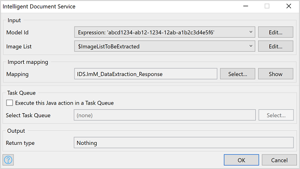
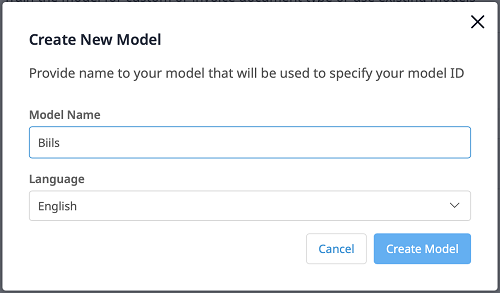
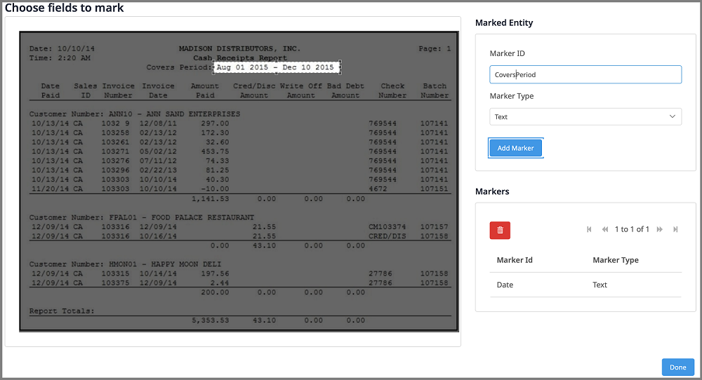
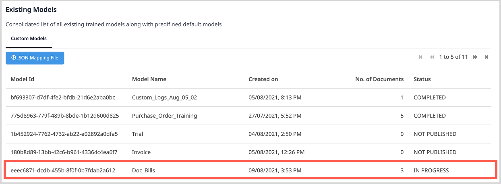
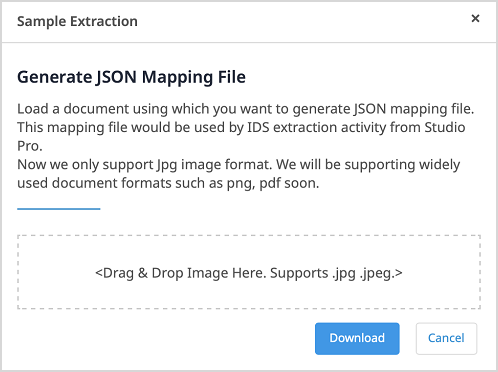

## 1 Introduction

The [Intelligent Document Service](https://marketplace.mendix.com/link/component/118388) app service uses AI and OCR technologies to extract text and key value pairs from documents. 

To use it, you need to include the **Intelligent Document Service** activity in your microflow. This activity expects a trained model input, which you create using the Document Model Training app. For more information, see the section [Training a Model](#document-model-training). 

### 1.1 Features

* Use Mendix SSO for authentication
* Extract data from images in bulk and map data to entities
* Train a model using sample images by marking specific areas in images

### 1.2 Limitation

* Only supports images in JPG and JPEG formats

## 2 Installation

1. Follow the instructions in [How to Use Marketplace Content in Studio Pro](/appstore/general/app-store-content) to import the Intelligent Document module into your app.

2.  In the **Toolbox**, drag the **Intelligent Document Service** activity from the **Document Data Capture Services** category into your microflow.

## 3 Configuration

1. Double-click the **Intelligent Document Service** activity to open the **Intelligent Document Service** dialog window.

    

2. Select the **Model Id** of your model. You can also click **Edit** it.

   {}
   After the training of a model is **COMPLETED **in the Document Model Training app, you can use its **Model Id**. For more information, see the section [Training a Document Model](#document-model-training). 
   {}

3. Select an **Image List** which inherits from `System.Image`. You can also click **Edit** to edit it.

4. In the **Mapping** field, **Select** a **Mapping** file to define how extracted data is mapped.

   {}
   For details on how to get the JSON mapping file, see [Getting a JSON Mapping File](#mapping-file).
   {}
   
5. If you want to execute the extraction action in a task queue, select **Execute this Java action in a Task Queue**, then click **Select** and select a task queue.

   {}
   For more information, see [Task Queue](/refguide/task-queue) (for Mendix version 9.0.3 and above) or [Process Queue](/appstore/modules/process-queue) (for Mendix version below 9.0.3).
   {}
   
6. Click **OK** to save the changes and close the dialog window.

7. To configure credential for the **Receipt Processing Service** activity, add the following constants with values in your Mendix app:

   * Access_Key
   * Encryption_Key
   * Secret_Key

     

   {}
   Credentials are generated when you create binding keys on Marketplace.
   {}

## 4 Training a Document Model {#document-model-training}

1. Open the **Document Model Training** app.

2. Login in to the app using your **Mendix Account**.

3. Click **Environment** to show the **Existing Models** list.

   
   
   If the **Status** of a model is **COMPLETED**, then you can use its **Model Id** in the **Intelligent Document Service** activity.

4. To create and train a new model, click **Create New Model** above the **Existing Models** list on the right side. The **Create New Model** dialog window opens.

5. Enter a unique **Model Name**, select a **Language**, select **Custom for Document types**, and then click **Create Model**.

    

    The **Import File** page opens.

6. Drag sample images in JPG or JPEG format into the box where it says **<Drag & Drop Image Here. Supports .jpg .jpeg.>**.

   

7. Click **Next**. The **Add Marker and IDs** page opens. The status of the images you imported is **Not Marked**.

    

8. To mark an image, perform the following steps:

   1. Click **Add Markers**. The **Mark Document** dialog window opens.

   

   2. On the left side, select an area in the image where text is expected.
   3. On the right side, enter a **Marker ID** that is used for the area that you select.
   4. Select the **Marker Type**. It can be **Text** or **Checkmark**.
   5. Click **Add Marker** to add the marker to the list of **Markers**.
   6. To delete a marker from the **Markers** list, select the marker and click the delete icon on top of the list.
   7. When you make all the markers for this image, close the **Mark Document** dialog window. The status of the image becomes **Marked**.

   

9. Repeat the step above until you mark all the images.

10. Click **Publish**. The new model appears in the **Existing Models** list with the status **IN PROGRESS**.

   Once the **Status** of the model becomes **COMPLETED**, the model is ready to use.    

## 5 Getting a JSON Mapping File {#mapping-file} 

1. Open the **Document Model Training** app.

2. Login in to the app using your **Mendix Account**.

3. Click **Environment** to show the **Existing Models** list.

4. Select a model that has the status **COMPLETED**.

5. Click **JSON Mapping File**. The **Sample Extraction** dialog window opens.

    

6. Drag sample images into the box where it says **<Drag & Drop Image Here. Supports .jpg .jpeg.>**.6. Drag sample images into the box where it says **<Drag & Drop Image Here. Supports .jpg .jpeg.>**.

7. Click **Download** to get the JSON file. 

8. Copy the **Model Id** and use it in the **Intelligent Document Service** activity.
