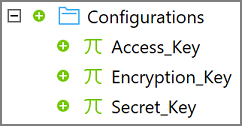
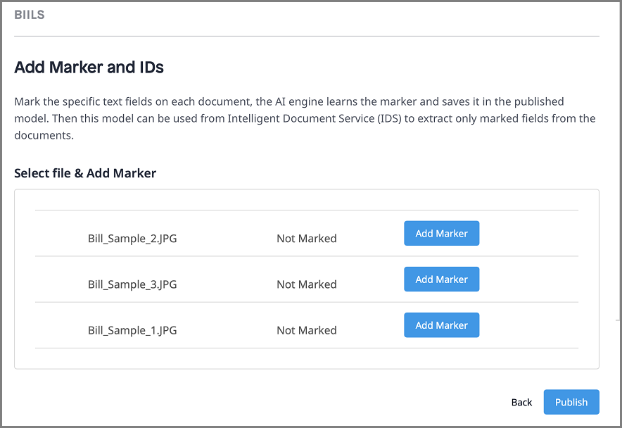

## 1 Introduction

The [Intelligent Document Service](https://marketplace.mendix.com/link/component/118388) app service uses AI and OCR technologies to extract text and key value pairs from documents.

To use the app service, you need to include the intelligent document service activity in your microflow. This activity expects a
trained model input, which you create using the Document Model Training app. For more information, see the section [Training a Model](#document-model-training).

### 1.1 Features

* Extract data from images in bulk and map data to entities
* Train a model using sample images by marking specific areas in images
* Support [Mendix SSO](/appstore/modules/mendix-sso)

### 1.2 Limitation

* Currently only supports images in JPG and JPEG formats

### 1.3 Prerequisites

This app best service works with Studio Pro 8 versions starting with [8.18.5](/releasenotes/studio-pro/8.18#8185) and 9 versions starting with [9.0](/releasenotes/studio-pro/9.0).

## 2 Installation

1. Go to [Marketplace](https://marketplace.mendix.com/link/component/118388) and download the *.mpk* file for Intelligent Document Service.

2. To add the Intelligent Document Service to your app in Mendix Studio Pro, follow these steps:

   1.  In the **App Explorer** (in Studio Pro 9) or **Project Explorer** (in Studio Pro 8), right-click the app.

   2. Click **Import module package** and then select the *.mpk* file.

      

      In the **Import Module** dialog box, **Add as a new module** is the default option when the module is being downloaded for the first time, which means that new entities will be created in your app.

      {}If you have made any edits or customization to a module that you have already downloaded, be aware of the **Replace existing module** option. This will override all of your changes with the standard App Store content, which will result in the creation of new entities and attributes, the deletion of renamed entities and attributes, and the deletion of their respective tables and columns represented in the database. Therefore, unless you understand the implications of your changes and you will not update your content in the future, making edits to the downloaded modules is not recommended.{}

   3. In the **Import Module** dialog box, click **Import**. 

   4. Wait until a pop-up box states that the module was successfully imported. Click **OK**.

   5. Open the **App Explorer** or **Project Explorer** to view the **IntelligentDocService** module.

Once imported, the app service is visible in the **App Explorer** or **Project Explorer** and in the **Document Data Capture Service** category in the **Toolbox**.

## 3 Configuration

Intelligent Document Service is a premium Mendix product that is subject to a purchase and subscription fee. To successfully deploy an app that uses Intelligent Document Service, you need to get a valid combination of certain keys and configure them as constants in the module.

### 3.1  Subscribing to Get Keys

1. On the [Intelligent Document Service](https://marketplace.mendix.com/link/component/118388) page, click **Subscribe** to order a subscription.

2. Fill in the [Technical Contact](/developerportal/collaborate/app-roles#technical-contact) information (**First Name**, **Last Name**, **Email Address**), billing account information, and other required information, and then place the order. The Technical Contact receives an order confirmation email.

3. Click the link in the order confirmation email to go to the Marketplace [Subscriptions](/appstore/general/app-store-overview#subscriptions) page and log in there. The **Subscriptions** page gives an overview of all the subscriptions of your organization.

4. Click **Intelligent Document Service** to open [service management dashboard](/appstore/general/app-store-overview#4-8-1-service-management-dashboard).

5. Click **Create Binding Keys**.

6. Enter a descriptive name for the binding keys. Make sure that the name includes the name of the app which uses Intelligent Document Service.

7.  Click **Create Keys** to generate the **Access_Key**, **Secret_Key** and **Encryption_Key**. The system generates the **Access_Key**, **Secret_Key** and **Encryption_Key**. 

    {}Do not close the following page yet. Once you close this page, you cannot retrieve the keys again.{}

    

8. **Copy** the **Access_Key**, **Secret_Key** and **Encryption_Key**. You need to use them later for app deployment.

After you copy the keys, you can close the page.

### 3.2 Configuring Keys for Application Deployment

1.  In the **App Explorer** or **Project Explorer**, go to **IntelligentDocService** > **Configurations**. You can see that **Access_Key**, **Secret_Key** and **Encryption_Key** are defined as constants.

    

2. Double-click each constant and enter the respective keys.

3. Click **OK** to save the settings.

## 4. Usage

To use the Intelligent Document Service, first [train a model](#document-model-training) using sample images, then create an [Import Mapping](#mapping-file) that defines how to map extracted data from images to entities, and then include the [intelligent document activity](#extraction-activity) in a microflow. This microflow should be set up to accept your trained model and your image files to extract, extract data from images in bulk and then map the data to entities using the Import Mapping that you created.

### 4.1 Training a Document Model {#document-model-training}

1. Perform the following steps to log into the **Document Model Training** application:

    1. Log into the Marketplace with your Mendix account.
    2. Go to **My Marketplace** and click [Subscriptions](/appstore/general/app-store-overview#subscriptions) on the left navigation menu. The **Subscriptions** page gives an overview of all the subscriptions of your organization.
    3. Click **Intelligent Document Service** to open the service management dashboard.
    4. Click **Manage Instance** to open the **Document Model Training** application.

       

    5. Log into the application with your Mendix account.

2. Click **Environment** to show the **Existing Models** list.

    

    {} The model is ready to use only when the **Status** of this model is **COMPLETED**. {}

3. To train a new model, click **Create New Model** on the page. The **Create New Model** dialog box opens.

    

4. Enter a unique **Model Name**, select a **Language**, and then click **Create Model**.

5. Wait until **Import File** page opens.

6. Drag sample images in JPG or JPEG format into the box where it says **Drag & Drop Image Here**.

    

7. Click **Next**. The **Add Marker and IDs** page opens. The status of the images you imported is **Not Marked**.

    

8. To mark an image, perform the following steps:

    1. Click **Add Markers**. The **Mark Document** dialog box opens.

       
       
    2. On the left side, select an area in the image where text is expected.

    3. On the right side, enter a **Marker ID** that is used for the area that you selected.

    4. Select the **Marker Type**. It can be **Text** or **Checkmark**.

    5. Click **Add Marker** to add the marker to the list of **Markers**.

    6. To delete a marker from the **Markers** list, select the marker and click the delete icon on top of the list.

    7.  When you add all the markers for this image, click **Done** to close the **Mark Document** dialog box. The status of the images becomes **Marked**.

        

    8. Repeat the steps above until you mark all the images, then Click **Publish**. The new model appears in the **Existing Models** list with the status **IN PROGRESS**.

9. Wait until the **Status** of the model becomes **COMPLETED**. At this time, the model is ready to use. 

### 4.2 Creating an Import Mapping{#mapping-file}

You need to use an [Import Mapping](/refguide/mapping-documents#2-import-mappings) to populate the extracted data into entity, and if necessary, further process the entity with [event handlers](/refguide/event-handlers).

1. To create an Import Mapping, you need a JSON mapping file. Perform the following steps to get the JSON mapping file:

    1. Log into the **Document Model Training** application with your Mendix account.

    2. Click **Environment** to show the **Existing Models** list.

    3. Select your trained model. Make sure that the **Status** of the model is **COMPLETED**. Note down the **Model Id**. You will need it when you [extract the data with the trained model ](#extraction-activity).

    4. Click **JSON Mapping File**. The **Generate JSON Mapping File** dialog box opens.

       

    5. Drag the sample images into the box where it says **Drag & Drop Image Here**.

    6. Click **Download** to get the JSON file.

2. To add the JSON file to your app, perform the following steps:

    1. In the **App Explorer** (in Studio Pro 9) or **Project Explorer** (in Studio Pro 8), right-click the module or the folder where you want to add the JSON file.

    2. From the pop-up menu, select **Add other** > [JSON structure](/refguide/json-structures).

       

    3. In the **Add JSON Structure** dialog box, enter a **Name** for the JSON Structure and click **OK**. The **JSON Structure** dialog box opens.

    4. In the **JSON Snippet** box, add the content of the JSON mapping file that you generated. The system converts the JSON snippet into a schema structure automatically. You will need this schema structure to create the Import Mapping.

    5. Click **OK** to save the changes and close the dialog box.

3.  To create the Import Mapping, perform the following steps:

    1. In the **App Explorer** or **Project Explorer**, right-click the module or the folder where you want to add the Import Mapping.
      
    2. From the pop-up menu, select **Add other** > **Import mapping**.
    
    3. In the **Add Import Mapping** dialog box, enter a **Name** for the Import Mapping and click **OK**. The **Select schema elements for import mapping** dialog box opens.
    
    4.  For **Schema source**, select **JSON structure** and **Select** the JSON structure that you created.
    
        
    6. Click **OK** to save the changes and close the dialog box.

### 4.3 Extracting the Data with the Trained Document Model {#extraction-activity}

1.   In the **Toolbox**, drag **Intelligent Document Service** activity from the **Document Data Capture Service** category into your microflow.

   

2. Create a list of image that inherits from `System.Image`. Images to be extracted should be passed as a list, as shown in the microflow above.

3. Double-click the **Intelligent Document Service** activity to open the dialog box.

   

4. Click **Edit** to enter the **Model Id** of your model.

5. Click **Edit** to select the **Image List** which inherits from `System.Image`.

6. In the **Mapping** box, **Select** the Import Mapping that you created to define how extracted data should be mapped into the entity.

7. Click **OK** to save the changes and close the dialog box.

{} Optionally for further automation, add [event handlers](/refguide/event-handlers) on the entity where you populate the extracted data. You can call your own microflow to process the extracted data when inserted into the entity. For example, you can modify, validate, and pass the data to next steps. By dong this, you can achieve full end-to-end automation.{}

### 4.4 Checking Statistics Using the Usage Dashboard

The **Usage** dashboard shows the real-time statistics about the usage of an app service. Perform the following steps to check the real-time statistics:

1. Log into the Marketplace.

2. Go to **My Marketplace** and click [Subscriptions](/appstore/general/app-store-overview#subscriptions) on the left navigation menu. The **Subscriptions** page gives an overview of all the subscriptions of your organization.

3. Click **Intelligent Document Service** to open the service management dashboard. On the **Overview** tab, the **Usage** dashboard shows the real-time statistics.

## 5 Technical Provider
The AI technology and OCR technology used by Intelligent Document Service is powered by ABBYY&reg;. Application includes ABBYY® FlexiCapture® 12 SDK © 2019 ABBYY Production LLC., and also that ABBYY and FLEXICAPTURE are either registered trademarks or trademarks of ABBYY Software Ltd. and cannot be used without prior written consent of ABBYY Software Ltd.

