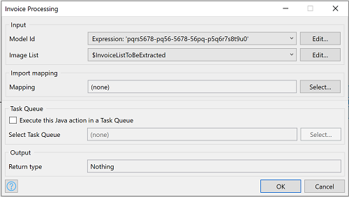
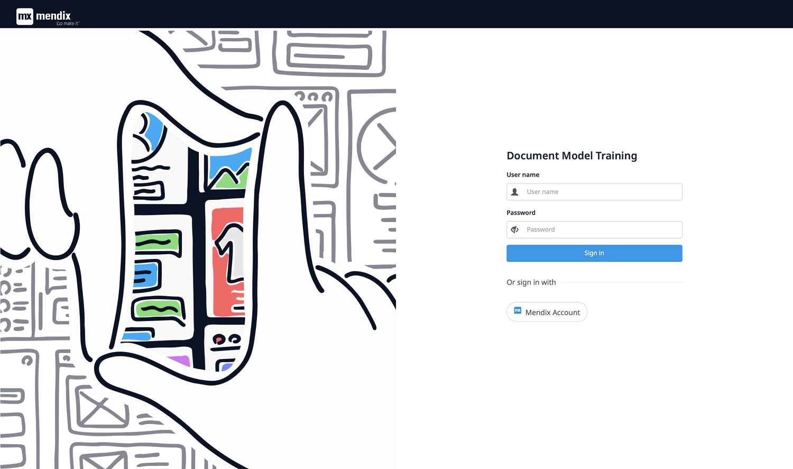
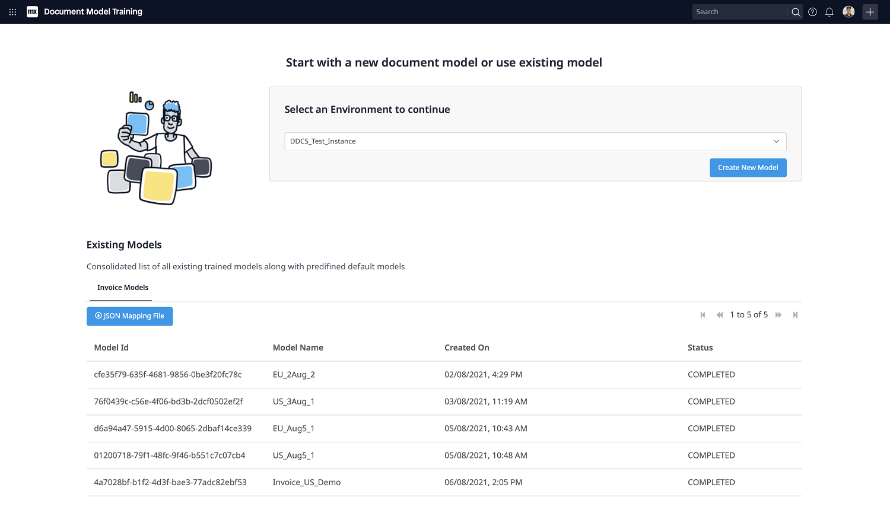
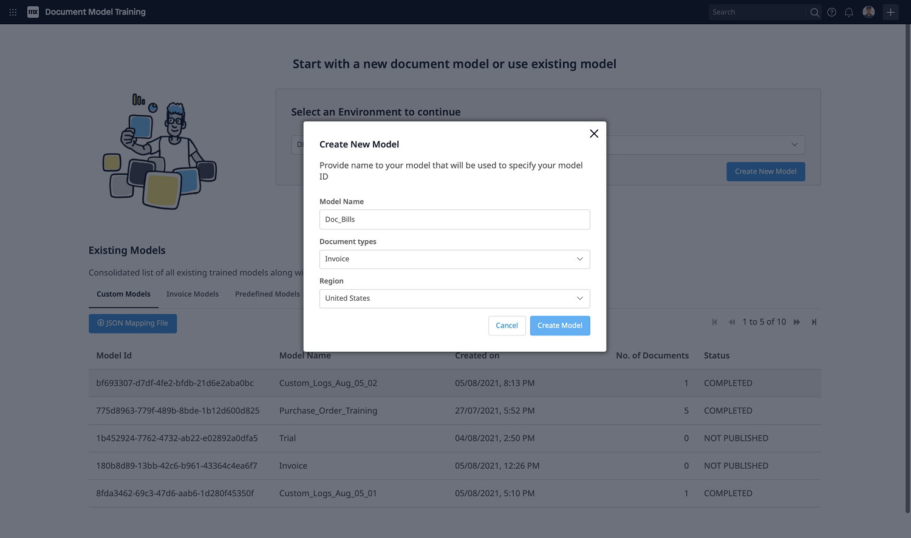
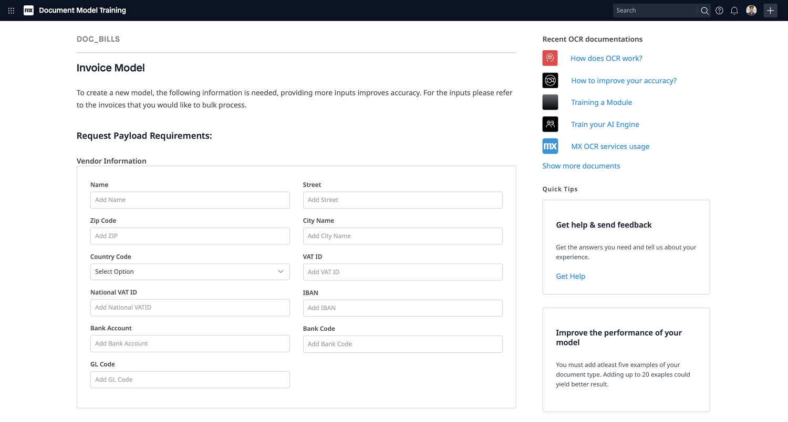
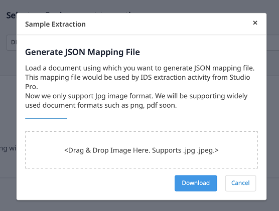

## 1 Introduction
Automates invoice processing almost immediately without any document training. Supports major world economy invoices.

### 1.1 Typical Use Case
Using _Document Model Training_ (refer _Usage_ section ), Select your choice of region (Europe, US). Then you can simply use _Invoice processing Activity_ to process Invoices in bulk. 

### 1.2 Features
* Extract data from bulk images and map to entity
* Select Region of your choice

### 1.3 Limitation
* Supports only jpg / jpeg image formats.

## 2 Installation

Follow the instructions in [How to Use App Store Content in Studio Pro](../general/app-store-content) to import the _Invoice Processing_ module into your app.

## 3 Configuration

### 3.1 Invoice Processing Service Activity
Once the module is imported, _Invoice Processing Service Activity_ will appear in your toolbox.

Drag and drop _Invoice Processing Service Activity_ (_Document Data Capture Services_ Catagory) into your microflow

### 3.2 Model ID: 
Model ID can be used after model created successfully, refer _Usage_ section.

### 3.3 Image List: 
List of Image objects (Inherited from System.Image)

### 3.4 Mapping: 
Provide _Import Mapping_ to which extracted data will be mapped. Refer _step 7_ in _Usage_ section to get JSON to create _Import Mapping_.

### 3.5 Task Queue: 
Provide Task Queue to execute Extraction action

## 4 Usage

### Document Model Training: Create Model

1. Visit _Document Model Training_ App

2. Login with _Mendix Account_.

3. Select _Environment_. Existing Models list will show up. 

You can use Model Id in _Invoice Processing Service Activity_ if status is _COMPLETED_.

Follow _step 7_ to get JSON to create _Import Mapping_.

4. To create and train a new model, select _Create New Model_. Provide unique _Model Name_, _Region_ and Select _Create Model_.

5. Fill in the Vendor and Business Unit information and Select _Create Model_

6. Model will appear in list with status _IN PROGRESS_. Once _Status_ of Model is _COMPLETED_, Model is ready to use

7. Get JSON Mapping file to use with _Invoice Processing Service Activity_ (Section 3.4),

    1. Select record in Existing Model list status _COMPLETED_ 
    2. Select _JSON Mapping File_
    3. Upload sample image used while training
    4. Select _Download_ to get JSON file
    
