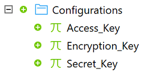
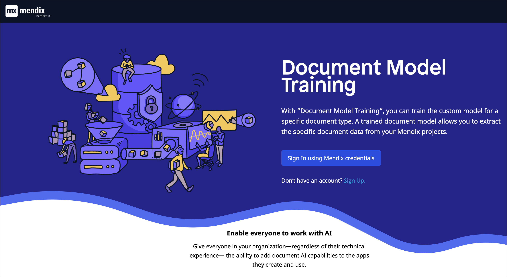
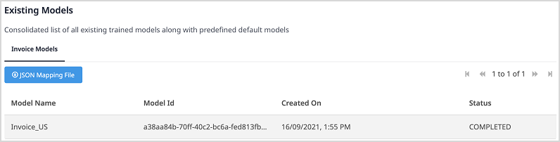
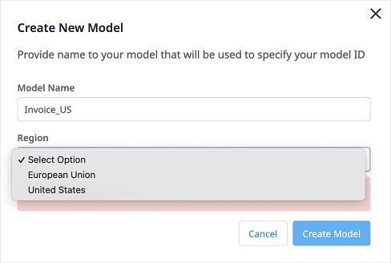
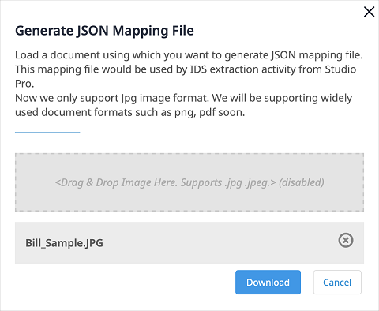
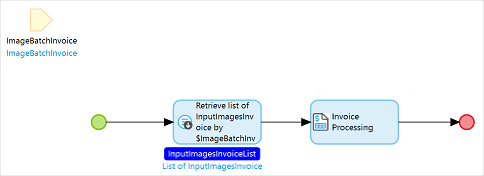

## 1 Introduction

Powered by AI and OCR technologies, the [Invoice Processing](https://marketplace.mendix.com/link/component/118389) app service can help you automate the processing of invoices in bulk. It supports invoices in the European Union and the United States.

### 1.2 Features

* Extract data from images of invoices in bulk and map data to an entity
* Support the invoices from the United States and European Union regions
* Support [Mendix SSO](/appstore/modules/mendix-sso)

### 1.3 Limitation

* Currently only supports images in JPG and JPEG formats

### 1.4 Prerequisites

This app service works best with Studio Pro 8 versions starting with [8.18.5](/releasenotes/studio-pro/8.18#8185) and 9 versions starting with [9.0](/releasenotes/studio-pro/9.0).

## 2 Installation

### 2.1 Obtaining the Binding Keys {#obtain-keys}

Invoice Processing is a premium Mendix product that is subject to a purchase and subscription fee. To successfully use this app service in your app, first you need to start a subscription or a trial to get the binding keys.

#### 2.1.1 Starting a Trial

A trial gives everyone in your company one-month access to the app service. To start a trial, perform the following steps:

1. Go to the [Invoice Processing](https://marketplace.mendix.com/link/component/118389) page in the Marketplace.
2. Click **Try for Free** to open the **Start Your Free Trial** page. Here you can see the **Trial Details** for the app service.
3. Select the check box to agree to the **Terms & Conditions**.
4. Click **Enable Trial**. A page opens and confirms that the your request has been received.
5. Wait until your request is processed. It can take more than at least 15 minutes for the system to process your request. After your request is processed, you will receive an email that says the app service is ready to be used.
6. Click the link in the email to go to the [My Subscriptions](/appstore/general/app-store-overview#my-subscriptions) page and log in there. This page shows all the products that you have trials for.
7. Click **Invoice Processing** to open the [service management dashboard](/appstore/general/app-store-overview#service-management-dashboard).
8. Follow the instructions in the [Creating Binding Keys](/appstore/general/app-store-overview#creating-binding-keys) section in the *Marketplace Overview* to create binding keys. Save the keys somewhere safe. You need to use them later to [configure the keys](#configure-keys) in your app.

#### 2.1.2 Starting a Subscription

1. Go to the [Invoice Processing](https://marketplace.mendix.com/link/component/118389) page in the marketplace.
2. Click **Subscribe** to start a subscription.
3. Select your subscription plan.
4. Fill in **Technical Owner** information (**First Name**, **Last Name**, **Email Address**), billing account information, payments and other required information and then place the order. A page opens and confirms that the your request has been received.
5. Wait until your request is processed. It can take more than 15 minutes for the system to process your request. After your request is processed, the Technical Contact will receive an email that says the app service is ready to be used.
6. Click the link in the email to go to the [Company Subscriptions](/appstore/general/app-store-overview#company-subscriptions) page and log in there. This page gives an overview of all the subscriptions of your organization.
7. Click **Invoice Processing** to open the [service management dashboard](/appstore/general/app-store-overview#service-management-dashboard).
8. Follow the instructions in the [Creating Binding Keys](/appstore/general/app-store-overview#creating-binding-keys) section in the *Marketplace Overview* to create binding keys. Save the keys somewhere safe. You need to use them later to [configure the keys](#configure-keys) in your app.

### 2.2 Installing the Component in Your App

To download and install the Invoice Processing app service in your app, follow the instructions in the [Importing Content from the App Explorer](/appstore/general/app-store-content.md#import) section in *Use Marketplace Content in Studio Pro*. After the app service is installed, you can find it in the **App Explorer** and also in the **Document Data Capture Service** category in the **Toolbox**.

## 3 Configuring the Binding Keys {#configure-keys}

Before you deploy an app, you should configure the binding keys in your app as follows:

1.  In the **App Explorer** or the **Project Explorer**, go to **InvoiceProcessing** > **Configurations**. **Access_Key**, **Secret_Key**, and **Encryption_Key** are defined as constants.

    

2. For each constant, double-click the constant, enter the key that you saved, and click **OK** to save the changes.

## 4 Usage

To use the Invoice Processing app service, first you need to create a model, then create an [Import Mapping](#mapping-file) using a sample invoice. The Import Mapping defines how to map extracted data from images to an entity. After you create the Import Mapping, include the [Invoice Processing activity](#extraction-activity) into a microflow. This microflow should be set up to accept the invoice image(s), your trained model, and the Import Mapping. The microflow should extract data from the invoice images in bulk and then map the data to an entity using the Import Mapping that you created.

### 4.1 Training a Document Model {#document-model-training}

1.  Perform the following steps to log into the **Document Model Training** application:
    1. Log into the Marketplace with your Mendix account.
    2.  Go to **My Marketplace** and then do as follows:
        
        * If you have a trial, click [My Subscriptions](/appstore/general/app-store-overview#my-subscriptions) on the left navigation menu. This page shows all the products that you have trials for.
        * If you have a subscription, click [Company Subscriptions](/appstore/general/app-store-overview#company-subscriptions) on the left navigation menu. This page gives an overview of all the subscriptions of your organization.

    3. Click **Invoice Processing** to open the [service management dashboard](/appstore/general/app-store-overview#service-management-dashboard).
    4.  Click **Manage Instance** to open the **Document Model Training** application.
    
        
    
    5. Log into the [Document Model Training](https://datacapture-appservices.mendixcloud.com/login.html) application using your Mendix account.    
    
2.  From the drop-down list below **Select an environment to continue**, select an environment that you use to train models for the Invoice Processing app service. The **Existing Models** in this environment is displayed.

    

    {} The model is ready to use only when the **Status** of this model is **Published**. {}

3.  To train a new model, click **Create New Model** on the page. The **Create New Model** dialog box opens.

    

4.  Enter a unique **Model Name**, select a **Region**, and then **Country**. You may select multiple countries for a given **Region**.

    {}Currently, these regions and countries are supported: **USA** (**USA**), **Canada** (**Canada**), **Europe** (**Netherlands**, **Germany**, **Great Britain**).{}

5.  Click **Create Model**.

    {} The model name should not exceed 55 characters. You can only use characters (a-z, A-Z), numbers (0-9), and underscore (\_). {}

    An **Information** pop-up window appears notifying the user that the model is being trained.

    

6. Click **OK**. The new model appears in the **Existing Models** list with the status **In Progress**.
7. Click **Refresh** and wait until the **Status** of the model becomes **Published**. Once the model is published, it is ready to use.

### 4.2 Creating an Import Mapping{#mapping-file}

You need to use an [Import Mapping](/refguide/mapping-documents#import-mappings) to populate the extracted data into an entity. If necessary, you can further process the entity with [event handlers](/refguide/event-handlers).

1.  To create an Import Mapping, you need a JSON structure. Perform the following steps to generate the JSON structure:
    1.  Log into the [Document Model Training](#document-model-training) application with your Mendix account.
    2.  From the drop-down list below **Select an environment to continue**, select an environment that you use to train models for the Invoice Processing app service. The **Existing Models** in this environment is displayed.
    3.  Select your trained model. Make sure that the **Status** of the model is **Published**. Note down the **Model Id**. You will need it when you [extract data with the trained model ](#extraction-activity).
    4.  Click **Download JSON Structure**. The **Generate JSON Structure** dialog box opens.
    5.  Drag the sample invoice into the box where it says **Drag & Drop your image file here**. You can also click **Browse** and select the file.

        

    6. Click **Download** to get the JSON structure.
2.  To add the JSON structure to your app, perform the following steps:
    1.  In the **App Explorer** or **Project Explorer**, right-click the module or the folder where you want to add the JSON structure.
    2.  From the pop-up menu, select **Add other** > [JSON structure](/refguide/json-structures).

        

    3. In the **Add JSON Structure** dialog box, enter a **Name** for the JSON Structure and click **OK**. The **JSON Structure** dialog box opens.
    4. In the **JSON Snippet** box, add the content of the JSON mapping file that you generated. The system converts the JSON snippet into a schema structure automatically. You will need this schema structure to create the Import Mapping.
    5. Click **OK** to save the changes and close the dialog box.
3.  To create the Import Mapping, perform the following steps:
    1.  In the **App Explorer** or **Project Explorer**, right-click the module or the folder where you want to add the Import Mapping.
    2.  From the pop-up menu, select **Add other** > **Import mapping**.
    3.  In the **Add Import Mapping** dialog box, enter a **Name** for the Import Mapping and click **OK**. The **Select schema elements for import mapping** dialog box opens.
    4.  For **Schema source**, select **JSON structure** and **Select** the JSON structure that you created.

        

    5. Click **OK** to save the changes and close the dialog box.

### 4.3 Extracting the Data with the Trained Document Model {#extraction-activity}

1.  In the **Toolbox**, drag **Invoice Processing** activity from the **Document Data Capture Service** category into your microflow.

    

2. Create a list of image that inherits from `System.Image`. Images where data are extracted should be passed as a list, as shown in the microflow above.
3.  Double-click the **Invoice Processing** activity to open the dialog box.

    

4.  Click **Edit** to enter the **Model Id** of your model.
5. Click **Edit** to select the **Image List** which inherits from `System.Image`.
6. In the **Mapping** box, **Select** the Import Mapping that you created to define how extracted data should be mapped into an entity.
7. Click **OK** to save the changes and close the dialog box.

{} Optionally for further automation, add [event handlers](/refguide/event-handlers) on the entity where you populate the extracted data. You can call your own microflow to process the extracted data when inserted into the entity. For example, you can modify, validate, and pass the data to next steps. By dong this, you can achieve full end-to-end automation.{}

### 4.4 Checking Statistics on the Service Dashboard

The **Usage** dashboard shows the real-time statistics about the usage of an app service. Perform the following steps to check the real-time statistics:

1. Log into the Marketplace.
2.  Go to **My Marketplace** and then do as follows:
    * If you have a trial, click [My Subscriptions](/appstore/general/app-store-overview#my-subscriptions) on the left navigation menu. This page shows all the products that you have trials for.
    * If you have a subscription, click [Company Subscriptions](/appstore/general/app-store-overview#company-subscriptions) on the left navigation menu. This page gives an overview of all the subscriptions of your organization.
    
3. Click **Invoice Processing** to open the [service management dashboard](/appstore/general/app-store-overview#service-management-dashboard). On the **Overview** tab, the **Usage** dashboard shows the real-time statistics.

## 5 Technical Provider{#technical-provider}

The AI and OCR technologies used by Invoice Processing Service are powered by [ABBYY&reg;](https://www.abbyy.com). Application includes ABBYY® FlexiCapture® 12 SDK © 2019 ABBYY Production LLC., and also that ABBYY and FLEXICAPTURE are either registered trademarks or trademarks of ABBYY Software Ltd. and cannot be used without prior written consent of ABBYY Software Ltd.

