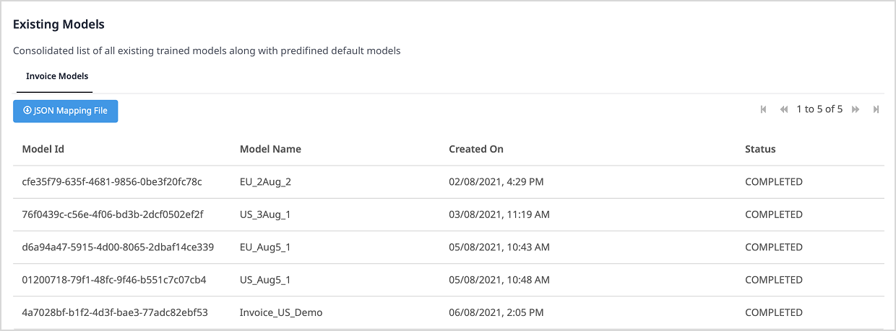
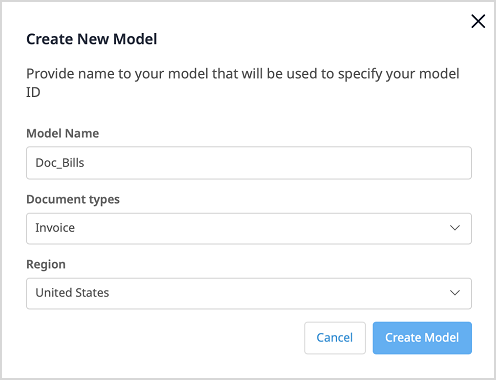
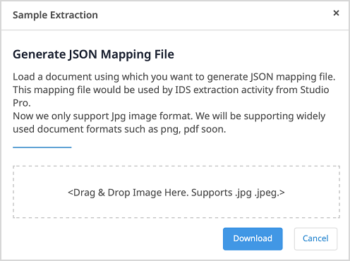

## 1 Introduction

With the [Invoice Processing](https://marketplace.mendix.com/link/component/118389) app service, you can automate the processing of invoices in bulk almost immediately, without training any documents. This app service supports invoices in the European Union and the United States.

### 1.2 Features

* Extract data from images of invoices in bulk and map data to entities
* Support a region that you select

### 1.3 Limitation

* Only supports images in JPG and JPEG formats

## 2 Installation

1. Follow the instructions in [How to Use Marketplace Content in Studio Pro](/appstore/general/app-store-content) to import the Invoice Processing Service module into your app.
2. In the **Toolbox**, drag the **Invoice Processing Service** activity from the **Document Data Capture Services** category into your microflow.

## 3 Configuration

1. Double-click the **Invoice Processing Service** activity to open the **Invoice Processing** dialog window. 

    
    
2. Select the **Model Id** of your model. You can also click **Edit** it.

    {}
    After the training of a model is **COMPLETED **in the Document Model Training app, you can use its **Model Id**. For more information, see the section [Training a Document Model](#document-model-training). 
    {}

3. Select an **Image List** which inherits from `System.Image`. You can also click **Edit** to edit it.

4. In the **Mapping** field, **Select** a **Mapping** file to define how extracted data is mapped.

   {}
   For details on how to get the JSON mapping file, see [Getting a JSON Mapping File](#mapping-file).
   {}

5. If you want to execute the extraction action in a task queue, select **Execute this Java action in a Task Queue**, then click **Select** and select a task queue.

   {}
   For more information, see [Task Queue](/refguide/task-queue) (for Mendix version 9.0.3 and above) or [Process Queue](/appstore/modules/process-queue) (for Mendix version below 9.0.3).
   {}

6. Click **OK** to save the changes and close the dialog window.

7. To configure credential for the **Intelligent Document Service** activity, add the following constants with values in your Mendix app:
   * Access_Key
   * Encryption_Key
   * Secret_Key

     

   {}
   Credentials are generated when you create binding keys on Marketplace.
   {}

## 4 Training a Document Model {#document-model-training}

1. Open the **Document Model Training** app.

2. Login in to the app using your **Mendix Account**.

3. Click **Environment** to show the **Existing Models** list.

    
    
    If the **Status** of a model is **COMPLETED**, then you can use its **Model Id** in the **Intelligent Document Service** activity.

4. To create and train a new model, click **Create New Model** above the **Existing Models** list on the right side. The **Create New Model** dialog window opens.

5. Enter a unique **Model Name**, select a **Region**, select the **Invoice** for **Document types**, and then click **Create Model**.

    

    The **Invoice Model** page opens.

6. Fill in the **Vendor Information** and the **Business Unit Information** and click **Create Model**.

     The new model appears on the **Invoice Models** tab in the **Existing Models** list with the status **IN PROGRESS**.

     Once the **Status** of the model becomes **COMPLETED**, the model is ready to use. 

## 5 Getting a JSON Mapping File {#mapping-file} 

1. Open the **Document Model Training** app.

2. Login in to the app using your **Mendix Account**.

3. Click **Environment** to show the **Existing Models** list.

4. Select a model that has the status **COMPLETED**.

5. Click **JSON Mapping File**. The **Sample Extraction** dialog window opens.

    

6. Drag sample images into the box where it says **<Drag & Drop Image Here. Supports .jpg .jpeg.>**.

7. Click **Download** to get the JSON file. 

8. Copy the **Model Id** and use it in the **Inovice Processing Service** activity.

