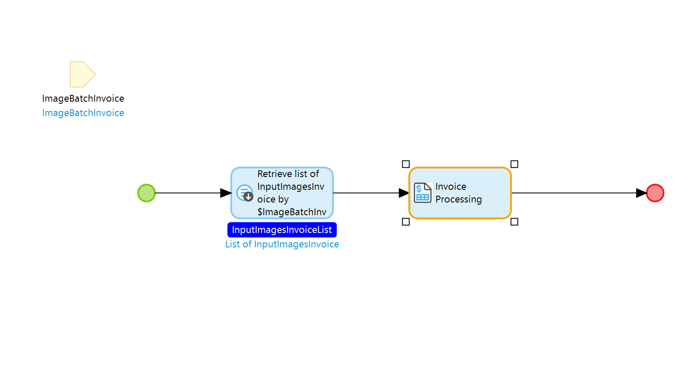
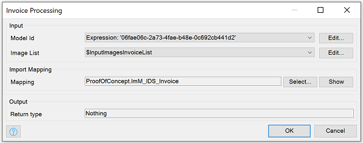

## 1 Introduction

With the [Invoice Processing](https://marketplace.mendix.com/link/component/118389) app service, you can automate the processing of invoices in bulk almost immediately, without training any documents. It supports invoices in the European Union and the United States.

### 1.2 Features

* Extract data from images of invoices in bulk and map data to entities
* Support United States and European Union region
* Support [Mendix SSO](/appstore/modules/mendix-sso)

### 1.3 Limitation

* Currently only supports images in JPG and JPEG formats

### 1.4 Prerequisites

This app best service works with Studio Pro 8 versions starting with [8.18.5](/releasenotes/studio-pro/8.18#8185) and 9 versions starting with [9.0](/releasenotes/studio-pro/9.0).

## 2 Installation

1. Go to [Marketplace](https://marketplace.mendix.com/link/component/118389) and download the *.mpk* file for **Invoice Processing**

2.  To add the Invoice Processing Service to your app in Mendix Studio Pro, follow these steps:
    1. In the **App Explorer** (in Studio Pro 9) or the **Project Explorer** (in Studio Pro 8), right-click the app, click **Import module package**, and then select *InvoiceProcessing.mpk*.

       

       In the **Import Module** dialog box, **Add as a new module** is the default option when the module is being downloaded for the first time, which means that new entities will be created in your app.

       {}If you have made any edits or customization to a module that you have already downloaded, be aware of the **Replace existing module** option. This will override all of your changes with the standard App Store content, which will result in the creation of new entities and attributes, the deletion of renamed entities and attributes, and the deletion of their respective tables and columns represented in the database. Therefore, unless you understand the implications of your changes and you will not update your content in the future, making edits to the downloaded modules is not recommended.{}

    2. In the **Import Module** dialog box, click **Import**.

    3. Wait until a pop-up window states that the module was successfully imported. Click **OK**.

    4. Open the **App Explorer** or **Project Explorer** to view the **InvoiceProcessing** module.

    5. Once imported, the app service is visible in the **App Explorer** or **Project Explorer** and in the **Document Data Capture Service** category in the **Toolbox**.

## 3 Configuration

Invoice Processing Service is a premium Mendix product that is subject to a purchase and subscription fee. To successfully deploy an app that uses Invoice Processing Service, you need to get a valid combination of certain keys and configure them as constants in the module.

### 3.1  Subscribing to Get Keys

1. On the [Invoice Processing Service](https://marketplace.mendix.com/link/component/118389) page, click **Subscribe** to order a subscription.

2. Fill in the [Technical Contact](/developerportal/collaborate/app-roles#technical-contact) information (**First Name**, **Last Name**, **Email Address**), billing account information, and other required information, and then place the order. The Technical Contact receives an order confirmation email.

3. Click the link in the order confirmation email to go to the Marketplace [Subscriptions](/appstore/general/app-store-overview#subscriptions) page and log in there. The **Subscriptions** page gives an overview of all the subscriptions of your organization.

4. Click **Invoice Processing Service** to open the subscription details page.

5. Click **Create Binding Keys**.

6. Enter a meaningful name for the binding keys. Make sure that the name includes the name of the app which uses Invoice Processing Service.

7.  Click **Create Keys** to generate the **Access_Key**, **Secret_Key** and **Encryption_Key**. The system generates **Access_Key**, **Secret_Key** and **Encryption_Key**.

    

{}Once you close this page, you will not be able to retrieve the keys again.{}

8. **Copy** the **Access_Key**, **Secret_Key** and **Encryption_Key**. You will use them later for app deployment.

### 3.2 Configuring Keys for Application Deployment

1.  In the **App Explorer** (in Studio Pro 9) or the **Project Explorer** (in Studio Pro 8), go to **InvoiceProcessing** > **Configurations**. You can see **Access_Key**, **Secret_Key** and **Encryption_Key** are defined as constants.

    

2. Double-click on each constant and and enter the respective keys.

3. Click **OK** to save the settings.

## 4 USAGE

To use **Invoice Processing Service**, firstly [Create Model](#document-model-creating) with Vendor Information and Business Unit Information from Sample Invoice. Using same invoice, get [JSON mapping file and create Import Mapping](#mapping-file).
Next include the [Invoice Processing Service](#extraction-activity) activity in your microflow, which will accept invoices to extract and Import Mapping.

### 4.1 Creating a Document Model {#document-model-creating}

1. Open the **Document Model Training** application.

    {} You can access it from `Manage Instance` button on the **Service Management Dashboard**. See [Service Management Dashboard](/appstore/general/app-store-overview#4-8-1-service-management-dashboard). {}

2. Login in to the app using your **Mendix Account**.

3. Click **Environment** to show the **Existing Models** list.

    

    {} Model status should be **COMPLETED** to use its **Model Id**. {}

4. To create and train a new model, click **Create New Model** on the page. The **Create New Model** dialog window opens.

    

5. Enter a unique **Model Name**, select a **Region**, and then click **Create Model**.

6. Wait until **Invoice Model** page opens.

    

7. Fill in **Vendor Information** and **Business Unit Information** from Sample Invoice. Providing more inputs improves accuracy.

8. Click **Create Model**. The new model appears in the **Existing Models** list with the status **IN PROGRESS**.

Once the **Status** of the model becomes **COMPLETED**, the model is ready to use.

### 4.2 Getting a JSON Mapping File {#mapping-file}

To populate the extracted data into entity and further process it with [Event handlers](/refguide8/event-handlers) with the help of [Import Mapping](/refguide/mapping-documents#2-import-mappings).
Below steps will help to get JSON which can be used while creating Import Mapping.

1. Open the **Document Model Training** application.

    {} You can access it from `Manage Instance` button on the **Service Management Dashboard**. See [Service Management Dashboard](/appstore/general/app-store-overview#4-8-1-service-management-dashboard). {}

2. Login in to the app using your **Mendix Account**.

3. Click **Environment** to show the **Invoice Models** list.

4.  Click **JSON Mapping File**. The **Generate JSON Mapping File** dialog window opens.

    

5. Drag Sample Invoice (referred while creating a model) into the box where it says **Drag & Drop Image Here**.

6. Click **Download** to get the JSON file.

7.  Use this JSON file to create [JSON Mapping](/refguide8/mapping-documents) which will be used in the [Invoice Processing Activity](#extraction-activity).

    1. From **App Explorer / Project Explorer**, Create **[JSON structure](/refguide8/json-structures)**. Use JSON file and convert schema structure to be used by Import Mapping.
    
       

    2. From **App Explorer / Project Explorer**, Create [Import Mapping](/refguide8/mapping-documents#2-import-mappings). Map created above with JSON structure with entity.
    
       

8. Copy the **Model Id** and use it in the [Invoice Processing Activity](#extraction-activity).

### 4.3 Extracting the data using Created Document Model (#extraction-activity)

1.  Drag and drop **Invoice Processing Service** activity to your microflow from the **Document Data Capture Service** category in the **Toolbox**.

    

2. Images to be extracted should be passed as a list. As shown in above image, create list of image inherits from `System.Image`.

3.  Double-click the **Invoice Processing Service** activity to open the dialog window.

    

4.  Click **Edit** to enter the **Model Id** of your model.

    {} After the training of a model is **COMPLETED** in the Document Model Training app, you can use its **Model Id**. For more information, see the section [Creating a Document Model](#document-model-creating). {}

5. Click **Edit** to Select an **Image List** which is list of images inherits from `System.Image`.

6.  In the **Mapping** field, **Select** a **[JSON Mapping](/refguide8/mapping-documents)** file to define how extracted data is mapped.  This configuration will populate the extracted data into entity we mapped in Import Mapping.

    {} For details on how to get the JSON mapping file and create Imoprt Mapping, see [Getting a JSON Mapping File](#mapping-file). {}

7. Click **OK** to save the changes and close the dialog window.

Optionally for further automation, add [Event handlers](/refguide8/event-handlers) on those entity where we are populating the extracted data.
You can call your own Microflow to process (modify, validate, pass data to next steps etc.) the extracted data when inserted into entity, which will allow you to achieve full end to end automation.
To create event on your entity mapped in Import Mapping, please refer [Event handlers](/refguide8/event-handlers).

### 4.4 Checking Statistics Using the Service Dashboard

The **Usage** dashboard shows the real-time statistics about the usage of an app service. Perform the following steps to check the real-time statistics:

1. Log into the Marketplace.

2. Go to **My Marketplace** and click [Subscriptions](/appstore/general/app-store-overview#subscriptions) on the left navigation menu. The **Subscriptions** page gives an overview of all the subscriptions of your organization.

3. Click **Invoice Processing Service** to open the subscription details page. On the **Overview** tab, the **Usage** dashboard shows the real-time statistics.

## 5 Technical Provider

 The OCR technology used by Invoice Processing is powered by ABBYY&reg;. Application includes ABBYY® FlexiCapture® 12 SDK © 2019 ABBYY Production LLC., and also that ABBYY and FLEXICAPTURE are either registered trademarks or trademarks of ABBYY Software Ltd. and cannot be used without prior written consent of ABBYY Software Ltd.

