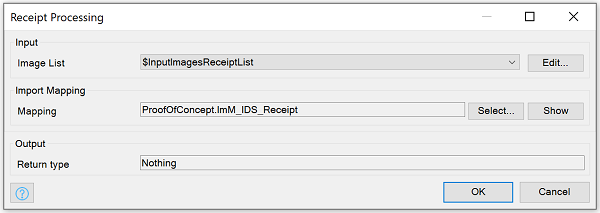
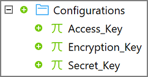
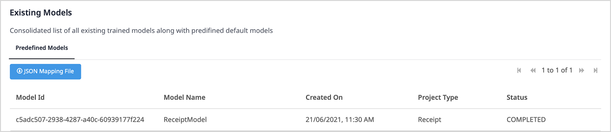
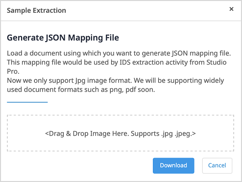

## 1 Introduction

The [Receipt Processing](https://marketplace.mendix.com/link/component/118390) app service has a pre-built ready-to-implement trained document model. It extracts the information from the main fields, without need for any additional training. You can automate the processing of receipts in bulk using this app service.

### 1.2 Features

* Extract data from images of receipts in bulk and map data to entities

### 1.3 Limitation

* Only supports images in JPG and JPEG formats

## 2 Installation

1. Follow the instructions in [How to Use Marketplace Content in Studio Pro](/appstore/general/app-store-content) to import the Receipt Processing module into your app.

2. In the **Toolbox**, drag the **Receipt Processing Service** activity from the **Document Data Capture Services** category into your microflow.

## 3 Configuration

1. Double-click the **Receipt Processing Servic**e activity to open the **Invoice Processing** dialog window.

	

2. Select the **Model Id** of your model. You can also click **Edit** it.

   {}
   After the training of a model is **COMPLETED **in the Document Model Training app, you can use its **Model Id**. For more information, see the section [Training a Document Model](#document-model-training). 
   {}

3. Select an **Image List** which inherits from `System.Image`. You can also click **Edit** to edit it.

4. In the **Mapping** field, **Select** a **Mapping** file to define how extracted data is mapped.

   {}
   For details on how to get a JSON mapping file, see [Getting a JSON Mapping File](#mapping-file).
   {}

5. If you want to execute the extraction action in a task queue, select **Execute this Java action in a Task Queue**, then click **Select** and select a task queue.

   {}
   For more information, see [Task Queue](/refguide/task-queue) (for Mendix version 9.0.3 and above) or [Process Queue](/appstore/modules/process-queue) (for Mendix version below 9.0.3).
   {}

6. Click **OK** to save the changes and close the dialog window.

7. To configure credential for the **Receipt Processing Service** activity, add the following constants with values in your Mendix app:
   * Access_Key
   * Encryption_Key
   * Secret_Key

     

   {}
   Credentials are generated when you create binding keys on Marketplace.
   {}

## 4 Training a Document Model {#document-model-training}

1. Open the **Document Model Training** app.

2. Login in to the app using your **Mendix Account**.

3. Click **Environment**. The **Existing Models** list appears.

    

    If the **Status** of a model is **COMPLETED**, then you can use its **Model Id** in the **Intelligent Document Service** activity.

## 5 Getting a JSON Mapping File {#mapping-file} 

1. Open the **Document Model Training** app.

2. Login in to the app using your **Mendix Account**.

3. Click **Environment** to show the **Existing Models** list.

4. Select a model that has the status **COMPLETED**.

5. Click **JSON Mapping File**. The **Sample Extraction** dialog window opens.

    

6. Drag sample images into the box where it says **<Drag & Drop Image Here. Supports .jpg .jpeg.>**.
  
7. Click **Download** to get the JSON file. 

8. Copy the **Model Id** and use it in the **Receipt Processing Service** activity.