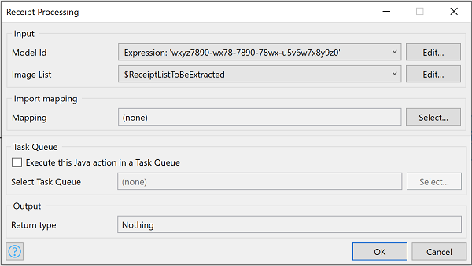
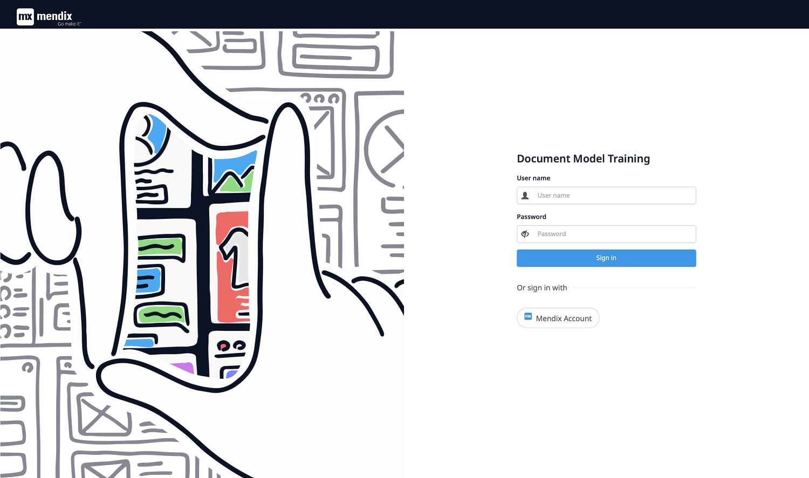
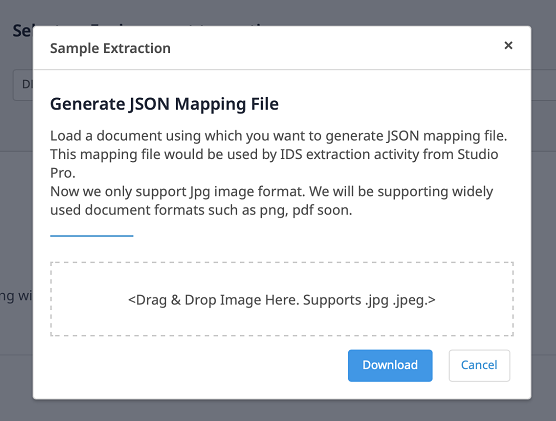

## 1 Introduction
The app service has prebuilt ready-to-implement trained document model for receipt processing. It extracts main/important fields, without need for any additional training.

### 1.1 Typical Use Case
You can simply use _Receipt Processing Activity_ to process Receipt in bulk. 

### 1.2 Features
* Extract data from bulk receipt images and map to entity

### 1.3 Limitation
* Supports only jpg / jpeg image formats.

## 2 Installation

Follow the instructions in [How to Use App Store Content in Studio Pro](../general/app-store-content) to import the _Receipt Processing_ module into your app.

## 3 Configuration

### 3.1 Receipt Processing Service Activity
Once the module is imported, _Receipt Processing Service Activity_ will appear in your toolbox.

Drag and drop _Receipt Processing Service Activity_ (_Document Data Capture Services_ Catagory) into your microflow

### 3.2 Model ID: 
Model ID can be used fetched from _Document Model Training_, refer _Usage_ section.

### 3.3 Image List: 
List of Image objects (Inherited from System.Image)

### 3.4 Mapping: 
Provide _Import Mapping_ to which extracted data will be mapped. Refer _step 4_ in _Usage_ section to get JSON to create _Import Mapping_.

### 3.5 Task Queue: 
Provide Task Queue to execute Extraction action

## 4 Usage

### Document Model Training: Create Model

1. Visit _Document Model Training_ App

2. Login with _Mendix Account_.

3. Select _Environment_. Existing Models list will show up.

4. Get JSON Mapping file to use with _Receipt Processing Service Activity_ (Section 3.4),

    1. Select record in Existing Model list status _COMPLETED_ 
    2. Select _JSON Mapping File_
    3. Upload sample receipt
    4. Select _Download_ to get JSON file
    5. Copy Model ID of same to feed into Activity
    
