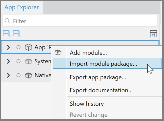

## 1 Introduction

The [Receipt Processing](https://marketplace.mendix.com/link/component/118390) app service has a pre-built, ready-to-implement trained document model. It extracts the information from the main fields, without need for any additional training. You can automate the processing of receipts in bulk using this app service.

### 1.1 Features

* Pre-built, ready-to-implement receipt document models
* Extract data from images of receipts in bulk and map data to entities
* Support [Mendix SSO](/appstore/modules/mendix-sso)

### 1.2 Limitation

* Currently only supports images in JPG and JPEG formats

### 1.3 Prerequisites

This app best service works with Studio Pro 8 versions starting with [8.18.5](/releasenotes/studio-pro/8.18#8185) and 9 versions starting with [9.0](/releasenotes/studio-pro/9.0).

## 2 Installation

1. Go to [Marketplace](https://marketplace.mendix.com/link/component/118390) and download the *.mpk* file for Receipt Processing.

2. To add the Receipt Processing service to your app in Mendix Studio Pro, follow these steps:
   1. In the **App Explorer** (in Studio Pro 9) or **Project Explorer** (in Studio Pro 8), right-click the app.
   2. Click **Import module package** and then select *ReceiptProcessing.mpk*.

   

   In the **Import Module** dialog box, **Add as a new module** is the default option when the module is being downloaded for the first time, which means that new entities will be created in your app.

   {}If you have made any edits or customization to a module that you have already downloaded, be aware of the **Replace existing module** option. This will override all of your changes with the standard App Store content, which will result in the creation of new entities and attributes, the deletion of renamed entities and attributes, and the deletion of their respective tables and columns represented in the database. Therefore, unless you understand the implications of your changes and you will not update your content in the future, making edits to the downloaded modules is not recommended.{}

3. In the **Import Module** dialog box, click **Import**.

4. Wait until a pop-up box states that the module was successfully imported. Click **OK**.

6. Open the **App Explorer** or **Project Explorer** to view the **ReceiptProcessing** module.

Once imported, the app service is visible in the **App Explorer** or **Project Explorer** and in the **Document Data Capture Service** category in the **Toolbox**.

## 3 Configuration

Receipt Processing app service is a premium Mendix product that is subject to a purchase and subscription fee. To successfully deploy an app that uses Receipt Processing app service, you need to get a valid combination of certain keys and configure them as constants in the module.

### 3.1  Subscribing to Get Keys

1. On the [Receipt Processing](https://marketplace.mendix.com/link/component/118390) app service page, click **Subscribe** to order a subscription.

2. Fill in the [Technical Contact](/developerportal/collaborate/app-roles#technical-contact) information (**First Name**, **Last Name**, **Email Address**), billing account information, and other required information, and then place the order. The Technical Contact receives an order confirmation email.

3. Click the link in the order confirmation email to go to the Marketplace [Subscriptions](/appstore/general/app-store-overview#subscriptions) page and log in there. The **Subscriptions** page gives an overview of all the subscriptions of your organization.

4. Click **Receipt Processing** to open [service management dashboard](/appstore/general/app-store-overview#4-8-1-service-management-dashboard).

5. Click **Create Binding Keys**.

6. Enter a descriptive name for the binding keys. Make sure that the name includes the name of the app which uses the Receipt Processing app service.

7.  Click **Create Keys** to generate the **Access_Key**, **Secret_Key** and **Encryption_Key**. The system generates **Access_Key**, **Secret_Key** and **Encryption_Key**. 

    {}Do not close this page yet. Once you close this page, you cannot retrieve the keys again.{}

    

8. **Copy** the **Access_Key**, **Secret_Key** and **Encryption_Key**. 

After you copy the keys, you can close the page.

### 3.2 Configuring Keys for Application Deployment

1. In the **App Explorer** (in Studio Pro 9) or the **Project Explorer** (in Studio Pro 8)**, go to **ReceiptProcessing** > **Configurations**. You can see **Access_Key**, **Secret_Key** and **Encryption_Key** are defined as constants.

    

2. Double-click on each constant and and enter the respective keys.
3. Click **OK** to save the settings.

## 4. Usage

To use Receipt Processing Service, firstly create an [Import Mapping](#mapping-file), and then include the receipt processing service activity in your microflow. This microflow should be set up to accept your trained model and your image files to extract, [extract data](#extraction-activity) from images in bulk and then map the data to entities using the Import Mapping that you created.

### 4.1 Creating an Import Mapping{#mapping-file}

You need to use an [Import Mapping](/refguide/mapping-documents#2-import-mappings) to populate the extracted data into entity, and if necessary, further process the entity with [event handlers](/refguide/event-handlers).

1.  To create an Import Mapping, you need a JSON mapping file. Perform the following steps to get the JSON mapping file:

    1. Log into the Marketplace with your Mendix account.
      
    2. Go to **My Marketplace** and click [Subscriptions](/appstore/general/app-store-overview#subscriptions) on the left navigation menu. The **Subscriptions** page gives an overview of all the subscriptions of your organization.
      
    3. Click **Receipt Processing** to open the service management dashboard.
      
    4. Click **Manage Instance** to open the **Document Model Training** application.

       
      
   5. Click **Environment** to show the **Existing Models** list.
   
   6. Select your trained model. Make sure that the **Status** of the model is **COMPLETED**. Note down the **Model Id**. You will need it in the [receipt processing service activity](#extraction-activity).
   
   7. Click **JSON Mapping File**. The **Generate JSON Mapping File** dialog box opens.

      

   8. Drag sample images into the box where it says **Drag & Drop Image Here**.

   9. Click **Download** to get the JSON file.

2. To add the JSON file to your app, perform the following steps:

   1.  In the **App Explorer** (in Studio Pro 9) or **Project Explorer** (in Studio Pro 8), right-click the module or the folder where you want to add the JSON file.
   2.  From the pop-up menu, select **Add other** > [JSON structure](/refguide/json-structures).

       

   3. In the **Add JSON Structure** dialog box, enter a **Name** for the JSON Structure and click **OK**. The **JSON Structure** dialog box opens.

   4. In the **JSON Snippet** box, add the content of the JSON mapping file that you generated. The system converts the JSON snippet into a schema structure automatically. You will need this schema structure to create the Import Mapping.

   5. Click **OK** to save the changes and close the dialog box.

3. To create the Import Mapping, perform the following steps:

   1. In the **App Explorer** or **Project Explorer**, right-click the module or the folder where you want to add the Import Mapping.

   2. From the pop-up menu, select **Add other** > **Import mapping**.

   3. In the **Add Import Mapping** dialog box, enter a **Name** for the Import Mapping and click **OK**. The **Select schema elements for import mapping** dialog box opens.

   4. For **Schema source**, select **JSON structure** and **Select** the JSON structure that you created.

      

   5. Click **OK** to save the changes and close the dialog box.

### 4.2 Extracting the Data with the Trained Document Model {#extraction-activity}

1. In the **Toolbox**, drag **Receipt Processing** activity from the **Document Data Capture Service** category into your microflow.

    

2. Create a list of image that inherits from `System.Image`. Images to be extracted should be passed as a list, as shown in the microflow above.

3. Double-click the **Receipt Processing** activity to open the **Receipt Processing** dialog box.

    

4. Click **Edit** to select the **Image List** which inherits from `System.Image`.

5. In the **Mapping** box, **Select** the Import Mapping that you created to define how extracted data should be mapped into the entity.

6. Click **OK** to save the changes and close the dialog box.

{} Optionally for further automation, add [event handlers](/refguide/event-handlers) on the entity where you populate the extracted data. You can call your own microflow to process the extracted data when inserted into the entity. For example, you can modify, validate, and pass the data to next steps. By dong this, you can achieve full end-to-end automation.{}

### 4.3 Checking Statistics Using the Usage Dashboard

The **Usage** dashboard shows the real-time statistics about the usage of an app service. Perform the following steps to check the real-time statistics:

1. Log into the Marketplace.

2. Go to **My Marketplace** and click [Subscriptions](/appstore/general/app-store-overview#subscriptions) on the left navigation menu. The **Subscriptions** page gives an overview of all the subscriptions of your organization.

3. Click **Receipt Processing** to open the subscription details page. On the **Overview** tab, the **Usage** dashboard shows the real-time statistics.
