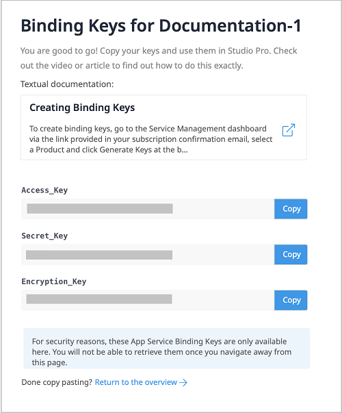
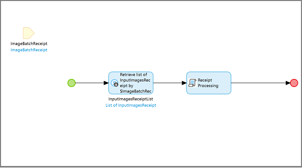

## 1 Introduction

The [Receipt Processing](https://marketplace.mendix.com/link/component/118390) app service has a pre-built ready-to-implement trained document model. It is powered by **ABBYY&reg;**, extracts the information from the main fields, without need for any additional training. You can automate the processing of receipts in bulk using this app service.

### 1.1 Features

* Pre-built ready-to-implement receipt document models
* Extract data from images of receipts in bulk and map data to entities

### 1.2 Prerequisites

This app service best works with Studio Pro 8 starting with [8.18.5](/releasenotes/studio-pro/8.18#8185) and 9 versions
starting with [9.2](/releasenotes/studio-pro/9.2).

## 2 Installation

* Go to [Marketplace](https://marketplace.mendix.com/link/component/118390) and download _mpk_ file for **Receipt Processing**

* To add the Receipt Processing Service to your app in Mendix Studio Pro, follow these steps:

   * In the **App Explorer / Project Explorer**, right-click the app, click **Import module package**, and then select
     *ReceiptProcessing.mpk*

     

     In the **Import Module** dialog box, **Add as a new module** is the default option when the module is being downloaded for the first time, which means that new entities will be created in your app.

     {}If you have made any edits or customization to a module that you have already downloaded, be aware of the **Replace existing module** option. This will override all of your changes with the standard App Store content, which will result in the creation of new entities and attributes, the deletion of renamed entities and attributes, and the deletion of their respective tables and columns represented in the database. Therefore, unless you understand the implications of your changes and you will not update your content in the future, making edits to the downloaded modules is not recommended.{}

   * In the **Import Module** dialog box, click **Import**.

   * Wait until a pop-up window states that the module was successfully imported. Click **OK**.

   * Open the **App Explorer / Project Explorer** to view the **ReceiptProcessing** module.

Once imported, the app service is visible in the **App Explorer / Project Explorer** and in the **Document Data Capture Service** category in the **Toolbox**.

## 3 Configuration

Receipt Processing Service is a premium Mendix product that is subject to a purchase and subscription fee. To successfully deploy an app that uses Receipt Processing Service, you need to get a valid combination of certain keys and configure them as constants in the module.

### 3.1  Subscribing to Get Keys

* On the [Receipt Processing Service](https://marketplace.mendix.com/link/component/118390) page, click **Subscribe** to order a subscription.

* Fill in the [Technical Contact](/developerportal/collaborate/app-roles#technical-contact) information (**First Name**, **Last Name**, **Email Address**), billing account information, and other required information, and then place the order. The Technical Contact receives an order confirmation email.

* Click the link in the order confirmation email to go to the Marketplace [Subscriptions](/appstore/general/app-store-overview#subscriptions) page and log in there. The **Subscriptions** page gives an overview of all the subscriptions of your organization.

* Click **Receipt Processing Service** to open the subscription details page.

* Click **Create Binding Keys**.

* Enter a meaningful name for the binding keys. Make sure that the name includes the name of the app which uses Receipt Processing Service.

* Click **Create Keys** to generate the **Access_Key**, **Secret_Key** and **Encryption_Key**.

The system generates **Access_Key**, **Secret_Key** and **Encryption_Key**.

{}Once you close this page, you will not be able to retrieve the keys again.{}

* **Copy** the **Access_Key**, **Secret_Key** and **Encryption_Key**. You will use them later for app deployment.

### 3.2 Configuring Keys for Application Deployment

* In the **App Explorer / Project Explorer**, go to **ReceiptProcessing** > **Configurations**. You can see **Access_Key**, **Secret_Key** and **Encryption_Key** are defined as constants.

  

* Double-click on each constant and and enter the respective keys.

* Click **OK** to save the settings.

## 4. Usage

To use **Receipt Processing Service**, firstly using sample receipt, get [JSON mapping file and create Import Mapping](#mapping-file).
Next include the Receipt Processing Service activity in your microflow, which will accept receipts to extract and Import Mapping.

### 4.1 Getting a JSON Mapping File {#mapping-file}

* Open the **Document Model Training** app.

* Login in to the app using your **Mendix Account**.

* Click **Environment** to show the **PreTrained Models** list.

* Click **JSON Mapping File**. The **Generate JSON Mapping File** dialog window opens.

* Drag sample images into the box where it says **Drag & Drop Image Here**.

* Click **Download** to get the JSON file.

* Use this JSON file to create [JSON Mapping](/refguide8/mapping-documents) which will be used in the [Receipt Processing Activity](#extraction-activity).

    * From **App Explorer / Project Explorer**, Create **[JSON structure](/refguide8/json-structures)**. Use JSON file and convert schema structure to be used by Import Mapping.
      

    * From **App Explorer / Project Explorer**, Create [Import Mapping](/refguide8/mapping-documents#2-import-mappings). Map created above with JSON structure with entity.
      

* Copy the **Model Id** and use it in the [Receipt Processing Activity](#extraction-activity).

### 4.2 Extracting the data {#extraction-activity}

* Drag and drop **Receipt Processing** activity to your microflow from the **Document Data Capture Service** category in the **Toolbox**.

  

* Images to be extracted shuold be passed as a list. As shown in above image, create list of image inherited from inherits from `System.Image`.

* Double-click the **Receipt Processing** activity to open the **Receipt Processing** dialog window.

    

* Click **Edit** to Select an **Image List** which inherits from `System.Image`.

* In the **Mapping** field, **Select** a **[JSON Mapping](/refguide8/mapping-documents)** file to define how extracted data is mapped.

  {} For details on how to get the JSON mapping fileand create Imoprt Mapping, see [Getting a JSON Mapping File](#mapping-file). {}

* Click **OK** to save the changes and close the dialog window.

### 4.3 Checking Statistics Using the Service Dashboard

The **Usage** dashboard shows the real-time statistics about the usage of an app service.
Log into the Marketplace. Go to **My Marketplace** to find Service Dashboard. More info at  [Subscriptions](/appstore/general/app-store-overview#subscriptions)
