## 1 Introduction

The [Text Analytics](https://marketplace.mendix.com/link/component/118412) app service takes written text as input, and then do text analytics for your web applications. Powered by machine learning, this app service can find insights and relationships in text, identify the language of the text, extract key phrases, places, people, brands, or events; understand how positive or negative the text is, analyze text using tokenization and parts of speech, and automatically organize a collection of text files by topic. 

With this app service, you do not have to build a text analytics application from scratch. All you need to do is drag and drop items and configure them.

Here is an overview of what the Text Analytics contains:

| Item                                        | Name                                                         |
| ------------------------------------------- | ------------------------------------------------------------ |
| [Predefined entities](#predefined-entities) | Detector, Language, Response, DominantLanguageDetector, DominantLanguage, SentimentDetector, Sentiment, SentimentScore, EntityDetector, Entity, PiiEntityDetector, PiiEntity, KeyPhraseDetector, KeyPhrase, SyntaxDetector, SyntaxToken |
| [Constants](#constants)                     | LicenseToken, TokenEndpoint                                  |
| [Microflows](#microflows)                   | CreateDominantLanguageDetector, CreateEntityDetector, CreateKeyPhraseDetector, CreatePiiEntityDetector, CreateSentimentDetector, CreateSyntaxDetector |
| [Nanoflows](#nanoflows)                     | DetectDominantLanguage, DetectEntities, DetectKeyPhrases, DetectPiiEntities, DetectSentiment, DetectSyntax |
| [Enumerations](#enumerations)               | EntityType, PartOfSpeechTag, PiiEntityType, SentimentType    |

In most cases, you will only need what is contained in the **TextAnalytics** > **USE_ME** folder. The content in the **TextAnalytics** > **Internal** folder is for internal use only and you will not need it.

### 1.1 Typical Use Cases

You can use this app service on Mendix cloud to easily identify the language of the text, extract key phrases, places, people, brands, or events, understand how positive or negative the text is, analyze text using tokenization and parts of speech, and automatically organize a collection of text files by topics in your Mendix applications.

### 1.2 Features

This app service enables doing the following:

* Key phrase detection based on text
* Sentiment detection based on text
* Language detection based on text
* Entity detection based on text, such as organizations, locations, dates, and persons
* Syntax detection based on text
* Personally Identifiable Information (PII) detection based on text

### 1.3 Prerequisites

This app service can only be used with Studio Pro 9 versions starting with [9.4.0](/releasenotes/studio-pro/9.4).

## 2 Obtaining a License Token {#obtain-license-token}

Text Analytics is a premium Mendix product that is subject to a purchase and subscription fee. To successfully use this app service in an app, you need to start a subscription or a trial to get a license token:

1. Go to the [Text Analytics](https://marketplace.mendix.com/link/component/118412) page in the marketplace.

2. Click **Subscribe** to start a subscription or click **Try for Free** to start a trial. The trial gives you one-month access to the app service.

3. To start a subscription, fill in [Technical Contact](https://docs.mendix.com/developerportal/collaborate/app-roles#technical-contact) information (**First Name**, **Last Name**, **Email Address**), billing account information, and other required information, and then place the order. The Technical Contact receives an order confirmation email.

   For the trial, you do not need to fill in this information.

4. Click the link in the order confirmation email to go to the Marketplace [Subscriptions](https://docs.mendix.com/appstore/general/app-store-overview#subscriptions) page and log in there. The **Subscriptions** page gives an overview of all the subscriptions of your organization.

5. Click **Text Analytics** to open the [service management dashboard](https://docs.mendix.com/appstore/general/app-store-overview#service-management-dashboard).

6. Follow the instructions in the [Creating Binding Keys](/appstore/general/app-store-overview#creating-binding-keys) section in the *Marketplace Overview* to create a license token.

## 3 Installation

1. Go to the [Text Analytics](https://marketplace.mendix.com/link/component/118408) page in the marketplace.
2. **Download** the *TextAnalytics.mpk* file.
3.  To add the Text Analytics app service to your app in Mendix Studio Pro, follow these steps:
    1.  In the **App Explorer**, right-click the app.
    2.  Click **Import module package** and then select *TextAnalytics.mpk*. 

        In the **Import Module** dialog box, **Add as a new module** is the default option when the module is being downloaded for the first time, which means that new entities will be created in your project.

        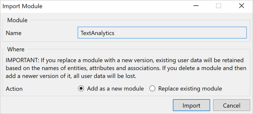
    
        {}If you have made any edits or customization to a module that you have already downloaded, be aware of the **Replace existing module** option. This will override all of your changes with the standard App Store content, which will result in the creation of new entities and attributes, the deletion of renamed entities and attributes, and the deletion of their respective tables and columns represented in the database. Therefore, unless you understand the implications of your changes and you will not update your content in the future, making edits to the downloaded modules is not recommended.{}
    
    3. In the **Import Module** dialog box, click **Import**. 
    4. Wait until a pop-up box states that the module was successfully imported. Click **OK**.
    5. Open the **App Explorer**  to view the **TextAnalytics** module. You can also find the app service in the **Cognitive AI widgets** category in the **Toolbox**.
4. After importing, you need to map the **Administrator** and **User** module roles of the installed modules to the applicable user roles in your app.

You have successfully added the Text Analytics resources to your app.

## 4 Configuring the License Token {#configure-license-token}

### 4.1 In Studio Pro

1. In the App Explorer, go to **Settings** to open the [App Settings](/refguide/project-settings) dialog box.

2. On the **Configurations** tab, click **Edit** to open the **Edit Configuration** dialog box.

3. On the **Constants** tab, create a new constant with the predefined constant **TextAnalytics.LicenseToken**.

4. Fill in the **Value** with the license token that you [obtained](#obtain-license-token).

5. Click **OK** to save the settings.

   

6. When you finish building the app, click **Run** to deploy your app to the cloud.

### 4.2 In the Developer Portal

Alternatively, you can add or update LicenseToken as a constant in the [Developer Portal](/developerportal/deploy/environments-details).

Before you deploy your app, configure the app **Constants** in the deployment package.

If you have already deployed your app, change the existing **LicenseToken** constant value on the **Model Options** tab and restart the app:

## 5 Configuration

### 5.1 Predefined Entities {#predefined-entities}

#### 5.1.1 DominantLanguage

The **DominantLanguage** entity is an entity referenced from **DominantLanguageDetector** and **Language** that incorporates all the information of the supported dominant language object to help you get a confident score of the dominant language from given text.

| Attribute | Data Type |Description |
| --- | --- |---|
| `ConfidenceScore` | Decimal |The confident score of dominant language. |

#### 5.1.2 Language

The **Language** entity is a conceptual entity that incorporates all the information of the supported language object. You can choose to inherit from this entity, set an association to the entity, or copy this entity to your module.

| Attribute | Data Type |Description |
| --- | --- |---|
| `Name` | String | The name of the language. |
| `Code` | String |The [language code](#supported-languages). |

#### 5.1.3 Detector

The **Detector** entity is a conceptual entity that incorporates all the information of the supported detector object. You can choose to inherit from this entity, set an association to the entity, or copy this entity to your module.

| Attribute | Data Type |Description |
| --- | --- |---|
| `InputText` | String |The input text of target detector. |

#### 5.1.4 Seniment

The **Sentiment** entity is an entity referenced from **SentimentDetector** and **SentimentScore** that incorporates all the information of the supported sentiment object to help you perform sentiment analysis from given text.

| Attribute | Data Type |Description |
| --- | --- |---|
| `SentimentType` | Enumeration | The customized sentiment type enumeration. |

#### 5.1.5 SentimentScore

The **SentimentScore** entity is a conceptual entity that incorporates all the information of the supported level of confidence of the sentiment score detector object.

| Attribute | Data Type |Description |
| --- | --- |---|
| `Positive` | Decimal |The level of confidence that The detector has in the accuracy of its detection of the POSITIVE sentiment. |
| `Negative` | Decimal | The level of confidence that The detector has in the accuracy of its detection of the NEGATIVE sentiment. |
| `Neutral` | Decimal |The level of confidence that The detector has in the accuracy of its detection of the NEUTRAL sentiment. |
| `Mixed` | Decimal |The level of confidence that the detector has in the accuracy of its detection of the MIXED sentiment. |

#### 5.1.6 Entity

The **Entity** entity is a conceptual entity that inherits from the **TextAnalytics.Response** entity and is referenced from **EntityDetector** that incorporates all the information of the supported entity object to help you perform entity detection from given text.

| Attribute | Data Type |Description |
| --- | --- |---|
| `EntityType` | Enumeration |The customized entity type. |

#### 5.1.7 PiiEntity

The **PiiEntity** entity is a conceptual entity that inherits from the **TextAnalytics.Response** entity and referenced from **PiiEntityDetector** that incorporates all the information of the supported PII entity object to help you perform PII entity detection from given text.

| Attribute | Data Type |Description |
| --- | --- |---|
| `PiiEntityType` | Enumeration | The customized PII entity type. |

#### 5.1.8 KeyPhrase

The **KeyPhrase** entity is a conceptual entity that inherits from **TextAnalytics.Response** entity and is referenced from **KeyPhraseDetector** that incorporates all the information of the supported key phrase object to help you perform key phrase detection from given text.

#### 5.1.9 SyntaxToken

The **SyntaxToken** entity is a conceptual entity that inherits from **TextAnalytics.Response** entity and is referenced from **SyntaxDetector** that incorporates all the information of the supported syntax token object to help you perform syntax token extraction from given text.

| Attribute | Data Type |Description |
| --- | --- |---|
| `Index` | Integer |The index of the token. |
| `PartOfSpeech` | Enumeration |The part of speech tag enumeration for the token. |

#### 5.1.10 Response

The **Response** entity is a conceptual entity that incorporates all the information of the supported response data object. You can choose to inherit from this entity, set an association to the entity, or copy this entity to your module.

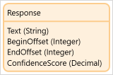

| Attribute | Data Type |Description |
| --- | --- |---|
| `Text` | String | The word that was recognized in the source text. |
| `BeginOffset` | Integer |The zero-based offset from the beginning of the source text to the first character in the word. |
| `EndOffset` | Integer |The zero-based offset from the beginning of the source text to the last character in the word. |
| `ConfidenceScore` | Decimal |The level of confidence that the Text Analytics module has in the accuracy of the detection. |

### 5.2 Constants {#constants}

#### 5.2.1 LicenseToken

The **LicenseToken** constant is used to provide a valid Text Analytics license token for the app that uses Text Analytics to be successfully deployed to [Mendix Licensed Cloud Node](/developerportal/deploy/mendix-cloud-deploy) or your own environment.

As Text Analytics is a commercial product, whenever the app is deployed in the cloud or deployed locally in Studio Pro, you need a valid license token, and you need to set the value of the **LicenseToken** constant to that license token in the deployment environment settings.

For details on how to get and configure a license token, see the [Obtaining a License Token](#obtain-license-token) section and [Configuring the License Token](#configure-license-token).

#### 5.2.2 TokenEndpoint

The **TokenEndpoint** constant provides a valid endpoint of security token service for the back-end authentication of the cognitive text analytics service. The constant comes with a default value which points to the production environment of the deployed security token service. The security token service issues security tokens that authenticate user's identity. 

### 5.3 Microflows {#microflows}

#### 5.3.1 CreateDominantLanguageDetector

The **CreateDominantLanguageDetector** microflow takes **text** (String) and **languageCode** (String) as input parameters to create DominantLanguageDetector as a return object from the back-end service.

#### 5.3.2 CreateEntityDetector

The **CreateEntityDetector** microflow takes **text** (String) and **languageCode** (String) as input parameters to create CreateEntityDetector as a return object from the back-end service.

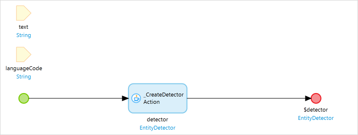

#### 5.3.3 CreateKeyPhraseDetector

The **CreateKeyPhraseDetector** microflow takes **text** (String) and **languageCode** (String) as input parameters to create CreateKeyPhraseDetector as a return object from the back-end service.

#### 5.3.4 CreatePiiEntityDetector

The **CreatePiiEntityDetector** microflow takes **text** (String) and **languageCode** (String) as input parameters to create CreatePiiEntityDetector as a return object from the back-end service.

#### 5.3.5 CreateSentimentDetector

The **CreateSentimentDetector** microflow takes **text** (String) and **languageCode** (String) as input parameters to create CreateSentimentDetector as a return object from the back-end service.

#### 5.3.6 CreateSyntaxDetector

The **CreateSyntaxDetector** microflow takes **text** (String) and **languageCode** (String) as input parameters to create CreateSyntaxDetector as a return object from the back-end service.

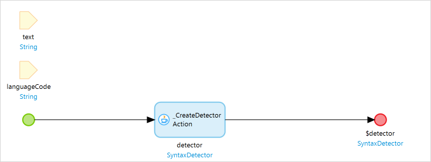

### 5.4 Nanoflows {#nanoflows}

#### 5.4.1 DetectDominantLanguage

The **DetectDominantLanguage** nanoflow takes the **languageDetector** object as an input parameter to get a list of dominant languages.

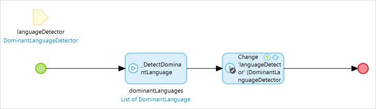

#### 5.4.2 DetectEntities

The **DetectEntities** nanoflow takes the **entityDetector** object as an input parameter to get a list of entities.

#### 5.4.3 DetectKeyPhrases

The **DetectKeyPhrases** nanoflow takes the **keyPhrasesDetector** object as an input parameter to get a list of key phrases.

#### 5.4.4 DetectPiiEntities

The **DetectPiiEntities** nanoflow takes the **piiEntitiesDetector** object as an input parameter to get a list of PII entities.

#### 5.4.5 DetectPiiEntities

The **DetectSentiment** nanoflow takes the **sentimentDetector** object as an input parameter to get a sentiment object.

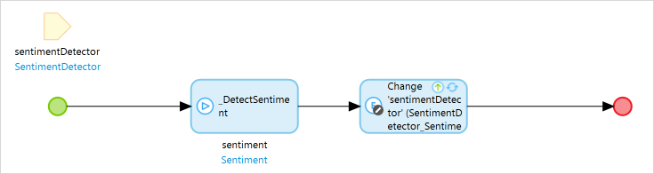

#### 5.4.6 DetectSyntax

The **DetectSyntax** nanoflow takes the **syntaxDetector** object as an input parameter to get a list of syntax tokens.

### 5.5 Enumerations {#enumerations}

#### 5.5.1 SentimentType

The **SentimentType** is an enumeration that incorporates all the information of the supported sentiment type.

| Caption | Name |
| --- | --- |
| Positive | Positive |
| Negative | Negative |
| Neutral | Neutral |
| Mixed | Mixed |

#### 5.5.2 EntityType

The **EntityType** is an enumeration that incorporates all the information of the supported entity type.

| Caption | Name |
| --- | --- |
| Person | Positive |
| Location | Negative |
| Organization | Neutral |
| Commerical Item | Mixed |
| Event | Positive |
| Date | Negative |
| Quantity | Neutral |
| Title | Mixed |
| Other | Mixed |

#### 5.5.3 PartOfSpeechTag

The **PartOfSpeechTag** is an enumeration that incorporates all the supported part of speech tags.

| Caption | Name |
| --- | --- |
| Adjective | Adjective |
| Adposition | Adposition |
| Adverb | Adverb |
| Auxiliary | Auxiliary |
| Conjunction | Conjunction |
| Determiner | Determiner |
| Interjection | Interjection |
| Noun | Noun |
| Numeral | Numeral |
| Particle | Particle |
| Pronoun | Pronoun |
| Proper Noun | Proper_Noun |
| Punctuation | Punctuation |
| Subordinating Conjunction | Subordinating_Conjunction |
| Symbol | Symbol |
| Verb | Verb |
| Other | Other |

#### 5.5.4 PiiEntityType

The **PiiEntityType** is an enumeration that incorporates all the information of the supported Personally Identifiable Information (PII) types.

| Caption | Name |
| --- | --- |
| Bank Account Number | Bank_Account_Number |
| Bank Routing | Bank_Routing |
| Credit Debit Number | Credit_Debit_Number |
| Credit Debit CVV | Credit_Debit_CVV |
| Credit Debit Expiry | Credit_Debit_Expiry |
| Pin | Pin |
| Email | Email |
| Address | Address |
| Name | Name |
| Phone | Phone |
| SSN | SSN |
| Date Time | Date_Time |
| Passport Number | Passport_Number |
| Driver ID | Driver_Id |
| URL | URL |
| Age | Age |
| User Name | User_Name |
| Password | Password |
| IP Address | IP_Address |
| MAC Address | MAC_Address |
| All | All |

### 5.6 Supported Languages {#supported-languages}

| Language              | Code  |
| --------------------- | ----- |
| German                | de    |
| English               | en    |
| Spanish               | es    |
| Italian               | it    |
| Portuguese            | pt    |
| French                | fr    |
| Japanese              | ja    |
| Korean                | ko    |
| Hindi                 | hi    |
| Arabic                | ar    |
| Chinese (simplified)  | zh    |
| Chinese (traditional) | zh-TW |

## 6 Using Text Analytics

When you start from a blank app template in Mendix Studio Pro, follow the steps below to set up customizable text analytics actions quickly.

### 6.1 Performing Language Detection in Your Browser

Use the **CreateDominantLanguageDetector** microflow and the **DetectDominantLanguage** nanoflow to perform language detection. Follow these steps to configure the language detection:

1.  Create a nanoflow as follows:
    1. Name the nanoflow *CreateDominantLanguageDetector*.
    2. Add the **CreateDominantLanguageDetector** microflow from the **TextAnalytics** > **USE_ME** folder to the nanoflow.
    3.  Double-click the **CreateDominantLanguageDetector** microflow in the nanoflow, change the settings as shown in the screenshot below, and click **OK**.

        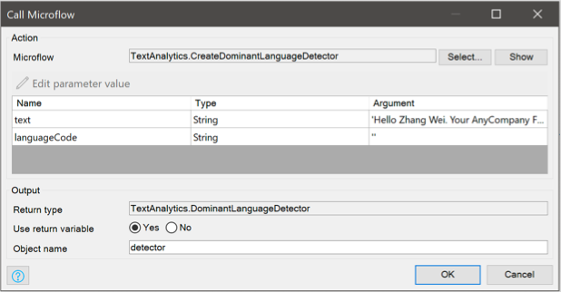

   4.  Right-click the create object activity and select **Set $detector as return value** in the pop-up menu.

       

2. From the **Toolbox**, add a **Data view** widget to your page.
3. Set the **CreateDominantLanguageDetector** nanoflow as the data source of the **Data View** widget as follows:
   1. Double-click the **Data view** widget to open the **Edit Data View** dialog box.
   2. For **Data source**, select **Nanoflow**.
   3. **Select** the **CreateDominantLanguageDetector** nanoflow for **Nanoflow**.
   4. Click **OK** to save the settings.
4. Inside the **Data view**, add a **Text area** widget.
5. Change the settings of the **Text area** widget as follows:
   1. Double-click the **Text area** widget to open the **Edit Text Area** dialog box.
   2. For **Data source**, select the **InputText** attribute from **Data view**.
   3. For **Label caption**, enter *Text*.
   4. Click **OK** to save the settings. 
6. Inside the **Data view**, add a **Button** widget below the **Text area** widget.
7. Change the settings of the **Button** widget as follows:
   1. Double-click the **Button** widget to open the **Action Button** dialog box.
   2. For **Caption**, enter *Detect Dominant Language*.
   3. In the **Event** section, set **On click** to **Call a nanoflow**.
   4. For **Nanoflow**, select the **DetectDominantLanguage** nanoflow from the **TextAnalytics** > **USE_ME** folder.
   5. Click **OK** to save the settings. 
8. Inside the **Data view**, add a **Template grid** widget below the **Button** widget.
9. Change the settings of the **Template grid** widget as follows:
   1. Double-click the **Template grid** widget to open the **Edit Template Grid** dialog box.
   2. Go to the **Data source** tab.
   3. Set **Type** to **Association**.
   4. Set **Entity (path)** to **TextAnalytics.DominantLanguageDetector_DominantLanguages/TextAnalytics.DominantLanguage**.
   5. Click **OK** to save the settings. 
10. Inside the **Template grid** widget, add a **Text box** widget.
11. Change the settings of the **Text box** widget as follows:
    1. Double-click the **Text area** widget to open the **Edit Text box** dialog box.
    2. Set **Data source** to **DominantLanguage_Language/Language/Name**.
    3. For **Label caption**, enter *Language*.
    4. Click **OK** to save the settings.
12. Inside the **Template grid** widget, add a second **Text box** widget below the **Text box** widget that you just created.
13. Change the settings of the **Text area** widget as follows:
    1. Double-click the **Text area** widget to open the **Edit Text Area** dialog box.
    2. Set **Data source** to **ConfidenceScore** from **Template grid**.
    3. For **Label caption**, enter *Score*.
    4. Click **OK** to save the settings.
14. Make sure you have [configured the license token](#configure-license-token).
15.  Run your app locally. You can perform language detection directly in the browser:

     

### 6.2 Performing Sentiment Detection in Your Browser

Use the **CreateSentimentDetector** microflow and the **DetectSentiment** nanoflow to perform sentiment detection. Follow these steps to configure the sentiment detection:

1.  Create a nanoflow as follows:
    1. Name the nanoflow *CreateSentimentDetector*. 
    2. Add the **CreateSentimentDetector** microflow from the **TextAnalytics** > **USE_ME** folder to the nanoflow.
    3.  Double-click the **CreateSentimentDetector** microflow in the nanoflow, change the settings as shown in the screenshot below, and click **OK**.

        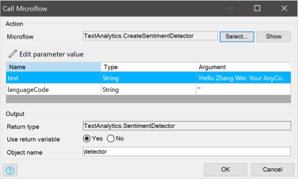
    
    4.  Right-click the create object activity and select **Set $detector as return value** in the pop-up menu.
    
        
    
2.  Create a microflow as follows:
    1. Name the microflow *GetDetectorSupportedLanguages*. 
    2. Right-click the canvas and select **Add** > **Parameter** from the pop-up menu. 
    3. Double-click the parameter to open the **Parameter** dialog box.
    4. Set **Data type** to **Object** and select **Detector** entity from **TextAnalytics** module as target object.
    5. For **Name**, enter *detector*.
    6. Click **OK** to save the changes.
    7. Double-click the end event to open the **End Event** dialog box.
    8. Set **Type** to **List**.
    9. For **Entity**, select **Language** entity from **TextAnalytics** module.
    10. In the text box, enter *$detector/TextAnalytics.Detector_SupportedLanguages/TextAnalytics.Language*.
    11.  Click **OK** to save the settings. 

         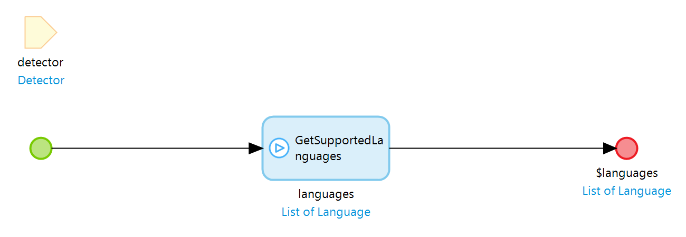

3. Add a **Data view** widget to your page.
4. Set the **CreateSentimentDetector** nanoflow as the data source of the **Data view** widget as follows:
   1. Double-click the **Data view** widget to open the **Edit Data View** dialog box.
   2. For **Data source**, select **Nanoflow**.
   3. **Select** the **CreateSentimentDetector** nanoflow for **Nanoflow**.
   4. Click **OK** to save the settings. 
5. Inside the **Data view** widget, add a **Reference selector** widget.
6. Change the settings of the **Reference selector** widget as follows:
   1. Double-click the **Reference selector** widget to open the **Edit Reference Selector** dialog box.
   2. Go to the **Selectable objects** tab.
   3. Set **Source** to **Microflow**.
   4. Set the **Microflow** as **GetTranslatorSupportedLanguages**.
   5. Go to the **General** tab.
   6. Set **Data source** to **TextAnalytics.Detector_InputLanguage/TextAnalytics.Language/TextAnalytics.Language.Name**.
   7. Click **OK** to save the settings. 
7. Inside the **Data view** widget, add a **Text area** widget below the **Reference selector** widget.
8. Change the settings of the **Text area** widget as follows:
   1. Double-click the **Text area** widget to open the **Edit Text Area** dialog box.
   2. For **Data source**, select the **InputText** attribute from **Data view**.
   3. For **Label caption**, enter *Text*.
   4. Click **OK** to save the settings. 
9. Inside the **Data view** widget, add a **Button** widget below the **Text area** widget.
10. Change the settings of the **Button** widget as follows:
    1.  Double-click the **Button** widget to open the **Action Button** dialog box.
    2.  For Caption, enter *Detect Sentiment*.
    3.  In the **Event** section, set **On click** to **Call a nanoflow**.
    4.  For **Nanoflow**, select the **DetectSentiment** nanoflow from the **TextAnalytics** > **USE_ME** folder.
    5.  Click **OK** to save the settings. 
11. Inside the **Data view** widget, add another **Data view** below the **Button** widget.
12. Change the settings of the **Data view** widget as follows:
    1. Double-click the **Data view** widget to open the **Data view** dialog box.
    2. Set **Entity (path)** to **TextAnalytics.SentimentDetector_Sentiment/TextAnalytics.Sentiment**.
    3. Click **OK** to save the settings. 
    4. When the **Question** dialog box asks if you want to automatically fill the contents of the data view, click **Yes**.
13. Inside the **Data view** widget that you just created, add another **Data view**.
14. Change the settings of the second **Data view** widget as follows:
    1. Double-click the **Data view** widget to open the **Data view** dialog box.
    2. Set **Entity (path)** to **TextAnalytics.Sentiment_SentimentScore/TextAnalytics.SentimentScore**.
    3. Click **OK** to save the settings.  
    4. When the **Question** dialog box asks if you want to automatically fill the contents of the data view, click **Yes**.
14. Make sure you have [configured the license token](#configure-license-token).
15.  Run your app locally. You can perform sentiment detection directly in the browser:

     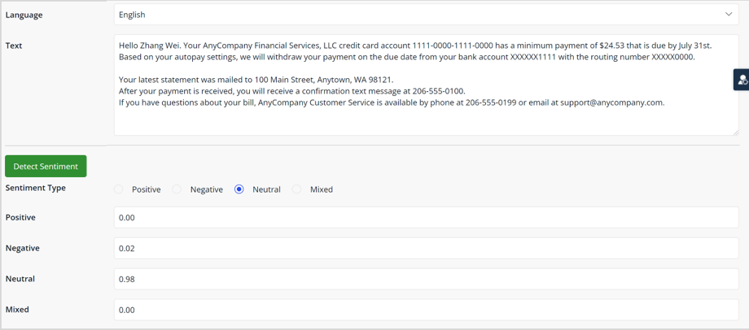

### 6.3 Performing Key Phrase Detection in Your Browser

Use the **CreateKeyPhraseDetector** microflow and the **DetectKeyPhrases** nanoflow to perform key phrase detection. Follow these steps to configure this key phrase detect action:

1.  Create a nanoflow as follows:
    1. Name the nanoflow *CreateKeyPhraseDetector*.    
    2. Add the **CreateKeyPhraseDetector** microflow from the **TextAnalytics** > **USE_ME** folder to the nanoflow.
    3.  Double-click the **CreateKeyPhraseDetector** microflow in the nanoflow, change the settings as shown in the screenshot below, and click **OK**.
    
        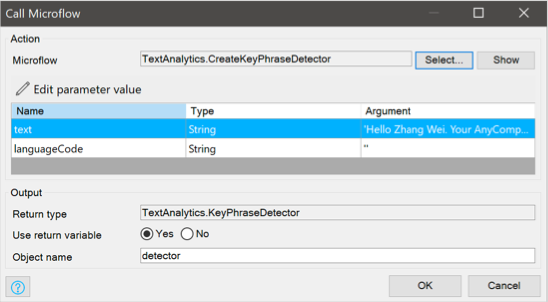
    
    4.  Right-click the create object activity and select **Set $detector as return value** in the pop-up menu.
      
        
   
2. Add a **Data view** widget to your page.
3. Set the **CreateKeyPhraseDetector** nanoflow as the data source of the **Data view** widget as follows:
   1. Double-click the **Data view** widget to open the **Edit Data View** dialog box.
   2. For **Data source**, select **Nanoflow**.
   3. **Select** the **CreateKeyPhraseDetector** nanoflow for **Nanoflow**.
   4. Click **OK** to save the settings. 
4. Inside the **Data view** widget, add a **Reference selector** widget.
5. Change the settings of the **Reference selector** widget as follows:
   1. Double-click the **Reference selector** widget to open the **Edit Reference Selector** dialog box.
   2. Go to the **Selectable objects** tab.
   3. Set **Source** to **Microflow**.
   4. Set the **Microflow** as **GetTranslatorSupportedLanguages**.
   5. Go to the **General** tab.
   6. Set **Data source** to **TextAnalytics.Detector_InputLanguage/TextAnalytics.Language/TextAnalytics.Language.Name**.
   7. Click **OK** to save the settings.
6. Inside the **Data view** widget, add a **Text area** widget below the **Reference selector** widget.
7. Change the settings of the **Text area** widget as follows:
   1. Double-click the **Text area** widget to open the **Edit Text Area** dialog box.
   2. For **Data source**, select the **InputText** attribute from **Data view**.
   3. For **Label caption**, enter *Text*.
   4. Click **OK** to save the settings.
8. Inside the **Data view** widget, add a **Button** widget below the **Text area** widget.
9. Change the settings of the **Button** widget as follows:
   1. Double-click the **Button** to open the **Action Button** dialog box.
   2. For Caption, enter *Detect Key Phrases*.
   3. In the **Event** section, set **On click** to **Call a nanoflow**.
   4. For **Nanoflow**, select the **DetectKeyPhrases** nanoflow from the **TextAnalytics** > **USE_ME** folder.
   5. Click **OK** to save the settings.
10. Inside the **Data view** widget, add a **Data grid** widget below the **Button** widget.
11. Change the settings of the **Data grid** widget as follows:
    1. Double-click the **Data grid** widget to open the **Edit Data Grid** dialog box.
    2. Go to the **Data source** tab.
    3. For the **Type** of the **Data source**, select **Association**.
    4. Set **Entity (path)** to **TextAnalytics.KeyPhraseDetector_KeyPhrases/TextAnalytics.KeyPhrase**.
    5. Click **OK** to save the settings.
    6.  When the **Question** dialog box asks if you want to automatically fill the contents of the data view, click **Yes**.
    7. If needed, drag a column in the data grid to move it to a different place.
12. Make sure you have [configured the license token](#configure-license-token).
13.  Run your app locally. You can perform key phrase detection directly in the browser:

     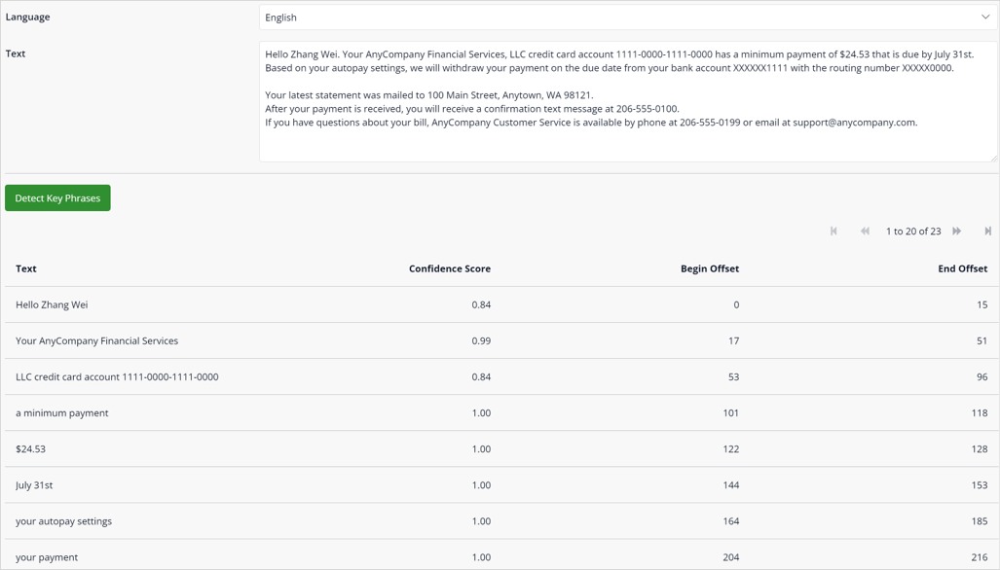

### 6.4 Performing Entity Detection in Your Browser

Use the **CreateEntityDetector** microflow and the **DetectEntities** nanoflow to perform entity detection. Follow these steps to configure this entity detect action:

1.  Create a nanoflow as follows:
    1. Name the nanoflow *CreateEntityDetector*.
    2. Add the **CreateEntityDetector** microflow from the **TextAnalytics** > **USE_ME** folder to the nanoflow.
    3.  Double-click the **CreateEntityDetector** microflow in the nanoflow, change the settings as shown in the screenshot below, and click **OK**.
    
        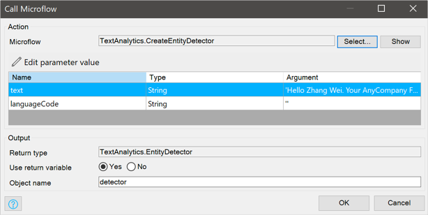
        
    4. Right-click the create object activity and select **Set $detector as return value** in the pop-up menu.
    
       
    
2. Add a **Data view** widget to your page.
3. Set the **CreateEntityDetector** nanoflow as the data source of the **Data view** widget as follows:
   1. Double-click the **Data view** widget to open the **Edit Data View** dialog box.
   2. For **Data source**, select **Nanoflow**.
   3. **Select** the **CreateEntityDetector** nanoflow for **Nanoflow**.
   4. Click **OK** to save the settings.   
4. Inside the **Data view** widget, add a **Reference selector** widget.
5. Change the settings of the **Reference selector** widget as follows:
   1. Double-click the **Reference selector** widget to open the **Edit Reference Selector** dialog box.
   2. Go to the **Selectable objects** tab.
   3. Set **Source** to **Microflow**.
   4. Set the **Microflow** as **GetTranslatorSupportedLanguages**.
   5. Go to the **General** tab.
   6. Set **Data source** to **TextAnalytics.Detector_InputLanguage/TextAnalytics.Language/TextAnalytics.Language.Name**.
   7. Click **OK** to save the settings.
6. Inside the **Data view** widget, add a **Text area** widget below the **Reference selector** widget.
7. Change the settings of the **Text area** widget as follows:
   1. Double-click the **Text area** widget to open the **Edit Text Area** dialog box.
   2. For **Data source**, select the **InputText** attribute from **Data view**.
   3. For **Label caption**, enter *Text*.
   4. Click **OK** to save the settings. 
8. Inside the **Data view** widget, add a **Button** widget below the **Text area** widget.
9. Change the settings of the **Button** widget as follows:
   1. Double-click the **Button** widget to open the **Action Button** dialog box.
   2. For Caption, enter *Detect Entities*.
   3. In the **Event** section, set **On click** to **Call a nanoflow**.
   4. For **Nanoflow**, select the **DetectEntities** nanoflow from the **TextAnalytics** > **USE_ME** folder.
   5. Click **OK** to save the settings.
10.  Inside the **Data view** widget, add a **Data grid** widget below the **Button** widget.
11. Change the settings of the **Data grid** widget as follows:
    1. Double-click the **Data grid** widget to open the **Edit Data Grid** dialog box.
    2. Go to the **Data source** tab.
    3. For the **Type** of the **Data source**, select **Association**.
    4. Set **Entity (path)** to **TextAnalytics.EntityDetector_Entities/TextAnalytics.Entity**. 
    5. Click **OK** to save the settings.
    6. When the **Question** dialog box asks if you want to automatically fill the contents of the data view, click **Yes**.
    7. If needed, drag a column in the data grid to move it to a different place.
12. Make sure you have [configured the license token](#configure-license-token).
13.  Run your app locally. You can perform entity detection directly in the browser:

     

### 6.5 Performing PII Entity Detection in Your Browser

Use the **CreatePiiEntityDetector** microflow and the **DetectPiiEntities** nanoflow to perform PII entity detection. Follow these steps to configure this PII entity detect action:

1.  Create a nanoflow as follows:
    1. Name the nanoflow *CreatePiiEntityDetector*.
    2. Add the **CreatePiiEntityDetector** microflow from the **TextAnalytics** > **USE_ME** folder to the nanoflow.
    3.  Double-click the **CreatePiiEntityDetector** microflow in the nanoflow, change the settings as shown in the screenshot below, and click **OK**.

        
      
   4.  Right-click the create object activity and select **Set $detector as return value** in the pop-up menu.
   
       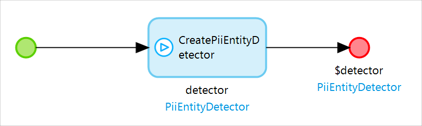
   
2. Add a **Data view** widget to your page.
3. Set the **CreatePiiEntityDetector** nanoflow as the data source of the **Data view** widget as follows:
   1. Double-click the **Data view** widget to open the **Edit Data View** dialog box.
   2. For **Data source**, select **Nanoflow**.
   3. **Select** the **CreatePiiEntityDetector** nanoflow for **Nanoflow**.
   4. Click **OK** to save the settings.   
4. Inside the **Data view** widget, add a **Reference selector** widget.
5. Change the settings of the **Reference selector** widget as follows:
   1. Double-click the **Reference selector** widget to open the **Edit Reference Selector** dialog box.
   2. Go to the **Selectable objects** tab.
   3. Set **Source** to **Microflow**.
   4. Set the **Microflow** as **GetTranslatorSupportedLanguages**.
   5. Go to the **General** tab.
   6. Set **Data source** to **TextAnalytics.Detector_InputLanguage/TextAnalytics.Language/TextAnalytics.Language.Name**.
   7. Click **OK** to save the settings. 
6. Inside the **Data view** widget, add a **Text area** widget below the **Reference selector** widget.
7. Change the settings of the **Text area** widget as follows:
   1. Double-click the **Text area** widget to open the **Edit Text Area** dialog box.
   2. For **Data source**, select the **InputText** attribute from **Data view**.
   3. For **Label caption**, enter *Text*.
   4. Click **OK** to save the settings. 
8. Inside the **Data view** widget, add a **Button** widget below the **Text area** widget.
9. Change the settings of the **Button** widget as follows:
   1. Double-click the **Button** widget to open the **Action Button** dialog box.
   2. For Caption, enter *Detect PII Entities*.
   3. In the **Event** section, set **On click** to **Call a nanoflow**.
   4. For **Nanoflow**, select the **DetectPiiEntities** nanoflow from the **TextAnalytics** > **USE_ME** folder.
   5. Click **OK** to save the settings.
10. Inside the **Data view** widget, add a **Data grid** widget below the **Button** widget.
11. Change the settings of the **Data grid** widget as follows:
    1. Double-click the **Data grid** widget to open the **Edit Data Grid** dialog box.
    2. Go to the **Data source** tab.
    3. For the **Type** of the **Data source**, select **Association**.
    4. Set **Entity (path)** to **TextAnalytics.PiiEntityDetector_PiiEntities/TextAnalytics.PiiEntity**. 
    5. Click **OK** to save the settings.
    6. When the **Question** dialog box asks if you want to automatically fill the contents of the data view, click **Yes**.
    7. If needed, drag a column in the data grid to move it to a different place.
12. Make sure you have [configured the license token](#configure-license-token).
13.  Run your app locally. You can perform PII entity detection directly in the browser:

     

### 6.6 Performing Syntax Detection in Your Browser

Use the **CreateSyntaxDetector** microflow and the **DetectSyntax** nanoflow to perform syntax detection. Follow these steps to configure this syntax detect action:

1.  Create a nanoflow as follows:
    1. Name the nanoflow *CreateSyntaxDetector*.
    2. Add the **CreateSyntaxDetector** microflow from the **TextAnalytics** > **USE_ME** folder to the nanoflow.
    3.  Double-click the **CreateSyntaxDetector** microflow in the nanoflow, change the settings as shown in the screenshot below, and click **OK**.

        

    4.  Right-click the create object activity and select **Set $detector as return value** in the pop-up menu.

        

2. Add a **Data view** widget to your page.
3. Set the **CreateSyntaxDetector** nanoflow as the data source of the **Data view** widget as follows:
   1. Double-click the **Data view** widget to open the **Edit Data View** dialog box.
   2. For **Data source**, select **Nanoflow**.
   3. **Select** the **CreateSyntaxDetector** nanoflow for **Nanoflow**.
   4. Click **OK** to save the settings. 
4. Inside the **Data view** widget, add a **Reference selector** widget.
5. Change the settings of the **Reference selector** widget as follows:
   1. Double-click the **Reference selector** widget to open the **Edit Reference Selector** dialog box.
   2. Go to the **Selectable objects** tab.
   3. Set **Source** to **Microflow**.
   4. Set the **Microflow** as **GetTranslatorSupportedLanguages**.
   5. Go to the **General** tab.
   6. Set **Data source** to **TextAnalytics.Detector_InputLanguage/TextAnalytics.Language/TextAnalytics.Language.Name**.
   7. Click **OK** to save the settings.  
6. Inside the **Data view** widget,  add a **Text area** widget below the **Reference selector** widget.
7. Change the settings of the **Text area** widget as follows:
   1. Double-click the **Text area** widget to open the **Edit Text Area** dialog box.
   2. For **Data source**, select the **InputText** attribute from **Data view**.
   3. For **Label caption**, enter *Text*.
   4. Click **OK** to save the settings.   
8. Inside the **Data view** widget, add a **Button** widget below the **Text area** widget.
9. Change the settings of the **Button** widget as follows:
   1. Double-click the **Button** widget to open the **Action Button** dialog box.
   2. For Caption, enter *Detect Syntax*.
   3. In the **Event** section, set **On click** to **Call a nanoflow**.
   4. For **Nanoflow**, select the **DetectSyntax** nanoflow from the **TextAnalytics** > **USE_ME** folder.
   5. Click **OK** to save the settings. 
10. Inside the **Data view** widget, add a **Data grid** widget below the **Button** widget.
11. Change the settings of the **Data grid** widget as follows:
    1. Double-click the **Data grid** widget to open the **Edit Data Grid** dialog box.
    2. Go to the **Data source** tab.
    3. For the **Type** of the **Data source**, select **Association**.
    4. Set **Entity (path)** to **extAnalytics.SyntaxDetector_SyntaxTokens/TextAnalytics.SyntaxToken**. 
    5. Click **OK** to save the settings.
    6. When the **Question** dialog box asks if you want to automatically fill the contents of the data view, click **Yes**.
    7. If needed, drag a column in the data grid to move it to a different place.
12. Make sure you have [configured the license token](#configure-license-token).
13.  Run your app locally. You can perform syntax detection directly in the browser:

     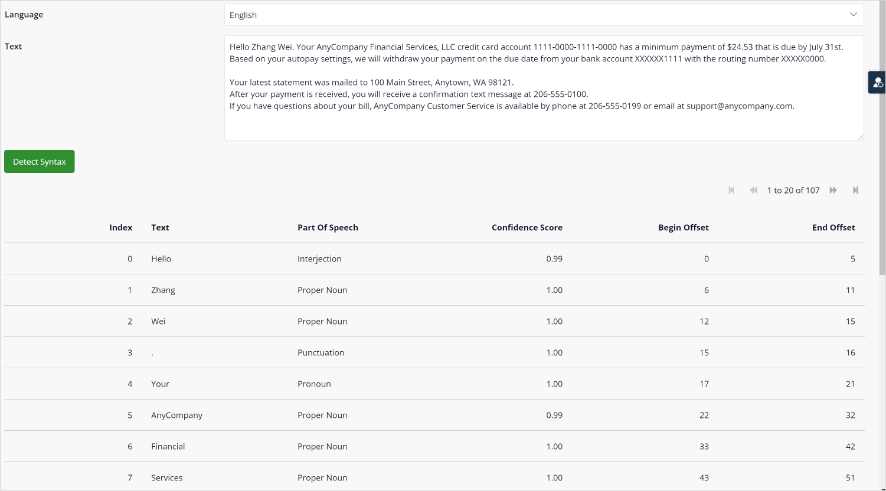
