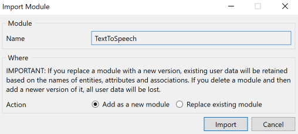
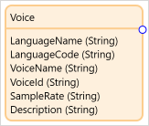
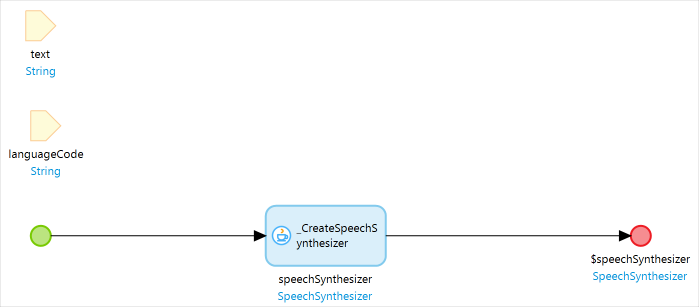
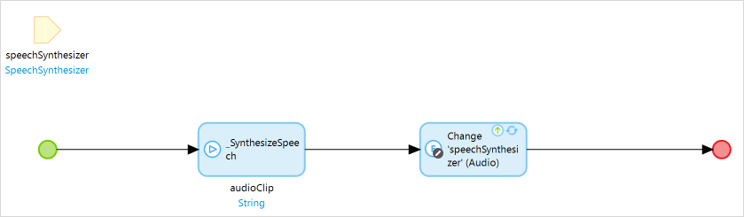
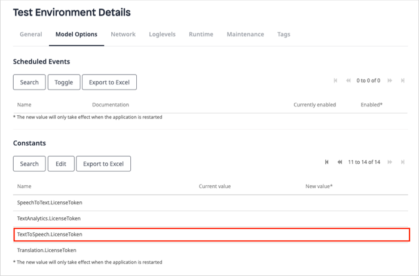
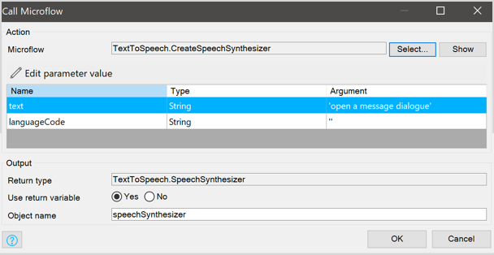
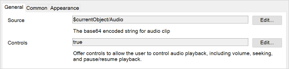
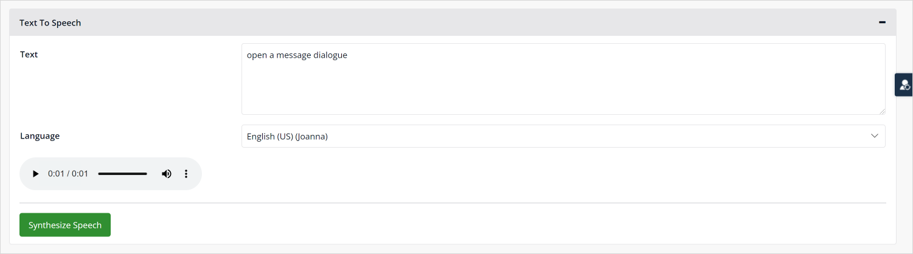

## 1 Introduction

The [Text To Speech](https://marketplace.mendix.com/link/component/118409) app service enables you to easily convert written text into human voice in your web applications. With this app service, you can build an app to work with the state-of-the-art of text to voice conversion, without building your own text-to-speech app from the scratch. All you need to do is drag and drop items and configure them.

Here is an overview of what the Text To Speech contains:

| Item                                        | Name                        |
| ------------------------------------------- | --------------------------- |
| [Predefined entities](#predefined-entities) | SpeechSynthesizer, Voice    |
| [Constants](#constants)                     | LicenseToken, TokenEndpoint |
| [Microflows](#microflows)                   | CreateSpeechSynthesizer     |
| [Nanoflows](#nanoflows)                     | SynthesizeSpeech            |
| [Widgets](#widgets)                         | AudioPlayer                 |

In most cases, you will only need what is contained in the **TextToSpeech** > **USE_ME** folder. The content in the **TextToSpeech** > **Internal** folder is for internal use only and you will not need it.

### 1.1 Typical Use Cases

You can use this app service to easily convert written text into voice in your Mendix apps. You can perform some basic operations, such us synthesizing speech from given text with different language options, and playing synthesized audio with the **AudioPlayer** widget.

### 1.2 Features

This app service enables doing the following:

* Convert text to voice
* Support different language options
* Play synthesized audio with the **AudioPlayer** widget

### 1.3 Prerequisites

This app service can only be used with Studio Pro 9 versions starting with [9.4.0](/releasenotes/studio-pro/9.4).

## 2 Installation

### 2.1 Obtaining a License Token {#obtain-license-token}

Text to Speech is a premium Mendix product that is subject to a purchase and subscription fee. To successfully use this app service in your app, first you need to start a subscription or a trial to get a license token.

#### 2.1.1 Starting a Trial

A trial gives everyone in your company one-month access to the app service. The trial has a limitation with [data usage](#check-usage) up to 2500 minutes. To start a trial, perform the following steps:

1. Go to the [Text To Speech](https://marketplace.mendix.com/link/component/118593) page in the marketplace.
2. Click **Try for Free** to open the **Start Your Free Trial** page. Here you can see the **Trial Details** for the app service.
3. Select the check box to agree to the **Terms & Conditions**.
4. Click **Enable Trial**. A page opens and confirms that the your request has been received.
5. Wait until your request is processed. It can take more than at least 15 minutes for the system to process your request. After your request is processed, you will receive an email that says the app service is ready to be used. 
6. Click the link in the order confirmation email to go to the Marketplace [Subscriptions](https://docs.mendix.com/appstore/general/app-store-overview#subscriptions) page and log in there. The **Subscriptions** page gives an overview of all the subscriptions of your organization.
7. Click **Translation** to open the [service management dashboard](https://docs.mendix.com/appstore/general/app-store-overview#service-management-dashboard).
8. Follow the instructions in the [Creating Binding Keys](/appstore/general/app-store-overview#creating-binding-keys) section in the *Marketplace Overview* to create a license token.

#### 2.1.2 Subscribing to the App Service

1. Go to the [Text To Speech](https://marketplace.mendix.com/link/component/118593) page in the marketplace.
2. Click **Subscribe** to start a subscription.
3. Select your subscription plan.
4. Fill in [Technical Contact](https://docs.mendix.com/developerportal/collaborate/app-roles#technical-contact) information (**First Name**, **Last Name**, **Email Address**), billing account information, payments and other required information and then place the order. A page opens and confirms that the your request has been received.
5. Wait until your request is processed. It can take more than 15 minutes for the system to process your request. After your request is processed, the Technical Contact will receive an email that says the app service is ready to be used. 
6. Click the link in the order confirmation email to go to the Marketplace [Subscriptions](https://docs.mendix.com/appstore/general/app-store-overview#subscriptions) page and log in there. The **Subscriptions** page gives an overview of all the subscriptions of your organization.
7. Click **Translation** to open the [service management dashboard](https://docs.mendix.com/appstore/general/app-store-overview#service-management-dashboard).
8. Follow the instructions in the [Creating Binding Keys](/appstore/general/app-store-overview#creating-binding-keys) section in the *Marketplace Overview* to create a license token.

### 2.2 Downloading the Component from the Marketplace

1. Go to the [Text To Speech](https://marketplace.mendix.com/link/component/118593) page in the Marketplace.
2.  **Download** the *TextToSpeech.mpk* file.
3.  To add the Text To Speech app service to your app in Mendix Studio Pro, follow these steps:
    1.  In the **App Explorer**, right-click the app.
    2.  Click **Import module package** and then select *TextToSpeech.mpk* file.

        In the **Import Module** dialog box, **Add as a new module** is the default option when the module is being downloaded for the first time, which means that new entities will be created in your project.

        

        {}If you have made any edits or customization to a module that you have already downloaded, be aware of the **Replace existing module** option. This will override all of your changes with the standard Marketplace content, which will result in the creation of new entities and attributes, the deletion of renamed entities and attributes, and the deletion of their respective tables and columns represented in the database. Therefore, unless you understand the implications of your changes and you will not update your content in the future, making edits to the downloaded modules is not recommended.{}

   3. In the **Import Module** dialog box, click **Import**. 
   4. Wait until a pop-up box states that the module was successfully imported. Click **OK**.
   5. Open the **App Explorer**  to view the **TextToSpeech** module. You can also find the app service in the **Cognitive AI widgets** category in the **Toolbox**.
3. After importing, you need to map the **Administrator** and **User** module roles of the installed modules to the applicable user roles in your app.

You have successfully added the Text To Speech resources to your app.

## 3 Configuration

### 3.1 Predefined Entities {#predefined-entities}

#### 3.1.1 SpeechSynthesizer

The **SpeechSynthesizer** entity is a conceptual entity that incorporates all the information of the synthesized media document. It contains the text and synthesized audio string. You can choose to inherit from this entity, set an association to the entity, or copy this entity to your module.

| Attribute |Data Type | Description|
| --- | --- |---|
| `Text` | String |The text string need to be converted. |
| `Audio` | String |The base64-encoded audio data string. |

The **Voice** entity is an entity referenced from **SpeechSynthesizer** that incorporates all the information of the supported voice object.

| Attribute |Data Type | Description|
| --- | --- |---|
| `LanguageName` | String |The language name of the voice object. |
| `LanguageCode` | String |The [language code](#supported-languages) of the voice object. |
| `VoiceName` | String |The name of the voice object. |
| `VoiceId` | String |The UUID of the voice object. |
| `SampleRate` | String |The sample rate of voice. |
| `Description` | String |The text string of the voice description. |

There is a many-to-many association between the **SpeechSynthesizer** entity and the **Voice** entity.

### 3.2 Constants {#constants}

#### 3.2.1 LicenseToken

The **LicenseToken** constant provides a valid license token for an app that uses this app service. As Text to Speech is a commercial product, no matter your app is deployed in the [Mendix Cloud](/developerportal/deploy/mendix-cloud-deploy), your own environment, or locally in Studio Pro, you need to have a valid license token and configure it correctly. For details on how to get and configure a license token, see the [Obtaining a License Token](#obtain-license-token) section and [Configuring the License Token](#configure-license-token) section.

#### 3.2.2 TokenEndpoint

The **TokenEndpoint** constant provides a valid endpoint of security token service for the back-end authentication of the app service. The constant comes with a default value which points to the deployed security token service. The security token service issues security tokens that authenticate user's identity. 

### 3.3 Microflows {#microflows}

#### 3.3.1 CreateSpeechSynthesizer {#createspeechsynthesizer}

The **CreateSpeechSynthesizer** microflow takes **text** and **languageCode** from a voice object as input parameters, and returns a **speechSynthesizer** object that contains the based64-encoded audio string and text string. For instance, **languageCode** can be set to `en-US`. 

{}
For more information about language codes, see the [Supported Languages](#supported-languages) section.
{}

### 3.4 Nanoflows {#nanoflows}

#### 3.4.1 SynthesizeSpeech

The **SynthesizeSpeech** nanoflow takes a **speechSynthesizer** object as an input parameter, syntheizes audio string from the input parameter, and updates the **speechSynthesizer** audio string parameter.

### 3.5 Widgets {#widgets}

#### 3.5.1 AudioPlayer {#audioplayer}

The core widget required is the **AudioPlayer** widget. You can make the following settings for the **AudioPlayer** widget:

* **General** tab
	* **Source**  – the value of the **Audio** attribute of a **speechSynthesizer** object
	* **Controls**  – determines if it offers controls to allow the end user to control audio playback, including volume, seeking, and pause/resume playback; this accepts a Boolean value

### 3.6 Supported Languages {#supported-languages}

| Language               | Language Code |
| ---------------------- | ------------- |
| Arabic                 | arb           |
| Chinese, Mandarin      | cmn-CN        |
| Danish                 | da-DK         |
| Dutch                  | nl-NL         |
| English, Australian    | en-AU         |
| English, British       | en-GB         |
| English, Indian        | en-IN         |
| English, New Zealand   | en-NZ         |
| English, South African | en-ZA         |
| English, US            | en-US         |
| English, Welsh         | en-GB-WLS     |
| French                 | fr-FR         |
| French, Canadian       | fr-CA         |
| Hindi                  | hi-IN         |
| German                 | de-DE         |
| Icelandic              | is-IS         |
| Italian                | it-IT         |
| Japanese               | ja-JP         |
| Korean                 | ko-KR         |
| Norwegian              | nb-NO         |
| Polish                 | pl-PL         |
| Portuguese, Brazilian  | pt-BR         |
| Portuguese, European   | pt-PT         |
| Romanian               | ro-RO         |
| Russian                | ru-RU         |
| Spanish, European      | es-ES         |
| Spanish, Mexican       | es-MX         |
| Spanish, US            | es-US         |
| Swedish                | sv-SE         |
| Turkish                | tr-TR         |
| Welsh                  | cy-GB         |

### 3.7 Configuring the License Token {#configure-license-token}

#### 3.7.1 For an App Deployed Locally or in a Sandbox

If you deploy your app locally, configure the license token in Studio Pro. Perform the following steps:

1. In the App Explorer, go to **Settings** to open the [App Settings](/refguide/project-settings) dialog box.
2. On the **Configurations** tab, click **Edit** to open the **Edit Configuration** dialog box.
3. On the **Constants** tab, create a new constant with the predefined constant **SpeechToText LicenseToken**.
4. Fill in the **Value** with the license token that you obtained.
5.  Click **OK** to save the settings.

    

6. When you finish building the app, click **Run** to deploy your app to the cloud.

#### 3.7.2 For an App Deployed in the Mendix Cloud

If you deploy your app in the Mendix Cloud, configure the license token in the [Developer Portal](/developerportal/deploy/environments-details).

Before you deploy your app, configure the app **Constants** in the deployment package.

If you have already deployed your app, change the existing **LicenseToken** constant value on the **Model Options** tab and restart the app.

#### 3.7.3 For an App Deployed in Your Own Environment

If you deploy your app in your own environment, you need to configure the license token in your own environment. For more information, see [Deployment](/developerportal/deploy/index).

## 4 Usage

### 4.1 Converting Text to Speech in Your Browser

When you start from a blank app template in Mendix Studio Pro, follow the steps below to set up the text-to-speech conversion:

1.  Create a nanoflow as follows:
    1. Name the nanoflow *CreateSpeechSynthesizer*.
    
    2. Add the **CreateSpeechSynthesizer** microflow from the **TextToSpeech** > **USE_ME** folder to the nanoflow.
    
    3.  Double-click the **CreateSpeechSynthesizer** microflow in the nanoflow, change the settings as shown in the screenshot below, and click **OK**.
       
        
      
        In this example, the **languageCode** is set to `''`, then the default language option `en-US` is used. You can also set it to a different [language code](#supported-languages). For more information about the parameters, see [CreateSpeechSynthesizer](#createspeechsynthesizer)

    4.  Right-click the **CreateSpeechSynthesizer** microflow and select **Set $speechSynthesizer as return value** in the pop-up menu.
    
        
    
2.  Create a microflow as follows:
    1. Name the microflow *GetSupportedVoices*. 
    2. Right-click the canvas and select **Add** > **Parameter** from the pop-up menu. 
    3. Double-click the parameter to open the **Parameter** dialog box.
    4. Set **Data type** to **Object** and select **SpeechSynthesizer** entity from **TextToSpeech** module as target object.
    5. For **Name**, enter *speechSynthesizer*.
    6. Click **OK** to save the changes.
    7. Add a retrieve object activity to the microflow.
    8. Double-click the retrieve object activity to open the **Retrieve Objects** dialog box.
    9. Set the **Source** to **By association**.
    10. Set **Association** to **$speechSynthesizer/SpeechSynthesizer_SupportedVoices**.
    11. Click **OK** to save the settings.
    12.  Right-click the **GetSupportedVoices** microflow and select **Set $Voices as return value** in the pop-up menu.
      
         
   
3. Add a **Data view** widget to your page.
4. Set the **CreateSpeechSynthsizer** nanoflow as the data source of the **Data view** widget as follows:
   1.  Double-click the **Data view** widget to open the **Edit Data View** dialog box.
   2.  For **Data source**, select **Nanoflow**.
   3.  **Select** the **CreateSpeechSynthsizer** nanoflow for **Nanoflow**.
   4.  Click **OK** to save the settings.
5. Inside the **Data view** widget, add a **Text area** widget.
6. Change the settings of the **Text area** widget as follows:
   1. Double-click the **Text area** widget to open the **Edit Text Area** dialog box.
   2. Set **Data source** to **SpeechSynthesizer_Voice/Voice/SpeechSynthesizer_Voice/SpeechSynthesizer/Text**.
   3. Click **OK** to save the settings.
7. Inside the **Data view** widget, add a **Reference selector** widget below the **Text area** widget.
8. Change the settings of the **Reference selector** widget as follows:
   1. Double-click the **Reference selector** widget to open the **Edit Reference Selector** dialog box.
   2. Go to the **Selectable objects** tab.
   3. Set **Source** to **Microflow**.
   4. Set the **Microflow** as **GetSupportedVoices**.
   5. Go to the **General** tab.
   6. Set **Data source** to **TextToSpeech.SpeechSynthesizer_Voice/TextToSpeech.Voice/TextToSpeech.Voice.Description**.
   7. For **Label caption**, enter *Language*.
   8. Click **OK** to save the settings.
9. Inside the **Data view** widget, add an [Audio player](#audioplayer) widget below the **Reference selector** widget.
10.  Change the settings of the **Audio player** widget as follows:
     1.  Double-click the **Audio Player** widget to open the **Audio Player** dialog box.
     2.  On the **General** tab, set **Source** to **$currentObject/Audio** to bind the base64-encoded audio data string.
     3.  Set **Controls** to **true**.

         

     4. Click **OK** to save the settings.
11. Inside the **Data view** widget, add a **Button** widget below the **Audio player** widget .
12. Change the settings of the **Button** widget as follows:
    1. Double-click the **Button** widget to open the **Action Button** dialog box.
    2. For **Caption**, enter *Synthesize Speech*.
    3. In the **Event** section, set **On click** to **Call a nanoflow**.
    4. For **Nanoflow**, **Select** the **SynthesizeSpeech** nanoflow from the **TextToSpeech** > **USE_ME** folder.
    5. Click **OK** to save the settings. 
13. Make sure you have [configured the license token](#configure-license-token).
14. Run your app locally. You can convert text to speech directly in the browser:

    

### 4.2 Checking Statistics on the Usage Dashboard {#check-usage}

The **Usage** dashboard shows the real-time statistics about the usage of an app service. Perform the following steps to check the real-time statistics:

1. Log into the Marketplace.
2. Go to **My Marketplace** and click [Subscriptions](/appstore/general/app-store-overview#subscriptions) on the left navigation menu. The **Subscriptions** page gives an overview of all the subscriptions of your organization.
3. Click **Text to Speech** to open the [service management dashboard](/appstore/general/app-store-overview#service-management-dashboard). On the **Overview** tab, the **Usage** dashboard shows the real-time statistics.
