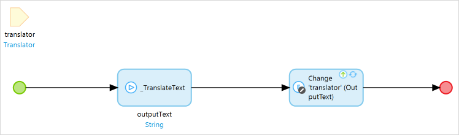
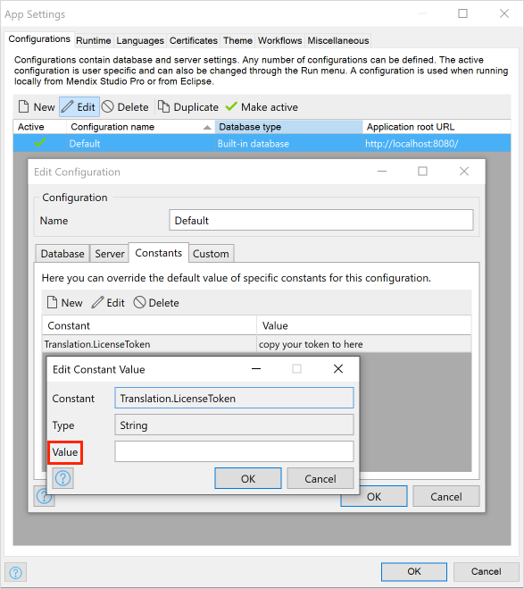
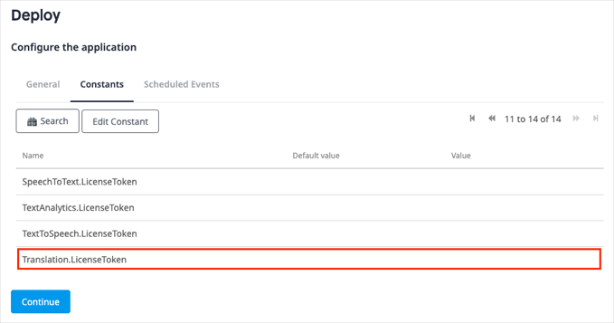
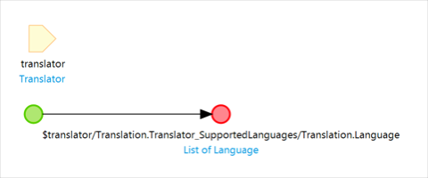

## 1 Introduction

The [Translation](https://marketplace.mendix.com/link/component/118411) app service enables you to build web applications to work with state-of-the-art multi-language text translation. All you need to do is drag and drop items and configure them.

Here is an overview of what the Translation contains:

| Item                                        | Name                        |
| ------------------------------------------- | --------------------------- |
| [Predefined entities](#predefined-entities) | Language, Translator        |
| [Constants](#constants)                     | LicenseToken, TokenEndpoint |
| [Microflows](#microflows)                   | CreateTranslator            |
| [Nanoflows](#nanoflows)                     | TranslateText               |

In most cases, you will only need what is contained in the **Translation** > **USE_ME** folder. The content in the **Translation** > **Internal** folder is for internal use only and you will not need it.

### 1.1 Typical Use Cases

You can use this app service on Mendix cloud that enables you to easily perform text translation with multi-language support in your Mendix applications.

### 1.2 Features

This app service enables doing the following:

* Customize text tranlation
* Switch different language options

### 1.3 Prerequisites

This app service can only be used with Studio Pro 9 versions starting with [9.3.0](/releasenotes/studio-pro/9.4).

## 2 Installation

### 2.1 Obtaining a License Token {#obtain-license-token}

Translation is a premium Mendix product that is subject to a purchase and subscription fee. To successfully use this app service in your app, first you need to start a subscription or a trial to get a license token.

#### 2.1.1 Starting a Trial

A trial gives everyone in your company one-month access to the app service. The trial has a limitation with [data usage](#check-usage) up to 2500 minutes. To start a trial, perform the following steps:

1. Go to the [Translation](https://marketplace.mendix.com/link/component/118411) page in the marketplace.
2. Click **Try for Free** to open the **Start Your Free Trial** page. Here you can see the **Trial Details** for the app service.
3. Select the check box to agree to the **Terms & Conditions**.
4. Click **Enable Trial**. A page opens and confirms that the your request has been received.
5. Wait until your request is processed. It can take more than at least 15 minutes for the system to process your request. After your request is processed, you will receive an email that says the app service is ready to be used. 
6. Click the link in the email to go to the [Company Subscriptions](https://docs.mendix.com/appstore/general/app-store-overview#company-subscriptions) page and log in there. This page gives an overview of all the subscriptions of your organization.
7. Click **Translation** to open the [service management dashboard](https://docs.mendix.com/appstore/general/app-store-overview#service-management-dashboard).
8. Follow the instructions in the [Creating Binding Keys](/appstore/general/app-store-overview#creating-binding-keys) section in the *Marketplace Overview* to create a license token.

#### 2.1.2 Subscribing to the App Service

1. Go to the [Translation](https://marketplace.mendix.com/link/component/118411) page in the marketplace.
2. Click **Subscribe** to start a subscription.
3. Select your subscription plan.
4. Fill in **Technical Owner** information (**First Name**, **Last Name**, **Email Address**), billing account information, payments and other required information and then place the order. A page opens and confirms that the your request has been received.
5. Wait until your request is processed. It can take more than 15 minutes for the system to process your request. After your request is processed, the Technical Contact will receive an email that says the app service is ready to be used. 
6. Click the link in the email to go to the [Company Subscriptions](https://docs.mendix.com/appstore/general/app-store-overview#company-subscriptions) page and log in there. This page gives an overview of all the subscriptions of your organization.
7. Click **Translation** to open the [service management dashboard](https://docs.mendix.com/appstore/general/app-store-overview#service-management-dashboard).
8. Follow the instructions in the [Creating Binding Keys](/appstore/general/app-store-overview#creating-binding-keys) section in the *Marketplace Overview* to create a license token.

### 2.2 Download the Component from the Marketplace

1. Go to the [Translation](https://marketplace.mendix.com/link/component/118411) page in the Marketplace.
2. **Download** the *Translation.mpk* file.
3.  To add the Translation app service to your app in Mendix Studio Pro, follow these steps: 
    1. In the **App Explorer**, right-click the app.
    2.  Click **Import module package** and then select the *Translation.mpk*. 

        In the **Import Module** dialog box, **Add as a new module** is the default option when the module is being downloaded for the first time, which means that new entities will be created in your project.

        

        {}If you have made any edits or customization to a module that you have already downloaded, be aware of the **Replace existing module** option. This will override all of your changes with the standard Marketplace content, which will result in the creation of new entities and attributes, the deletion of renamed entities and attributes, and the deletion of their respective tables and columns represented in the database. Therefore, unless you understand the implications of your changes and you will not update your content in the future, making edits to the downloaded modules is not recommended.{}

   3. In the **Import Module** dialog box, click **Import**. 
   4. Wait until a pop-up box states that the module was successfully imported. Click **OK**.
   5. Open the **App Explorer**  to view the **Translation** module. You can also find the app service in the **Cognitive AI widgets** category in the **Toolbox**.   
4. Map the **Administrator** and **User** module roles of the installed modules to the applicable user roles in your app.

You have succesfully added the Translation resources to your app.

## 3 Configuration

### 3.1 Predefined Entities {#predefined-entities}

#### 3.1.1 Translator

The **Translator** entity is a conceptual entity that incorporates all the information of the translator object. It contains both input and output text strings. You can choose to inherit from this entity, set an association to the entity, or copy this entity to your module. 

| Attribute | Description |
| --- | --- |
| **InputText** | The input text string. |
| **OutputText** | The output text string. |

#### 3.1.2 Language

The **Language** entity is an entity referenced from **Translator** that incorporates all the information of supported language object.

| Attribute | Description |
| --- | --- |
| **Name** | The language name, equivalent to the locale name. |
| **Code** | The [language code](#supported-languages) that assigns letters or numbers as identifiers or classifiers for languages. |

### 3.2 Constants {#constants}

#### 3.2.1 Constants

The **LicenseToken** constant provides a valid license token for an app that uses this app service. As Translation is a commercial product, no matter your app is deployed in the [Mendix Cloud](/developerportal/deploy/mendix-cloud-deploy), your own environment, or locally in Studio Pro, you need to have a valid license token and configure it correctly. For details on how to get and configure a license token, see the [Obtaining a License Token](#obtain-license-token) section and [Configuring the License Token](#configure-license-token) section.

#### 3.2.2 TokenEndpoint

The **TokenEndpoint** constant provides a valid endpoint of security token service for the back-end authentication of the app service. The constant comes with a default value which points to the deployed security token service. The security token service issues security tokens that authenticate user's identity.

### 3.3 Microflows {#microflows}

#### 3.3.1 CreateTranslator {#create-translator}

The **CreateTranslator** microflow takes **inputText**, **inputLanguageCode**, and **outputLanguageCode** as input parameters and creates translator actions in the back-end service. For instance, **inputLanguageCode** and **outputLanguageCode** can be set to `en-US`.

{}
For more information about the language codes, see the [Supported Languages](#supported-languages) section.
{}

### 3.4 Nanoflows {#nanoflows}

#### 3.4.1 TranslatorText

The **TranslatorText** microflow takes the **translator** object as an input parameter, performs text translation actions in the back-end service, and eventually updates the output text string of the **translator** object.

### 3.5 Supported Languages {#supported-languages}

| Language | Language Code |
| ---- | -----------|
| Afrikaans	|af |
| Albanian	|sq |
| Amharic	|am |
| Arabic	|ar |
| Armenian	|hy |
| Azerbaijani	|az |
| Bengali	|bn |
| Bosnian	|bs |
| Bulgarian	|bg |
| Catalan	|ca |
| Chinese (Simplified)	|zh |
| Chinese (Traditional)	|zh-TW |
| Croatian	|hr |
| Czech	|cs |
| Danish	|da |
| Dari	|fa-AF |
| Dutch	|nl |
| English	|en |
| Estonian	|et |
| Farsi (Persian)	|fa |
| Filipino, Tagalog	|tl |
| Finnish	|fi |
| French	|fr |
| French (Canada)	|fr-CA |
| Georgian	|ka |
| German	|de |
| Greek	|el |
| Gujarati	|gu |
| Haitian Creole	|ht |
| Hausa	|ha |
| Hebrew	|he |
| Hindi	|hi |
| Hungarian	|hu |
| Icelandic	|is |
| Indonesian	|id |
| Irish	|ga |
| Italian	|it |
| Japanese	|ja |
| Kannada	|kn |
| Kazakh	|kk |
| Korean	|ko |
| Latvian	|lv |
| Lithuanian	|lt |
| Macedonian	|mk |
| Malay	|ms |
| Malayalam	|ml |
| Maltese	|mt |
| Marathi	|mr |
| Mongolian	|mn |
| Norwegian	|no |
| Pashto	|ps |
| Polish	|pl |
| Portuguese	|pt |
| Portuguese (Portugal)	|pt-PT |
| Punjabi	|pa |
| Romanian	|ro |
| Russian	|ru |
| Serbian	|sr |
| Sinhala	|si |
| Slovak	|sk |
| Slovenian	|sl |
| Somali	|so |
| Spanish	|es |
| Spanish (Mexico)	|es-MX |
| Swahili	|sw |
| Swedish	|sv |
| Tamil	|ta |
| Telugu	|te |
| Thai	|th |
| Turkish	|tr |
| Ukrainian	|uk |
| Urdu	|ur |
| Uzbek	|uz |
| Vietnamese	|vi |
| Welsh	|cy |

### 3.6 Configuring the License Token {#configure-license-token}

#### 3.6.1 For an App Run Locally or Deployed as a Mendix Free App

If you run your app locally or deploy it as a Mendix Free App, configure the license token in Studio Pro. Perform the following steps:

1. In the App Explorer, go to **Settings** to open the [App Settings](/refguide/project-settings) dialog box.
2. On the **Configurations** tab, click **Edit** to open the **Edit Configuration** dialog box.
3. On the **Constants** tab, create a new constant with the predefined constant **Translation.LicenseToken**.
4. Fill in the **Value** with the license token that you obtained.
5.  Click **OK** to save the settings.

    

6. When you finish building the app, click **Run Locally** to run your app locally or click **Run** to deploy it as a Mendix Free App. Then you can see the app service in your app.

#### 3.6.2 For an App Deployed in the Mendix Cloud

If you deploy your app in the Mendix Cloud, configure the license token in the Developer Portal.

Before you deploy your app, configure the app **Constants** in the deployment package.

If you have already deployed your app, change the existing **LicenseToken** constant value on the **Model Options** tab and restart the app.

#### 3.6.3 For an App Deployed in Your Own Environment

If you deploy your app in your own environment, you need to configure the license token in your own environment. For more information, see [Deployment](/developerportal/deploy/index).

## 4 Usage

### 4.1 Performing Text Translation in Your Browser

 When you start from a blank app template in Mendix Studio Pro, follow the steps below to set up translation:

1.  Create a nanoflow as follows:
    1. Name the nanoflow *CreateTranslator*.
    2. Add the **CreateTranslator** microflow from the **Translation** > **USE_ME** folder to the nanoflow.
    3.  Double-click the **CreateTranslator** microflow in the nanoflow, change the settings as shown in the screenshot below, and click **OK**. 

        

        In this example,  **inputLanguageCode** is set to *'en'* and **outputLanguageCode** is set to *'zh'*, so the default translation will be from English to Chinese. You can also set them to other [language codes](#supported-languages). For more information about the parameters, see  [CreateTranslator microflow](#create-translator).

    4.  Right-click the create object activity and select **Set $translator as return value** in the pop-up menu. 

        
    
2.  Create a microflow as follows:
    1. Name the microflow *GetTranslatorSupportedLanguages*. 
    2. Right-click the canvas and select **Add** > **Parameter** from the pop-up menu.
    3. Double-click the parameter to open the **Parameter** dialog box.
    4. Set **Data type** to **Object** and select **Translator** entity from **Translation** module as target object.
    5. For **Name**, enter *translator*.
    6. Click **OK** to save the changes.
    7. Double-click the end event to open the **End Event** dialog box.
    8. Set **Type** to **List**.
    9. For **Entity**, select **Language** entity from **Translation** module 
    10. In the text box, enter *$translator/Translation.Translator_SupportedLanguages/Translation.Language*.
    11.  Click **OK** to save the settings.  

         

3. Add a **Data view** widget to your page.
4. Set the **CreateTranslator** nanoflow as the data source of the **Data view** widget as follows:
   1. Double-click the **Data view** widget to open the **Edit Data View** dialog box.
   2. For **Data source**, select **Nanoflow**.
   3. **Select** the **CreateTranslator** nanoflow for **Nanoflow**.
   4. Click **OK** to save the settings. 
5. Inside the **Data view** widget, add a **Group box** widget.
6. Change the settings of the **Group box** widget as follows:
   1. Double-click the **Group box** widget to open the **Edit Group Box** dialog box.
   2. For **Caption**, enter *Input*.
   3. Click **OK** to save the settings.
7. Inside the **Group box** widget, add a **Reference selector** widget.
8. Change the settings of the **Reference selector** widget as follows:
   1. Double-click the **Reference selector** widget to open the **Edit Reference Selector** dialog box.
   2. Go to the **Selectable objects** tab.
   3. Set **Source** to **Microflow**.
   4. Set the **Microflow** as **GetTranslatorSupportedLanguages**.
   5. Go to the **General** tab.
   6. Set **Data source** to **Translation.Translator_InputLanguage/Translation.Language/Translation.Language.Name**.
   7. For **Label caption**, enter *Language*.
   8. Click **OK** to save the settings.
9. Inside the **Group box** widget, add a **Text area** widget below the **Reference selector** widget.
10. Change the settings of the **Text area** widget as follows:
   1. Double-click the **Text area** widget to open the **Edit Text Area** dialog box.
   2. For **Data source**, **Select** the **InputText** attribute from **Data view**.
   3. For **Label caption**, enter *Text*.
   4. Click **OK** to save the settings. 
11. Inside the **Data view** widget, add a second **Group box** widget.
12. Change the settings of the **Group box** widget as follows:
    1. Double-click the **Group box** widget to open the **Edit Group Box** dialog box.
    2. For **Caption**, enter *Output*.
    3. Click **OK** to save the settings.
13. Inside the **Data view** widget, add a **Reference selector** widget.
14. Change the settings of the **Reference selector** widget as follows:
    1. Double-click the **Reference selector** widget to open the **Edit Reference Selector** dialog box.
    2. Go to the **Selectable objects** tab.
    3. Set **Source** to **Microflow**.
    4. Set the **Microflow** as **GetTranslatorSupportedLanguages**.
    5. Go to the **General** tab.
    6. Set **Data source** to **Translation.Translator_OutputLanguage/Translation.Language/Translation.Language.Name**.
    7. For **Label caption**, enter *Language*.
    8. Click **OK** to save the settings.
15. Inside the **Group box** widget, add a **Text area** widget below the **Reference selector** widget.
16.  Change the settings of the **Text area** widget as follows:
     1. Double-click the **Text area** widget to open the **Edit Text Area** dialog box.
     2. For **Data source**, Select the **OutputText** attribute from **Data view**.
     3. For **Label caption**, enter *Text*.
     4.  Click **OK** to save the settings. 

         

17. Inside the **Data view** widget, add a **Button** widget below the **Text area** widget.
18. Change the settings of the **Button** widget as follows:
    1. Double-click the **Button** widget to open the **Action Button** dialog box.
    2. For **Caption**, enter *Translate*.
    3. In the **Event** section, set **On click** to **Call a nanoflow**.
    4. For **Nanoflow**, **Select** the **TranslateText** nanoflow from the **Translation** > **USE_ME** folder.
    5. Click **OK** to save the settings.  
19. Make sure you have [configured the license token](#configure-license-token).
20.  Run your app locally. You can perform text translation directly in the browser:

     

### 4.2 Checking Statistics on the Usage Dashboard {#check-usage}

The **Usage** dashboard shows the real-time statistics about the usage of an app service. Perform the following steps to check the real-time statistics:

1. Log into the Marketplace.
2. Go to **My Marketplace** and Click [Company Subscriptions](/appstore/general/app-store-overview#company-subscriptions) on the left navigation menu. This page gives an overview of all the subscriptions of your organization.
3. Click **Translation** to open the [service management dashboard](/appstore/general/app-store-overview#service-management-dashboard). On the **Overview** tab, the **Usage** dashboard shows the real-time statistics.
