## 1 Introduction

The [AWS IoT](https://marketplace.mendix.com/link/component/2868/) connector enables easily connecting to IoT devices and data on [AWS IoT](https://aws.amazon.com/iot/).

### 1.1 Typical Use Cases

The connector consists of microflow actions that enable doing the following:

* Determining devices connected to AWS IoT
* Getting and setting the shadow of devices connected to AWS IoT through the REST API or MQTT messages

### 1.2  Dependencies

This connector uses source code from the following projects:

* [AWS IoT demo for Danbo by Fabio Silva](https://github.com/awslabs/)
* [JavaQuery - AWS Version 4 Signing process by Vicky Thakor](https://www.javaquery.com/2016/01/aws-version-4-signing-process-complete.html)

## 2 Configuration

The microflow actions need AWS credentials. Most use an AWS access key ID and an AWS secret access key.

For the MQTT actions you need to provide the certificates as provided by AWS IoT. These should be stored
in the resources folder of your Mendix app:

{}
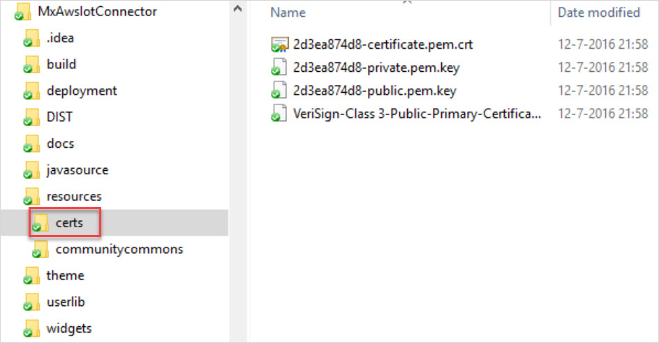
{}

### 2.1 Things

To get a list of all the things registered at AWS IoT, you can use **Things - get list** action:

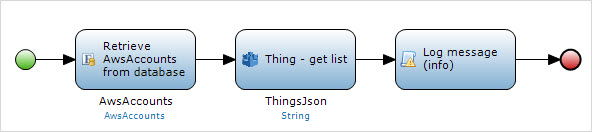

This will return a JSON document as provided by AWS IoT. Then you can use a JSON import mapping to create entities from the JSON that is returned.

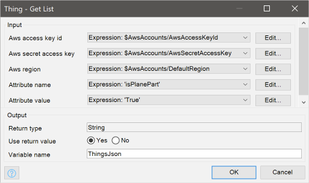

To get the details of a device, you can use the **Thing - describe** action:

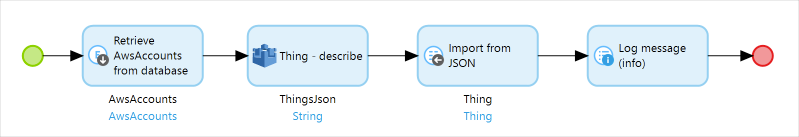

### 2.2 State

AWS IoT has a shadow of the device state, and it provides a REST API to this shadow. Through this API, you can determine the last known state of a device or request a state change of the device.

To read the last known status of a device, use the **Data - get shadow** action:

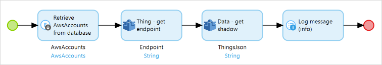

This action needs the endpoint of the REST API. You can copy-paste this from AWS IoT, or you can use the **Thing - get endpoint** action to determine the endpoint:

To change the status of a device, you can update the shadow using the **Data - change shadow** action:

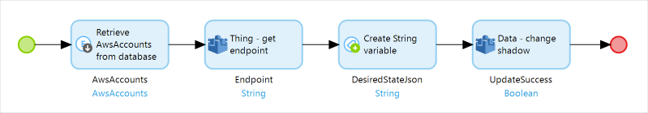

### 2.3 Messages

In addition to the REST API, you can work with the state of devices through MQTT messages.

To receive messages from devices, you need to subscribe to the required topic using the **Data - subscribe to MQTT topic** action:

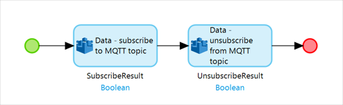

Typically, you should do this when your Mendix app is started.

To subscribe, you need to provide the certificate information as provided by AWS IoT:

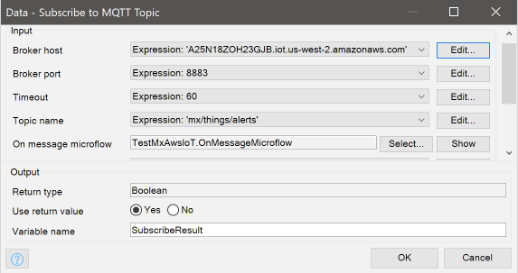

When a message is received, the microflow you specify is called using the `topic` and `payload` string parameters. The
`payload` contains a JSON document that you can import using JSON import mappings. The format of this message depends on the data sent by the device.

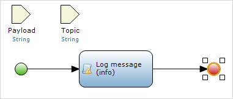

To publish a message on an MQTT topic, you can use the **Data - publish MQTT message** action:

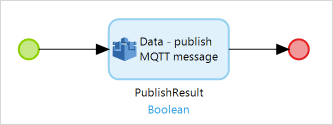

When configuring this action, you also need the certificates provided by AWS IoT:

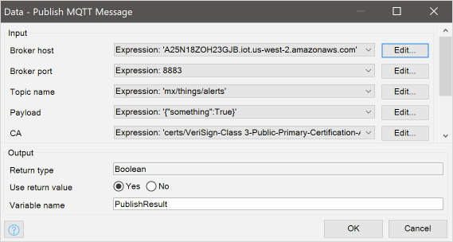
