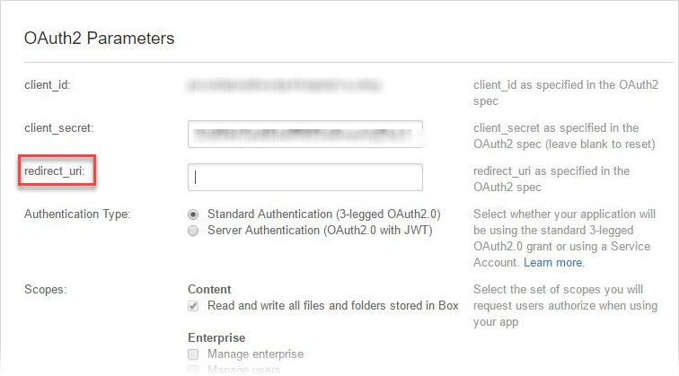
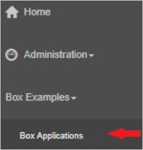
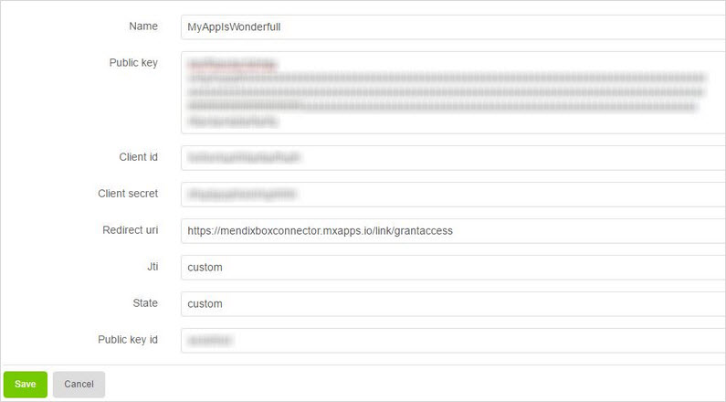
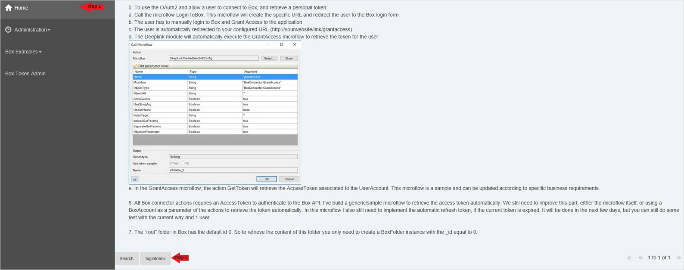
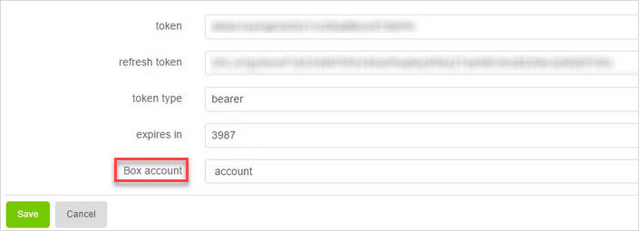
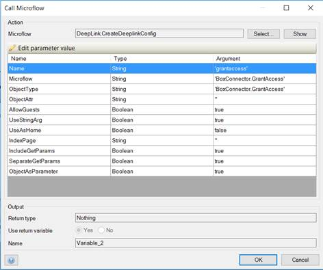

## 1 Introduction

The [Box](https://appstore.home.mendix.com/link/app/40977/) connector provides an easy to way to use [Box](https://www.box.com) inside your Mendix application.

## 2 Installation

1. Download this connector as well as the [Community Commons Function Library](../modules/community-commons-function-library) and [Deep Link](../modules/deep-link) modules into your app project.
2. In order to use this connector, you must have an account on the Box developer site of box, so go to [BoxDEV](https://developer.box.com/) and click **Log in** > **Sign up** in the upper-right corner of the page.
3. Fill in the form with your credentials and submit.
4. Validate your account via an email, which will then give you access to the dashboard of your Box account.
5. To allow the connector access to your account, you must enable the two-factor authentication via the **Security** tab.
6. Create a new Box application that  your Mendix application will interact with by clicking **Get Started**.
7. In the new Box app, you need to set the **redirect_URL** to the domain address of your Mendix application as `https://{mendix_application_address}/link/grantaccess`. This is so Box is able to return to your application once it is authenticated.

	

8.  Generate an RSA keypair. The following commands may change depending on your OS:

	```
	openssl genrsa -out boxmendixappdes.key 2048
	openssl rsa -in boxmendixappdes.key -pubout > boxmendixappdes.pub
	```

	For more information on generating an RSA keypair, see [JWT Auth](https://docs.box.com/docs/app-auth#section-1-generating-an-rsa-keypair).

9. Click **Add Public key** and then copy the contents of *boxmendixappdes.pub*.
10. Run your app project to access the Box connector.
11. To connect your Box app to the connector, click **Box Applications** in the navigation bar on the left side of the connector: 

	

12. Click **New** and fill out the information according to your newly built Box app:

	

13. You need to make an account to associate the final token to, so click **Box Accounts** on the navigation layout and click **New** to make a new account.
14. After configuring the connector, you need to receive an authentication token to be able to have access to your Box account. To do that, navigate to the home page of your Mendix connector, select your Box application on the bottom of the page, and click **Log in to Box**:

	

15. Accept the request from Box asking you to give permission to the connector to access all the files and folders of your account.
16. After access is given, you will be navigated back to the connector, where you will find information regarding your token. Add your account to the **Box account** field and click **Save**:

	

17. In the **BoxConnector** module in your app project, use the **BoxApplication_Overview** page as an admin user to configure the Box connector for your application.
18. Use the **BoxAccounts_Overview** page to associate Box accounts to Mendix accounts via the  token provided by the corresponding type of Box account (user or service).
19. Make sure the **BoxApplication** entity is set with the same **redirect_URL** as you set above for your Box app.
20. Configure the Deep Link module as follows:

	

Congrats! You are now able to use the different [features](#features) in the connector to make your own personal app and control your Box account.

## 3 Features {#features}

The connector has the available features described below.

### 3.1 Authentication Management

These actions are available in **Authentication**:

* **GetToken**
* **GetTokenServiceAccount**
* **RefreshToken**
* **RevokeToken**

### 3.2 Collaboration Management

These actions are available in **Collaboration**:

* **CreateCollaboration** – used to add a collaboration for a single user or a single group to a file or folder; either an email address, user ID, or group ID can be used to create the collaboration.
	* **BoxItem** (required) – the item to which the collaboration will be added; this can be a BoxFile or a BoxFolder; `_id` and `_type` attributes are required
	* **BoxUser** – the Box user added as a collaborator; can describe a group or a single user; the login (email address) is used only for single user
	* **CollaborationRole** – the role applied to the BoxUser collaborator
	* **Notify** (optional) – determines if the user (or all the users in the group) should receive email notification of the collaboration
	* **CanViewPath** – viewing the path collaborations allows the invitee to see the entire ancestral path to the associated folder
* **Delete collaboration** – used to delete a single collaboration
	* **BoxCollaboration** (required) – the `_id` attribute is required
* **GetCollaboration** – used to get information about a single collaboration
	* **BoxCollaboration** (required) – the `_id` attribute is required
	* **Fields** (optional) – attributes to include in the response
	* **PendingStatus** – set to true to retrieve only the pending collaborations, set to false to retrieve all collaborations
* **PendingCollaborations** – used to retrieve all the pending collaboration invites for a user
	* **Fields** (optional) – attribute(s) to include in the response
* **UpdateCollaboration** – used to edit an existing collaboration
	* **BoxCollaboration** (required) – the `_id` attribute is required
	* **UpdateRole** (optional) – the access level of this collaboration
	* **UpdateStatus** – whether this collaboration has been accepted; this can be set to accepted or rejected by the `accessible_by` user if the status is pending
	* **UpdateExpiresAt** – the time in the future when this collaboration will expire
	* **UpdateCanViewPath** – whether the **CanViewPath** collaboration feature is enabled

### 3.3 File Management

These actions are available in **File**:

* **CopyFile** – copies a file to another folder; the original version of the file will not be altered
	* **BoxFile** (required) – the source file to copy; the `_id` attribute is required
	* **DestBoxFolder** – the folder representing the new location of the file; the `_id` attribute is required
	* **Version** (optional) – an optional file version ID if you want to copy a specific file version
	* **Name** – an optional new name for the file
* **CreateFileSharedLink** – creates a shared link for this particular folder; in order to disable a shared link, set the **SharedLink** parameter to empty
	* **BoxFolder** (required) – the folder for which to create a SharedLink; the `_id` attribute is required
	* **SharedLink** – an object representing this item's shared link and associated permissions
	* **Access** – the level of access required for this shared link; can be `Open`, `Company`, `Collaborators`, or `Null` to get the default share level
	* **Unshared_at** – the day when this link should be disabled
	* **Password** – requires a password before viewing a shared link
	* **Permissions** – the set of permissions that apply to this link
	* **Effective_access** – the access level set by the enterprise administrator; this will override any previous access levels set for the shared link and prevent any less-restrictive access levels to be set
* **DeleteFile** – discards a file to the trash
	* **BoxFile** (required) – the file to delete; the `_id` attribute is required
	* **IfMatchEtag** (optional) – the e-tag of the file; if-match the header to prevent race conditions
* **DeleteOldVersion** – discards a specific file version to the trash
	* **BoxFile** (required) – the `_id` attribute is required
	* **Version** – the version ID to discard
	* **IfMatchEtag** (optional) – the e-tag field of the file object
* **DownloadFile** – retrieves the actual data of the file; an optional version parameter can be set to download a previous version of the file
	* **BoxFile** (required) – the file to delete; the `_id attribute` is required
	* **Version** (optional) – the version of the file
* **GetEmbedLink** – retrieves an expiring URL for creating an embedded preview session; the URL will expire after 60 seconds, and the preview session will expire after 60 minutes
* **GetFileCollaborations** – gets a list of all the collaborations on a file (meaning, all the users that have access to that folder)
	* **BoxFile** (required) – the file to request; the `_id` attribute is required
	* **Limit** (optional) – the maximum number of items to return in a page; the default is 100, and the max is 1000
	* **Offset** – the item at which to begin the response
	* **Fields** – the attribute(s) to include in the response
* **GetFileComments** – retrieves the comments on a particular file (if any exist)
	* **BoxFile** (required) – the `_id` attribute is required
	* **Fields** (optional) – attribute(s) to include in the response
* **GetFileInfo** – retrieves the metadata about a file
	* **BoxFile** (required) – the file to retrieve metadata about; the `_id` attribute is required
* **GetFileTasks** – retrieves all the tasks for the given file
	* **BoxFile** (required) – the `_id` attribute is required
* **GetThumbnail** – retrieves a thumbnail or smaller image representation of this file; the sizes of 32x32, 64x64, 128x128, and 256x256 can be returned in the *.png* format, and sizes of 32x32, 94x94, 160x160, and 320x320 can be returned in the *.jpg* format; thumbnails can be generated for image and video file formats
	* **BoxFile** (required) – the `_id` attribute is required
	* **Format** – the expected format for the thumbnail
	* **MinSize** (optional) – the minimum size of the thumbnail
	* **MaxSize** (optional) – the maximum size of the thumbnail
* **GetTrashedFile** – retrieves a file that has been moved to the trash; a 404 error will be returned if the file is not in the trash
	* **BoxFile** (required) – the file to retrieve; the `_id` attribute is required
* **LockAndUnlock** – locks and unlocks files
	* **BoxFile** (required) – the file to lock/unlock; the `_id` attribute is required
	* **Lock** – the lock properties; the `_type` attribute is required and cannot be empty; the others attributes are optional
* **PermanentlyDeleteFile** – permanently deletes a file that is in the trash so that the item will no longer exist in Box; this action cannot be undone
	* **BoxFile** (required) – the file to delete; the `_id` attribute is required
* **PreflightCheck** – verifies that a file will be accepted by Box before you send all the bytes over the wire; can be used for both first-time uploads and uploading new versions of an existing file (via */files/[id]/content*); preflight checks verify all permissions as if the file was actually uploaded, including folder upload permission, file name collisions, file size caps, folder and file name restrictions, and folder and account storage quota
	* **BoxFile** (required) – the `name` attribute is required
	* **BoxFolder** –  the `_id` attribute is required
* **PromoteVersion** – if there are previous versions of this file, this method can be used to promote one of the older versions to the top of the stack; this actually mints a copy of the old version and puts it on top of the version's stack; the file will have the exact same contents, the same SHA1/etag, and the same name as the original; other properties such as comments do not get updated to their former values
	* **BoxFile** (required) – the file to update; the `_id` attribute is required
	* **Version** – the ID of the `file_version` that you want to make current
* **RestoreFile** – restores an item that has been moved to the trash; the default behavior is to restore the item to the folder it was in before it was moved to the trash; if that parent folder no longer exists or if there is now an item with the same name in that parent folder, the new parent folder and/or new name will need to be included in the request
	* **BoxFile** (required) – the file to restore; the `_id` attribute is required
	* **Name** (optional) – the new name for this item
	* **DestBoxFolder** – the new parent folder for this item; the `_id` attribute is required
* **UpdateFileInfo** – updates individual or multiple fields in the file object, including renaming the file, changing its description, and creating a shared link for the file; to move a file, change the ID of its parent folder
	* **BoxFile** (required) – the file to update
	* **UpdateName** (optional, but at least one of them must be specified) – the new name
	* **UpdateDescription** – the new description 
	* **UpdateParentFolder** – the folder where you want to move the file
	* **UpdateSharedLink** – the shared link to update with its new attributes 
	* **UpdateTags** – all the tags attached to this file
* **UploadFile** – uses the uploads to allow users to add a new file
	* **FileToUpload** (required) – the file to upload to Box; the `name` attribute is required
	* **BoxFolder** – the destination Box folder; the `_id` attribute is required
* **UploadFileVersion** – uploads a new version of an existing file in a user's account; the file name on Box will remain the same as the previous version; to update the file's name, you can specify a new name for the file
	* **BoxFile** (required) – the `_id` attribute is required; optionally, the `name` attribute of the BoxFile has to be set if the name of the file must be updated
	* **FileToUpload** – the new version of the file to upload
* **ViewVersions** – if there are previous versions of this file, this method can be used to retrieve information about the older versions
	* **BoxFile** (required) – the `_id` attribute is required
	* **Fields** (optional) – the attribute(s) to include in the response

### 3.4 Folder Management

These actions are available in **Folder**:

* **CopyFolder** – creates a copy of a folder in another folder; the original version of the folder will not be altered
	* **SrcBoxFolder** (required) – the source folder to copy; the `_id` attribute is required
	* **DestBoxFolder** – the destination folder for the copy; the `_id` attribute is required
	* **NewName** (optional) – the new name of the folder to be copied
* **CreateFolder** – create a new empty folder inside the specified parent folder
	* **FolderName** (required) – the desired name for the folder
	* **BoxFolder** – the parent folder; the `_id` attribute is required
* **CreateFolderSharedLink** – creates a shared link for this particular folder; in order to disable a shared link, set the **SharedLink** parameter to empty
	* **BoxFolder** (required) – the folder for which to create a shared link; the `_id` attribute is required
	* **SharedLink** – an object representing this item's shared link and associated permissions
	* **Access** – the level of access required for this shared link; can be open, company, collaborators, or null to get the default share level
	* **Unshared_at** – the day on which the link should be disabled
	* **Password** – sets requiring a password before viewing a shared link
	* **Permissions** – sets the permissions that apply to this link
	* **Effective_access** – the access level set by the enterprise administrator; this will override any previous access levels set for the shared link and prevent any less-restrictive access levels from being set
* **DeleteFolder** – deletes a folder; a recursive parameter must be included in order to delete folders that have items inside of them
	* **BoxFolder** (required) – the folder to delete; the `_id` attribute is required
	* **Recursive** – sets Whether to delete this folder if it has items inside of it
* **GetFolderCollaborations** – gets a list of all the collaborations on a folder (meaning, all of the users that have access to that folder)
	* **BoxFolder** (required) – the folder to delete; the `_id` attribute is required
	* **Limit** (optional) – the maximum number of items to return in a page; the default is 100 and the max is 1000
	* **Offset** – the item at which to begin the response
	* **Fields** (optional) – the attribute(s) to include in the response
* **GetFolderInfo** – retrieves the full information about a folder, including when it was last updated and the files and folders contained in it; the root folder of a Box account is always represented by the ID `0`
	* **BoxFolder** (required) – the `_id` attribute is required
* **GetTrashedFolder** – retrieves a folder that has been moved to the trash; a 404 will be returned if the folder is not in the trash
	* **BoxFolder** (required) – the folder to retrieve; the `_id` attribute is required
	* **Fields** (optional) – the attribute(s) to include in the response
* **GetTrashedItems** – retrieves the files and/or folders that have been moved to the trash
	* **Limit** (optional) – the maximum number of items to return
	* **Offset** (optional) – the item at which to begin the response
	* **Fields** (optional) – the attribute(s) to include in the response
* **PermanentlyDeleteFolder** – permanently deletes a folder that is in the trash, which means the item will no longer exist in Box; this action cannot be undone.
	* **BoxFolder** (required) – the folder to delete; the `_id` attribute is required
* **RestoreFolder** – restores an item that has been moved to the trash; the default behavior is to restore the item to the folder it was in before it was moved to the trash; if that parent folder no longer exists or if there is now an item with the same name in that parent folder, the new parent folder and/or new name will need to be included in the request
	* **BoxFolder** (required) – the folder to restore; the `_id` attribute is required
	* **Name** (optional) – the new name for this item
	* **DestBoxFolder** – the new parent folder for this item; the `_id` attribute is required
* **UpdateFolder** – updates information about the folder; yo move a folder, update the ID of its parent; to enable an email address that can be used to upload files to this folder, update **FolderUploadEmail**
	* **BoxFolder** (required) – the folder to update; the `_id` attribute is required
	* The following attributes are optional, but at least one should be specified: 
		* **UpdateName** – the new name 
		* **UpdateDescription** – the new description 
		* **UpdateParentFolder** – the folder where to move the file 
		* **UpdateSharedLink** – the shared link to update with its new attributes 
		* **UpdateFolderUploadEmail** – the folder upload email to update with its new attributes 
		* **UpdateSyncState** – determines whether Box Sync clients will sync this folder; values of `synced` or `not_synced` can be sent, while `partially_synced` may also be returned
		* **UpdateTags** – all the tags attached to this folder

### 3.5 Metadata Management

These actions are available in **Metadata**:

* **CreateMetadataOnFile** – creates the metadata template instance for a corresponding Box file; when creating metadata, only values that adhere to the metadata template schema will be accepted
	* **BoxFolder** (required) – the `_id` attribute is required
	* **MetadataValues** – the custom value(s) defined by a user or application
	* **Scope** – the scope of the object
	* **BoxTemplate** – the template to use; the `templateKey` attribute is required; at least 1 `MetadataValue` must be provided with the type and corresponding value
* **DeleteMetadataOnFile** – deletes the template instance
	* **BoxFolder** (required) – the `_id` attribute is required
	* **Scope** – the scope of the template
	* **BoxTemplate** – the `templateKey` attribute is required
* **GetMetadataOnFile** – retrieves the metadata template instance for a corresponding Box file
	* **BoxFile** (required) – the `_id` attribute is required
	* **BoxTemplate** – the `templateKey` attribute is required
	* **Scope** – the scope
* **UpdateMetadataOnFile** – updates the template instance; updates can be either add, replace, remove , test, move, or copy; the template instance can only be updated if the template instance already exists; when editing metadata, only values that adhere to the metadata template schema will be accepted; the update is applied atomically; if any errors occur during the application of the update operations, the metadata instance remains unchanged
	* **BoxFile** (required) – the `_id` attribute is required
	* **Scope** – the scope of the object
	* **BoxTemplate** – the template to use; the `templateKey` attribute is required; at least 1 `MetadataValue` must be provided with the type and corresponding value
	* **UpdateMetadataList** – the list of changes to apply; the `UpdateMetadata` objects must be set as follows:
		* **Operation** – the operation to apply
		* TypeMetadata** – the type of the metadata 
		* Key** – the key name of the metadata 
		* StrValue/FloatValue/DateValue** – the corresponding value to be set or tested; required for `add`, `replace`, and `test` operations; for `add`, if the value already exists, then the previous value will be overwritten by the new value; for `replace`, the metadata value must exist before replacing; for `test`, the value of the existing metadata instance must match the specified value
	* **FromBoxMetadata** – the key to the `Metadata` source; this value is required only in case of `move` or `copy` operations

## 4 Developing This App Store Component

This connector was built with the Eclipse IDE Neon, and [SemVer](http://semver.org/) is used for versioning.

To contribute to the development of this connector, follow these steps:

1. Open an issue about your topic in [mendix / BoxConnector](https://github.com/mendix/BoxConnector).
2. Fork the repo, then make a branch that you name starting with the issue number you are resolving, then make a pull request to the master branch.
3. Add some tests for feature changes.
