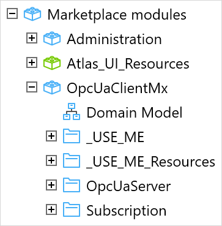
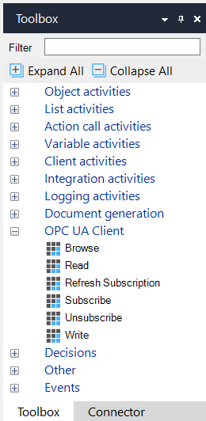
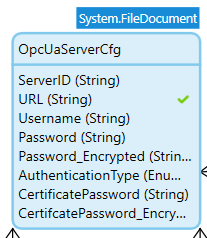
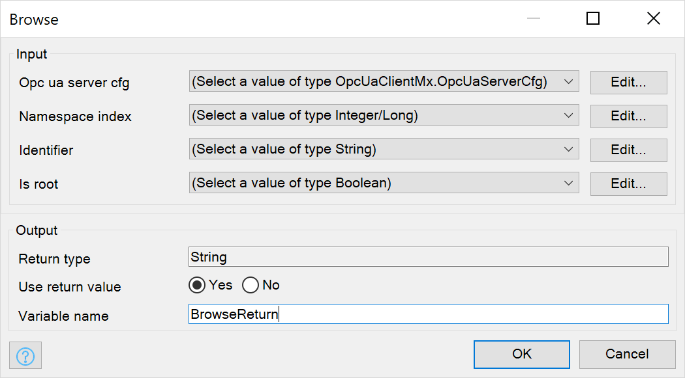
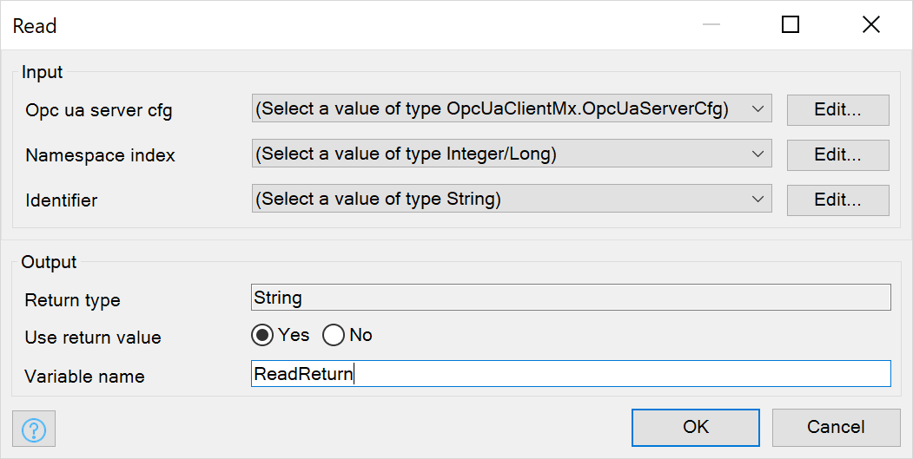
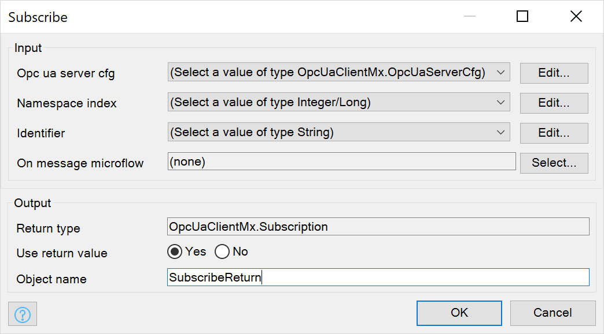
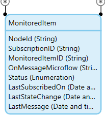
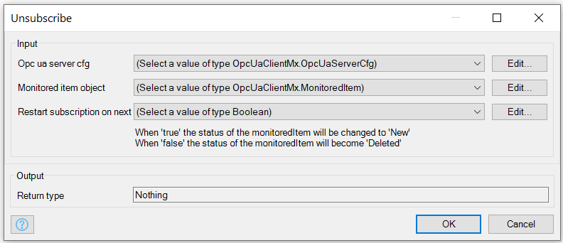
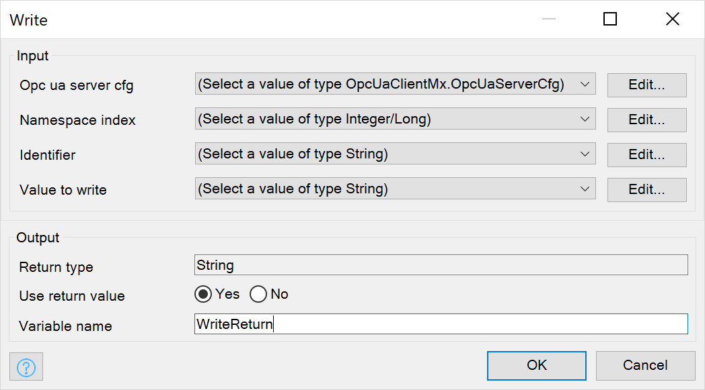

## 1 Introduction

The [OPC UA Client connector](https://marketplace.mendix.com/link/component/117391/) connector allows you to connect your Mendix application to [OPC](https://opcfoundation.org/) enabled servers using the functionality of [OPC UA](https://opcfoundation.org/about/opc-technologies/opc-ua/). The connector allows you to read from, write to, and subscribe to OPC UA servers.

OPC is the platform-independent, multi-vendor interoperability standard for the secure and reliable exchange of data in the industrial automation space and in other industries. The OPC Unified Architecture (OPC UA) is an architecture that integrates all the OPC specifications into one extensible framework.

This module uses the [Eclipse Milo library](https://github.com/eclipse/milo) an open-source implementation of OPC UA, and has been tested with the [Prosys OPC UA server](https://www.prosysopc.com/). All terminology in this module is per the OPC UA Documentation. 

There is a sample module, [OPC UA Client example implementation](https://marketplace.mendix.com/link/component/114876/), which gives an example of how the connector can be used.

### 1.1 Features

#### 1.1.1 Actions

The OPC UA Client connector supports the following actions

* Browse: – browse a list of nodes
* Read: – reads the value of a node
* Write: – write data to a node
* Subscribe: – to receive data (or events) from a node
* Unsubscribe: – stop receiving updates for a node

#### 1.1.2 Security 

The OPC UA Client connector supports all three security options offered by OPC UA:

* None
* Credentials
* Client certificates

Only one of the options can be in use any any time. Which one will be determined by the OPC UA server that you are connecting to. The password from both the user and certificate are automatically encrypted when saving the server configuration using the Encryption module.  

#### 1.1.3 Dependencies

The OPC UA Client connector has the following dependencies

* Mendix 8.17.0 or higher
* Encryption Module
* An OPC UA server – we assume that you are familiar with OPC UA and your OPC UA server(s), these instructions do not include information on how to set up your servers.

Recommended; Having an external OPC UA Client tool will make setup of the connection a lot easier. A commonly-used client is the one from [Unified Automation](https://www.unified-automation.com/downloads/opc-ua-clients.html). With this (non-Mendix) tool you will be able to browse through the server and find the parameters needed to configure your connection. 

## 2 Installation

Import the [OPC UA Client connector](https://marketplace.mendix.com/link/component/117391/) module into your app. Instructions for doing this are in [How to Use Marketplace Content in Studio Pro](/appstore/general/app-store-content).

You will see the new module in the **Marketplace modules** section of the **App Explorer**.

{}

{}

When you edit a microflow, you will also see five additional actions in the **Toolbox**.

{}

{}

### 2.1 Configuration

1. Add the **OpcUaServer_Overview** page to the navigation of the app, either through the **Navigation** settings, or by adding an **Open Page** button to a page which is already in the navigation (for example the home page). 

2. Find the constant: **UA_ApplicationName** in the `_USE_ME` folder and update this with the information specific to your Client. The application name must be unique to the OPC UA Server, the connector has no requirements to the contents of this constant. If you have a single Mendix application connecting to the server you could choose to leave the default value, if you have multiple Mendix applications connecting to the same server you **must** alter the name to be unique (as per the OPC UA spec).   
*See the OPC UA Specification for more details, this setting is only used by the OPC UA Server.*

3. Find the constant: **UA_ApplicationURI** in the `_USE_ME` folder and update this with the information specific to your Client. The application URI must be unique to the OPC UA Server, the connector has no requirements to the contents of this constant. If you have a single Mendix application connecting to the server you could choose to leave the default value, if you have multiple Mendix applications connecting to the same server you **must** alter the name to be unique (as per the OPC UA spec).  
*If you are using client certificates for authentication, the URI should match the certificate. See the OPC UA Specification for more details, this setting is only used by the OPC UA Server.*

4. If you use subscriptions you **must** setup the After Startup & Before Shutdown microflow. When subscribing these actions make sure that you re-subscribe when you start your app & that you disconnect when shutting down. If you don't use the after startup subscriptions won't reconnect after a reboot. If you don't use the before shutdown, the server will keep the old subscriptions (potentially up to a few hours) and send duplicate messages for this period of time (and can cause exceptions in the client). 

This is all you need to do to use the connector. However, there is also a sample module, [OPC UA Client example implementation](https://marketplace.mendix.com/link/component/114876/), which gives an example of how the connector can be used. If you want to look at the sample implementation described in [OPC UA Client example implementation](#example-implementation) you will need to import this into your app in addition to the OPC UA Client connector.

## 3 OPC UA Client connector

### 3.1 Client State

The module/app is designed for usage with multiple servers if necessary. The state for each OPC UA server is kept by the client in an object of entity type **OpcUaServerCfg**. This  needs to be populated before the actions of the OPC UA client connector can be used. 

{}

{}

For each OPC UA server, the following information will need to be stored in a OpcUaServerCfg object.

* ServerID (String) – a short nickname that you assign to the server so that you can identify it easily. Primarily used for error and log messages.
* URL (String) – the full URL of the OPC UA server (e.g.: opc.tcp://localhost:53530/OPCUA/SimulationServer)
* Username (String) – the username used if the authentication type is `CREDENTIALS`
* Password (String) – the password for the username used if the authentication type is `CREDENTIALS`, only used for data-entry. After saving this field is reset.
* Password_Encrypted (String) – the encrypted password for the username, automatically takes the 'Password' and encrypts the value
* AuthenticationType (Enumeration) – the type of authentication required for this server: `NONE`, `CREDENTIALS`, or `CERTIFICATE`
* CertificatePassword (String) – the certificate password required when using the `CERTIFICATE` type of authentication, only used for data-entry. After saving this field is reset.
* CertificatePassword (String) – the encrypted password for the certificate, automatically takes the CertificatePassword and encrypts the value

You can see an example of how this can be set up in the [OPC UA Client example implementation](#example-implementation) section.

### 3.2 Actions

Once you have set up the server configuration, you can perform the following actions in your microflows.

#### 3.2.1 **Browse** a List of Nodes{#browse}

The **Browse** action allows you to browse the nodes within the OPC UA server. The browse function starts at the specified node and browses 'down' and returns the children of the specified node. 

* Opc UA server cfg – an object of entity type OpcUaServerCfg containing the configuration of the server to which the request is made
* NodeId – The NodeId from where you want to browse to it's children. When requesting the 'Is Root'=true leave this value empty. Expects the full Node Id as referenced by the OPC UA server. This is generally a combination of the namespace URI and Identifier but can have different variations. You can find this in most OPC UA Clients (including the Unified Automation client) and the Browse function returns this same value for each node. Example: "ns=4;id=3"
* Is root – is used by the tree widget in the example implementation module — if you are not using the tree widget you, the value here is not important
* Return Variable – The output of this action is the JSON string with all information about the requested nodes. This string can be parsed with the Import Mapping activity.

#### 3.2.2 **Read** the Value of a Node{#read}

The **Read** action allows you to read the current value of a specific node within the OPC UA server. The output of the action is a string formatted value of the Node. While the module supports most OPC UA attribute types the action always returns the value as a string as it was showing in the original message received from the OPC UA Server. Example the decimal value 10.59 will be returned as '10.59'   

* Opc ua server cfg – an object of entity type OpcUaServerCfg containing the configuration of the server to which the request is made
* NodeId – The NodeId of the Node you want to read. Expects the full Node Id as referenced by the OPC UA server. This is generally a combination of the namespace URI and Identifier but can have different variations. You can find this in most OPC UA Clients (including the Unified Automation client) and the Browse function returns this same value for each node. Example: "ns=4;id=3"

{}
All values are read as strings, you will need to convert them if you need a numeric or date value.
{}

#### 3.2.3 **Subscribe** to Updates of Data from a Node{#subscribe}

The **Subscribe** action allows you to subscribe to receive a notification every time the value of a node changes. OPC UA allows many different ways to subscribe to different data changes, events, and many variations.  

**Attention:** At this point the module only allows subscriptions on value changes. Events, and aggregates are currently not supported. 

With the subscription function you can configure exactly how you receive the data. There are two parts that you need to configure

1. the frequency with which the OPC UA Server collects the data points
2. the frequency with which the OPC UA Server sends updates to your Mendix OPC UA Client — this is optional, if you don't specify this all values are requested every 2 seconds

##### 3.2.3.1 OPC UA Background

To understand the subscription action it's important to understand the distinction in OPC when monitoring a Node. 
As mentioned before there are two intervals that influence the behavior of the connection. The Sampling Interval & the Publishing Interval. The Sampling interval is part of the MonitoredItem and determines how frequently the OPC UA Serer records a Sample of the Node. When the OPC UA Server takes a sample, the value is placed in a Queue for transmission. The Publishing interval, which is part of the subscription, determines which Samples from which MonitoredItems get transmitted and how often this transmission occurs. 

The simplest scenario is 1 MonitoredItem with 1 Subscription, both with an Publishing and Sampling interval of 500ms. As a result the OPC UA Server will take a sample every 500ms, place that in a Queue and transmit that sample every 500ms. 

When the Monitored Item has a sample interval of 500ms, but the subscription has a publishing interval of 2seconds, the OPC UA Server will store all samples in a Queue. Every 2 seconds the OPC UA Server will connect with the Mendix client and will send all (4) samples in a single message. The client will process these 4 message individually, in the order that they were send.

OPC UA allows for bundling of MonitoredItems in a single subscription to reduce the amount of messages that are being exchanged. Example:  
Subscription 1233, is created with a Publishing Interval of 2 seconds  
Node ns=1;id=2; is Monitored with a Sampling Interval of 500ms. 
Node ns=1;id=3; is Monitored with a Sampling Interval of 500ms. 
Node ns=1;id=4; is Monitored with a Sampling Interval of 500ms. 

As a result the OPC UA server will connect with the mendix client every 2 seconds, it will make a single connection and share all the messages from all monitored items. In this example the subscription message will include: 4 samples from node ns=1;id=2 & 4 samples from node ns=1;id=3 & 4 samples from node ns=1;id=4. (12 samples in total).  
The Mendix client will evaluate each sample and process it according to it's configuration (see below for details).

##### 3.2.3.2 Subscription Action

The action creates an object of type **MonitoredItem** & **Subscription** which is associated with the OPC UA service and contains details of the subscription and the item which is being monitored. You monitor a **Node**, this creates what OPC UA calls a **MonitoredItem**, the monitored item is what determines the frequency and type of values that you are getting.  
**Limitation:** A Monitored Item uses the following default settings: samplingInterval = 500ms; queueSize = 10; discardOldest = true; (See OPC UA Documentation for more details on the impact of this)

The **Subscription** influences the connection that is established with the client. Every  *PublishingInterval*-milliseconds the Server will connect with the client to send any new values. 

Each subscription requires a microflow to process the data each time a notification is received. 

**The configuration:**

* Opc ua server cfg – an object of entity type OpcUaServerCfg containing the configuration of the server to which the request is made
* NodeId – The NodeId of the Node you want to subscribe to. Expects the full Node Id as referenced by the OPC UA server. This is generally a combination of the namespace URI and Identifier but can have different variations. You can find this in most OPC UA Clients (including the Unified Automation client) and the Browse function returns this same value for each node. Example: "ns=4;id=3"
* On message microflow – defines a microflow to be run every time a message is received from the subscribed service. This microflow must have 1 input parameter of type: OpcUaClientMx.Message and no output.
* Subscription (optional) – pass a **Subscription** entity to have more control over the frequency in which messages are send to the client. Leave this parameter blank to let the module setup the subscription.
* Use return value – `Yes` returns an object of type **MonitoredItem** which defines the new subscription and can be used in the microflow, `No` does not return an object. The returned object should not be changed or committed, but can be associated to for your administration/logic.
* Variable name – the name assigned to the variable containing the return value  

{}
Subscriptions and MonitoredItems are automatically kept alive by the app & OPC UA Server and will continue to be sent as long as both the client and server are running. The OPC UA Connector automatically provides values for `requestedMaxKeepAliveCount` and `requestedLifetimeCount`and will keep the subscription alive. If these values are exceeded, then the subscription will lapse. This can happen, for example, if the app is redeployed.
{}

##### 3.2.3.3 MonitoredItem

Information about nodes which are subscribed to is stored in the **MonitoredItem** entity associated with the **OpcUaServerCfg** server configuration & **Subscription** entity.  

{}

{}

An object is created for each Node you request to monitor and contains the following information:

* NodeId (String) – The full NodeId as referenced by the OPC UA Server.  
* SubscriptionID (String) – a unique identifier generated by the OPC UA server (will be identical to the associated Subscription entity)  
* MonitoredItemID (String) – a unique identifier generated by the OPC UA server — this can be used to identify the unique Monitored Item for cancellation of the subscription  
* Status (Enum) – identifies whether the subscription is active or not (New, Active, Failed, Deleted)  
* LastSubscribedOn (DateTime) - The last time the 'Subscribe' function was successfully executed.  
* LastStateChange (DateTime) - The last time the Status attribute changed, this is the moment the subscription got active, failed or was deleted.  
* LastMessage (DateTime) - The moment the last full message was received from the OPC UA server on this monitored Item.  

##### 3.2.3.4 Subscription

Information about unique **Subscription**s that are active with the OPC UA Server. The subscription is associated to a **OpcUaServerCfg** server configuration & at least one **Monitored Item**.  
The subscription reflects the connection configuration with the OPC UA Server. 

{}

{}

This is the only object from the OpcUaClientMx domain that you should create from a microflow, you can create, change and commit this before passing it into the Subscribe action. If you choose to leave the parameter empty then an object is created automatically for each Node you request to monitor. The entity contains the following information:

* RequestedPublishingInterval_ms (Decimal) – The Publishing interval that is requested from the OPC UA Server in milliseconds. *(Using decimal here to honor the Eclipse Milo implementation)*  
* SubscriptionID (String) – a unique identifier generated by the OPC UA server  
* Status (Enum) – identifies whether the subscription is active or not (New, Active, Failed, Deleted)  

#### 3.2.4 **Unsubscribe** from Updates of Data from a Node

The **Unsubscribe** action allows you to end a subscription to item change notifications when you no longer want to receive the notifications. 

**Attention:** Never manually or programmatically delete the **Subscription** or **MonitoredItem**, unless the Status is 'Deleted'. Removing the objects prematurely can result in duplicate data or exceptions when the OPC UA Server sends messages for these now removed configurations.  

You can configure if the unsubscribe is permanent (and records are removed) or if the subscription info is kept for restart through the parameters.

* Opc ua server cfg – an object of entity type OpcUaServerCfg containing the configuration of the server to which the request is made
* Monitored item ID – the ID of the item which is being monitored by the subscription — this is held as the **MonitoredItemID** in the **Subscription** entity
* RestartSubscriptionOnNextReboot – Indicate if the registration entities should be kept by this action. When 'true' the **MonitoredItem** & **Subscription** will be kept in the database and their Status will be changed to 'New'. When 'false' the status of the monitoredItem will become 'Deleted' and the module will automatically remove the entities from the database. 

#### 3.2.5 **Write** Data to a Node{#write}

The **Write** action allows you to write a new value to a node to which you have write permissions.
If nothing is returned the action was successful, if the OPC UA Server refuses the value an exception will be thrown with the full JSON response included in the exception message. 

* Opc ua server cfg – an object of entity type OpcUaServerCfg containing the configuration of the server to which the request is made
* NodeId – The NodeId of the Node you want to write to. Expects the full Node Id as referenced by the OPC UA server. This is generally a combination of the namespace URI and Identifier but can have different variations. You can find this in most OPC UA Clients (including the Unified Automation client) and the Browse function returns this same value for each node. Example: "ns=4;id=3"
* Value to write – the new value which you want to set for this node, this can be any supported type (see the limitations for all types that are currently supported). Make sure the value can easily be parsed as the type, i.e. Doubles must be formatted as 0.0, Integers may not have a decimal point, etc. 

### 3.3 Pages

The OPC UA Client connector comes with a number of pages which you can use to manage and test the connection to your server(s).

#### 3.3.1 OpcUaServer_Overview

This page shows a summary of all the servers you have set up in your app and allows you to edit existing servers and set up a new one. For each server you will see the name you have given it, the URL where the server can be reached, and the authentication type.

To use this page, just include it in the navigation for your app, or add an **Open Page** button to an existing page of your app.

From this page, you can perform the following actions:

* Search – search for a particular server in the list of servers
* New server – add a new OPC UA server using the **OpcUaServer_NewEdit** page
* Edit server - change the details of the selected server using the **OpcUaServer_NewEdit** page
* View Subscription Details – Opens a detail page for your server with all the active subscriptions with their status. This following page allows you to re-connect or disconnect subscriptions. 
* Delete – delete all the information about the selected server — you will be asked for confirmation. Only delete a server if there are no active subscriptions, the module doesn't validate this. 

#### 3.3.2 OpcUaServer_NewEdit

This page allows you to create or change the details of an OPC UA server you want to use within your app. Your app administrator can use this page as is, or you can customize it for your own use. If you customize it, we recommend that you use a copy of it in one of your own modules so that it is not accidentally overwritten if you update the OPC UA Client connector Marketplace module.

##### 3.3.2.1 Data on OpcUaServer_NewEdit Page

* **Name** – The name to give to this server within the app
* **URL** – The URL used for connection to the server — this should be a TCP connection in the form `opc.tcp://…`
* **Authentication type** – the type of authentication to be used with this server — this is one of **NONE**, **CREDENTIALS**, or **CERTIFICATE**
    * **username** (if **Authentication Type** is **CREDENTIALS**) – the username required to authenticate to the OPC UA server if credentials are being used for authentication
    * **Password** (if **Authentication Type** is **CREDENTIALS**) – the password required to authenticate to the OPC UA server if credentials are being used for authentication
    * **Certificate file (PFX)** (if **Authentication Type** is **CERTIFICATE**) – the file containing the certificate required to authenticate to the OPC UA server if a certificate is being used for authentication — you will be able to upload a file held locally, and also download an existing file
    * **Certificate password** (if **Authentication Type** is **CERTIFICATE**) – the password required to authenticate to the OPC UA server if a certificate is being used for authentication

The password for the credentials & certificate are automatically encrypted/decrypted by the module. After saving the configuration the UI doesn't allow you to read the existing password, the decryption is only programmed in the connector. 

{}
The OPC UA server should have only one type of authentication enabled, and the authentication type chosen here must match that type to ensure that the endpoint can be reached.
{}

##### 3.3.2.2 Troubleshoot (test actions) on OpcUaServer_NewEdit Page

In addition to the usual **Save** and **Cancel** buttons which allow you to save the server settings or cancel the create or edit operation, there are additional options to validate your configuration. If you click the 'Advanced Troubleshooting' button a new page is opened where you can still edit your configuration, but also test by reading/writing/browsing the OPC UA Server. This allows you to test your configuration and run actions directly on the OPC UA Server.

**Test Messaging:**

* **NodeId** – The NodeId of the Node you want to use. Expects the full Node Id as referenced by the OPC UA server. This is generally a combination of the namespace URI and Identifier but can have different variations. You can find this in most OPC UA Clients (including the Unified Automation client) and the Browse function returns this same value for each node. Example: "ns=4;id=3"
* **Value to write** – the value to write to a node when the **Write** button is clicked. Leave blank if you want to execute any of the other actions.
* **Result** – the resulting JSON string from performing any of the four test actions. This shows the full response from the OPC UA Server, the connector might at relevant details in case of an error. 
* **Read** executes the [Read action](#read)
* **Write** executes the [Write action](#write)
* **Browse** executes the [Browse action](#browse)
* **Subscribe Simple** executes the [Subscribe action](#subscribe). Process response with microflow: `SubscriptionIncomingData_Process_TEST`. Check the log or put a breakpoint on this microflow to checkout the response messages.
* **Subscribe w/ Msg** executes the [Subscribe action](#subscribe). Process response with microflow: SubscriptionIncomingData_Process_wMessage_TEST. Check the log or put a breakpoint on this microflow to checkout the response messages.

The result of the tests is displayed in the **Result** field. It shows the raw JSON response which the OPC UA server provides.

##### 3.3.2.3 Server Subscriptions overview 

The Subscription Detail page provides insight in the MonitoredItems and Subscriptions that are currently active (or have been recently active). You cannot create new subscriptions from here, but you can interact with existing ones.

The **Monitored Item** Tab:  
Shows a view of all the **MonitoredItem**s that are known to the application. Any object of any status is showing in this view, that is New, Active, Failed, Deleted instances. 

For each MonitoredItem you are able to perform one of the following actions:   
*If your server is correctly configured there is no need to ever execute these actions, but this can be useful to resolve connectivity problems or recover after a previous failure*

* **Refresh Subscription** Select a MonitoredItem from the list, to re-establishes the connect with the Server. If a previous connection exists it will simply re-negotiate the settings with the server, if the connection was lost it will be re-established. This action can also be executed on 'Deleted' or 'Failed' objects. A successful refresh will update these objects to the 'Active' status. 
* **Unsubscribe** Unsubscribe the MonitoredItem from the OPC UA server updates. If the action was successful the object will receive the status 'Deleted' and will be removed from the database eventually.   
* **Delete** Remove the selected MonitoredItem from the database. There are no validations on this action, make sure you know that you can delete the record from the database before executing this action. If you remove a MonitoredItem that still has an active subscription at the OPC UA Server the connector could generate duplicate or untraceable messages, or throw exceptions (until the connection expires at the server).     
* **Re-connect All New/Active Subscriptions** Refresh all the MonitoredItems that have the status New or Active. Re-establishes the connect with the Server. If a previous connection exists it will simply re-negotiate the settings with the server, if the connection was lost it will be re-established.  

The **Subscription (connection)** Tab:  
Shows a list of all the active Subscriptions with the server, and all MonitoredItems that are grouped in that same connection. 
The Subscription objects are managed by the connector, you cannot directly interact with this data. All Subscriptions are automatically created or removed along with MonitoredItems.

The purpose of this tab is to show the Subscriptions with their current Publishing Interval to gain insight in the frequency messages being send by the server.  

## 4 OPC UA Client Example Implementation{#example-implementation}

The OPC UA Client example implementation is a sample app based on the [Prosys OPC UA server](https://www.prosysopc.com/) and provides basic browsing functionality, this is not intended to replace a UA Client. It implements the following functionality:

* Configure one or more OPC UA server connections (using the client)
* View & browse nodes on the server
* Example Consumer implementation

You can use the OpcUaClient_ExampleImplementation module (link) as template to start the consumption of your OPC UA Server information. Bear in mind that the node data structure from all servers will be different and it could be that the JSON to browse the Nodes is different in your server, so adjust your imports accordingly if needed.

### 4.1 Dependencies

* Mendix 8.17.0 or higher
* Atlas UI (use, for example, the blank starter app as a basis)
* The OpcUaClientMx module
* Any OPC UA server

### 4.2 Initial Configuration

1. Install the **OpcUaClientMx** module according to the instructions
1. Add the **OpcUaServer_Overview** page to the navigation of the app, either through the **Navigation** settings, or by adding an **Open Page** button to a page which is already in the navigation (for example the home page). The page in this module contains the same functionality as the **OpcUaClientMx** module and can be used as a replacement. 

### 4.3 Pages

The **OpcUaServer_View** page adds functionality through the **View server** button on the server overview page. By opening this page you are able to browse and search through the OPC UA nodes. The Tree view and Node View are different ways to interact with the nodes and open the node structure. For a full detailed view of all node properties either use an actual OPC UA browser or extend the module to parse the additional properties.

### 4.4 Example Consumption

The module contains a folder '_Example Consumer' which shows the best way to structure the integration with an OPC UA Server.

In this example you can see how to interact with a physical gate through a PLC. The dashboard shows an example of the runtime configuration of the Subscriptions, for an actual implementation you'd move this to an admin management page. The left side of the page shows the interaction with the OPC UA Server.  
As you can see it shows the current status of the PLC, when clicking on the 'Open' or 'Close' button the microflow will perform the required validations before writing an instruction to the OPC UA Server.  

In this use-case the OPC UA Server will receive the instruction through the write action, this will trigger the physical gate to move. When the gate state changes, the OPC UA Server will update the 'State'-node accordingly.  

The application is subscribing on the 3 different nodes, IsUp, IsDown, IsMoving. When either of these nodes changes values, a message is send to the Mendix client and the values are parse by the respective microflows: UA_ProcessEvent_GateUp, UA_ProcessEvent_GateDown, UA_ProcessEvent_GateMoving.    
All three subscription microflows lookup the MonitoredItem record, and through the MonitoredItem find the actual PLC that's changing (you need to follow this pattern when interacting with multiple devices through OPC UA). After retrieving the PLC it will update the state according to the Message. You can extend this microflow with as many complex evaluation and validations as you want. 

Alternatives: It is possible for the OPC UA Node to hold a complex JSON structure as value instead of a simple integer in this example. If that is the case you'd implement the same microflow logic, but in addition you'd call an Import Mapping activity before processing the results. 

## 5 Limitations

1. Limited Value types.

    Currently only Boolean, Int16, UInt16, Int32, Int64, Float, Double, and String are implemented to be written to the Node in the OPC UA Server. Reading has been tested for limited data types, when reading and subscribing all return values are casted to String through a simple toString() method. This implementation works well for Boolean and the Int values but hasn't been tested for all data types. 

1. High-Availability Architecture *(no horizontal scaling support)*.   

    At this point the module is relying completely on storing configuration in the server memory and only supports running on a single Container instance. If you use scaling and run multiple parallel instances of the application the module will likely generate exceptions and loose messages. 

1. Complex Events on Nodes.  

    Subscriptions are only possible on value changes of Nodes. At this time Events or aggregates are not implemented yet. The module does support all DataTypes, any OPC UA type is received and passed as a String to the evaluating microflow.

1. Advanced settings on MonitoredItem.  

    OPC UA offers fine-grained control over how values are shared with [this] client. At this time all MonitoredItems are setup with identical default parameters, and these can not yet be influenced. The default parameters are coming from the Apache Milo library. 
   
    Some examples of the default values are: SamplingInterval: 500ms; RequestedPublishingInterval: 500ms; QueueSize: 10; DiscardOldest: true;    (This will get a guaranteed value every 500ms, and stores a maximum of 10 values in the queue, if the queue fills up it will discard the oldest and keep the latest 10 values only).
