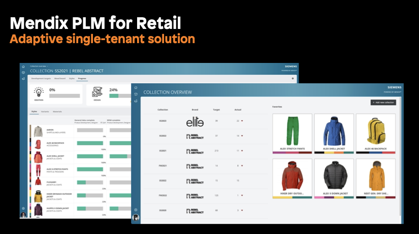

## 1 Introduction

The Mendix Platform is well-suited to supporting the development of solutions. Rapid development with Mendix allows for the adaptation of solutions to fit a customer's needs and context, and to integrate with the customer's existing IT landscape.

## 2 What Is an Adaptive Solution?

### 2.1 Adaptive Solution Structure

In an adaptive solution, up to 20% of the end solution can be adapted through customizations, extensions, integrations, or new customer-specific modules. Instead of being tied to a prescriptive software-as-a-service (SaaS) solution that only allows for configuration at runtime, adaptive solutions allow for design-time adaptation through model-level changes to cater to the needs of your customers.

### 2.2 Adaptive Solution Examples

An adaptive solution is a solution where each customer gets an instance of the solution based on a common core. This instance is adapted to the customer’s specific needs and context, and integrated with the customer’s existing IT landscape. 

The Mendix Marketplace contains numerous adaptive solutions, for example:

* [Mendix PLM for Fashion and Retail](https://marketplace.mendix.com/link/component/118343)
* [Siemens FSM](https://marketplace.mendix.com/link/component/117710)
* [Omnichannel Integration Layer](https://marketplace.mendix.com/link/component/118344)

Each solution is useable as is, but it can also be adapted to become even more suitable for the customer.

## 3 Architecting a Solution for Adaptation

### 3.1 Three Main Functional parts {#three-parts}

Architecting a solution for adaptation requires an understanding of your customers' needs: You need to know which functional requirements are common across your customers and which are specific to individual customers. This enables splitting the application model into the following parts:

* A shared and immutable common core
* Common extension modules that can be adapted to a customer's needs
* Customer-specific modules

Identifying these functional parts enables you to define API boundaries between them.

### 3.1 Progressive & Emergent Architecture

The goal for architecting a solution for adaptation is a deep understanding and full specification of the correct scoping of the different parts described above (meaning, the immutable core compared with customizable modules or something which needs to be customer-specific). This is a level of knowledge that you will only reach once you are serving a large number of customers.

When you start work on a solution for an initial customer or handful of customers, you might not have this thorough understanding yet. Instead, as you deliver the solution to additional customers, you will learn about their needs and will better understand which functionalities will be common and which will be specific.

This requires an iterative approach, where your understanding of the architectural requirements becomes clearer over time. It also requires a certain level of pragmatism in technical design choices, because you have to accept that you do not know everything up-front and you will have to redo certain design choices as your understanding increases.

<!-- TODO: add graphic of progressive emergent architecture -->

### 3.2 Designing the Interfaces

When designing the interfaces of your solutions, you should do the following:

* Split your adaptive solution architecture into the [three main functional parts](#three-parts) described above
* Think about which parts of the shared core are reusable in other parts:
	* Define which shared logic should be reusable and define entry points to the shared logic as APIs
	* Define which entities (data/state) are required in which parts of the functionality
* Design APIs between common core and extension modules and consider making public only the parts that are explicitly required in other parts of your current architecture — design for today
* Design APIs for custom-specific modules, focus on current customer requests and their value, and focus on a minimum viable product (MVP) by keeping it small and simple
* Iterate with customers to evolve the adaptability of the solution by evolving the architecture
	* Progressively, the architecture will emerge and become more complex as your solution becomes more successful, so re-architect when necessary

### 3.3 Applying IP Protection to Make the Common Core Immutable

IP protection can be used to make parts of the application model immutable by customers. For practical guidance, see [IP Protection](ip-protection).
