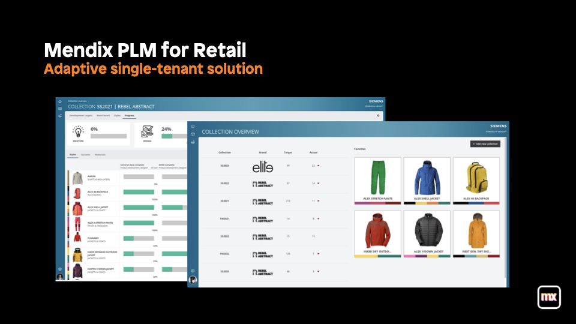
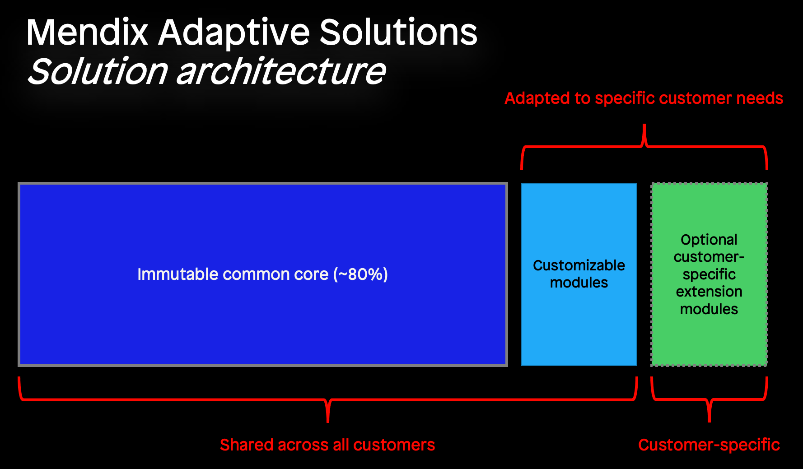

{}
The Mendix Solutions Guide is under active development and will be regularly extended with new sections. Make sure to check in regularly to stay up to date with the latest content!
{}

## 1 Introduction

The Mendix Solutions Platform brings the benefits of low code with Mendix to the world of solutions development. With the rapid development capability of the Mendix platform, adaptive solutions can be made to fit the customer's needs and context and integrated with the customer's existing IT landscape.

### 1.1 Structure of an Adaptive Solution

Up to 20% of the end solution can be adapted - through customizations, extensions, integrations or completely new & customer-specific modules. Instead of being tied to a prescriptive SaaS solution that only allows for configuration at run-time, Adaptive Solutions allow for design-time adaptation through model-level changes to cater to the needs of your customers.

### 1.2 Examples of Adaptive Solutions

An Adaptive Solution is a solution where each customer gets an instance of the solution based on a common core, adapted to the customer’s specific needs & context and integrated with the customer’s existing IT landscape. 

The Mendix Marketplace contains numerous adaptive solutions. Some examples:

* [Mendix PLM for Fashion and Retail](https://marketplace.mendix.com/link/component/118343)
* [Siemens FSM](https://marketplace.mendix.com/link/component/117710)
* [Omnichannel Integration Layer](https://marketplace.mendix.com/link/component/118344)

These solutions are useable as-is, but can be adapted to become even more suitable for the customer.

## 2 Architecting a Solution for adaptation

Architecting a solution for adaptation requires an understanding of your customer’s needs: you need to know which functional requirements are common across your customers and which are specific. This enables you to split the application model into a shared & immutable core, common extension modules which can be adapted to customer’s needs, and customer-specific modules. Identifying these functional areas enables you to define API boundaries between the shared, immutable core, the common extension modules and the customer-specific modules.

### 2.1 Progressive, emergent architecture

The end-goal is a deep understanding and a full specification of the correct scoping o fthe different parts: the immutable core vs the scope of customizable modules vs what needs to be customer-specific. This is a level of knowledge that you will only reach once you are serving a large enough amount of customers.

So when starting work on a solution for a launching customer or a handful of customers, you might not have this thorough understanding yet. Instead, as you deliver the solution to additional customers, you will learn about their needs and will better understand which functionalities will be common vs specific.

This requires an iterative approach, where your understanding of the requirements on architecture becomes clearer and clearer over time. It also requires a certain level of pragmatism in technical design choices, because it requires you to accept that you do not know everything up front and you will have to redo certain design choices as your understanding increases.

<!-- TODO: Graphic of progressive, emergent architecture -->

### 2.2 Designing the interfaces

* Split your adaptive solution architecture in three parts:
  * Shared, immutable core
  * Shared customizable modules
  * Customer-specific modules
* Think about which parts of the shared core are reusable in other parts.
  * Define which shared logic should be reusable. Define entry points to the shared logic as APIs.
  * Define which entities (data/state) are required in which parts of the functionality.
* Design APIs between common core & extension module. Consider making only the parts public that are explicitly required in other parts of your current architecture. Design for today.
* Design APIs for custom-specific modules. Focus on current customer requests and their value, and focus on an MVP. Keep it small & simple.
* Iterate with customers to evolve the adaptability of the solution by evolving the architecture. Progressively, the architecture will emerge and become more complex as your solution becomes more succesful. Re-architect when necessary.

### 2.3 Applying IP Protection to make the common core immutable

IP Protection can be used to make parts of the application model immutable by consumers. Review the [IP Protection](ip-protection) section of the Solutions Guide for practical guidance on how to apply IP Protection.
