## 1 Introduction

This how-to covers the basics of accessing the Marketplace from Studio Pro and provides examples of how to add a widget and a module to your application.

**This how-to will teach you how to do the following:**

* Download content from the Marketplace via Studio Pro
* Use content (for example, widgets, modules, and others) downloaded from the Marketplace in Studio Pro

## 2 Prerequisites

Before starting this how-to, make sure you have completed the following prerequisites:

* Familiarize yourself with the [Marketplace Overview](app-store-overview)

## 3 Downloading Content from the Marketplace {#downloading}

To download a component from the Marketplace via Studio Pro, follow these steps:

1. Open Studio Pro and sign in with your Mendix credentials.

2. Open the app in which you want to install the component from the Marketplace.

3.  Click the Marketplace icon in the top menu bar to open it in Studio Pro:

    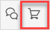

4.  On the Marketplace overview page, find the component to use in your app. The **Categories** menu item gives you an overview of which types of content you can download. You can use the **Search** bar to find the component.

    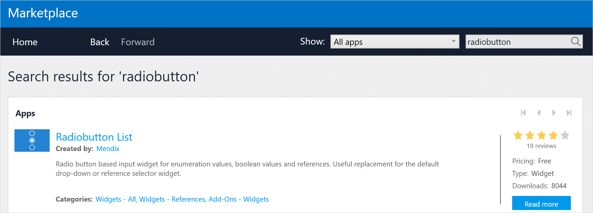
    
    {}Results for Marketplace content searches done in Studio Pro may differ from those done in the [online Marketplace](app-store-overview) due to sync issues.{}

5.  Click the component or **Read more** to view the details of the component.

    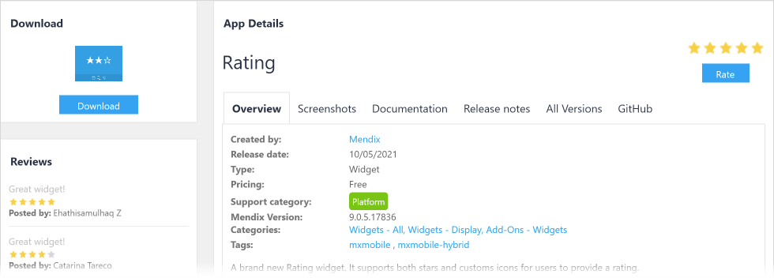

6. Click **Download** to download the component to your app. 

    Make sure that you download the correct version. The version must be compatible with the Studio Pro version that you use. Do check the **Mendix Version** on the **Overview** tab. Do not download a compontent that requires a higher **Mendix version** than the Studio Pro that you use. You can download older versions of the component on the **All Versions** tab.

    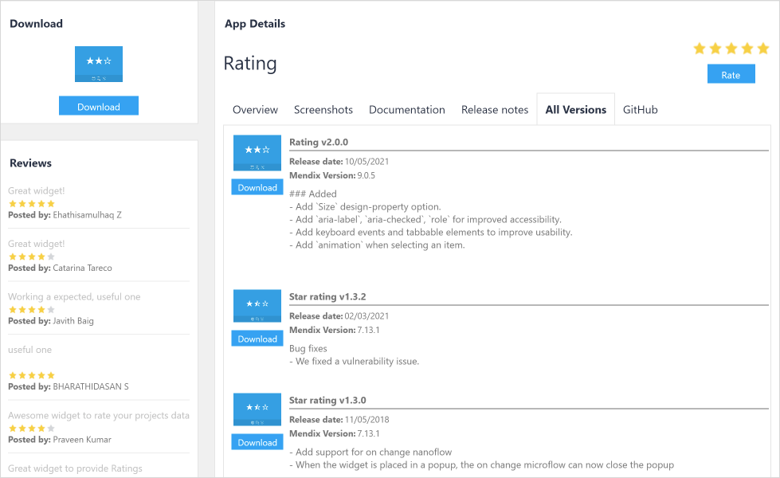

After you download a component:

* If the component is an app, it is created on your hard drive and is opened in Studio Pro
* If the component is not an app, it is downloaded directly into your app

## 4 Using Content in Studio Pro

After you download a component, you can use the component in your app. 

{}
For more information on how a component works, check the **Documentation** tab on the page of the component in the Marketplace.
{}

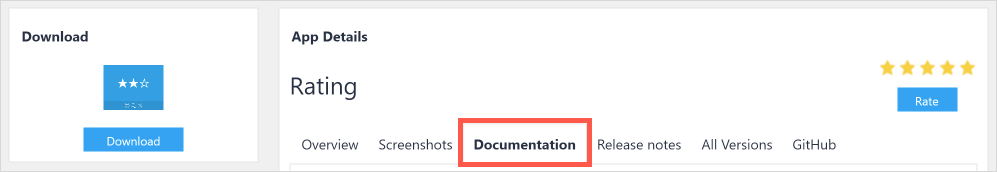

### 4.1 Using a Widget  {#widget}

You can download a widget from the Marketplace and use it in your app. We will use the [Rating](/appstore/widgets/rating) widget as an example. You can follow the steps to use any widget from the Marketplace.

#### 4.1.1 Adding a Widget

To add the Rating widget from the Marketplace via Studio Pro, follow these steps:

1. [Download](#downloading) the Rating widget from the marketplace to your app.

2. Click **Add widget**. The **Select Widget** dialog box opens.

    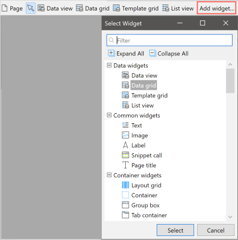

3. In the **Filter** bar, enter *Rating*. The downloaded widget is found in the **Display** widgets category. 

    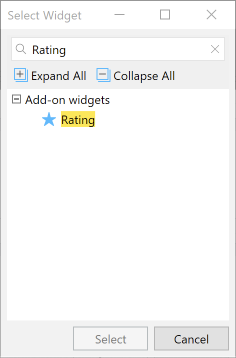

4. Click the **Rating** widget and then click **Select**. 

5. In the page of your app, click where you want to drop the widget. After you release the mouse button, the widget is placed in the page.

    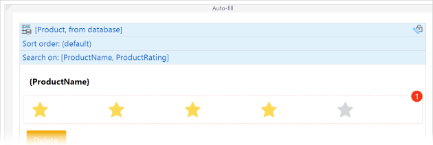

{}
If you want to delete a widget from the app, go to **App** > **Show App Directory in Explorer** to open the app folder, and then remove the *.mpk* file from the **widgets** folder.
{}

#### 4.1.2 Updating a Widget

To update a widget in your app to a newer version, follow these steps:

1. Open the app in which you want to update the widget.

2. Click the Marketplace icon in the top menu bar to open the Marketplace in Studio Pro:

   

3. Find the widget in the Marketplace.

4. Click the component or **Read more** to view the details of the component.

5. Go to the **All Versions** tab.

   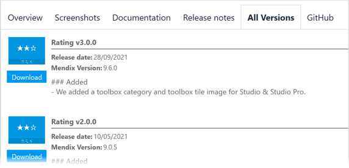

6. Click **Download** to download the latest version. Then the **Question** dialog box opens and asks if you want to overwrite the existing package.

7. Click **Yes** to proceed. The widget is updated to the downloaded version.

#### 4.1.3 Configuring a Widget

After you place a widget in your page, some new errors can appear in the [Errors](/refguide/errors-pane) pane. That is because you still need to configure the widget.

To configure the widget, follow these steps:

1. Go to the **Errors** pane and check the error message. This error shows after you drop the **Rating** widget into the page:

    

2. In the page, double-click the Rating widget. The **Edit Rating** dialog box opens and the **Attribute** field shows **(none)** – this means that no attribute is assigned, which causes the error.

    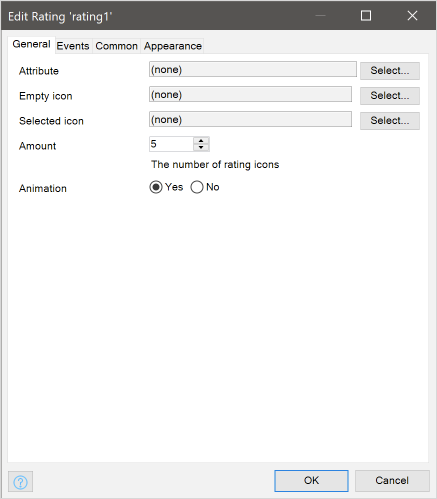

3. Click **Select** to select an attribute. In this example, we select the attribute **ProductRating**. This is the attribute of an entity that we already created.

    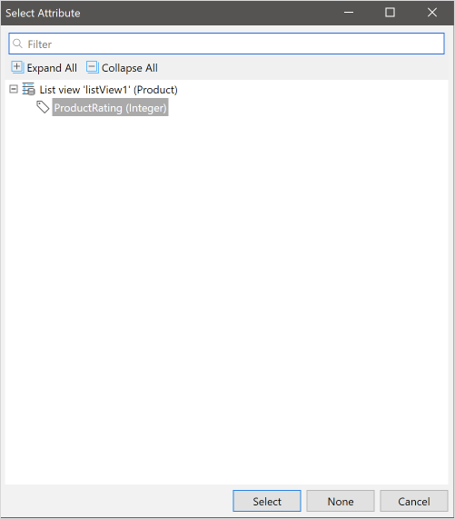

4. In the **Edit Rating** dialog box, click **OK**. The error in the **Errors** pane should disappear.

### 4.2 Using a Module {#module}

You can also download an entire module from the Marketplace. A module includes the whole functionality and instegration that can be very helpful when you are building your application.

In this section, we will use the [Email with Templates](/appstore/modules/email-with-templates) module as an example. You can follow the steps to use any module from the Marketplace.

#### 4.2.1 Adding a Module

To add the Email with Template module from the Marketplace via Studio Pro, follow these steps:

1. [Download](#downloading) the Email with Templates module from the marketplace to your app. The **Import Module** dialog box opens.

2. Select one of these options:

    * **Add as a new module** – if you select this option, new entities are created in your app
    * **Replace existing module** – if you select this option, you need to specify which **Module to replace**
      

    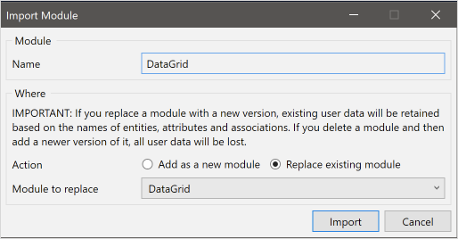

    {}When you select **Replace existing module**, a warning will show you which files in the app directory will be overwritten. If you click **OK**, these files will be replaced by the standard files. Be careful with this option when you have made changes to a module that you downloaded – once the files are replaced, you will have the standard Marketplace module again, with new entities and attributes. The entities and attributes that you renamed and their respective tables and columns represented in the database are all deleted. We recommend that you do not make changes to the downloaded modules, unless you will not update your component in the future and understand the implications of your changes.{}

3. In the **Import Module** dialog box, click **Import**.

4. Wait until a pop-up window states that the module was successfully imported. Click **OK**.

5. Open the **App Explorer** and find the **EmailTemplate** module.

    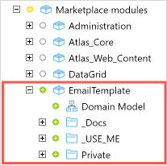

Unlike a widget, you can see a module in your App Explorer. A module contains a domain model, pages, and microflow logic. A module downloaded from the Marketplace stores files if the module contains files (for example, files that are contained in the **userlib** or **resource** folders). In addition, a module downloaded from the Marketplace has a light blue icon to differentiate it from the development modules.

{}
Sometimes additional widgets are added when you download a module. For example, **Image Crop** module contains the **Image Cropper** widget.
{}

#### 4.2.1 Updating a Module

1. Open the app in which you want to update the module.

2. Click the Marketplace icon in the top menu bar to open the Marketplace in Studio Pro:

   

3. Find the module in the Marketplace.

4. Click the module or **Read more** to view the details of the module.

5. Go to the **All Versions** tab.

6. Click **Download** to download the latest version. The **Import Module** dialog box opens.

   

7. Select **Replace existing module**. 

8. When the **Warning** dialog box opens and shows a list of files will be overwritten, click **OK**.

9. Wait until a pop-up window states that the module was successfully imported. Click **OK**. The module is updated to the downloaded version.

#### 4.2.2 Configuring the Module

Each module that you download from the Marketplace is different. Some modules can cause errors because they are connected to other modules. For example, when you download the Email with Templates module, you also need to download the [Mx Model Reflection](/appstore/modules/model-reflection) module and [Encryption](/appstore/modules/encryption) module to make the errors disappear. If you run into any problems, always check the **Documentation** tab on the page of this module in the Marketplace for installation guidelines and details on any dependencies.

For details on configuring the Email with Templates module in Studio Pro, see [Email with Templates](/appstore/modules/email-with-templates).

### 4.3  Using an App or Layout {#project-layout}

Downloading an app or layout will create a new app structure in the location that you enter. After you click **Download**, a window will appear where you can specify how the app should be created.

{}
You cannot create a new app in an existing repository that is not empty.
{}

### 4.4 Using a Theme

Downloading a theme is very similar to downloading a widget. Like a widget, a theme is added to the app structure – in the **theme** folder of your app. A theme downloaded from the Marketplace will immediately be set as the active theme for your app. You can find out which theme is active for your app in the app **Settings**.

{}
If you want to delete a widget from the app, go to **App** > **Show App Directory in Explorer** to open the app folder, and then remove the ZIP file from the **theme** folder.
{}

## 5 Read More

* [Marketplace Overview](app-store-overview)
* [How to Share Marketplace Content](share-app-store-content)
* [Marketplace Content Support](app-store-content-support)
* [Properties Common in the Page Editor](/refguide/common-widget-properties)
* [My Top 5 Mendix Widgets for Speeding Up Application Development](http://www.mendix.com/blog/top-5-mendix-widgets-speeding-application-development/)

