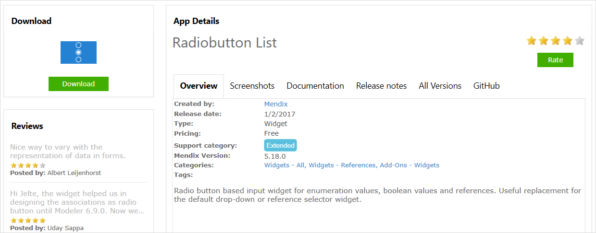

## 1 Introduction

This how-to covers the basics of accessing the App Store from Studio Pro and provides examples of how to add a widget and a module to your application.

**This how-to will teach you how to do the following:**

* Install content from the App Store via Studio Pro
* Download widgets and modules from the App Store into Studio Pro
* Use other App Store content in Studio Pro

## 2 Prerequisites

Before starting this how-to, make sure you have completed the following prerequisites:

* Familiarize yourself with the [App Store Overview](app-store-overview)

## 3 Downloading Content from the App Store {#downloading2}

To download content from the App Store via Studio Pro, follow these steps:

1. Open Studio Pro and sign in with your Mendix credentials.
2. Open the project in which you would like to install a component.
3.  Click the App Store icon in the top menu bar to open it in Studio Pro:

	

4.  On the App Store overview page, you find a project or component to use in your app. Use the **Search** bar to find a specific project or component. You can also filter the content with the **Categories** in order to get a general view of what is available to download.

	
    
	{}Results for App Store content searches done in Studio Pro may differ from those done in the [online App Store](app-store-overview) due to sync issues.
	{}

5.  Click the title of the item or **Read more** to view the item details:

	

6. When you have found the App Store component you want to download into your app, click **Download**:
    * A project will be created on your hard-drive and will be opened in Studio Pro
    * A component will be downloaded directly into your project

    Make sure that you download the correct version of the content from the App Store, because the widget or module version needs to be compatible with the Studio Pro version you are using. Do not download a widget that has a higher release version than the Studio Pro you are using. You can access older versions of the widgets in the **All Versions** tab in the App Store and download the most compatible version:

    

## 4 Using a Widget in Studio Pro {#widget}

In this section, you will learn how to add a widget to your app project. You can follow the same steps to download any App Store widget you need.

### 4.1 Adding the Widget

To add the Radio Button List widget from the App Store via Studio Pro, follow these steps:

1. Download the [Radio Button List](../widgets/radio-button-list) widget (for reference, follow the steps in the [Downloading Content from the App Store](#downloading2) section above).
2.  A widget downloaded from the App Store is placed in your app project structure. You can find the widget and start using it in the following ways:

	* Click **Add widget**, then browse the list of **Add-on widgets**:

		{}
		{}

	* Right-click the drop-zone where you want to use the widget, select **Add Widget**, then browse the list of **Add-on widgets**:

		

	To delete a widget, remove the *.mpk* file from your project's widgets folder.

3.  Select the **Attribute Radio Button List** widget, which will be placed in your app page:

	

### 4.2 Using the Widget

Each widget that you download from the App Store is different and has different ways of being used. For more information on what the widget does and how it can be implemented, check out the **Documentation** tab specific to each widget in the App Store:

Most widgets will require you to configure them. This is why when you drop the widget into a page, you will often see an error in the **Errors** list.

To resolve this widget error, follow these steps:

1.  Open the error view and review the error message:

	

	In this example, the **Target attribute** property in the radio button is required.

2.  Double-click the radio button to open all of its options in the **Edit Custom Widget** editor. Notice that the **Target attribute** is empty or set to none:

	

3.  Click **Select**, which will open the **Select Attribute** dialog box.
4.  Select the attribute that you want to display as a radio button. Note that the radio button works on Booleans and enumeration attribute types.

	

## 5 Using a Module in Studio Pro {#downloading}

In addition to widgets, you can download entire modules from the App Store (for example, the [Excel Importer](/appstore/modules/excel-importer)). The modules include whole functionalities and integrations that can be very helpful when you are building your applications.

In this section, you will learn how to add the Google Maps module as an example scenario. You can follow the same steps to download any App Store module you need.

### 5.1 Adding the Module

To add the Google Maps module from the App Store via Studio Pro, follow these steps:

1. Download the [Google Maps Module](https://appstore.home.mendix.com/link/app/174/).
2.  In the **Import Module** dialog box, **Add as a new module** is the default option when the module is being downloaded for the first time, which means that new entities will be created in your project:

	

	{}If you have made any edits or customization to a module that you have already downloaded, be aware of the **Replace existing module** option. This will override all of your changes with the standard App Store content, which will result in the creation of new entities and attributes, the deletion of renamed entities and attributes, and the deletion of their respective tables and columns represented in the database. Therefore, unless you understand the implications of your changes and you will not update your content in the future, making edits to the downloaded modules is not recommended.
	{}

3. Click **Import** on the **Import Module** dialog box, and a pop-up stating that “The app was successfully imported into the project” will appear. Click **OK**.
4.  Open the **Project Explorer** to view the Google Maps module. Note that unlike a widget, a module will be visible in your Project Explorer and will contain a domain model, pages, and microflow logic. A module downloaded from the App Store will store files if the module contains files (for example, userlib or resource files). In addition, a module downloaded from the App Store will have a light blue icon to differentiate it from the development modules.

	

### 5.2 Using the Module

Each module that you download from the App Store is different, and some modules might lead to errors because they are connected to other modules. For example, if you download the [Excel Importer](/appstore/modules/excel-importer) module, you will also need to download the Mx Model Reflection module to make the errors disappear. If you run into any problems, always check the **Documentation** tab specific to the App Store component for installation guidelines and details on any dependencies.

{}
Sometimes additional widgets are added when you download a module. For example, the Google Maps widget is included when you download the Google Maps module.
{}

To use the Google Maps module in Studio Pro, follow these steps:

1. Add the **Location Map Overview** and **Location Overview** menu items to your app's **Navigation**:

    

2. Review the Google Map by running your app locally and adding some locations.

## 6 Using Other App Store Content

There are also guidelines for using projects, layouts, and themes from the App Store.

### 6.1 Using a Project or Layout {#project-layout}

Downloading a project or layout will create a new project structure in the the location that you enter. After clicking **Download**, a window will appear where you can specify how the project should be created.

{}
You cannot create a new project in an existing repository that is not empty.
{}

### 6.2 Using a Theme

Downloading a theme is very similar to downloading a widget. Like a widget, a theme is added to the project structure, in the **theme** folder of your app project. A theme downloaded from the App Store will immediately be set as the active theme for your project. You can find out which theme is active for your project in the app  project **Settings**.

To delete a theme, remove the ZIP file from your project's **theme** folder.

## 7 Read More

* [App Store Overview](app-store-overview)
* [How to Share App Store Content](share-app-store-content)
* [App Store Content Support](app-store-content-support)
* [Properties Common in the Page Editor](/refguide/common-widget-properties)
* [My Top 5 Mendix Widgets for Speeding Up Application Development](http://www.mendix.com/blog/top-5-mendix-widgets-speeding-application-development/)

