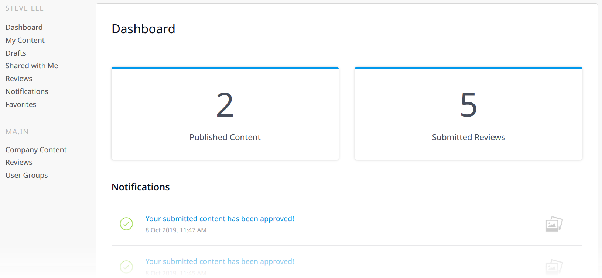
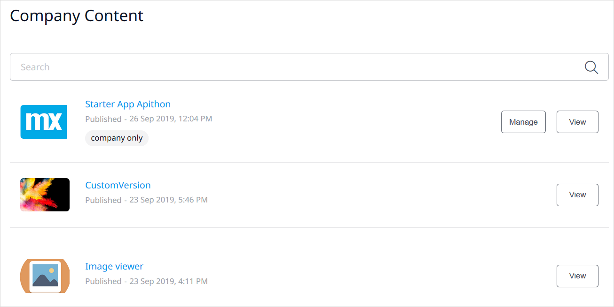
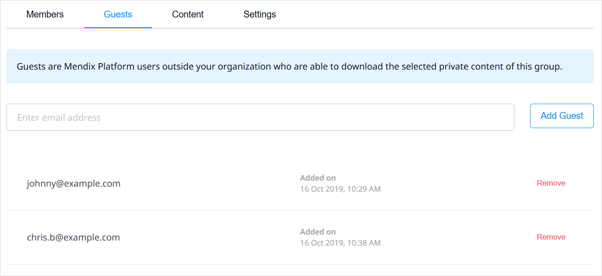

## 1 Introduction

{}
As the Mendix App Store is being updated into a dynamic and fully functioning Mendix Marketplace, some documentation pages will refer to "App Store" and some to "Marketplace."
{}

{}[**MEETING: Verify wording above**]{}

The [Mendix App Store](https://appstore.home.mendix.com/index3.html) is a vibrant marketplace containing complete sample apps that can be used right away as well as various components (connectors, widgets, and modules) that can be used to build custom apps more quickly. In the Mendix App Store, you can browse all the content, get what you need, and share the content you have created.

This document describes the different sections of the Mendix App Store.

## 2 App Store Home Page {#home}

The home page of the Mendix App Store has three main tabs at the top:

* **Discover** – the home page, where you can browse various component categories and filter what is displayed
* **My Marketplace** – click this to go to [My App Store](#my-app-store)
* **{Your company's private App Store page}** – click this to go to your [company's App Store](#company-content)
* **My Subscriptions** – click this to go to your [Subscriptions](#subscriptions) page

It also presents various content categories:

| Category | Description |
| --- | --- |
| Get Studio Pro | All the versions of [Studio Pro](/releasenotes/studio-pro/) available for download. |
| [Layouts](/refguide/layout) | Start building your app based on a layout that is ready to use with commons structures and widgets. |
| Create New App | Click this to select a app template for your new app project. |
| [Modules](/appstore/modules/) | These elements enable new functionality with accompanying domain models and security options. |
| Solutions | Fully-formed solutions for apps you can immediately start using. |
| [Widgets](/appstore/widgets/) | Single user-interface elements that can be configured, such as containers, drop-down menus, and buttons. |
| [Themes](/appstore/themes/) | Styling options for your apps that you can apply for different elements and devices. |

{}[**MEETING: Finish describing Solutions**]{}

The following filter options are also available:

* **Tags**
* **Ratings**

## 3 Component Details Page {#details}

Clicking the tile of an App Store component will bring you to its details page with the sections described below.

### 3.1 Header & Usage

The header for each component presents the following details:

* The name and category of the component
* The review average (in stars) and the number of reviews
* The number of times the component has been downloaded
* The **Add to Saved** button which, when clicked, will add the component to the list on the [Dashboard](#dashboard) and [Saved](#saved-components) pages
* The **Share** button, which allows you to share the component to your networks
* The following buttons (depending on the type of component and what the developer added to share):
	* **Download** – click this to download the component
		* This is only available for components that have a file attached (meaning, all shared Studio Pro components, but not promotions)
		* The best practice is to download a component from the App Store that is accessible in Studio Pro, because it then downloads directly into Studio Pro (for details on importing downloaded App Store content into Studio Pro, see [How to Import & Export Objects](/howto/integration/importing-and-exporting-objects))
	* **Try for Free** – click this to [subscribe](#subscriptions) to a free trial of the paid [platform-supported](app-store-content-support#category) component

{}[**MEETING: Verify "Add to saved" definition, cross-references, terms/labels**]{}

{}[**MEETING: Verify "Share" definition**]{}

{}[**MEETING: Verify "Try for Free" definition and when it's available; verify that "Preview" and "Open" buttons will no longer be available [if still available, get definitions from current doc**]{}

The **Usage** section presents  the following information (depending on the type of component):

* The latest **Version** number of the component
* The Studio Pro version that the component **Requires** to work
* The type of **License** for the component

The **Publisher** section presents the name of the company who created the component as well as the **Date** when the component was first published.

{}[**MEETING: Verify Publisher section; what happens when you click company name?**]{}

The **Developers** section presents the names of the developers who last updated the component, with links to their [Mendix Profile](/developerportal/mendix-profile/).

{}[**MEETING: Verify definition of what developers are included and that link goes to Mendix Profile**]{}

The **Support** section presents the category of support Mendix offers for the component (for details on categories, see [App Store Content Support](app-store-content-support)).

---

{}[**MEETING:Verify if below will still be part of this section; especially UUID, which is linked to in section 3.1.1 of Project API**]{}

* The **URL** for the component page that you can copy and share
* The **UUID** of the component; if the component is part of the **Getting Started** category of App Store content, this UUID can be used in the [CreateNewApp operation](/apidocs-mxsdk/apidocs/projects-api#createnewapp) in the *Projects API*
* A **View on GitHub** link, which will take you to the GitHub source files of the component

### 3.2 Tabs

The details page for each component presents the following item information tabs:

*  **Overview** tab – contains the following sections:
	* **Description** – a description of the component
	* **Screenshots** – screenshots of the component
	* **User Reviews** – user reviews of the component; to leave a review for the component, click **Add Review** – a section will open where you can add text, rate the component, and submit the review (your reviews will be listed on your [Reviews](#my-reviews) page)

	{}[**MEETING: Verify can still add screenshots**]{}

*  **Documentation** tab – can include details on typical use cases, features and limitations, dependencies, installation and configuration, and frequently asked questions; [platform-supported](app-store-content-support#category) components are documented in the various categories of this *App Store Guide*:

	
	
	{}[**Update screenshot for component with documentation**]{}

	* Clicking **Edit documentation** will open a text editor where you can edit the App Store component's documentation

*  **Releases** tab – lists all the versions (updates) of the component, any of which can be downloaded by clicking **Download**:

	

{}[**MEETING: Verify no other tabs**]{}
	
## 4 My App Store {#my-app-store}

### 4.1 Dashboard {#dashboard}

The **Dashboard** page presents your App Store activity:

* Your numbers for [Published Content](#content) and [Submitted Reviews](#my-reviews)
* [Notifications](#notifications) on components you created and favorited
* Content [Drafts](#drafts) you have created
* Your content [Favorites](#favorites)

### 4.2 My Content {#content}

On this page, you can see the App Store content for which you have created at least one version:

You may see the **Company only** label on a component, which means it is your company's private App Store content (for details on how this is configured, see the [Adding New App Store Content](share-app-store-content#private-app-store) section of *How to Share App Store Content*). This content can be shared with [guests](#guests).

In addition, you may see a label on a component name for the [user group](#user-groups) to which the component is assigned as user group [content](#content).

To see the component's [details](#details) page, click **View**.

#### 4.2.1 Managing a Component {#manage}

Click **Manage** to manage the component:

On this page, you will see the following buttons:

* **Create new draft version** – click this to create a new draft version of the component
	* Only one draft version of a component can exist at a time, so when one draft version is in progress, another draft cannot be initiated – if there is a draft version in progress, click **View draft** to see it
	* For more information on creating a draft version, see the [Updating Existing App Store Content](share-app-store-content#updating) section of *How to Share App Store Content*
* **Unpublish** – click this to remove that version from the component
	* If the component is not the protected content of a [user group](#user-groups), you can only unpublish a version that you have published yourself
	* If the component is protected [content](#content) from a user group, a group [member](#members) can unpublish any version
* **Edit** – click this to edit the component (for details on editing, see the [Adding New App Store Content](share-app-store-content#edit) section of *How to Share App Store Content*)

### 4.3 Drafts {#drafts}

This page contains drafts of App Store content you have started:

Click the name of an App Store component to be taken to the [DRAFT](share-app-store-content#adding) page, where you can continue editing the component details.

Click **Delete** to delete a draft.

Click **Withdraw** to withdraw the content from the review process after you have [submitted it for approval](share-app-store-content#status) . This will return the content to the draft state.

{}[**MEETING: Verify the Withdraw option is available here and not on page with Submit for approval (see cross-reference above; verify name of button**]{}

### 4.4 Shared with Me {#shared-with-me}

This page contains private content shared with you by other companies who have marked you as a [guest](#guests):

### 4.5 Reviews {#my-reviews}

This page contains reviews of [Your content](#content) by other users as well as **Your reviews** that you have written of other content:

### 4.6 Notifications {#notifications}

This page presents a history of notifications on content you have contributed to:

### 4.7 Saved {#saved-components}

This page presents the App Store content you have [favorited](#saved):

When the **Subscribe** box is checked next to a favorite component, you will receive email notifications when new versions of that component are published. Clear the check box if you do not want to receive these notifications.

## 5 Your Company's App Store

### 5.1 Company Content {#company-content}

On this page, you can see all the content your company has published:

The **Manage** button is available to you if one of the following conditions is true:

* You are the creator of the component and the component is not assigned to any [user groups](#user-groups)
* The component is assigned to a user group, and you are a [member](#members) of that group
* You are a Company Admin of the company that published the component

To manage a component, click **Manage** (for more information, see the [Managing a Component](#manage) section above).

To see the component's [details](#details) page, click **View**.

### 5.2 Reviews

This page contains reviews of **Your company's content** as well as **Your company's reviews** that users from your company have written of other content.

### 5.3 User Groups {#user-groups}

You can configure user groups for various levels of access to your company's App Store. The available configuration tabs for each user group page are described in the sections below.

{}
The **User Groups** menu item and page are visible to all users. However, only [Company Admins](/developerportal/company-app-roles/companyadmin-settings) with the [Can manage Company](/developerportal/company-app-roles/manage-roles#app-store-manager) permission can create and delete user groups. Both [Group Admins](#members) and Company Admins can manage user groups.
{}

#### 5.3.1 Members Tab {#members}

On this tab, you can enter the email address of a Mendix Platform user from your company and click **Add Member** to add them as a user group member. User group members can manage the [content](#content) assigned to the group.

Once a member is added, you can select their permission level: **Member** or **Group Admin**. A Group Admin can manage the user group.

To remove a member, click **Remove** next to their name.

#### 5.3.2 Guests Tab {#guests}

A guest is a Mendix Platform user from outside your organization who can download the selected private [Content](#content) of this group. To add a guest, enter their email address in the box and click **Add Guest**:

The guest will receive an email notifying them of access to the private content. They can then see all the private App Store content shared with them in their [Shared with Me](#shared-with-me) page.

{}
The guest must be a registered Mendix Platform user; otherwise, they will not be able to access the shared content.
{}

To remove a guest, click **Remove**.

#### 5.3.3 Content Tab {#content}

On this tab, you can assign content to this user group that can only be managed by members of this group. To assign a component to a user group, click **Assign Content** and select a company App Store component from the dialog box:

{}
A Mendix App Store component can only be assigned to one user group at a time. If a component is already assigned to another user group, it will not appear in this dialog box.
{}

To manage a component assigned to the user group, click **Manage** (for more information, see the [Managing a Component](#manage) section above).

To see the component's [details](#details) page, click **View**.

To remove a component from the user group, click **Remove**.

[Group Admins](#members) and Company Admins can check the **Allow guests to download** box of this component can be downloaded by [guests](#guests).

#### 5.3.4 Settings Tab

On this tab, you can enter a **Name** and **Description** for the user group.

To delete a group, a Company Admin can click **Delete Group**.

## 6 My Subscriptions {#subscriptions}

This page lists the **Product** (for example, **3D Visualization**), **Type** (for example, **App Service**), **Plan**, and **Expiration** of your subscriptions.

{}[**MEETING: verify description above, add more info and cross-references as available**]{}

Click **Manage App Services** to go to the page where you can manage the app services to which you have subscribed. There, you will **create and manage binding keys**.

{}[**MEETING: Need more info here**]{}

## 7 Read More

* [How to Use App Store Content in Studio Pro](app-store-content)
* [How to Share App Store Content](share-app-store-content)
* [App Store Content Support](app-store-content-support)
