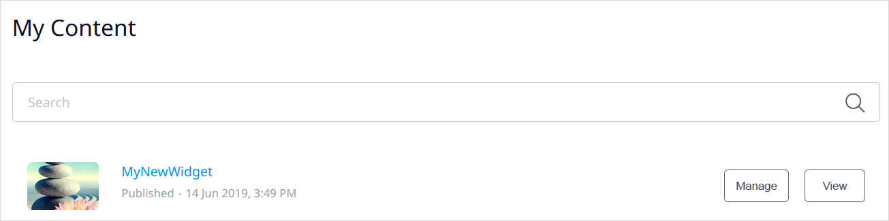
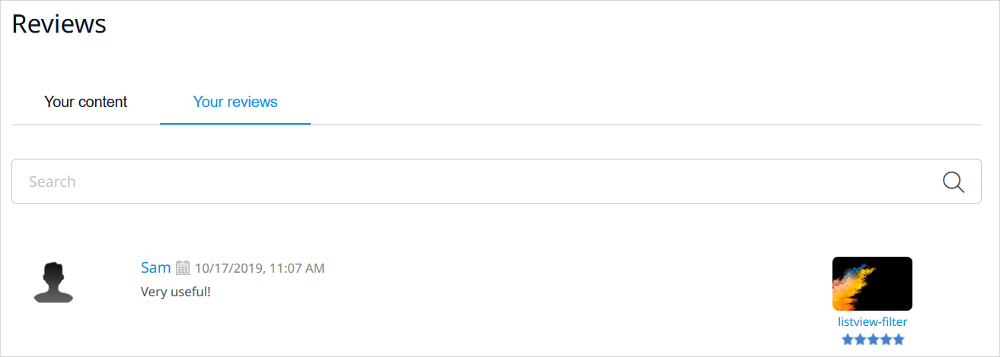
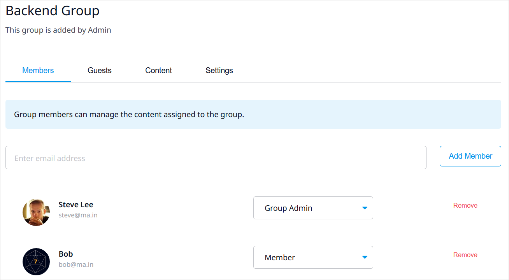
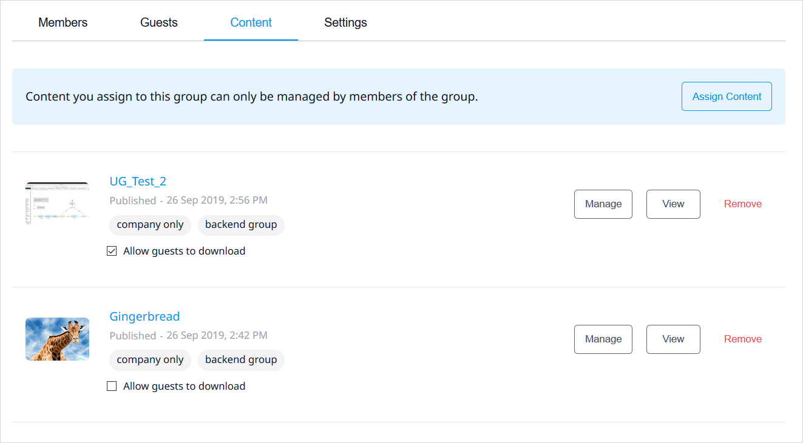

## 1 Introduction

The [Mendix Marketplace](https://marketplace.mendix.com/) is a vibrant marketplace containing complete sample apps that can be used right away as well as various components (connectors, widgets, and modules) that can be used to build custom apps more quickly. In the Mendix Marketplace, you can browse all the content, get what you need, and share the content you have created.

This document describes the different sections of the Mendix Marketplace.

## 2 Marketplace Home Page {#home}

The home page is your entry point to the various parts of the Mendix Marketplace. Here you can perform actions such as the following:

* Click **My Marketplace** to go to pages presenting your [Marketplace activity](#my-marketplace) as well as your company's [private content](#company-content)
* Click  **Get Studio Pro** to get the latest version of [Studio Pro](/releasenotes/studio-pro/)
* Click **Add Content** to [share new Marketplace content](/appstore/general/share-app-store-content) you have developed
* Explore various [content categories](#catalog).

The Marketplace offers the following content categories:

| Catalog | Description |
| --- | --- |
| [Widgets](/appstore/widgets/) | Widgets are single user-interface elements like containers, drop-down menus, and buttons. Select a widget, configure it, and add it to pages and snippets in your app. |
| [Connectors](/appstore/connectors/) | Connectors are for connecting data services. They have content that you can drag from the [Connector](/refguide/view-menu#connector) pane in Studio Pro into your app.|
| [Modules](/appstore/modules/) | Modules are packages of functionality for your app. They consist of a domain model, security options, and other elements like microflows, pages, or Java actions. Modules are mostly used for complex functionality that needs business or Java logic. |
| **App Design** | Start building your app based on a [layout](/refguide/layout) that is ready to use with commons structures and widgets or a [theme](/appstore/themes/) that contains styling options you can apply for different elements and devices. |
 | [App Services](/appstore/app-services/) | App services are packages of preconfigured business capabilities provided as modules containing logic, UIs, workflows, connectors, and APIs.  |
| **Solutions** | Solutions are aimed at industries and domain problems. An out-of-the-box solution delivers instant value, and can be adapted using the core Mendix Platform to fully meet your requirements. |

The following filter options are also available:

* **Tags**
* **Ratings**

## 3 Component Details Page {#details}

Clicking the tile of a Marketplace component will bring you to its details page with the sections described below.

### 3.1 Header & Usage

The header for each component presents the following details:

* The name and category of the component
* The review average (in stars) and the number of reviews
* The number of times the component has been downloaded
* The **Add to Saved** button which, when clicked, will add the component to the list on the [My Marketplace](#my-marketplace)
* The **Share** button, which allows you to copy the URL of the component and share it to your networks
* **Download** – click this to download the component
	* This is only available for components that have a file attached (meaning, all shared Studio Pro components, but not promotions)
	* The best practice is to download a component from the Marketplace that is accessible in Studio Pro, because it then downloads directly into Studio Pro (for details on importing downloaded Marketplace content into Studio Pro, see [How to Import & Export Objects](/howto/integration/importing-and-exporting-objects))

The **Usage** section presents  the following information (depending on the type of component):

* The latest **Version** number of the component
* The Studio Pro version that the component **Requires** to work
* The type of [license](share-app-store-content#license) for the component

The **Publisher** section presents the name of the company who created the component as well as the **Date** when the component was first published.

The **Developers** section presents the names of the developers who most recently updated the component, with links to their [Mendix Profile](/developerportal/mendix-profile/).

The **Support** section presents the category of support Mendix offers for the component (for more details, see [Marketplace Content Support](app-store-content-support)).

A **GitHub** link will take you to the GitHub source files of the component.

### 3.2 Tabs

The details page for a component presents the following item information tabs:

*  **Overview** – contains the following sections:
	* **Description** – a description of the component
	* **Screenshots** – screenshots of the component
	* **User Reviews** – user reviews of the component; to leave a review for the component, click **Add Review**, which will open a section where you can add text, rate the component, and submit the review (your reviews will be listed on your [Reviews](#my-reviews) page); if you are a developer of the component, you can **Reply** to a review
*  **Documentation** – can include details on typical use cases, features and limitations, dependencies, installation and configuration, and frequently asked questions
	* [Platform-supported](app-store-content-support#category) components are documented in the various categories of this *Marketplace Guide*
	* Click **Edit documentation** to open a text editor where you can edit the Marketplace component's documentation
* **Pricing**  – lists the pricing options (only for paid components)
* **Releases** – lists all the versions of the component (any of which can be downloaded by clicking **Download**) along with details like the **Framework version** and the **UUID** (which can be used in the [CreateNewApp operation](/apidocs-mxsdk/apidocs/projects-api#createnewapp) in the *Projects API*): 

## 4 My Marketplace {#my-marketplace}

At the top of your Marketplace page, you can choose a category to [share new Marketplace content](share-app-store-content#adding), such as **Widgets**, **App Services**, or **Solutions**.

The rest of this page presents previews of your Marketplace activity:

Click an item in the sidebar to go to the page for that content:

* [My Content](#my-content)
* [Shared with Me](#shared-with-me)
* [Saved Content](#saved-components)
* [Reviews](#my-reviews)
* [Company Content](#company-content)
* [User Groups](#user-groups)

### 4.1 My Content {#my-content}

In this page, you can see the Marketplace content for which you have created at least one version. Click the context menu to access various options for managing your content:

* **View item** – click this to go to the [component details page](#details) 
* **Create a new draft** – click this to create a new draft version of the component
	* Only one draft version of a component can exist at a time, so when one draft version is in progress, another draft cannot be initiated – if there is a draft version in progress, click **View draft** to see it
	* For more information on creating a draft version, see the [Updating Existing Marketplace Content](share-app-store-content#updating) section of *How to Share Marketplace Content*
* **Edit a version** – click this to edit the component (for details on editing, see the [Adding New Marketplace Content](share-app-store-content#adding) section of *How to Share Marketplace Content*)
* **Unpublish a version** – click this to remove one version or all versions of the component
	* If the component is [protected content](#group-content) from a [user group](#user-groups), a [group member](#members) can unpublish any version
	* If the component is not the protected content of a user group, you can only unpublish a version that you have published yourself
	* Select **Unpublish all my versions** to remove all your versions of the component

You may see the **Company only** label on a component, which means it is your company's private Marketplace content (for details on how this is configured, see the [Adding New Marketplace Content](share-app-store-content#private-app-store) section of *How to Share Marketplace Content*). This content can be shared with [guests](#guests).

In addition, you may see a label on a component name for the [user group](#user-groups) to which the component is assigned as group [group content](#group-content).

At the top of the page, you can click **Open Drafts** to see drafts of all the Marketplace content you have started:

On this page, click the name of a Marketplace component to go to its [draft page](share-app-store-content#adding), where you can continue editing the component details.

Click **Delete** to delete a draft. You can also click **Withdraw** to withdraw the content from the review process after you have [submitted it for approval](share-app-store-content#approval), which will return the content to the draft state.

### 4.2 Shared with Me {#shared-with-me}

This page contains private content shared with you by other companies who have marked you as a [guest](#guests).

### 4.3 Saved Content {#saved-components}

This page presents the Marketplace content you have [saved](#saved). Click the bell icon in the bottom-right corner of the component's tile to receive email notifications on new versions of the component:

Click the context menu to access various options for managing this content:

* **View item** – click this to go to the [component details page](#details) 
* **Receive/Stop email notifications** – click this to start receivin email notifications or to stop the notifications if you already have them enabled
* **Unsave** – click this to remove the component from your saved content

### 4.4 Reviews {#my-reviews}

This page contains reviews of [My Content](#my-content) by other users as well as **My reviews** that you have written of other content:

### 4.5 Company Content {#company-content}

On this page, you can see all the content your company has published. Click the context menu to access various options for managing this content:

The options in this menu are the same as described for the context menu for the [My Content](#my-content) section above. However, the **Edit a version** and **Unpublish a version** options are only available for your own versions of company content.

### 4.6 Company Reviews

This page contains reviews of **Your company's content** as well as **Your company's reviews** that users from your company have written of other content.

### 4.7 User Groups {#user-groups}

You can configure user groups for various levels of access to your company content. The available configuration tabs for each user group page are described in the sections below.

{}
The **User Groups** menu item and page are visible to all users. However, only [Mendix Admins](/developerportal/control-center/#company) can create and delete user groups. Both [Group Admins](#members) and Mendix Admins can manage user groups.
{}

#### 4.7.1 Members Tab {#members}

On this tab, you can enter the email address of a Mendix Platform user from your company and click **Add Member** to add them as a user group member. User group members can manage the [content](#group-content) assigned to the group.

Once a member is added, you can select their permission level: **Group Member** or **Group Admin**. A Group Admin can manage the user group.

To remove a member, click **Remove** next to their name.

#### 4.7.2 Guests Tab {#guests}

A guest is a Mendix Platform user from outside your organization who can download the selected private [Content](#group-content) of this group. To add a guest, enter their email address in the box and click **Add Guest**:

The guest will receive an email notifying them of access to the private content. They can then see all the private Marketplace content shared with them in their [Shared with Me](#shared-with-me) page.

{}
The guest must be a registered Mendix Platform user; otherwise, they will not be able to access the shared content.
{}

To remove a guest, click **Remove**.

#### 4.7.3 Content Tab {#group-content}

On this tab, you can assign content to this user group that can only be managed by members of this group. To assign a component to a user group, click **Assign Content** and select a company Marketplace component from the dialog box:

{}
A component can only be assigned to one user group at a time. If a component is already assigned to another user group, it will not appear in this dialog box.
{}

Click the context menu to access various options for managing this content:

The options in this menu are the same as described for the context menu for the [My Content](#my-content) section above. The **Unassign from group** button is only available for [Group Admins](#members) and can be used to remove content from the user group.

#### 4.7.4 Settings Tab

{}
This tab is only accessible to [Group Admins](#members) and [Mendix Admins](/developerportal/control-center/#company).
{}

On this tab, you can enter a **Group Name** and a **Group Description**.

To delete a user group, a Group Admin or Mendix Admin can click **Delete Group**.

## 5 Service Management Dashboard {#service-management}

To use an app service in your app, you need binding keys. You can create and manage these keys on the **Service Management** dashboard.

### 5.1 Creating Binding Keys

To create binding keys, go to the **Service Management** dashboard via the link provided in your subscription confirmation email, select a **Product**, and click **Generate Keys** at the bottom of the page:

In the **Provide a Name for Your App Connection** field of the **Connect Your Service** dialog box, enter a name for the connection:

After you click **Create Keys**, a page will appear with your keys – **clientID**, **TokenURL**, and **clientSecret**:

Click **Copy** for each key and manually save the keys somewhere safe, as you will not be able to access them again.

{}
Once you close this page of the Service Management dashboard, you will not be able to retrieve the keys again.
{}

To use the binding keys, see the [Using the Binding Keys](#using) section below.

Click **Return to the overview** to go to the main page of the Service Management dashboard. On the main page, you can hover over the **Binding Keys** column to see the binding keys that have already been created as well as to delete a binding key:

You can also highlight a product and click **Manage** to go to the app service provider's configuration page, where you can do further app service-specific configuration:

{}
This additional management option is only available for specific app services where necessary.
{}

### 5.2 Using the Binding Keys {#using}

When you are developing your app, set the app service's **clientID** and **clientSecret** as [constants](/refguide/configuration#constants) in the [App Settings](/refguide/project-settings).

For details on using binding keys in the MindSphere app service, see the [Authenticating MindSphere REST Calls](/partners/siemens/mindsphere-app-service#authenticating) section of *MindSphere App Service*.

## 6 Read More

* [How to Use Marketplace Content in Studio Pro](app-store-content)
* [How to Share Marketplace Content](share-app-store-content)
* [Marketplace Content Support](app-store-content-support)
