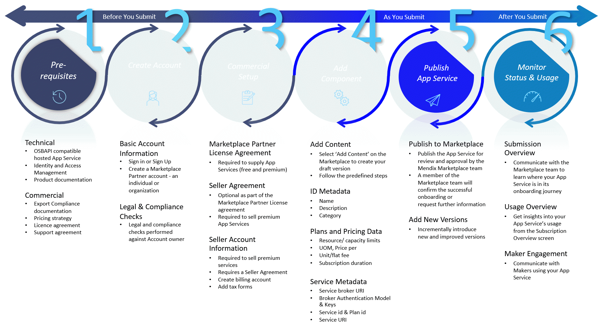

## 1 Introduction

Whether you are an established ISV, an ambitious startup, or a pioneering independent developer, by [sharing](share-app-store-content) your app service in the Mendix Marketplace, you will create customer value by fueling the resource library for Mendix developers. The process is simple: sign up as a [Marketplace Vendor](#vendor), design and build your app service, edit your listing, and submit it to the Marketplace today. In return, you will gain the following benefits:

{}[**Verify slide to be included; need higher quality image**{}

App services are domain-focused packaged business capabilities delivered as a collection of composable Mendix native UI components and APIs.  In other words, they are flexible building blocks with out-of-the-box integration into the Mendix development experience, enabling users to imagine new apps, extend the capability of existing apps, and significantly decrease time-to-value.

**This how-to will teach you how to do the following:**

* Join the Marketplace Vendor Program
* Make your app service Marketplace-ready

## 2 Becoming a Marketplace Vendor {#vendor}

The [Mendix Vendor Program](https://www.mendix.com/marketplace-vendor-program/) includes opportunities for a variety of types of partners (for example, ISVs, Strategic Alliance Partners, and Marketplace Vendors). ISVs and Marketplace Vendors are not mutually exclusive, because an ISV may also be a Marketplace Vendor, and a Marketplace Vendor may or may not be an ISV. If you have an app (or collection of apps) that solves a customer business problem, you should explore the Mendix ISV program for details on how to qualify to become an ISV and what solutions are relevant for the program. 

Whether you are supplying an app service as an individual with your own business or you are acting on behalf of your organization, you will be in great company by joining the Mendix Vendor Program.  We only need some key information from you before you are ready to offer your product through the Mendix Marketplace. Mendix will work with you throughout the application process to make your onboarding experience as simple as possible.

For more information, see the [Creating a Marketplace Vendor Account](#creating-account) section below.

### 2.1 Prerequisites

Before you become a Marketplace Vendor, there are a few prerequisites to take care of.  In addition to defining the business case for your app service (including how it will be licensed, priced, and supported), make sure you meet the export control requirements for your product.  We know export control can be confusing, so if you are still unclear on what you need to do, you can contact our Marketplace Compliance team.

{}[**How do they contact? Cannot include without direct contact info**{}

## 3 App Service Overview

The Marketplace provides a trustworthy experience for sharing and consuming app services and other products.  This is achieved through proven curation and governance processes as well as compliance checks conducted at the point of consumption. To walk you through the process of submitting content to the Marketplace, the intuitive [Upload Content](share-app-store-content#adding) wizard provides steps for adding and publishing your app service.

Once you have submitted your app service, you can manage all the business related to it, and you can access your commercial agreements and account information via the **Partner Portal**.  [My Marketplace](app-store-overview#my-marketplace) enables keeping track of and communicating with the users of your app service. 

{}[**Where is the Partner Portal? Will this be added to My Marketplace UI?**{}

Mendix uses the industry-standard [Open Service Broker API (OSB API)](https://www.openservicebrokerapi.org/) to enable us to automatically provision, de-provision, update, and connect users to your app service. For more information on this method, see the [Technical Readiness](#add-app-service) section below.

{}[**Verify keeping section cross-reference above**{}

The **Marketplace APIs** are also available for you to automate your workflow and access data about your app service.

{}[**Where are these APIs published, how to link to them?**{}

{}[**Verify slide to be included; need higher quality image**{}

## 4 Before You Submit

To help us maintain the high quality of content available on the Marketplace, we provide clear guidelines below for what is necessary when preparing and submitting your app service. Use these comprehensive resources to turn your idea into reality by learning how to design, develop, market, and monetize your app service and get support via best practices and success stories from like-minded Marketplace Vendors.

### 4.1 Prerequisites

### 4.1.1 OSB API Compatibility

To upload an app service to the Marketplace, it needs to be compatible to the OSB API.  This allows the service to be automatically provisioned, and it provides the connection details for users when they try or buy it.
        
Although OSB API supports endpoints for many operations (as specified in the [Open Service Broker API specification](https://github.com/openservicebrokerapi/servicebroker/blob/master/spec.md), these are the three main concepts to consider while implementing your service broker for your app service are:

* **Service Catalog** (`GET /v2/catalog`) – for listing your services available to the broker
* **Provisioning** (`PUT /v2/service_instances/{instance_id}`) – for provisioning your service
* **Binding** (`PUT /v2/service_instances/{instance_id}/service_bindings/{binding_id}`)  – for creating the connection and connection details to connect your service to an application during provisioning

For additional assistance and an example of how to provision and bind an app to a logging service, see  [Logging - As a app service](https://paper.dropbox.com/doc/Logging-As-a-App-Service-5B6CSVzCohsUXj6tBrYYN).

{}[**We do not publish links to Dropbox Paper - is this draft to be turned into a customer-facing doc?**{}

### 4.1.2 Identity and Access Management (IAM)

When you upload your app service to the Marketplace, you can choose how it integrates with the Mendix Platform’s foundational IAM service.  In this way, you can "consume" authentication, authorization decisions, and user profiles while focusing on your domain logic and while Mendix manages the identities and access policies. 

There are currently three models for integrating with Mendix IAM, the applicability of which depend on how your app service is architected.  Models 1 and 2 apply at the app/app service level, whereas model 3 applies at an individual user level:

* **Model 1: Enable an app to communicate with your app service via an API** – in this model, users can use the Mendix low-code artefacts you supply within their apps to invoke your API
* **Model 2: Enable Mendix developers and app end-users to have a single sign-on (SSO) experience between apps, app services, and the Mendix Platform** – this model is applicable when your app service requires a user identity (for example, your app service may support SSO when accessed by an end-user from within an app or when it is being configured by a developer at design time through a configuration UI)
* **Model 3: Enable end-user access control to your app service from within an app** – in this model, end-user access to your app service is managed centrally by the Mendix IAM service

For more information, follow this link [Service provider - IAM requirements](https://paper.dropbox.com/doc/Service-provider-IAM-requirements-hooivk3hshSdZ1llrmxGm).

{}[**We do not publish links to Dropbox Paper - is this draft to be turned into a customer-facing doc?**{}

### 4.1.3 Metering

App service metering consists of the following:

* Usage-based metering (via the API gateway)
	* API (payload, count)
	* An asynchronous service 
* Active users (via Mendix Runtime)
	* Widget
* Metering (via the app service’s own solution) 

### 4.1.4 Product Documentation

{}[**Content to be added?**]{}

### 4.1.5 Commercial

{}[**Content to be added?**]{}

### 4.1.6 Export Control

Export control is an area of legislation that regulates and restricts the export of goods, information, software, and technology that could be potentially useful for purposes that are contrary the interest of the exporting country. These items are considered to be *controlled*. 

If your app service is a controlled item, Mendix needs to ensure it is prevented from being sent to destinations where it may be used in a harmful way. In these cases, you typically need to request an export control license from a local government department, and you need to confirm ownership of such a license before we can list your app service in the Marketplace.

If you are unclear what this means to you and your app service, there are useful resources online.  If you are stuck, you can contact our Compliance Team at *compliance@mendix.com* for guidance.

{}[**Is this a working email address that should be shared publicly?**]{}

### 4.1.7 Pricing and Free Trials

As a Marketplace Vendor, it is important that you choose the pricing model that will maximize the business opportunity for your app service. Once you have decided on your preferred pricing model and whether you want to offer your app service as a free trial, you can apply these these options to your app service via steps in the Add Content wizard.

#### 4.1.7.1 Pricing Models

The Marketplace supports two pricing models: 

* **Per User** (subscription) – In this model, a single user pays a fixed monthly price.  When a second user is added, the monthly price doubles, and so on.
* **Usage-Based** – In this model, users pay for what they consume. In this way, it directly relates the price your users pay for your app service to their usage. The more they use, the more they pay and conversely, the less they use, the less they pay.

When you upload your app service, you can choose whether to have it metered by **Payload size** or **Count**. 

{}[**Do we need separate definitions for Payload size and Count, or are those supposed to reflect the two pricing models?**]{}

#### 4.1.7.2 Free Trials

The benefits of a free trial are well know as a means to increase user adoption. Having offered trials for many of our own app services, Mendix recommends that you consider offering a trial for yours, too.

{}[**What are these "trials for many of our own app services" when there is only 1 app service currently available (Mindsphere)?**]{}

The Marketplace supports time-based trias, so you must clearly define the terms and conditions of your trial offering so users are aware of what they are signing up for.  As a minimum, you must clearly state the trial duration and what happens to data created during the trial period once the trial has ended. 

The Marketplace tracks trial usage and notifies service users that their trial is drawing to an end. Once their trial ends, your service will no longer be available to them until they subscribe to it.
        
#### 4.1.7.3 Payments

One of the biggest benefits provided by the Marketplace is that it removes the pain of managing billing and payments.  A user pays a fee to use your app service according to the pricing model you specify for it. The Marketplace meters usage of your app service and sends a bill to the user.  You can see monthly billing reports in your Partner Portal, and you will also be emailed them for completeness.
        
Under our standard [Marketplace terms and conditions](https://www.mendix.com/terms-of-use/), we support the following subscription/billing model:

{}[**Verify correct link to T&Cs**]{}

| Subscription Duration | 12 Months |
| --- | --- |
| Subscription auto-renewal | Not Supported |
| Billing period | Monthly |
| Billing day | 15th day of each month |
| Billing timing | In arrears |

#### 4.1.7.4 Marketplace Operating Fees

The Mendix Marketplace is free to use unless you want to sell paid app services through it. When you sell your app service via the Marketplace, Mendix charges 20% of your gross revenue due to that service for the value-added services of purchasing, metering, and billing as well as the payment provided by the Marketplace.
    
For more information, see [+Mendix Ecosystem - The Composable Enterprise & PBC Monetization](https://paper.dropbox.com/doc/Mendix-Ecosystem-The-Composable-Enterprise-PBC-Monetization-SYmPTLdAc3p7NztBCqnMI) 

{}[**We do not publish links to Dropbox Paper - is this draft to be turned into a customer-facing doc?**{}

#### 4.1.7.5 Supported Regions

Subject to the compliance requirements for your specific app service, the Marketplace supports global access to free and trials of paid app services.
        
To sell a paid app service, you must be a permanent resident or a legal business entity in one of the following countries:

* Netherlands

{}[**Other countries to be listed?**{}

Further conditions apply:

* Licensing agreement
	* App services must comply with all legal requirements in any location where you make them available
* Support agreement
* FOSS

{}[**More information to be added above?**{}

### 4.2 Creating a Marketplace Vendor Account {#creating-account}

#### 4.2.1 Basic Account Information

Whether you are an individual app service supplier with your own business or you are supplying an app service on behalf of your company, you need to create a Marketplace Vendor account.

Since your Marketplace Vendor account is associated with your Mendix ID, you first need to create a [Mendix Platform account](https://signup.mendix.com/). When creating your Marketplace Vendor account, Mendix asks for basic information, including your legal name and address. This information is used to check whether you want to sell your app service or offer it for free.  As the creator of the account, you must have the permission to legally bind your company to Mendix.

| Account Detail | Description |
| --- | --- |
| Account Owner | Account creator’s email address |
| Logo |  |
| Name | Supplier name (could be a company/brand/individual.) |
| Description | Describe your (company’s) purpose, products, and service.s |
| Company Name | The legal name of the entity that will sell or offer your free service. |
| Company Address | The legal address of the entity that will sell or offer your free service. |

#### 4.2.2 Legal and Compliance Checks

The company registered with your account is the legal entity against which Mendix will be bound. For this reason, Mendix performs screening checks to ensure we are legally permitted to undertake business transactions together.

The checks involved are:

* SPS

{}[**More information to be added above?**{}

### 4.3 Commercial Setup

#### 4.3.1 Marketplace Vendor License Agreement

Whether you are offering a free or paid app service through the Marketplace, you have to accept our Marketplace Vendor License Agreement, which is an agreement between Mendix and you as a Marketplace Vendor within the Marketplace Vendor Program.

For ease of reference, here are some of the main points of the license agreement you need to be aware of:

* App services must be free from any known security vulnerabilities
* App services must not contain default passwords, authorization keys, or any other credentials
* App services must not include software that collects and exports customer data without the customer's knowledge and express consent
* App services must be production-ready and must include a defined support policy
* Mendix reserves the right to reject app services that do not comply with these guidelines or the requirements described in the license agreement

These are similar concepts to those in the Developer Program License Agreement in the [Apple Developer Program](https://help.apple.com/app-store-connect/#/devb6df5ee51) and [Atlassian Marketplace Vendor Agreement](https://www.atlassian.com/licensing/marketplace/partneragreement).

{}[**Keep reference to these examples?**{}

#### 4.3.2 Seller License Agreement

For paid app services, you have to accept our Marketplace Seller Agreement and provide seller account information, including the following:

| Seller Account Information | Description |
| --- | --- |
| Bank Name | The name of the branch where the account is held. |
| Bank Address | The address of the branch where the account is held. |
| Account Number | The account number for the legal entity or individual who signed the Seller License Agreement. |
| Account Holder Name | The name registered with the account. |

These are similar concepts to those in the Paid Applications Agreement in the [Apple Developer Program](https://help.apple.com/app-store-connect/#/devb6df5ee51).

{}[**Keep reference to this example?**{}

## 5 As You Submit

While you are developing your app service, it’s good practice to create a draft version with basic information such as name, description, and keywords in preparation for publishing it to the Marketplace as soon as you’ve finished creating it. 

Remember your listing represents your brand so be sure to keep it updated, use quality images and clearly explain the benefits of your app service. Refer to section 4 of https://docs.mendix.com/appstore/general/share-app-store-content for a complete list of supported metadata, and Brand Guidelines to learn more about our brand guidelines  

#### Step 4: Add your app service {#add-app-service}
At this stage you’ve confirmed the commercial feasibility of your app service, you’ve signed up as a Marketplace Vendor, and you’re technically ready to onboard it to the Marketplace.

As a helping hand we’ve provided this checklist of items to consider as the final step to successfully listing your app service:

- **Dependencies** -
    [ ] Provide a list of resources/dependencies from Marketplace that might be needed to use your component
    [ ] Make sure the dependency mentioned is compatible with your component
- **Technical Readiness** -
    [ ] While importing the component, there might still be errors that exist, because it is expected that the end-user needs to hook up some information from their existing modules into the new components. This should be fine, as long as there is an explanation in the Documentation section of “how to set-up” the component
    [ ] Errors existing with no explanation of how to address them should not exist, when importing the component
    [ ] Test your component for crashes and bugs
- **Accurate Metadata** - 
    [ ] Customers should know what they’re getting when they download or buy your app, so make sure all your app metadata, including privacy information, your component description, screenshots, and previews accurately reflect the components core experience and remember to keep them up-to-date with new versions
    [ ] Ensure that all app information and metadata is complete and accurate
    [ ] Include detailed explanations of non-obvious features and including supporting documentation where appropriate
    [ ] Select the most appropriate category for your app, and check out the [Marketplace Store Category Definitions](https://paper.dropbox.com/doc/App-Store-Quick-Reference-Card--BI1ABkUNXWwfPdO7~ND3lD4iAg-EvYnmdiq6zCsS2ZBe0jDM) if you need help. If you’re way off base, we may change the category for you
    [ ] [Update your contact information](https://sprintr.home.mendix.com/link/profilesettings/generalinfo) in case component Review needs to reach you
    [ ] Check the details on how to select the details while submitting a component follows [guidelines](https://docs.mendix.com/appstore/general/share-app-store-content#submission) as mentioned in the documentation
    [ ] Spell check the content you are about to submit
- **Versioning -**  
    [ ] Component should work fine for the specified Studio Pro version it was marked as being compatible with
    [ ] Keep versioning pattern consistent in terms of naming and version numbers for your component
    [ ] Also provide release notes
- **Branding** -
    [ ] Screenshots should show the app in use, and not merely the title art, log-in page, or splash screen. They may also include text and image overlays
- **Usability -**
    [ ] Make sure inclusion of README snippet and USEME folders which helps the user on how to use the component
    [ ] Make sure that there are no unnecessary dependencies bundled when exporting the module from the Desktop Modeler
        [ ] For instance, if the module only mentions needing a jar file `fancystuff.jar`, but the userlib includes 10 other jar files ← these are unnecessary dependencies
    [ ] If you attempt to cheat the system (for example, by trying to trick the review process, steal user data, copy another developer’s work, manipulate ratings) your components will be removed from the Marketplace.
    [ ] Keep updating your components on a timely basis or the components will be removed if not updated for longer period from Marketplace

**Setting pricing plan**

**Picking license** 
Customers using paid via Atlassian apps are subject the [Marketplace Terms of Use](https://www.atlassian.com/licensing/marketplace/termsofuse). Similarly, this agreement is between Atlassian and your app customers. Your customers agree to the terms when they purchase or use your app

We have enabled onboarding and publishing of a Component without License. We are planning to onboard FSM solution with this strategy.
i.e. Do no display License at all. Just add text under documentation mentioning “Commercial license terms applied” under ‘License’ Bullet Item.

**Step 5: Publish app service**
When your app service is ready to be published to the Marketplace it is submitted to the Marketplace Governance team for approval.  This is vital to maintaining high-quality Marketplace content and an improved overall user experience, and we’ve made it simple to trigger from within the Add Content wizard.

The Marketplace Governance team’s mission is to manage the quality of content while keeping the submission process as frictionless as possible.  They achieve this by maintaining this comprehensive set of guidelines, which when followed will maximise the chances of your submission being approved first time round. The more complex your app service, the more likely it is to require multiple approval iterations to get it into great shape but the Marketplace Governance team are on hand to advise you throughout the process.

### After You Submit

Once you’ve submitted your app service you can keep track of your submission by subscribing to receive status notifications and if you need more help you can contact the Marketplace Governance team.

**Step 6: Monitor Status and Usage**
Once your app service is available on the public Marketplace you can gain insights into its usage through the Subscription Overview in the Control Centre, and you can engage with Makers at they use it via My Marketplace Reviews.

Marketplace Reviews - discipline of supplier comments  

## Brand Guidelines

Use of Mendix logo
Branded imagery sizes
Legal requirements. credit lines trademarks

## UX Design Guidelines

Atlas
Principles
Themes
Styles
Fonts
