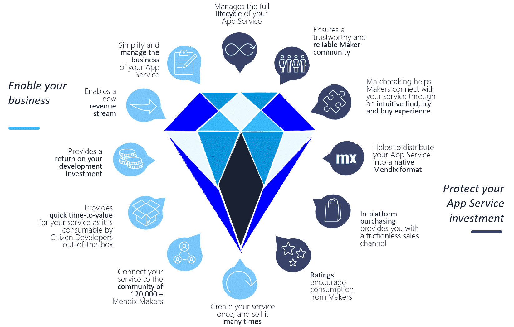
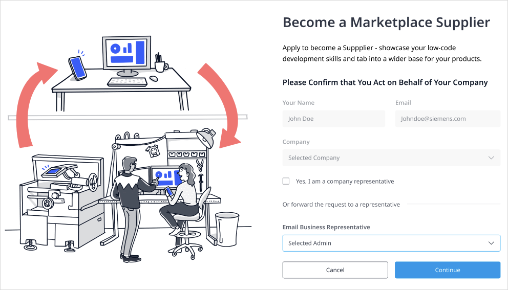
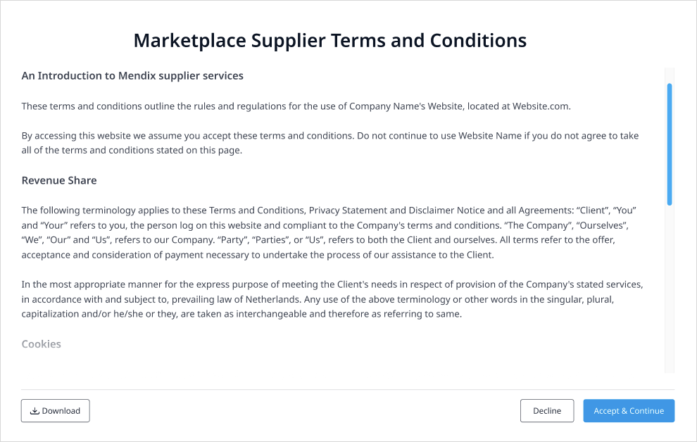
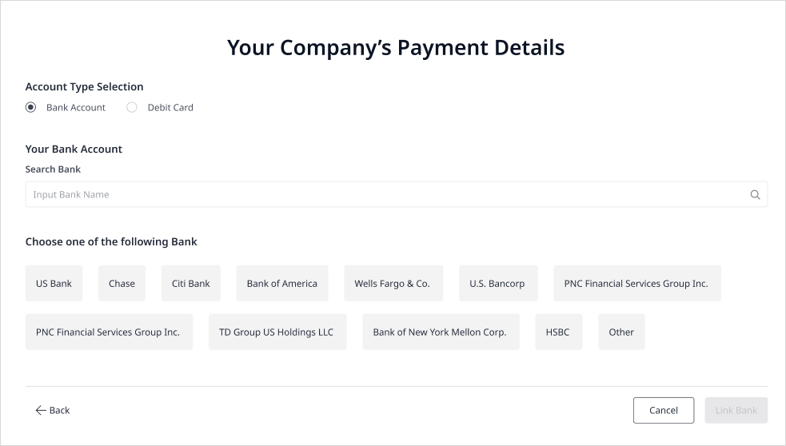
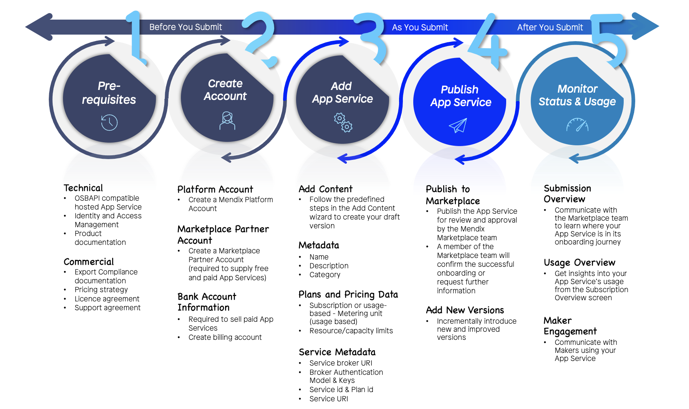

## 1 Introduction

Whether you are an established ISV, an ambitious startup, or a pioneering independent developer, by [sharing](share-app-store-content) your component in the Mendix Marketplace, you will create customer value by fueling the resource library for Mendix developers. The process is simple: sign up as a [Mendix Vendor](#vendor), design and build your component, edit your listing, and submit it to the Marketplace today. In return, you will gain the following benefits:

{}[**Verify slide to be included; need higher quality image**]{}

**This how-to will teach you how to do the following:**

* Join the Mendix Vendor Program
* Make your component ready to sell on the Marketplace
* Complete specific tasks before you submit, as you submit, and after you submit your component to the Mendix Marketplace

## 2 Becoming a Mendix Vendor {#vendor}

The [Mendix Vendor Program](https://www.mendix.com/marketplace-vendor-program/) includes opportunities for a variety of types of partners (for example, ISVs, Strategic Alliance Partners). ISVs and Mendix Vendors are not mutually exclusive, because an ISV may also be a Mendix Vendor, and a Mendix Vendor may or may not be an ISV. If you have a component (or collection of components) that solves a customer business problem, you should explore the Mendix ISV program for details on how to qualify to become an ISV and what solutions are relevant for the program. 

Whether you are supplying a component as an individual with your own business or you are acting on behalf of your organization, you will be in great company by joining the Mendix Vendor Program.  We only need some key information from you before you are ready to offer your product through the Mendix Marketplace. Mendix will work with you throughout the application process to make your submission experience as simple as possible.

### 2.1 Prerequisites

Before you become a Mendix Vendor, there are a few prerequisites to take care of. For paid components, whether you are an individual supplier with your own business or you are supplying on behalf of your company, you need a [Mendix Platform account](https://signup.mendix.com/) before you can create a Mendix Vendor account.

In addition to defining the business case for your component (including how it will be licensed, priced, and supported), make sure you meet the export control requirements for your product. We know export control can be confusing, so if you are unclear on what you need to do, contact Mendix at *DIS_AppServices_Supplier_Team@mendix.com*.

### 2.2 Applying to the Mendix Vendor Program

Whether you are an individual component supplier with your own business or you are supplying a component on behalf of your company, you need to [apply to the Mendix Vendor Program](https://www.mendix.com/marketplace-vendor-program/#contactForm).

Since your Mendix Vendor account will be associated with your Mendix ID, make sure you have a [Mendix Platform account](https://signup.mendix.com/). 

When applying to the program, you will be asked for basic information, including your legal name and address. This information is used to check whether you want to sell your component or offer it for free.

| Account Detail | Description |
| --- | --- |
| Account Owner | The account creator’s email address. |
| Logo | Your supplier logo. |
| Name | Supplier name (could be a company, brand, or individual). |
| Description | Describe your purpose, products, and services. |
| Company Name | The legal name of the entity that will sell or offer your free service. |
| Company Address | The legal address of the entity that will sell or offer your free service. |

As the creator of the Mendix Vendor account, you must have permission to legally bind your company to Mendix. If you are not the right person to do this, you can forward a request to one of your colleagues:

{}[**Is this section for applying via https://www.mendix.com/marketplace-vendor-program/#contactForm, or is there another place to apply or create an account?"**]{}

{}[**New image needed with "Vendors"**]{}

### 2.3 Mendix Vendor License Agreement {#vendor-license}

Whether you are offering a free or paid component through the Marketplace, you need to accept our Mendix Vendor License Agreement, which is an agreement between Mendix and you as a Mendix Vendor within the Mendix Vendor Program.

{}[**New image needed with "Vendors"**]{}

For ease of reference, here are some of the main points of the license agreement you need to be aware of:

* Components must be free from any known security vulnerabilities
* Components must not contain default passwords, authorization keys, or any other credentials
* Components must not include software that collects and exports customer data without the customer's knowledge and express consent
* Components must be production-ready and must include a defined support policy
* Mendix reserves the right to reject components that do not comply with these guidelines or the requirements described in the license agreement

### 2.4 Seller License Agreement {#seller-license}

To receive payments from Mendix, you need to accept the [Seller License Agreement](#seller-license) and provide some key information:

| Account Detail | Description |
| --- | --- |
| Bank Name | The name of the branch where the account is held. |
| Bank Address | The address of the branch where the account is held. |
| Account Number | The account number for the legal entity or individual who signed the Seller License Agreement. |
| Account Holder Name | The name registered with the account. |

### 2.5 Legal & Compliance Checks

The company registered with your account is the legal entity against which Mendix will be bound. For this reason, Mendix performs screening checks to ensure we are legally permitted to undertake business transactions together.

The checks involved are:

* SPS

{}[**Other checks to be listed?**{}

For more information on what you need to do as a Mendix Vendor to submit an component, see the sections below.

## 3 Making Your Component Marketplace-Ready

The Marketplace provides a trustworthy experience for sharing and consuming components.  This is achieved through proven curation and governance processes as well as compliance checks conducted at the point of consumption. To walk you through the process of submitting content to the Marketplace, the intuitive [Upload Content](share-app-store-content#adding) wizard provides steps for adding and publishing your component.

Once you have submitted your component, you can manage all the business related to it, and you can access your commercial agreements and account information via the **Vendor Portal**.  [My Marketplace](app-store-overview#my-marketplace) enables keeping track of and communicating with the users of your component. 

{}[**Where is the Vendor Portal? Will this be added to My Marketplace UI?**{}

Mendix uses the industry-standard [Open Service Broker API (OSB API)](https://www.openservicebrokerapi.org/) to enable us to automatically provision, de-provision, update, and connect users to your component. The **Marketplace APIs** are also available for you to automate your workflow and access data about your component. For details, see the next selection.

{}[**Where are these APIs published, how to link to them?**{}

To help us maintain the high quality of content available on the Marketplace, we provide clear guidelines below for what is necessary when preparing and submitting your component. Use these comprehensive resources to turn your idea into reality by learning how to design, develop, market, and monetize your component and get support via best practices and success stories from like-minded Mendix Vendors.

## 4 Submission Prerequisites

### 4.1 OSB API Compatibility for Components

To submit a component to the Marketplace, it needs to be compatible to the OSB API.  This allows the service to be automatically provisioned, and it provides the connection details for users when they try or buy it.

Although OSB API supports endpoints for many operations (as specified in the [Open Service Broker API specification](https://github.com/openservicebrokerapi/servicebroker/blob/master/spec.md), these are the three main concepts to consider while implementing your service broker for your component are:

* **Service Catalog** (`GET /v2/catalog`) – for listing your services available to the broker
* **Provisioning** (`PUT /v2/service_instances/{instance_id}`) – for provisioning your service
* **Binding** (`PUT /v2/service_instances/{instance_id}/service_bindings/{binding_id}`)  – for creating the connection and connection details to connect your service to an application during provisioning

For additional assistance and an example of how to provision and bind an app to a logging service, see **Logging as an App Service**.

{}[**We do not publish links to internal Dropbox Papers like above - is this draft to be turned into a customer-facing doc?**{}

### 4.2 Identity & Access Management (IAM)

When you submit your component to the Marketplace, you can choose how it integrates with the Mendix Platform’s foundational IAM service.  In this way, you can "consume" authentication, authorization decisions, and user profiles while focusing on your domain logic and while Mendix manages the identities and access policies. 

There are  three models for integrating with Mendix IAM, the applicability of which depends on how your component is architected. Models 1 and 2 apply at the app/component level, whereas model 3 applies at an individual user level:

* **Model 1: Enable an app to communicate with your component via an API** – in this model, users can use the Mendix low-code artefacts you supply within their apps to invoke your API
* **Model 2: Enable Mendix developers and app end-users to have a single sign-on (SSO) experience between apps, components, and the Mendix Platform** – this model is applicable when your component requires a user identity (for example, your component may support SSO when accessed by an end-user from within an app or when it is being configured by a developer at design time through a configuration UI)
* **Model 3: Enable end-user access control to your component from within an app** – in this model, end-user access to your component is managed centrally by the Mendix IAM service

For more information, see **Service Provider IAM Requirements**.

{}[**We do not publish links to internal Dropbox Papers like above - is this draft to be turned into a customer-facing doc?**{}

### 4.3 Metering

Component metering consists of the following:

* Usage-based metering (via the API gateway)
	* API (payload, count)
	* An asynchronous service 
* Active users (via Mendix Runtime)
	* Widget
* Metering (via the component’s own solution) 

### 4.4 Product Documentation

Comprehensive product documentation can have a significant impact on the success of your component product. This is why we check for its completeness as part of our review prior to your product being published in the Marketplace.

Document how your component is used while the component is being developed (for example, using API documentation, release notes, and technical reference documentation). You should also explain how your component is designed to behave for users through typical use cases and best practices.

We recommend you look at examples of widget, connector, and module documentation in the [Marketplace Guide](/appstore/) when writing your documentation.

### 4.5 Export Control

Export control is an area of legislation that regulates and restricts the export of goods, information, software, and technology that could be potentially useful for purposes that are contrary the interest of the exporting country. These items are considered to be *controlled*. 

If your component is a controlled item, Mendix needs to ensure it is prevented from being sent to destinations where it may be used in a harmful way. In these cases, you typically need to request an export control license from a local government department, and you need to confirm ownership of such a license before we can list your component in the Marketplace.

If you are unclear what this means to you and your component, there are useful resources online.  If you are stuck, you can contact Mendix at *compliance@mendix.com* for guidance.

{}[**Is this a working email address that should be shared publicly?**]{}

### 4.6 Pricing & Free Trials

As a Mendix Vendor, it is important that you choose the pricing model that will maximize the business opportunity for your component. Once you have decided on your preferred pricing model and whether you want to offer your component as a free trial, you can apply these these options to your component via steps in the Add Content wizard.

#### 4.6.1 Pricing Models

The Marketplace supports three pricing models. Before you submit your component, you specify the plan in your service broker implementation.

* **Flat Fee** –  As you submit your component, you specify the flat-fee price.
* **Per User**  – As you submit your component, you specify price per user per month. 
* **Usage-Based** – In this model, users pay for what they consume. In this way, it directly relates the price your users pay for your component to their usage. The more they use, the more they pay. You can determine the metrics on which the cost is based, along with the price per unit for each of the metrics (via `SUM` or `COUNT` functions).

When you submit your component you can choose whether to have it metered by **Payload size** or **Count**. 

{}[**Do we need separate definitions for Payload size and Count, or are those supposed to reflect the pricing models?**]{}

#### 4.6.2 Free Trials

The benefits of a free trial are well know as a means to increase user adoption. Having offered trials for many of our own components, Mendix recommends that you consider offering a trial for yours, too.

The Marketplace supports time-based trials, so you must clearly define the terms and conditions of your trial offering so users are aware of what they are signing up for.  As a minimum, you must clearly state the trial duration and what happens to data created during the trial period once the trial has ended. 

The Marketplace tracks trial usage and notifies service users that their trial is drawing to an end. Once their trial ends, your service will no longer be available to them until they subscribe to it.

#### 4.6.3 Payments

One of the biggest benefits provided by the Marketplace is that it removes the pain of managing billing and payments.  A user pays a fee to use your component according to the pricing model you specify for it. The Marketplace meters usage of your component and sends a bill to the user.  You can see monthly billing reports in your Vendor Portal, and you will also be emailed them for completeness.

Under our standard [Mendix  Terms of Use](https://www.mendix.com/terms-of-use/), we support the following subscription/billing model:

{}[**Verify correct link to Terms of Use**]{}

| Subscription Duration | 12 Months |
| --- | --- |
| Subscription auto-renewal | Not Supported |
| Billing period | Monthly |
| Billing day | 15th day of each month |
| Billing timing | In arrears |

#### 4.6.4 Marketplace Operating Fees

The Mendix Marketplace is free to use unless you want to sell paid components through it. When you sell your component via the Marketplace, Mendix charges 20% of your gross revenue due to that service for the value-added services of purchasing, metering, and billing as well as the payment provided by the Marketplace.

For more information, see **Mendix Ecosystem - Composable Enterprise & PBC Monetization**.

{}[**We do not publish links to internal Dropbox Papers like above - is this draft to be turned into a customer-facing doc?**{}

### 4.7 Supported Regions

Subject to the compliance requirements for your specific component, the Marketplace supports global access to free and trials of paid components.

To sell a paid component in the Mendix Marketplace, you must be a permanent resident or a legal business entity in one of the following countries:

* Netherlands
* Belgium

Further conditions apply:

* Licensing agreement – components must comply with all legal requirements in any location where you make them available
* Support agreement
* FOSS

## 5 Submitting Your Component

At this stage, you have signed up as a Mendix Vendor and confirmed the commercial feasibility of your component, so you are technically ready to publish your component in the Marketplace.

### 5.1 Preparing a Draft in the Marketplace

While you are developing your component, it is a good practice to [create a draft version](share-app-store-content#draft) in the Marketplace with basic information such as name, description, and keywords. Then you will be prepared to publish your component to the Marketplace as soon as you finish creating it. 

Remember that your listing represents your company brand, so be sure to keep it updated, use quality images, and clearly explain the benefits of your component. For more information, see the [Adding New Marketplace Content](share-app-store-content#adding) section of *How to Share Marketplace Content*.

### 5.2 Completing the Final Checklist

As a helping hand, the checklist below presents the final items to consider when successfully publishing your component.

**Dependencies**

- [ ] Provide a list of resources and dependencies from the Marketplace that might be needed to use your component.
- [ ]  Verify the listed dependencies are compatible with your component.

**Technical Readiness**

- [ ] Make sure you have prepared your component according to the [Marketplace content development guidelines](share-app-store-content#submission).
- [ ] Verify  your component for errors and warnings before submitting it to Marketplace. Warnings are accepted, but they are not recommended.
- [ ] While importing the component, there might still be errors that exist, because it is expected that the user needs to hook up some information from their existing modules into the new components. Make sure you explain how to set up the component and how to address all errors in the [component's documentation](share-app-store-content#doc) when you are preparing for publication. There should be no errors displayed upon importing the component that do not have an explanation.

**Accurate Metadata**

- [ ] Users should know what they are getting when they download or buy your component, so make sure all of your component's metadata (including privacy information, component description, and screenshots) is complete and accurately reflects the component's core experience. Remember to keep this up-to-date with new versions.
- [ ] Include detailed explanations of non-obvious features and include supporting documentation where appropriate.
- [ ] Select the most appropriate [category](app-store-overview#catalog) for your component (for example, **App Service**, **Module**, or **Connector**).
- [ ] Make sure your [Mendix Profile](/developerportal/mendix-profile/) is up-to-date so that you can be contacted about your submission if necessary.
- [ ] By default, you will see a template for the component's documentation, so make sure you update all the sections. If the template is not provided for any reason, make sure you provide all the details as described in the [Adding New Marketplace Content](share-app-store-content#doc) section of *How to Share Marketplace Content*. In addition, ensure the styling (for example, font size, spacing, indentation) and headings for this documentation content are consistent.
- [ ] Spell-check the content you are about to submit

{}[**Verify there will indeed be an App Service category to select when submitting a component**{}

**Versioning**

- [ ] Verify the component works well for the specified Studio Pro version it is marked as being compatible with.
- [ ] Keep the versioning pattern consistent in terms of naming and version numbers for your component [releases](share-app-store-content#updating).
- [ ] Provide [release notes](share-app-store-content#version) for the component release.
- [ ] Keep your component up to date with new versions.

**Branding**

- [ ] Make sure [screenshots](share-app-store-content#screenshot) show the component in use (and not merely the name, login page, or splash screen). These can also include text and image overlays.
- [ ] Screenshots should be of a similar size (if possible).
- [ ] Do not upload any blurred or trimmed screenshots or other images.
- [ ] Ensure the logo and images of your component always relates to its functionality. Images uploaded that do not relate to your component's functionality will lead to the rejection of your component during the submission review.

**General**

- [ ] Include a *README* snippet and *USEME* folders that will help with using the component.
- [ ] Make sure there are no unnecessary dependencies bundled when exporting the module from Studio Pro. For example, if the module only mentions needing a *.jar* file named *fancystuff.jar* but the *userlib* folder includes 10 other *.jar* files, remove these unnecessary dependencies.
- [ ] If you try to manipulate the Mendix Marketplace system (for example, by stealing user data, copying another developer’s work, or manipulating ratings), your components will be removed from the Marketplace.
- [ ] Update your component regularly and support it as defined in its SLA. To ensure the quality of Marketplace content, Mendix monitors the status of components, and we will contact you if our data suggests your component is due for an update.

**Picking a license** 

- [ ] Ensure that as the supplier, you determine the appropriate license for your component, which is an agreement between you, the supplying company, and the company of the user consuming it. We provide a default list of license types for you to choose from, or you can add a **License** bulletin under the **Documentation** section if you need your users to accept your own commercial terms and conditions.

[**LINK TO NEW SECTION IN HOW TO SHARE?**]

**Setting pricing plan**

- [ ] The pricing model you choose for your component determines what information you need to supply when publishing it. This specifies how the component is provisioned so that the Marketplace can use that information to catalog, meter, and bill the users of your component. 

[**LINK TO NEW SECTION IN HOW TO SHARE?**]

## 6 After You Submit Your Component

When your component is submitted to the Marketplace, [Mendix reviews it for approval](share-app-store-content#approval). This review is vital to maintaining high-quality Marketplace content and an improved overall user experience.

Mendix's mission in regards to the governance of Marketplace content is to manage quality while keeping the submission process as frictionless as possible.  We achieve this by maintaining the comprehensive set of guidelines above, which when followed will maximize your chances of being approved for publication right away. The more complex your component is, the more likely it will require multiple approval iterations to get it Marketplace-ready. We are on hand to advise you throughout the process.

You can keep track of your submission by subscribing to receive status notifications. If you need more help, you can contact the Marketplace Governance Team.

{}[**Is this contact to the Marketplace Governance Team available? How?**]{}

Once your component is available in the public Marketplace, you can gain insights into its usage through the **Subscription Overview** in the [Mendix Control Center](/developerportal/control-center/). You can engage with your customers as they use your component via [Reviews](app-store-overview#my-reviews).

{}[**Control Center update?**]{}
