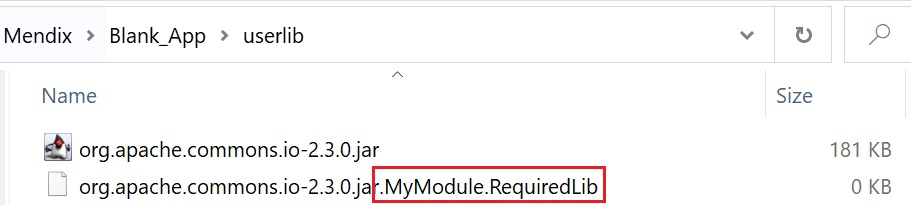
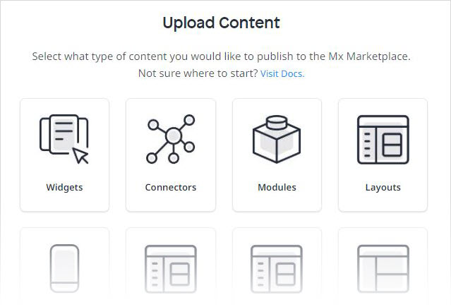
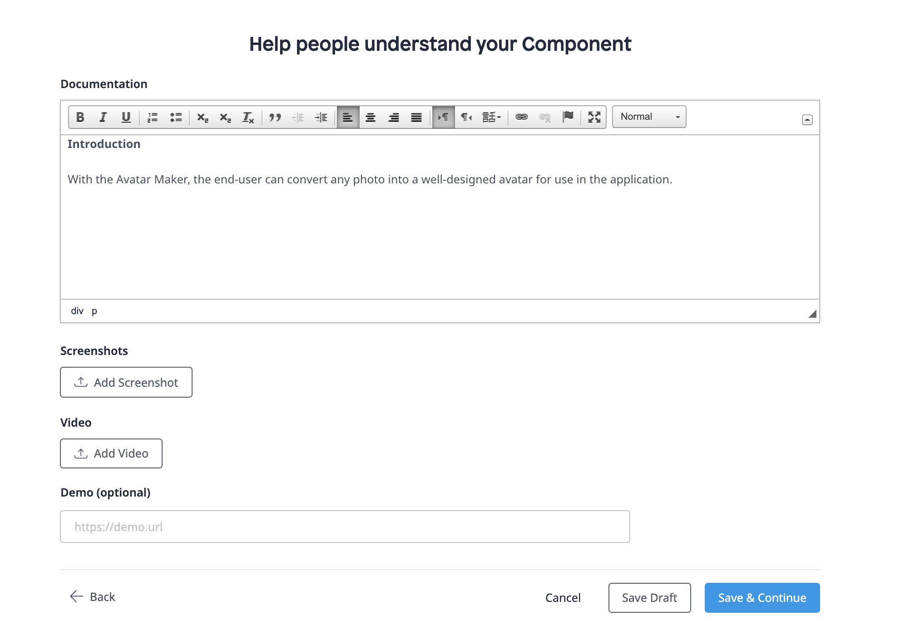
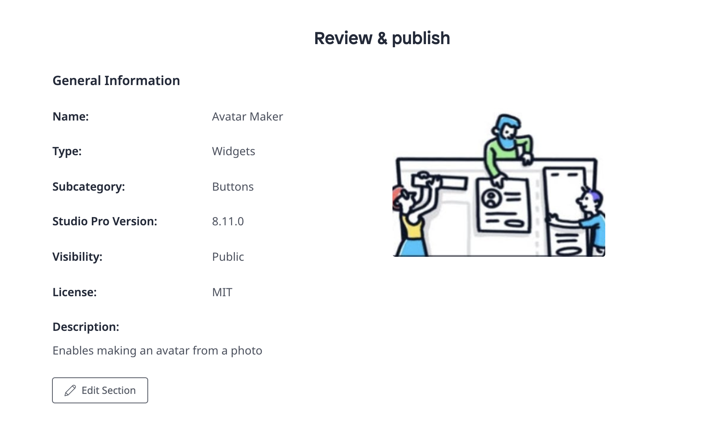

## 1 Introduction

The Mendix Marketplace is driven by contributions from members of the community who share the connectors, modules, and apps they have built with the Mendix Platform. This how-to shows how to add and update Marketplace content.

**This how-to will teach you how to do the following:**

* Add new content and promotions to share in the Marketplace
* Update existing Marketplace content

## 2 Prerequisites

Before starting this how-to, make sure you have completed the following prerequisites:

* Familiarize yourself with the [Marketplace Overview](app-store-overview) and [How to Use Marketplace Content in Studio Pro](app-store-content)

## 3 Marketplace Content Development Guidelines {#submission}

This section presents guidelines for developing content that you will submit to the Mendix Marketplace.

{}
Submitted Marketplace content will be reviewed within five working days.
{}

### 3.1 General Guidelines

These are some general guidelines for creating new Marketplace content:

* Set up a separate app to build and maintain your Marketplace component
* Use a relatively recent Mendix version when creating the item, not only the latest Mendix version
* Create multiple versions of your Marketplace component (for example, for Studio Pro 7 and 8 and Desktop Modeler 7)

You can add information the end-user should know to the component [Documentation](#doc) when you are adding the content to the Marketplace.

### 3.2 Widget Guidelines

To develop widgets and submit them to Marketplace, follow these guidelines:

* The widget should be [pluggable](/howto/extensibility/create-a-pluggable-widget-one)
* When writing variable and function names, use lowerCamelCase (for example, *mySecondVariable*)
* Add code comments
* Use descriptive variable and function names in both XML and JavaScript
* A function should not be more than 200 lines of code
* A function should only do one thing, and it should do it properly
* Use hooks and functional components over class components
* Use TypeScript over JavaScript
* Create test pages for mobile when content is made for mobile platforms

### 3.3 Module Guidelines

To develop modules and submit them to the Marketplace, follow these guidelines:

* Create a folder named **USE_ME** and add the microflows and pages that are relevant for the user
* Create an empty folder with the version number as its name, which will appear in Studio Pro's App Explorer
*  If you add any **userlib** .*jar* files, make sure they are accompanied by a blank **MyModule.RequiredLib** file so that users know where the .*jar* files come from

	

* Verify that the module's Java actions compile correctly (the easiest way to check is to create a deployment package, as it will clean the deployment folder and rebuild the app; for more information, see [Environments](/developerportal/deploy/environments))
* Reduce the use of layouts and use snippets instead, which will result in fewer module dependencies and will reduce the number of potential errors (for example, missing layouts)
* Implement [user roles](/refguide/user-roles) and [security](/refguide/security)
* Creating a new release or module export should be done while the security level of the app containing the module is set to **Production**
* The [status](/refguide/project-security#app-status) must be **Complete** for the following:
	* Page access
	* Microflow access
	* OData access
	* Entity access
	* Dataset access
* For example pages and microflows to be copied to another module, select the **Exclude from project** option for the document in order to encourage duplication and reduce dependency errors 
* Do not rename entities and attributes when creating new versions, as data in these entities will get lost (replacing an existing module is based on the entity names)
* The module should include the English language

## 4 Adding New Marketplace Content {#adding}

To add content to the Marketplace, follow these steps:

1.  Click **Add content** in the top-right corner of the Marketplace home screen:

	

2.  Select the category of content you would like to publish. The available types correspond to the content catalogs available on the [Marketplace home page](app-store-overview#home).

	

3.  Depending on the category you selected, you may be asked to select a sub-category for your component, for example:

	
	
4.  Select the location where you want to publish your component:

	* **Public Marketplace (all Mendix users)** – your component will be available to the Mendix community (this content will have to be reviewed and approved by Mendix before it is available)
	* **Private Marketplace (your company only)** – your content will receive the **Company only** label and be available only via your [Company Content](app-store-overview#company-content) page; selected private content of a user group can also be made available to [user group guests](app-store-overview#guests) for download; this content will not be reviewed by Mendix
	
	
	
	{}You can only set this in the initial version of your content. You cannot change this setting by updating the Marketplace component later.
	{}

5.  The **General** page will open, where you need to provide information about your component. The information you entered above is pre-filled on this page. Enter the following details: 
	a. Enter a **Name** for your component. 
	b. Enter a **Description** of your component (for example, "Node control is an native Android app that gives a system administrator access to the Mendix Cloud nodes being administered. From the app, the status of the different environments within a node can be monitored and an environment can be started or stopped."). 
	c. The **Category** you selected earlier will be listed here. You can change this if necessary. 
	
	{}You can only set this in the initial version of your content. You cannot change Category after inital version is published.
	{}

	d. Select the **Studio Pro Version** on which you built the content. 
	e. Select the type of **License** you want applied to your app (if applicable): 

	* [Apache V2](https://www.apache.org/licenses/LICENSE-2.0) 
	* [GNU General Public License, version 3](https://www.gnu.org/licenses/gpl-3.0.en.html) 
	* [Mendix EULA](https://www.mendix.com/terms-of-use/) 
	* [MindSphere Development License Agreement](https://siemens.mindsphere.io/en/terms) 
	* [MIT](https://opensource.org/licenses/MIT) 
	* SDISW Development License Agreement for Mendix Sample Apps EXTERNAL 
	* SDISW End-User License Agreement for Mendix Connectors and Widgets 
	* SDISW End-User License Agreement for Mendix Connectors and Widgets EXTERNAL 
	* SDISW End-User License Agreement for Mendix Sample Apps

	

6. Click **Upload an Image** to upload an icon for the component.
7.  On each page of the upload flow, click one of the following buttons:

	* **Save Draft** to save the details you have entered so far to the [Drafts](app-store-overview#my-content) page of your Marketplace (which you can access via the **My Drafts** button in the top-right of the page)
	* **Save & Continue** to go to the next page of the upload flow

8.  On the **Package** page, select your content source (note that if you are using **Solutions** category, you will not see the option to select your content source):
	
	* If you select **Select from GitHub**, follow the steps in the dialog box for copying the link of the release you want to import
		* To include the repo's *README.md* file on the component's [Documentation](#doc) tab, make sure you have checked the **Import Documentation** box 
		* When you are finished, click **OK**
	* If you select **Manual upload**, follow the steps in the dialog box for uploading the package source file
		* When you are finished, click **Save**

9.  If this is the first version of the component you are uploading, the number in the **Version** section of the **Package** page will be automatically set to **1.0.0**. Enter **Release Notes** for the component in the box provided describing what is new in that release.

	

10. On the **Enable** page, you can enter details on requirements and configuration for your component in the **Documentation**. Note that this documentation option is only available when the **Import Documentation** box has not been checked (on the **Package** page above). Follow the template for the recommended content:

	* You must fill out the following sections in order to submit your component:
		* An extended **Description** of the component
		* The **Typical usage scenario** for the component
		* The **Features and limitations** of the component
	* These sections are optional:
		* Any **Dependencies** (for example, the required Studio Pro version, modules, images, and styles)
		* The **Installation** steps and details
		* The **Configuration** steps and details
		* Any **Known bugs**
		* Any **Frequently asked questions**
		* Any **Compatability** steps and details

	The editor comes with a set of basic formatting tools, such as bold, bullet lists, and URL links.

	You can attach images to your documentation in one of two ways (uploaded images cannot be resized, but linked images can):

	* Drag the image from file explorer to the editor (this will upload your image)
	* Click the Image button in the editor tools and enter a URL which points to an image

11. Click **Add Screenshot** to select images of the component (especially for configuration) from your computer and upload them (this is required for submitting a new component):

	
	
	You can also optionally add a **Video** and **Demo**.
	
12. Finally, on the **Review & publish** page, you can review all the details of your component you entered so far and edit as necessary (via the **Edit Section** button) before clicking **Publish Content**.

	

After you click **Publish Content**, your draft will be reviewed by Mendix within approximately 5 working days before it is visible in the Marketplace.

{}
Review and approval by Mendix is required only for the first version of [Public Marketplace](#public-app-store) content. Subsequent versions of public content do not need review or approval by Mendix. [Private Marketplace](#private-app-store) content does not require any review or approval.
{}

## 5 Updating Existing Marketplace Content {#updating}

To update content that has already been published, follow these steps:

1.  Find the component by clicking **My Marketplace** and selecting one of the following:
	* **My Content**
	* **Company Content**
	* **User Groups** (note that if an existing Marketplace component is assigned to a [user group](app-store-overview#user-groups) as specific user group [content](app-store-overview#group-content), you can only update the component if you are a member of that group)
	
2.  Click **Manage** next to the component you want to update.

	{}Only one draft version of a component can exist at a time, so when one draft version is in progress, another draft cannot be started. If there is a draft version in progress, click **View draft** on the page where you manage the component in order to see the draft.
	{}

3. You can edit all component details, as described in the [Adding New Marketplace Content](#adding) section above.
4.  In the **Version** section of the **Package** page, update the **Major**, **Minor**, and **Patch** numbers so that the component is saved as a new version:

	* **Major update** – a large change (which will save the component from version 5.0 to version 6.0, for example)
	* **Minor update** – a medium-sized change (which will save the component from version 6.0.0 to version 6.1.0, for example)
	* **Patch** – a small change (which will save the component from 6.1.0 to 6.1.1, for example)

5.  On the **Publish** page, you can review all the details of your component you entered so far and edit as necessary (via the **Edit Section** button) before clicking **Publish Content**.

## 6 Read More

* [Marketplace Overview](app-store-overview)
* [How to Use Marketplace Content in Studio Pro](app-store-content)
