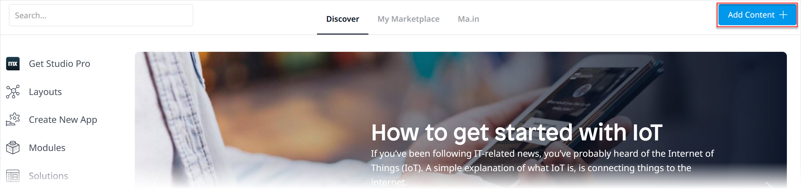
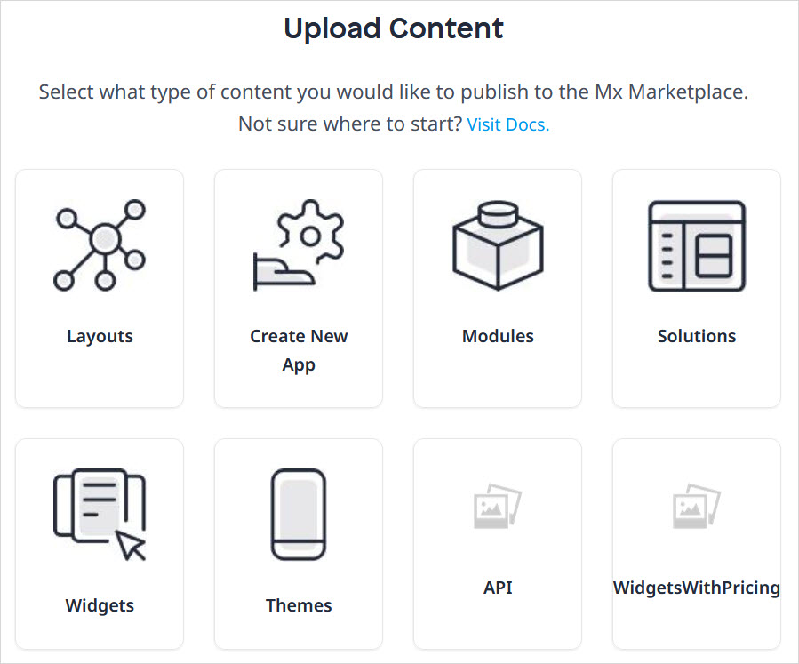
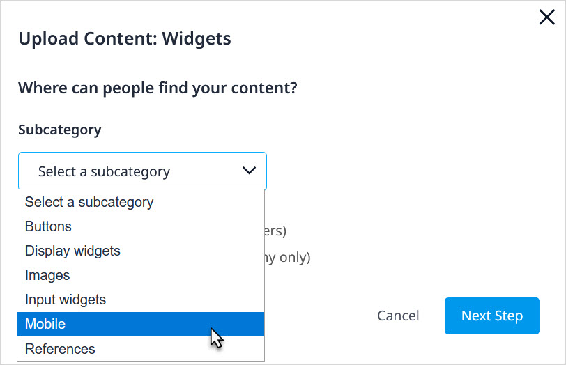
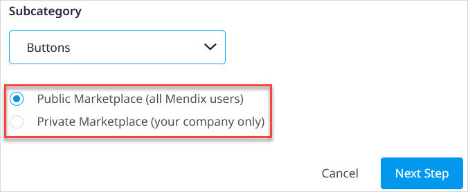
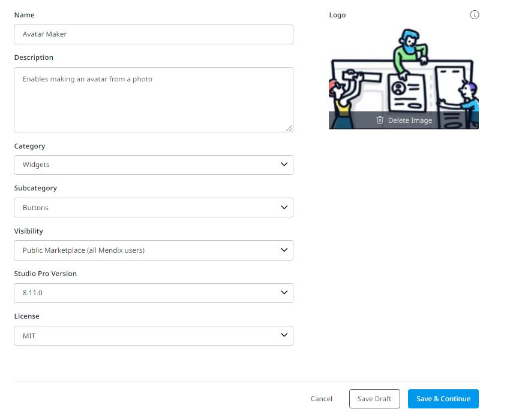
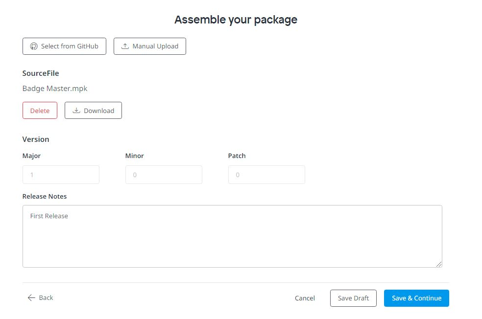
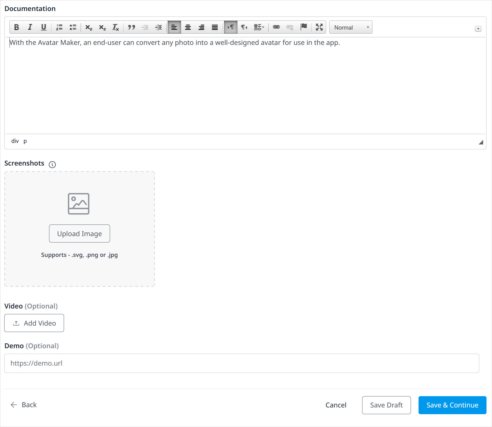
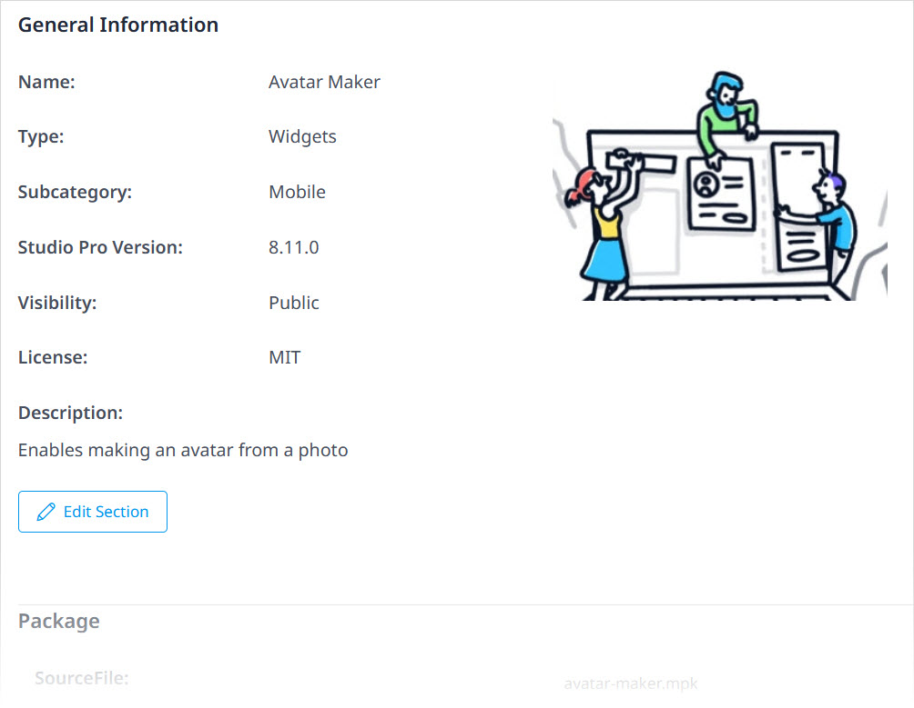

## 1 Introduction

The App Store is driven by contributions from members of the Mendix community who share the connectors, modules, and apps they have built. This how-to shows how to add and update App Store content.

**This how-to will teach you how to do the following:**

* Add new content and promotions to share in the App Store
* Update existing App Store content

## 2 Prerequisites

Before starting this how-to, make sure you have completed the following prerequisites:

* Familiarize yourself with the [App Store Overview](app-store-overview) and [How to Use App Store Content in Studio Pro](app-store-content)

## 3 App Store Content Development Guidelines {#submission}

This section presents guidelines for developing content that you will submit to the Mendix App Store.

{}
Submitted App Store content will be reviewed within five working days.
{}

### 3.1 General Guidelines

These are some general guidelines for creating new App Store content :

* Set up a separate project to build and maintain your App Store component
* Use a relatively recent Mendix version when creating the item, not only the latest Mendix version
* Create multiple versions of your App Store component (for example, for Studio Pro 8 and Desktop Modeler 7)

Any information the end-user should know about your content can be written on the [Documentation tab](#doc-tab) when you are adding the content to the App Store.

### 3.2 Widget Guidelines

To develop widgets and submit them to the App Store, follow these guidelines:

* The widget must be based on the [AppStoreBoilerplate](https://github.com/mendix/AppStoreWidgetBoilerplate)
* When writing variable and function names, use lowerCamelCase (for example, *mySecondVariable*)
* Add code comments
* Use descriptive variable and function names in both XML and JavaScript
* Always add `"use strict";` to functions
* A function may not be larger than 200 lines of code
* A function may only do one thing, and it should do it properly
* Internal variables should start with an underscore (`_`)
* Using the Dojo Toolkit and its functionalities is preferred, but for external plugins you can use jQuery
* Create a test project based on the [AppStoreBoilerplate](https://github.com/mendix/AppStoreWidgetBoilerplate)
* Create test pages for mobile when content is mobile-supported

### 3.3 Module Guidelines

To develop modules and submit them to the App Store, follow these guidelines:

* Create a folder named **USE_ME** and add the microflows and pages that are relevant for the user
* Create an empty folder with the version number as its name, which will appear in Studio Pro's Project Explorer
* If you add any userlib *jar* files, make sure they are accompanied by a *MyModule.RequiredLib* file so that users know where the *jar* files come from
* Verify that the module's Java actions compile correctly (the easiest way to check is to create a deployment package, as it will clean the deployment folder and rebuild the app; for more information, see [Create Deployment Package Dialog](/developerportal/deploy/environments) and [Environments](/developerportal/deploy/environments))
* Reduce the use of layouts – using snippets will result in fewer module dependencies and will reduce the number of potential errors (for example, missing layouts)
* User roles and security should be implemented 
* Creating a new release or module export should be done while the security level of the project containing the module is set to **Production**
* The module security status (in the **Project Security**) must be **complete** for the following:
	* Page access
	* Microflow access
	* OData access
	* Entity access
	* Dataset access
* For example pages and microflows to be copied to another module, they should be "excluded from project" in order to encourage duplication and reduce dependency errors 
* Do not rename entities and attributes when creating new versions, as data in these entities will get lost (replacing an existing module is based on the entity names)
* The module should include the English language

## 4 Adding New App Store Content {#adding}

To add content to the App Store, follow these steps:

1.  Click **Add content** in the top-right corner of the App Store home screen:

	

2.  Select the type of content you would like to publish. The categories available correspond to the content categories available on the [App Store homepage](app-store-overview#home):

	

3.  Depending on the category you selected, you may be asked to select a sub-category for your component, for example:

	
	
4.  Select the location where you want to publish your component:

	* **Public Marketplace (all Mendix users)** – your component will be available to the Mendix community (this content will have to be reviewed and approved by Mendix before it is available)
	* **Private Marketplace (your company only)** – your content will receive the **Company only** label and be available only via your [Company's App Store](app-store-overview#company-content); selected private content of a user group can also be made available to [user group guests](app-store-overview#guests) for download; this content will not be reviewed by Mendix
	
	
	
	{}You can only set this in the initial version of your content. You cannot change this setting by updating the App Store component later.
	{}

5.  The **General** page will open, where you need to provide information about your component. The information you entered above is pre-filled on this page. Enter the following details: 
	a. Enter a **Name** for your content. 
	b. Enter a **Description** of your content (for example, "Node control is an native Android app that gives a system administrator access to the Mendix Cloud nodes being administered. From the app, the status of the different environments within a node can be monitored and an environment can be started or stopped.") 
	c. Select the **Studio Pro Version** on which you built the content. 
	d. Select the type of **License** you want applied to your app (if applicable): 

	* [Apache V2](https://www.apache.org/licenses/LICENSE-2.0) 
	* [GNU General Public License, version 3](https://www.gnu.org/licenses/gpl-3.0.en.html) 
	* [Mendix EULA](https://www.mendix.com/terms-of-use/) 
	* [MindSphere Development License Agreement](https://siemens.mindsphere.io/en/terms) 
	* [MIT](https://opensource.org/licenses/MIT) 
	* [SDISW Development License Agreement for Mendix Sample Apps EXTERNAL](https://diswlogin.siemens.com/login?state=g6Fo2SBHWTQ5ZWdjLUs3Znpia3dDLXR5cXJpLTd6S0VrTmpuYaN0aWTZIEtmSzh0VHZIX3NTekVOSmJxYVMzUkpyczdIZ3RWQnVno2NpZNkgRGwzckYzM25QNXlUM3BmeUpjVmlVOUtoUmRkbGN5VDI&client=Dl3rF33nP5yT3pfyJcViU9KhRddlcyT2&protocol=samlp) 
	* [SDISW End-User License Agreement for Mendix Connectors and Widgets](https://download.industrysoftware.automation.siemens.com/download-n.php/teamcenter/product_updates/Tools/SDISW_End_User_License_Agreement_for_Mendix_Connectors_and_Widgets.pdf) 
	* [SDISW End-User License Agreement for Mendix Connectors and Widgets EXTERNAL](https://download.industrysoftware.automation.siemens.com/download-n.php/teamcenter/product_updates/Tools/SDISW_End_User_License_Agreement_for_Mendix_Connectors_and_Widgets_EXTERNAL.pdf) 
	* [SDISW End-User License Agreement for Mendix Sample Apps](https://download.industrysoftware.automation.siemens.com/download-n.php/teamcenter/product_updates/Tools/SDISW_End_User_License_Agreement_for_Mendix_Sample_Apps.pdf)

	You can request other license types to be added as **License** options by clicking the **Feedback** button on the right side of the App Store screen.
	
	{}[**MEETING: verify if clicking Feedback is still valid**]{}
	
	

6. Click **Upload an Image** to upload an icon for the component
7.  On each page of the upload flow, click one of the following buttons:

	* **Save Draft** to save the details you have entered so far as a draft to the [Drafts](app-store-overview#drafts) page of your App Store (which you can access via the **My Drafts** button in the top-right of the page and the )
	* **Save & Continue** to go to the next page of the upload flow

8.  On the **Package** page, select your content source:

	* If you need to click **Select from GitHub**, follow the steps on the dialog box for copying the link of the release you want to import
		* To include the repo's *README.md* file on the component's [Documentation](#doc-tab) tab, make sure you have checked the **Import Documentation** box 
		* When you are finished, click **OK**
	* If you need to click **Manual upload**, follow the steps on the dialog box for uploading the package source file
		* When you are finished, click **Save**
9.  If this is the first version of the component you are uploading, the version number in the **Version** section of the **Package** page will be automatically set to **1.0.0**. You can enter **Release Notes** for the component in the box provided describing what is new in that release.

	{}[**Verify step above for versioning**]{}
	
	

10. On the **Enable** page, you can enter details on requirements and configuration for your component in the **Documentation**. Note that this documentation option is only available when the **Import Documentation** box has not been checked. Follow the template for the recommended content:

	* The documentation template includes the following sections that you must fill out in order to submit your content:
		* An extended **Description** of the content
		* The **Typical usage scenario** for the content
		* The **Features and limitations** for the content
	* These sections are optional:
		* Any **Dependencies** (for example, the required Studio Pro version, modules, images, and styles)
		* The **Installation** steps and details
		* The **Configuration** steps and details
		* Any **Known bugs**
		* Any **Frequently Asked Questions**

	The editor comes with a set of basic formatting tools, such as bold, bullet lists, and URL links.

	You can attach images to your documentation in one of two ways (uploaded images cannot be resized, but linked images can):

	* Drag the image from file explorer to the editor (this will upload your image)
	* Click the Image button in the editor tools and enter a URL which points to an image

11. Click **Add Screenshot** to select images of the component (especially for configuration) from your computer and upload them (this is required for submitting a new component):

	
	
	{}[**Update screenshot for documentation box and add-options**]{}

12. Finally, on the **Publish** page, you can review all the details of your component you entered so far and edit as necessary (via the **Edit Section** button) before clicking **Publish Content**.

	

After you click **Publish Content**, your draft will be reviewed by Mendix within approximately 5 working days before it is visible in the App Store.

## 5 Updating Existing App Store Content {#updating}

{}
If an existing App Store component is assigned to a [user group](app-store-overview#user-groups) as specific user group [content](app-store-overview#content), you can only update the component if you are a member of that group.
{}

To update content that has already been published, follow these steps:

1.  Find the component you want to update by doing one of the following:
	* Clcik **My Marketplace** > [My Content](/appstore/general/app-store-overview#content) and then click **Manage** for the component to update
	* Go to the [component details](app-store-overview#details) page and click **Create new draft version**

	{}[**MEETING: "Create new draft version" button still available on component details page?; add screenshot**]{}

	{}Only one draft version of a component can exist at a time, so when one draft version is in progress, another draft cannot be started. If there is a draft version in progress, click **View draft** on the page where you manage the component in order to see the draft.
	{}

2. You can edit all component details, as described in the [Adding New App Store Content](#adding) section above.
3.  In the **Version** section of the **Package** page, update the **Major**, **Minor**, and **Patch** numbers so that the component is saved as a new version:

	* **Major update** – a large change (which will save the content from version 5.0 to version 6.0, for example)
	* **Minor update** – a medium-sized change (which will save the content from version 6.0.0 to version 6.1.0, for example)
	* **Patch** – a small change (which will save the content from 6.1.0 to 6.1.1, for example)

4.  On the **Publish** page, you can review all the details of your component you entered so far and edit as necessary (via the **Edit Section** button) before clicking **Publish Content**.

	{}[**PULL REQUEST: please verify steps above**]{}

## 6 Read More

* [App Store Overview](app-store-overview)
* [How to Use App Store Content in Studio Pro](app-store-content)
