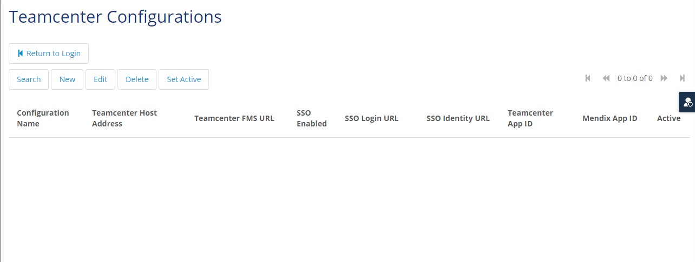
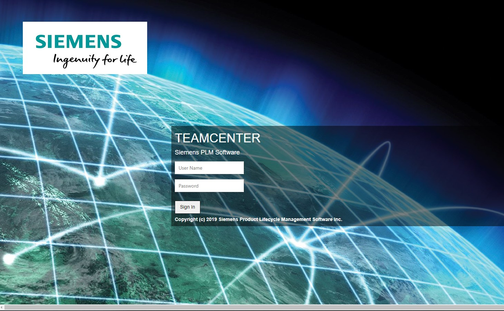
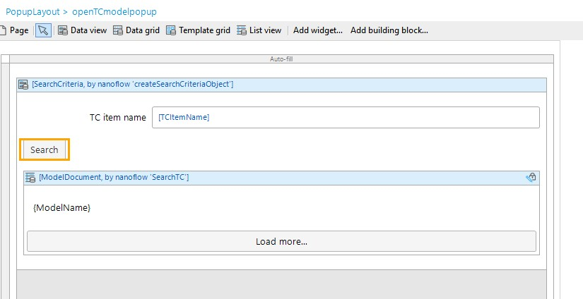
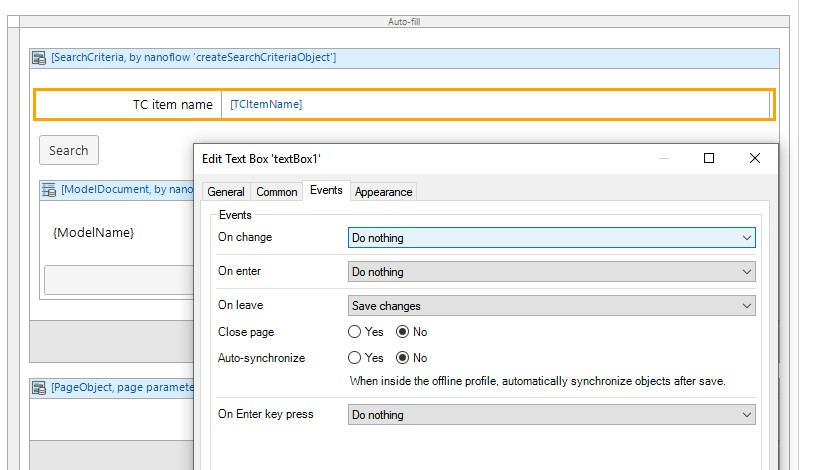

## 1 Introduction

The [3DViewerforTeamcenter-need update link](https://appstore.home.mendix.com/link/app114764/) module lets you connect to Teamcenter instance,visualize and operate on 3D domain models, nanoflows, micro-flows and nanoflow that enable you to get JT model fromTeamcenter.

### 1.1 Typical Use Cases

You can use this module along with **3DViewer** module when you want to get and visualize3D JT models that are stored in Teamcenter in your application, and perform some basic operations such us navigating model product structure tree, PMI Tree, sectioning and much more. Using this **3DViewerForTeamcenter** module alone won't be enough for visualize the model.

### 1.2 Features

The module enables you to do the following:

- Log in Teamcenter instance
- Get Models from Teamcenter by setting Revision Rules
- Visualize and perform operations on model when used with [**3DViewer** need update link() module

### 1.3 Dependencies

If you want to visualize models stored in Teamcenter, you will also need to import **Teamcenter** and **3DViewer** module:

- Teamcenter Connector module v2.1.0  is required for 3DViewer module to connect and loadmodel from Teamcenter: [Teamceneter Connector](https://appstore.home.mendix.com/link/app111627/)
- [3DViewer module(need to update link)](https://dxxxxx)

### 1.4 Limitations

To visualize model from Teamcenter, limitation is similar to that of **3DViewer**, please refer to [3DViewer limitations](3d-viewer.md#limitations)

## 2 Prerequisites

Before starting this how-to, make sure you have completed the following prerequisites:

- Download Teamcenter Connector 2.1.0 module from Mendix App Store
- Download 3DViewer module from Mendix App Store
- Download 3DViewerForTeamcenter module from Mendix App Store
- An existing Teamcenter instance (Teamcenter host address, Teamcenter FMS URL are needed to configure the Teamcenter instance)
- Teamcenter account

## 3 Installation

If you app does not have the **3DViewerForTeamcenter** module, it is available from the Mendix App Store [here](httpt://w). Follow the instructions in [How to Use App StoreContent in Studio Pro](https://docs.mendix.com/appstore/general/app-store-content) to import it into your app.

1. Download and import the **3DViewer** module into your app project.
2. Download **Teamcenter Connector** module v2.1.0 and import into your app project
3. Download **3DViewerForTeamcenter** module and import into your app project
4. Map 'Administrator' and 'User' module role of installed modules to the applicable user roles in your app.

## 4 Configuration

### 4.1 Initializing on App Startup

To automatically start this  module, create a **Startup** microflow, add **Viewer3D/USE_ME/VisServerAction** and **Viewer3D_TC/USE_ME/VisServerAction_TC** java action to the microflow, set return type as Boolean ,value as true. This **Startup** microflow needs to be set as the startup microflow (via **Project** >**Settings** > **Server** > **After startup**).

## 6 Using 3DViewerForTeamcenter

**3DViewer** provides a set of widgets to visualize JT models and a set of nanoflows, java actions to bring in the data.
While **3DViewerForTeamcenter** acts as an add-on to the **3DViewer** module, it mainly provides nanoflows, java actions, microflows to get JT data from Teamcenter instance.
To view the JT model from Teamcenter, use 3D widgets brought by **3DViewer** module to visualize the data obtained from**3DViewerForTeamcenter** is the approach.  

### 6.1 Reuse Teamcenter Login APIs to get access to Teamcenter instance data

To get data from Teamcenter, user needs to be authenticated and authorized. **Teamcenter connector** module provides both Admin Login logic and User login logic for app makers. Since we are building app to enable user to fetch data from Teamcenter and visualize it in the app. We will need to build a login for user, so that user can input their Teamcenter username and password to access Teamcenter data.

Follow these steps:

1. Add a **Login** button to the page.
2. Set the **OnClick** action to `TcConnector/Published/APIs/Login/ExexuteAdminLogin`
3. Run locally, when you click **Login**, you will be shown Teamcenter Admin page where you can manage Teamcenter instance that you want to connect to by provide `Teamcenter host address`, `Teamcenter FMS URL` and set it `Active`.

4. Return to `Login`, you will be able to enter your Teamcenter Account Login

This is a demo flow.There are other Teamcenter Login APIs provided in **TcConnector/Published/APIs/Login*, you can choose which to use based on your need.

### 6.2 Search Teamcenter item name and get a list of model

`SearchTC` nanoflow in **3DViewerForTeamcenter** module enables you to fetch model list by setting search criteria. A list of `ModelDocument` object will be returned as a result, which can be set as data source of a **ListView** widget. `SearchTC` nanoflow will first see if an active Teamcenter user session is alive, and then perform the search, so Login is essential before performing the model search. Additionally, by using **3dViewer_TC/USER_ME/SetRevisionRule**, you can apply specific Revision Rules to the search, and get different sets of model list returned.

Follow these steps:

1. Create a "Open TC model" button and add to page.
2. Set `On Click` action of button to show a pop up page.
3. Add a **ListView** widget to the page, set the Data Source as **Viewer3D_TC/USE_ME/SearchTC**.
4. Wrap **ListView** with a **Data View** widget as **SearchTC** nanoflow requires a **SearchCriteria** as input parameter. Set the Data Source of **Data View** to a simple **cerateSearchCriteria** object creation nanoflow.
5. Add search text box and search button to allow user to type in item name and perform search.

6. To achieve showing model list on **Search** button click, input parameter of **SearchTC** nanoflow `SearchCriteria` needs to be updated on button click, so when user type in model name in text box, the model name should be saved to `TCItemName` attribute of `SearchCriteria`.

and when user click on **Search** button, the change need to be synchronized for list view to refresh the list. 

1. Copy **GetModelList** nanoflow to your app module.  Depending on where you want to pull model from, you can customize the input parameter `SourceType`.
2. Add a popup page to display modellist on button click or other event of your choice.
3.  Place a **ListView** widget in Popup page, set nanoflow **GetModeList** as Data Source

### 6.3

### 6.4 Open Model from Model list

Now that you are able to get a list of model and also delete them, you also want to click on a model in the model list and visualize it.
As Viewer Widget need `Model ID` and `Model Source Type` to visualize a model, you will need to pass at least these two value from `ModelDocuement` to the Viewer Widget

