## 1 Introduction

The 3D Viewer for Teamcenter app service lets you connect to a Teamcenter instance and then visualize and operate on 3D JT models. It provides nanoflows and microflows that enable you to find and fetch a JT model from Teamcenter.

### 1.1 Typical Use Cases

You can use this app service to search and fetch JT models that are stored in a Teamcenter instance and use [3D Viewer](3d-viewer) widgets to visualize the fetched models. Once a model is fetched, you can perform some basic operations, such us navigating the model product structure tree and PMI tree, sectioning, and many more operations enabled by the 3D Viewer out-of-the-box tools. 

{}
Using this app service alone will not be enough to visualize a 3D model.
{}

### 1.2 Features

This app servcice enables doing the following:

* Log in to a Teamcenter instance
* Search  models from Teamcenter
* Get a model by setting revision rules
* Visualize and perform operations on model when used with 3D Viewer app service

### 1.3 Dependencies

If you want to visualize models stored in Teamcenter, you will also need to import the following components into your app project:

* [3D Viewer](3d-viewer) app service – this component provides out-of-the-box widgets and the domain model entities needed to visualize a JT model
* [Teamcenter](https://appstore.home.mendix.com/link/app/111627/) connector – this component is required for the 3D Viewer app service to connect and load the model from Teamcenter

### 1.4 Limitations

To visualize a model from Teamcenter, the limitations are similar to those of 3D Viewer. For details, see the [Limitations](3d-viewer#limitations) section of *3D Viewer*.

## 2 Prerequisites

Make sure you have the following prerequisites:

* [Studio Pro 8.13.1](https://appstore.home.mendix.com/link/modelers/) or above installed
* A living Teamcenter instance (need `Teamcenter host address` and `Teamcenter FMS url` to configure the Teamcenter instance)
* A Teamcenter account (it is better to have both an admin user account and a non-admin user account)

## 3 Installation

To visualize a model fetched from a Teamcenter instance, you need to import the components below into your app project. Follow the instructions in [How to Use App Store Content in Studio Pro](../general/app-store-content) to import these components:

* 3D Viewer for Teamcenter
* [3D Viewer](3d-viewer) app service
* [Teamcenter](https://appstore.home.mendix.com/link/app/111627/) connector (v2.1.0 or above) 

After importing, you need map the **Administrator** and **User** [module roles](/refguide/module-security#module-role) of the installed components to the applicable [user roles](/refguide/user-roles) in your app.

## 4 Initializing on App Startup

To automatically start this app service, create a **Startup** microflow, add **Viewer3D/USE_ME/VisServerAction** and **Viewer3D_TC/USE_ME/VisServerAction_TC** Java actions to the microflow, then set the return type as Boolean with a **Value** of **true**.

You need to set this microflow as the after-startup step via **Project Settings** > **Runtime** > **After startup**.

Finally, double-click the **Visualization Server** Java action and make sure **Http endpoint** is set as `@Viewer3D.HttpEndpoint`:

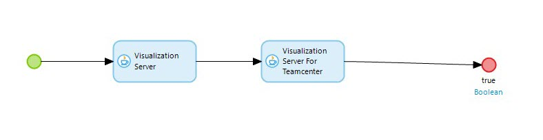

## 5 Using 3D Viewer For Teamcenter

The 3D Viewer app service provides a set of widgets to visualize JT models as well as a set of nanoflows and Java actions to bring in the data stored in Mendix file storage. Meanwhile, the Teamcenter connector module provides full-scale APIs for you to interact with a Teamcenter instance.  

The 3D Viewer for Teamcenter app service acts as an intermediate layer between the two components above. It mainly utilizes the APIs provided by the Teamcenter connector and provides nanoflows, Java actions, and microflows to get JT-format model data from the Teamcenter instance.  

To visualize and operate on the JT model from Teamcenter, use the 3D widgets that are included in the 3D Viewer app service to visualize the data obtained from the 3D Viewer for Teamcenter.

### 5.1 Reusing Teamcenter Login APIs to Get Access to Teamcenter Instance Data

To get data from Teamcenter, the end-user needs to be authenticated and authorized. The Teamcenter connector provides both admin login logic and user login logic in the **App Store Modules** > **TcConnector** > **Published** > **APIs** > **Login** folder. Since you are building an app to enable the end-user to fetch data from Teamcenter and visualize it in the app, you will need to build a login for the end-user so that they can enter their Teamcenter user name and password to access the Teamcenter data.

Follow these steps to build this login:

1. Add a **Login** [button](/refguide/button-widgets) to a page in your app.
2. Set the **On click** action to the **TcConnector** > **Published** > **APIs** > **Login** > **ExexuteAdminLogin** microflow.
3.  Run your app locally. When you click **Login**, you will be shown the Teamcenter Admin page where you can add, edit, and manage the Teamcenter instance that you want to connect to by providing the **Teamcenter Host Address** and **Teamcenter FMS URL** and set the instance to **Active**:

 
 
4.  Return to THE **Login**, where you can enter your Teamcenter account to log in to the Teamcenter instance that you configured and set to active:

 

{}
The above is an example Teamcenter login flow. There are other Teamcenter login APIs provided in **TcConnector** > **Published** > **APIs** > **Login**, and you can choose how to use them based on your needs.
{}

### 5.2 Getting a List of Corresponding Models from Teamcenter

The **SearchTC** nanoflow in the 3D Viewer For Teamcenter app service enables setting search criteria and fetching a model list. This nanoflow will first check if an active Teamcenter user session is live and then perform the search, so logging in is essential before performing the model search. A list of **ModelDocument** objects will be returned as a result of this nanoflow; therefore, the nanoflow can be set as the data source of a [list view](/refguide/list-view). Additionally, by using **3dViewer_TC** > **USER_ME** > **SetRevisionRule**, you can apply specific revision rules to the search and get different model data returned.

Follow these steps to get the list:

1. Create an **Open TC model** button and add to page.
2. Set **On Click** action of the button to show a pop up page.
3. Add a **ListView** widget to the pop up page, set the Data Source as **Viewer3D_TC/USE_ME/SearchTC**.
4. Wrap **ListView** with a **Data View** widget, as **SearchTC** nanoflow requires a **SearchCriteria** object as input parameter. Create a simple nanoflow **cerateSearchCriteria** which create a default **SearchCriteria** object and returns it as result. Set the Data Source of **Data View** to **cerateSearchCriteria** nanoflow.
5. Add search text box and search button to allow user to type in item name(model name) and perform search.

6. To achieve showing model list on **Search** button click, input parameter of **SearchTC** nanoflow **SearchCriteria** object needs to be updated on button click, so when user type in model name in text box, the model name should be saved to `TCItemName` attribute of **SearchCriteria** object.

and when user click on **Search** button, the change needs to be synchronized for List view widget to refresh the list. 
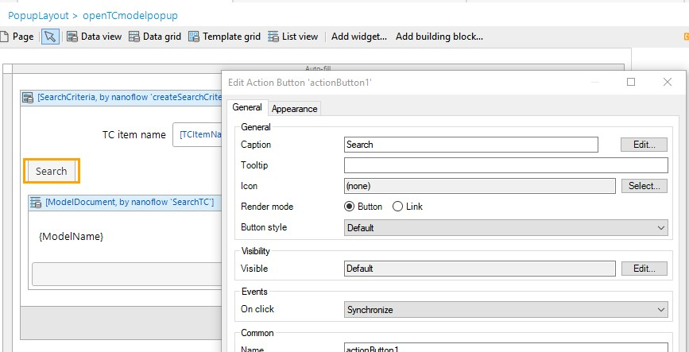

7. In the console, there's error saying that `Pagination` and `TCModelParamArray` parameters are missing for **SearchTC** nanoflow input, you need to fix this. `Pagination` is an entity defined in **Viewer3D/Domain Model**, by setting values of its attribute, you can get a paginated model list. Now let's just use the default setting, which is all in one page.  
 `TCModelParamArray` is an entity defined in **Viewer3D_TC/Domain Model**, it defines a set of attributes where you can set revision rule  and return different model data based on these revision rules. Now let's just use its default revision rule.  
Since we are missing these two input parameters for **SearchTC** nanoflow, we can wrap it with two **DataView** widgets, with **Data View** have nanoflow that returns `Pagination` object and `TCModelParamArray` object set as data source, respectively.
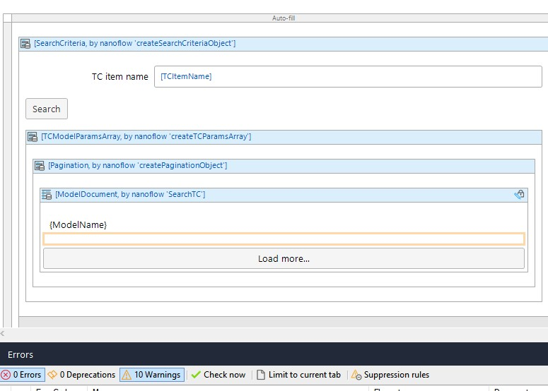  
Run locally, Login TC and then Open TC Model pop up, try to type in a item name (model name) and search, you will see a list of model that contain the entered item name.
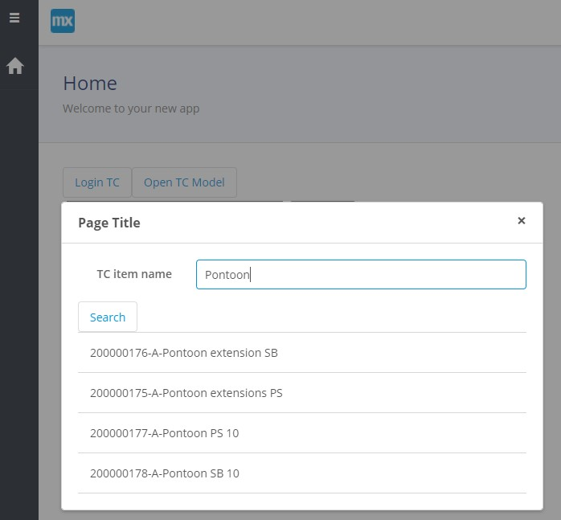

### 5.3 Open Model from Model list

Now that you are able to get a list of model, you may want to visualize these models, for models to be visualized, it needs 3D widgets that are part of 3D Viewer module.  `ModelDocument` object contains attributes (most importantly, `ModelId` and `Model Source Type`) that are needed to identify and visualize a model in 3D widgets.
As Viewer Widget needs `Model ID` and `Model Source Type` to visualize a model, you will need to pass `ModelDocument` object to the Viewer Widget.

Since you've built a model list pop up, one scenario is to click to select a list item on pop up page, return the **ModelDocument** object to home page to be visualized there.

Follow these steps:

1. Add an entity `PageObject`, associate it with `ModelDocument` entity that is defined in **Viewer3D/Domain Model**.
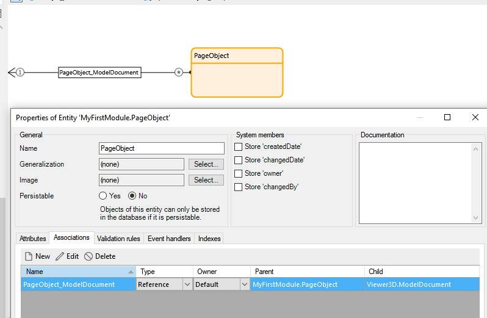
2. On home page, wrap main area with a **Data view** widget, create a **createPageObject** nanoflow which creates a default `PageObject` object and returns it. Set this nanoflow as data source of the Data View widget.
3. On home page, add another **Data View** widget within previous **Data View** widget, set the data source type of the new Data View widget to `context`, this way you can access to the `ModelDocument` object associated with `PageObject`.
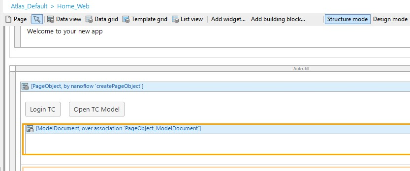

4. Find 3D widgets in toolbox, add to the inner **Data View** widget. Now you can access and set the `ModelId` and `Model Source Type` the Viewer widget needs.
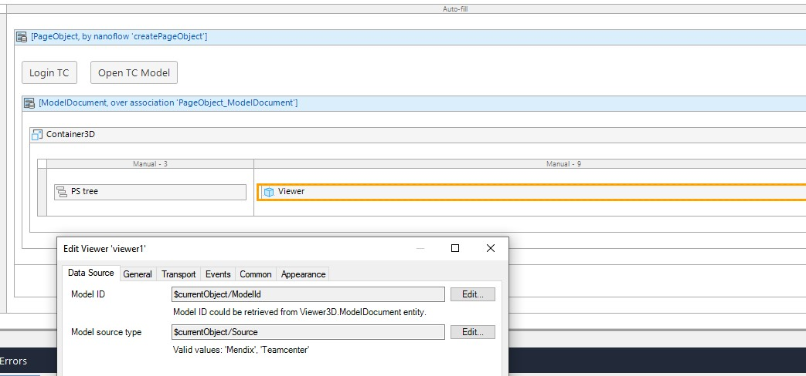  
5. On Open TC model popup page, add an outmost **Data view** widget, select `context` as its data source type, and select `PageObject`.
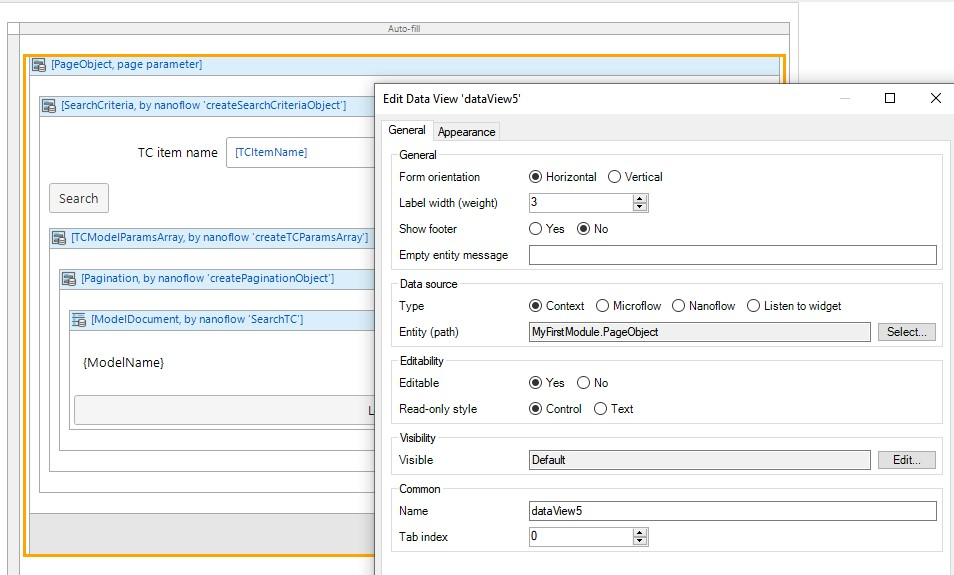
6. Create a **OpenSelectedModel** nanoflow and set it as On Click action of List View.  This nanoflow enables update `ModelDocument` associated with `PageObject` and returns updated `PageObject`. Every time user click on a model list item, `PageObject` will be updated, homepage where viewer is in will be updated to newly selected model.
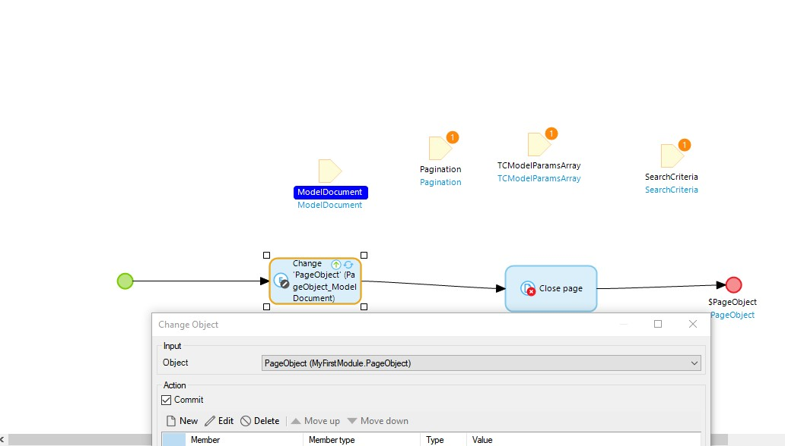

Run locally, you will be able to view the selected model.

There are other ways to visualize a model. Key idea is to pass valid `ModelId` and `Model Source Type` to the **Viewer** widget.

### 5.4  Set custom Revision Rules

**SearchTC** requires a **TCModelParamsArray** object as input parameter, it allows you to set specific revision rules you want to apply to a model and get the model data based on revision rules. If **TCModelParamsArray** is not specifically set, **SearchTC** will execute with default revision rules.

Follow these steps:

1. Add a **Set revision rule** button to list item 
2. Set nanoflow **Viewer3D_TC/USE_ME/SetRevisionRules** as button's On Click action 
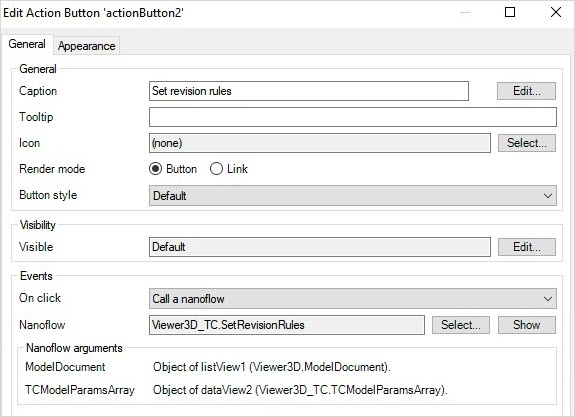

Run locally, you will be able to set  revision rule on the selected model and fetch model with needed information.
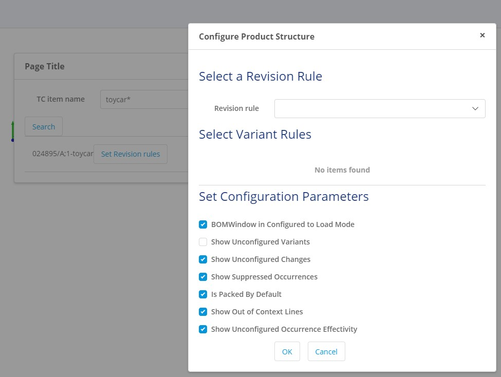
