        ---
        title: "3DViewer"
        #category: "Modules"
        #parent: "Enter the parent document filename of this document if necessary (for example, "design-the-architecture"); if there is a category, remove this parent line"
        #menu_order: Enter the position of the document in the category or under the parent; number by 10 (for first), 20, 30, etc. for easy ordering of other documents in the future if necessary; don't add brackets or quotation marks; if no number is added, the system will add an extremely high number to order the documents, which means that if you only want a document to appear at the top, you only have to add "10" to that specific document, you don't have to order all the other documents in the category/under the parent
        #description: "3D Visualization provides a viewing capability of JT models with flexible combination of 3D Visualization Widgets. You can view and operate the model, list model product structure tree, and take advanced operations like make measurement and sectioning in the 3D Visualization Widgets."
        #tags: ["3DVisualization", "CAD", "app store", "app store component", "platform support"]
        ---

 ## 1 Introduction

The [3DViewer（need update）](https://appstore.home.mendix.com/link/app/114764/) module  let you upload, visualize and operate on 3D JT files in your web applications. The module contains Java actions, JavaScript actions, domain models, nanoflows, micro-flows and a set of 3D widgets that enable you build app to work with 3D models (JT format ) . The module include whole functionalities and integrations that can be very helpful when you are building your own 3D applications. All you need to do is drag and drop items and configure them. This module does the heavylifting job for you so you don't have to build from scratch. 

### 1.1 Typical Use Cases

You can use the module when you want to upload, store and visualize 3D JT models in your application, and perform some basic operations such us navigating model product structure tree, PMI Tre, sectioning.

### 1.2 Features

 The module enables you to do the following:

- Display JT files
- Quick intuitive controls to navigate a product structure
- Zoom, rotate, fit all
- Ability to turn parts on and off
- Display PMI
- Ability to select and deselect parts
- Display Model Views
- Loading models from Mendix File Storage
- Display part/assembly properties
- Create 3D cross sections
- Examine your model from preset viewing angles
  
### 1.3 Limitations

- **Container3D** widget acts as a context sharing container for other 3D widgets, therefore every other 3D widgets need to be put inside **Container3D** widget.
- One **Container3D** widget can only contain one **Viewer**widget
- Only JT models with version starting from 9 are supported.

## 2 Installation

If your app does not have the **3DViewer** module, it isavailable from the Mendix App Store [need update](httpt://w).Follow the instructions in [How to Use App Store Content inStudio Pro](https://docs.mendix.com/appstore/generalapp-store-content) to import it into your app.

1. Import the 3DViewer module into your app project.
2. Map 'Administrator' and 'User' module role of installedmodules to the applicable user roles in your app.

## 4 Configuration

### 4.1 Initializing the 3DViewer Module on App Startup

To automatically start this  module, create a **Startup** microflow, the **Viewer3D/USE_ME/VisServerAction** java action to the microflow, set return type as Boolean ,value as true.**Startup** microflow needs to be set as the startup microflow(via **Project** > **Settings** > **Server** > **Afterstartup**).
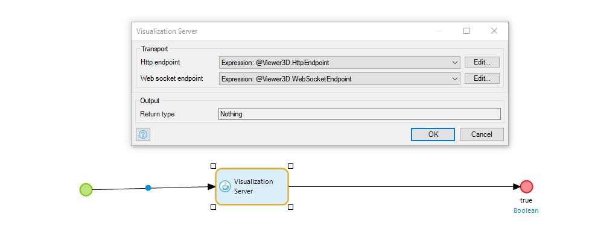
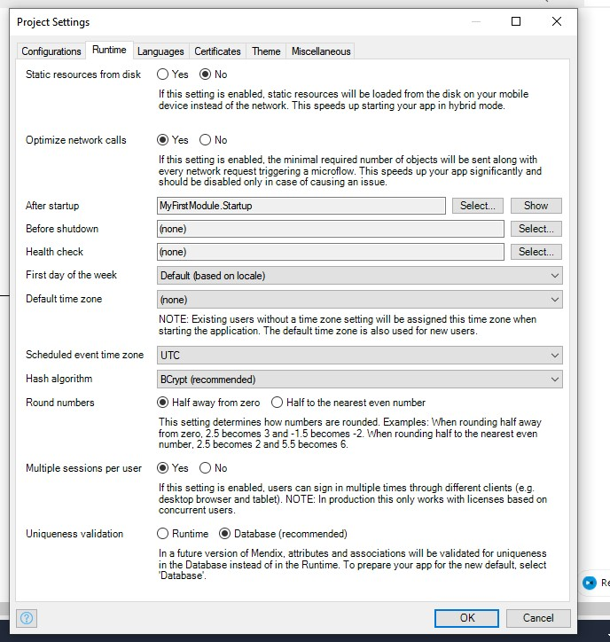
More details on After Startup can be found [here](.project-settings.md#after-startup).

## 5 3D Widgets

These are the widgets include in this module along with linksto their configuration details. For more details, please see[3DViewer widgets]
| Widget                                          | Description                                                                                                                                                                                   |
| ----------------------------------------------- | --------------------------------------------------------------------------------------------------------------------------------------------------------------------------------------------- |
| Container3D                    | A special container widget that provides shared context for other 3DViewer widgets        |                                                                                                  
| PMI Tree                         | Provides hierarchical tree display of a model's product manufacturing information, model views and design groups.                                                                             |
| PS Tree                         | Provides hierarchical classification of the items which form a product.                                                                                                                        |
| PS Tree Table                    | A configurable tree table to display attributes of your choice.                                                                                                                                 |
| Sectioning                     | Provides default animations for contents and widgets.                                                                                                                                           |
| Tool bar item camera mode    | Provides ability to control the apperance of surface objects displayedin the view, The option determine whether surface objects are represented on the display by facet geometry, edge geometry |
| Tool bar item camera orientation | Provides default animations for contents andwidgets.                                                                                                                                           |
| Tool bar item explode slider   | The explode slider allows you to create an exploded view of yourassembly                                                                                                                       |
| Tool bar item fit all                                                                                               |
| Tool bar item render mode     | Provides default animations for contents and widgets.                                                                                                                                           |
| Tool bar item selection mode    | Provides capability to select on model part, edge, face,body.                                                                                                                                  |
| Uploader                       | Enable suser to upload their own model to be viewed in browser or the app.                                                                                                                      |
| Viewer                         | Providesviewing window of your 3D Model when you open a model, zoom or rotate                                                                                                                  |

## 6 Using 3DViewer

3DViewer mainly provides a set of widgets to visualize JT models and a set of nanoflows, java actions to bring in the data.
Given that you start from a blank app template in Mendix Studio Pro, you can follow the instructions below to visualize your local JT file quickly.

### 6.1.1 To upload 3D JT model in browser and view right away

For Viewer widget to visualize a JT model, data source shouldbe setL `Model ID` and `Model Souce Type`. To enable upload 3DJT model and visualize directly on the page, a set of `ModelID` and `Model source type` should be returned by **Uploader** widget and set to **Viewer** widget.  

Follow these steps:

1. Place a **Container3D** widget on a page.
2. Put **Uploader** widget and **Viewer** widget into **Container3D** widget, give them a layout.
3. Set height of **Viewer** widget. Toggle to Design mode to see the preview.
4. Create an entity called **UploadedModel** in app module Domain Model.
5. Wrap **Uploader** widget and **Viewer** widget inside a new **DataView** widget.
6. Create a nanoflow **CreatedUploadedModel** and set this as data source of **DataView**.
7. Create two attributes for **UploadedModel** entity. set them to receive value returned from **Uploader**'s `Data source` and `UploadModelId`  respectively.
 
8. Set Data Source of **Viewer** widget: `Model ID` and `ModelSouce Type`.

9. Set the `Automatically load parts` to `Yes`  

Run Locally, you can now upload JT file and view directly inthe browser.
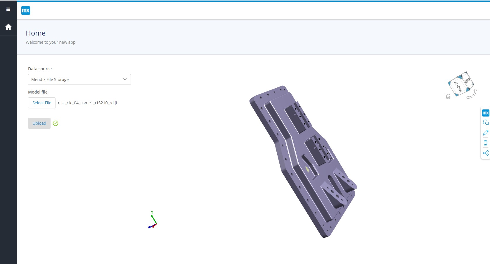

### 6.1.2 Display model loading progress with Mendix native**Progress Bar** widget

While you are uploading or loading a model, you may want toknow the uploading and loading progress information.  
To get uploading progress: in **Uploader** widget property,uploading progress can be obtained via `Progress percentage`:
  
To get loading progress: in **Viewer**widget property, loadingprogress can be obtained via `Progress status` and `Progresspercentage`.  
Follow these steps to display model loading progress:

1. Create an entity `PageObject`, add a `Decimal` typeattribute `LoadingProgress` with default value = 0, as**Progress bar** widget expects a decimal value.
2. Create a nanoflow called `createPageObject`, return`PageObject`
3. Wrap **Container3D** with a Data view, set the Data Sourceof the Data view widget to `createPageObject` nanoflow. 
4. Set the value of attribute `LoadingProgress` by setting the`Progress percentage` in **Viewer** widget property.
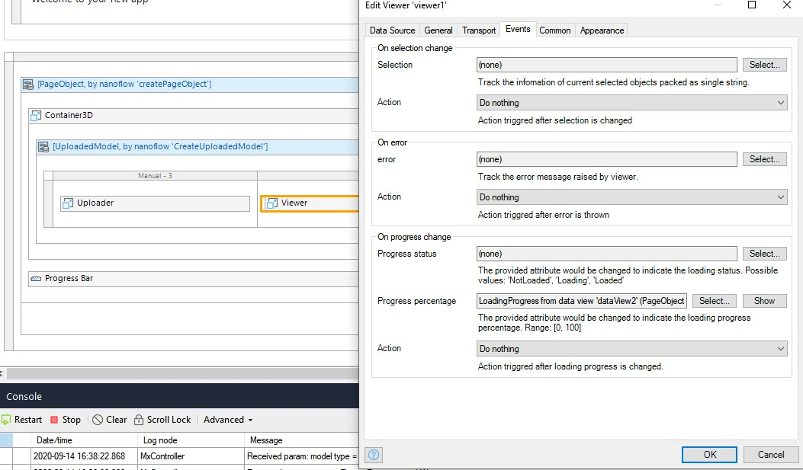
5. Add **Progress Bar** to the page, set  `PageObjectLoadingProgress` as the `Progress Attribute`.
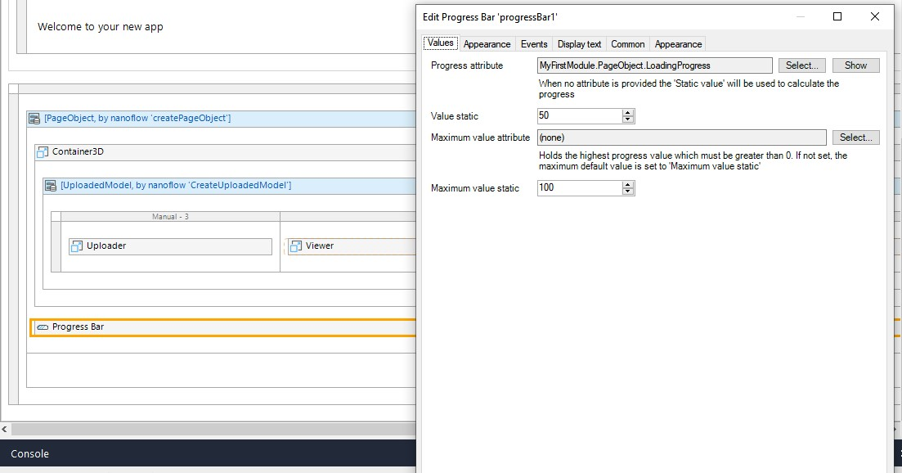  
Run locally, you will be able to see real-time model loading progress.
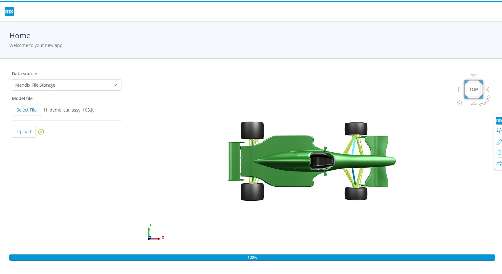

To display upload loading progress, the approach is similar.

6.1.3  More 3D functionalities

Add more 3D widgets to the page to enable more 3D functionalities, you can arrange the layout of them as to your preference. For example:
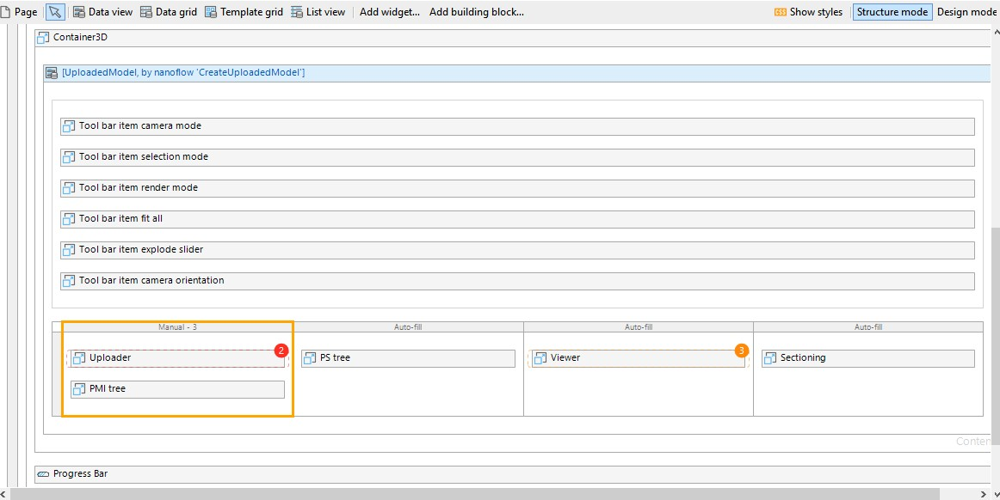
In design mode,
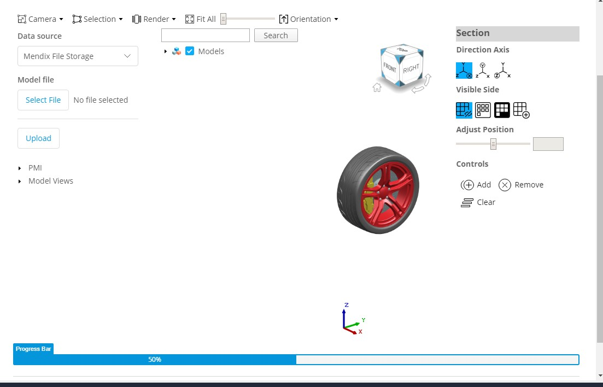

### 6.2 Manage uploaded models

In previous use case, you can only visualize the model you upload.
Usually you will also need to manage the models that are uploaded and stored in the data storage. 3DViewer provides **GetModelList** and **DeleteModel** nanoflows to help youbuild model data management functionality into your app.

### 6.2.1 Build model list

Mendix native **ListView** can be used to display the model list.

Follow these steps:

1. Use **View3D/USER_ME/GetModelListFromMendix**  nanoflow or copy it to your app module. A list of `ModelDocument` objects will be returned after calling the nanoflow.
2. Add a popup page to display model list on button click or other event of your choice.
3. Place a **ListView** widget in Popup page, set nanoflow **GetModelListFromMendix** as Data Source.
4. As **GetModelListFromMendix** requires a `Pagination` parameter input, wrap the **ListView** widget with a **DataView** widget, set **CreatePaginationObjecy** as its data source.0
5. Fill in the list item with the information you are interested in.

### 6.2.2 Open Model from Model list

Once you have the model list, you may want to select from the list and view the model. As **Viewer** widget expects `ModelId` and `Model Source Type`  to visualize a model, such information of selected model need to be passed to the **Viewer** widget.  Since each list item is a `ModelDocument` object and this object contains various information of the selected model, including `ModelId` and `Model Source Type`,  pass this object to **Viewer** widget.

Follow these steps:

1. Define `On click` action of List View so as to pass selected model to viewer widget that is present in another page, thus selected model can be loaded into the viewer. An example approach is to create an entity that is associated with `ModelDocument` entity defined in Viewer3D module Domain Model. Make the object a shared object between the page viewer is in and the model list page. In this example, `PageObject`:  
Home page:  
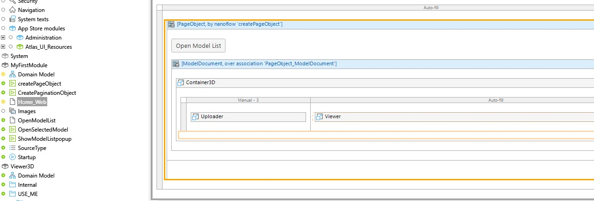
Open Model Popup page:  

2. OnClick of model list item, change the `ModelDocument` object `PageObject` is associated with, return the value so that Home page can be refreshed on PageObject change.
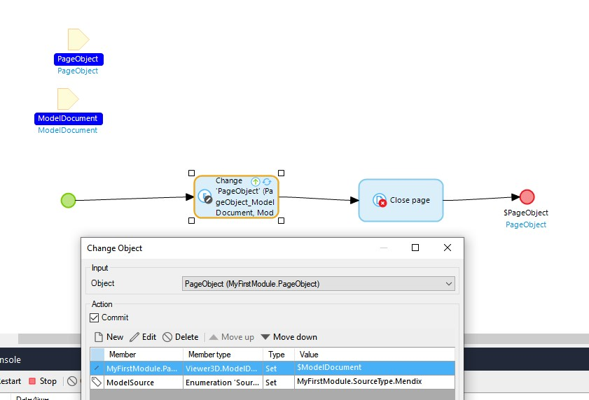

Run locally, you will get a simple model list, where you select which model to open:
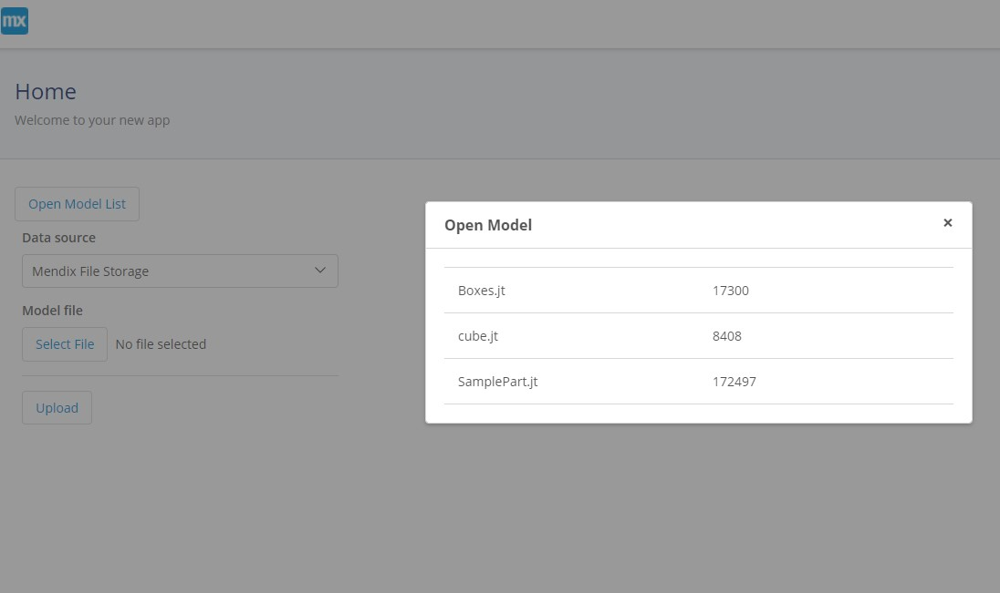

### 6.2.3 Delete model

There might be some models that you don't want in the database.You can delete them too. 3DViewer module provides **DeleteModelFromMendix** microflow to achieve this.

Follow these steps to delete model from model list:

1. Use  **Viewer3D/USE_M3/DeleteModelFromMendix** microflow directly or copy it to your app module.
2. For model list item, add a **Delete** button
3. Create a nanoflow **DeleteModel**, set `ModelDocument` as parameter, call **Viewer3D/USE_M3/DeleteModelFromMendix** microflow and commit the `ModelDocument`.

4. Set `On click` event of **Delete** button to **DeleteModel** nanoflow.

Now you are able to get a list of model, select on list item to open a model and delete model.

### 6.3 Handle Viewer events

Multiple events can be picked up by Viewer widget and can used to build your customized event handling logic.
Mainly 3 types of events can be picked on Viewer Widget:
**On Selection Change**:By selecting one attribute to set SelectionSet, you can get information of selected part.  
**OnError**: By selecting one attribute to set OnError event, you can pick up error exposed by Viewer.  
**On Progress Change**: By selecting one attribute to setProgress value to, you can get the current loading status and loading percentage of model, product structure tree, PMI tree.

## 7. Load and visualize model from Teamcenter

JT models from other data sources can also be visualized. Specifically, if you would like to load and visualize models from Teamcenter, you can use a combination of this **3DViewer** module and another module [**3DViewer for Teamcenter**](3d-viewr-for-teamcenter.md) to achieve this.

