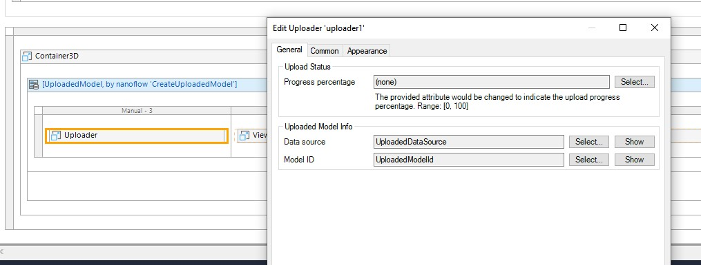
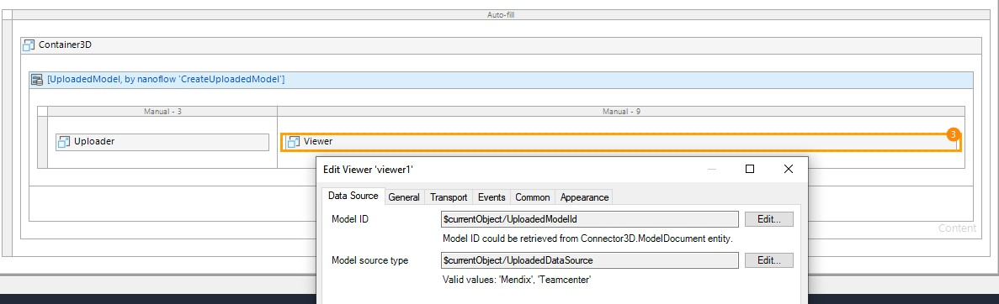
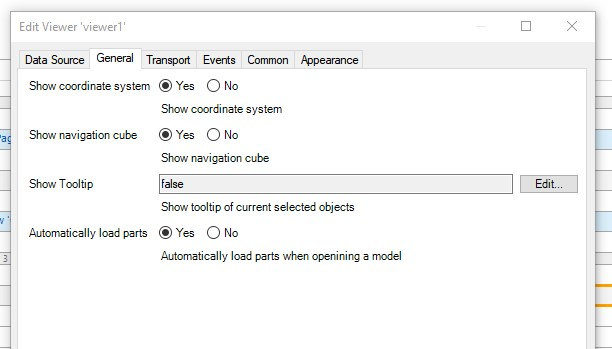
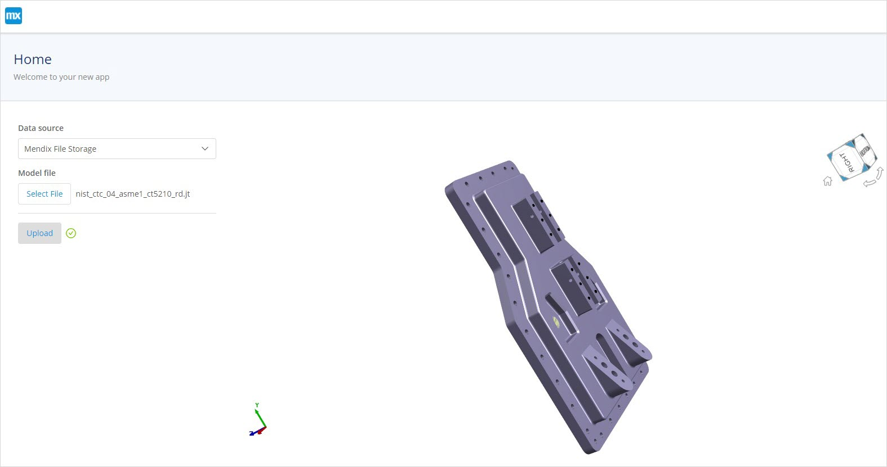
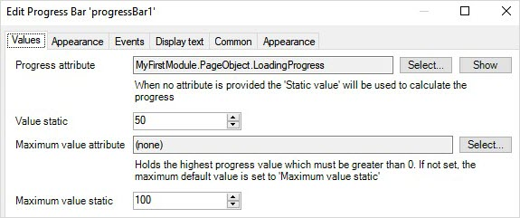
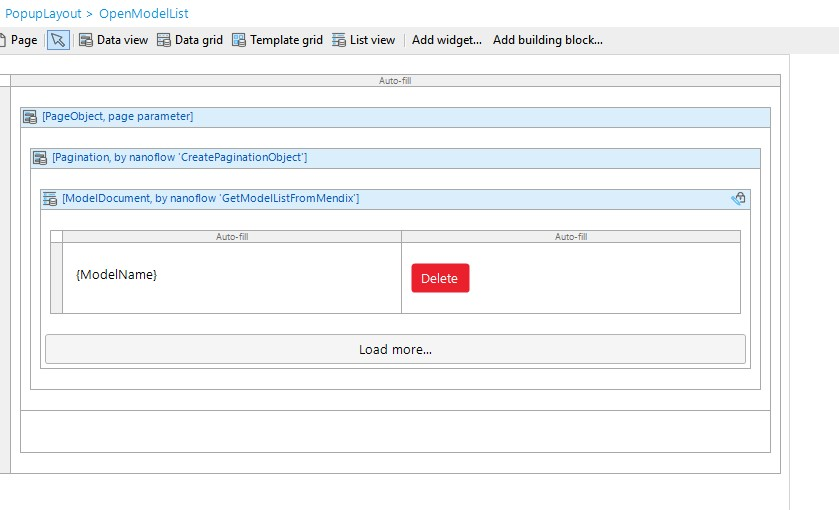
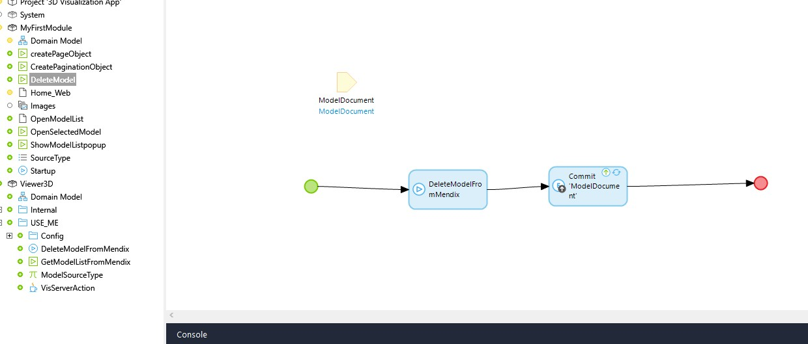
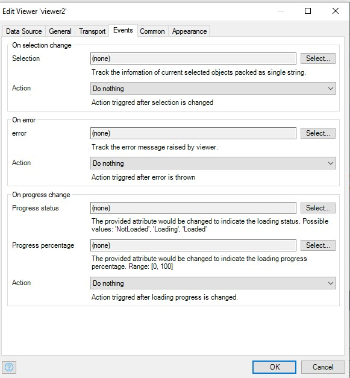

## 1 Introduction

The 3D Viewer app service lets you upload, visualize, and operate on 3D JT files in your web applications. The app service contains Java actions, JavaScript actions, domain models, nanoflows, microflows, and a set of 3D widgets that enable you build apps to work with 3D models via the JT format. The app service includes whole functionalities and integrations that can be very helpful when you are building your own 3D applications. All you need to do is drag and drop items and configure them. 

This app service does the heavy-lifting for you so you do not have to build a 3D-rendering engine from scratch.

{}[Add link to component]{}

### 1.1 Typical Use Cases

You can use this app service when you want to upload, store, and visualize 3D JT models in your application. You can perform some basic operations, such us navigating the model product structure tree, the **Product Manufacturing Information** (PMI) tree, and sectioning.

{}[Add cross-reference to PMI section?]{}

### 1.2 Features

This app service enables you to do the following:

* Display a 3D model (the JT format is currently supported)
* Use quick intuitive controls to navigate product structure
* Zoom, rotate, fit all, and pan
* Turn parts on and off
* Display PMI
* Select and clear selection of parts
* Display model views
* Load models from Mendix file storage
* Display part/assembly properties
* Create 3D cross-sections
* Examine your model from preset viewing angles
  
### 1.3 Limitations

The 3D Viewer app service includes a few 3D widgets. These are the limitations on how these widgets should be placed:

* The **Container3D** widget acts as a context-sharing container for other 3D widgets. Therefore, every other 3D widget needs to be put inside the Container3D widget. If 3D widgets are placed outside of the Container3D widget, you will see error in [Design mode](/refguide/page#design-mode).
* One **Container3D** widget can only contain one **Viewer** widget. If multiple Viewer widgets are placed inside a Container3D widget, you will see error message in [Design mode](/refguide/page#design-mode).

Currently, only JT models with version 9 and above are supported.

## 2 Installation

Follow the instructions in [How to Use App Store Content in Studio Pro](app-store-content) to import the app service into your app.

After importing, you need map the **Administrator** and **User** [module roles](/refguide/module-security#module-role) of the installed modules to the applicable [user roles](/refguide/user-roles) in your app.

## 4 Configuration

### 4.1 Initializing the 3D Viewer App Service on App Startup

To automatically start this app service, create a **Startup** microflow, add the **Viewer3D/USE_ME/VisServerAction** Java Action to the microflow, the set return type as **Boolean** with a **Value** of **true**.

This microflow needs to be set as the after-startup step via **Project Settings** > **Runtime** > [After startup](/refguide/project-settings#after-startup):

## 5 3D Widgets

These are the 3D widgets bundled in this module:

| Widget | Description |                                                                                                                                                                                      
| --- | --- |
| Container3D | A special container widget that provides a shared context for other 3D Viewer widgets. |                                                                                                            
| PMI Tree | Provides a hierarchical tree display of a model's product manufacturing information, model views, and design groups. |                                                                                 
| PS Tree | Provides a hierarchical classification of the items that form a product. |                                                                                                                           
| PS Tree Table | A configurable tree table to display the model attributes of your choice. |                                                                                                                             
| Sectioning | Allows you to create a section cut on the model. |                                                                                                                                                    
| Tool bar item camera mode | Provides the ability to control the appearance of surface objects displayed in the view. The option determines whether surface objects are represented on the display by facet geometry or edge geometry. |
| Tool bar item camera orientation | Allows you to view the model from different camera orientations. |                                                                                                                                        
| Tool bar item explode slider | Allows you to create an exploded view of your assembly. |                                                                                                                         
| Tool bar item fit all | Allows you to fit all the model parts in the viewer. |                                                                                                                                           
| Tool bar item render mode | Allows you to toggle between different model render modes. |                                                                                                                                         
| Tool bar item selection mode | Provides cthe apability to select a model part, edge, face, and body. |                                                                                                                                     
| Uploader | Enables you to upload your own model to be viewed in a browser or the app. |                                                                                                                       
| Viewer | Provides a viewing window of your 3D model when you open a model and zoom, rotate, or pan.|                                                                                                                 

## 6 Using 3D Viewer  

3D Viewer mainly provides a set of widgets to visualize JT models and a set of nanoflows and Java Actions to bring in the data.

Given that you start from a blank app template in Mendix Studio Pro, you can follow the instructions below to visualize your local JT model quickly.

### 6.1.1 Uploading & Viewing a 3D JT Model in Your Browser

For the **Viewer** widget to visualize a JT model, two data source attributes should be set: **Model ID** and **Model source type**. To enable uploading 3D JT models and visualizing them directly on the page, a set of these attributes should be returned by the **Uploader** widget and set to that of the **Viewer** widget.  

Follow these steps to configure this visualization:

1. Place a **Container3D** widget on a page.
2. Put the **Uploader** widget and **Viewer** widget into the **Container3D** widget and give them a layout.
3. Set a fixed height of the **Viewer** widget (toggle to **Design mode** to see the preview).
4. Create an entity called **UploadedModel** in your app module's domain model.
5. Wrap the **Uploader** and **Viewer** widgets inside a new [data view](/refguide/data-view).
6. Create a nanoflow, call it *CreatedUploadedModel*, and set this as data source of the data view.
7.  Create two attributes for the **UploadedModel** entity. Set them to receive the value returned from the **Uploader**'s **Data source** and **UploadModelId**:

  

8.  Set the data source attributes of the **Viewer** widget by setting **Model ID** to **UploadedModelID** and **Model Source Type** to **Mendix**:

  

9.  Set **Automatically load parts** to **Yes**, which enables loading the model automatically upon successful upload:

  
  
Run your app project locally. You can now upload a JT file and view it directly in the browser:

### 6.1.2 Displaying Model Loading Progress with Progress Bar Widget

When the end-user is uploading or loading a model, they may want to know the uploading and loading progress.

Uploading progress in the **Uploader** widget can be obtained via the **Progress percentage** property:

Loading progress in the **Viewer** widget can be obtained via the **Progress status** and **Progress percentage** attributes. 

Follow these steps to display the model loading progress:

1. Create an entity called *PageObject*, add decimal type attribute called *LoadingProgress* with a default value of `= 0` (as the **Progress bar** widget expects a decimal value).
2. Create a nanoflow called *createPageObject* that returns a **PageObject** object.  
3. Wrap **Container3D** with a data view and set the **Data Source** of the data view to the **createPageObject** nanoflow.  
4.  Set the value of the **LoadingProgress** attribute by setting the **Progress percentage** property:

  
  
5.  Add the **Progress Bar** to the page and set **PageObjectLoadingProgress** as the **Progress Attribute**:

    
  
Run your app locally. You can see the real-time model loading progress:

To display the upload loading progress, the steps are similar.

#### 6.1.3 Utilizing More 3D Functionality

Add more 3D widgets to the page to enable more 3D functionalities, you can arrange the layout of them as to your need. For example:  

In design mode,  

### 6.2 Managing Uploaded Models

In previous use case, you can only visualize the model you upload.
Usually you will also need to manage the models that are uploaded and stored in the data storage. 3DViewer provides **GetModelList** and **DeleteModel** nanoflows to help you build model data management functionality into your app.

### 6.2.1 Building a Model List

Mendix native **ListView** widget can be used to display the model list.

Follow these steps:

1. Use **View3D/USER_ME/GetModelListFromMendix**  nanoflow or copy it to your app module. A list of `ModelDocument` objects will be returned after calling the nanoflow.
2. Add a popup page to display model list on button click or other event of your choice.
3. Place a **ListView** widget in Popup page, set nanoflow **GetModelListFromMendix** as Data Source.
4. As **GetModelListFromMendix** requires a `Pagination` parameter input, wrap the **ListView** widget with a **DataView** widget, create a **CreatePaginationObject** nanoflow, set **CreatePaginationObject** nanoflow as List view's  data source.
5. Fill in the list item with the information you are interested in.

### 6.2.2 Opening a Model from the Model List

Once you have the model list, you may want to click to select a model from the list and view the model. As **Viewer** widget expects `ModelId` and `Model Source Type`  to visualize a model, such information of selected model need to be passed to the **Viewer** widget. Since each list item is a `ModelDocument` object and this object contains various information of the selected model, including `ModelId` and `Model Source Type`, we need to pass this object to **Viewer** widget.

Follow these steps:

1. Define `On click` action of List View so as to pass selected model to viewer widget that is present in another page, thus selected model can be loaded into the viewer. An example approach is to create an entity that is associated with `ModelDocument` entity defined in Viewer3D module Domain Model. Make the object a shared object between the page viewer is in and the model list page. I n this example, create a `PageObject`:  
Home page:  

Open Model Popup page:  

2. Set OnClick action of model list item, change the `ModelDocument` object `PageObject` is associated with, return the value so that Home page can be refreshed on PageObject change.

Run locally, you will get a simple model list, where you can select which model to open and visualize it at home page viewer:

### 6.2.3 Deleting a Model

There might be some models that you don't want in the database. You can delete them too. 3DViewer module provides **DeleteModelFromMendix** microflow to achieve this.

Follow these steps to delete model from database:

1. Use  **Viewer3D/USE_M3/DeleteModelFromMendix** microflow directly or copy it to your app module.
2. For model list item, add a **Delete** button

1. Create a nanoflow **DeleteModel**, set `ModelDocument` as input parameter, call **Viewer3D/USE_M3/DeleteModelFromMendix** microflow and commit the `ModelDocument`.

4. Set `On click` event of **Delete** button to **DeleteModel** nanoflow.

Now you are able to get a list of model, select on list item to open a model and delete model.

### 6.3 Handling Viewer Events

Multiple events can be picked up by **Viewer** widget and can used to build your customized event handling logic.
Mainly 3 types of events can be picked on **Viewer** Widget:

**On Selection Change**:By selecting one attribute to set SelectionSet, you can get information of selected part.  
**OnError**: By selecting one attribute to set OnError event, you can pick up error exposed by Viewer.  
**On Progress Change**: By selecting one attribute to setProgress value to, you can get the current loading status and loading percentage of model, product structure tree, PMI tree.

## 7 Loading & Visualizing a Model from Teamcenter

JT models from other data sources can also be visualized. Specifically, if you would like to load and visualize models from Teamcenter, you can use a combination of this **3DViewer** module and another module [**3DViewer for Teamcenter**](./3d-viewer-for-teamcenter.md) to achieve this.
