## 1 Introduction

[Data grid 2](https://marketplace.mendix.com/link/component/116540) is the successor of the standard data grid widget for displaying content in a tabular form. It comes with many powerful new features and settings like support for widgets, row and cell coloring, responsive layout, accessibility, and different paging options like virtual scrolling. It offers personalization support so that end-users can show, hide, and re-order columns. Personalizations can be persisted in the database for flexibility and control. The data grid is packaged as a module and uses a flexible approach for filtering. Developers can drag and drop data-grid-specific widgets inside the header of the grid and tailor the behavior of the filters. This module includes filters for text, numbers, dates, and the option to add drop-down filters for single or multiple selections.

Here is an example of a data grid using filters:

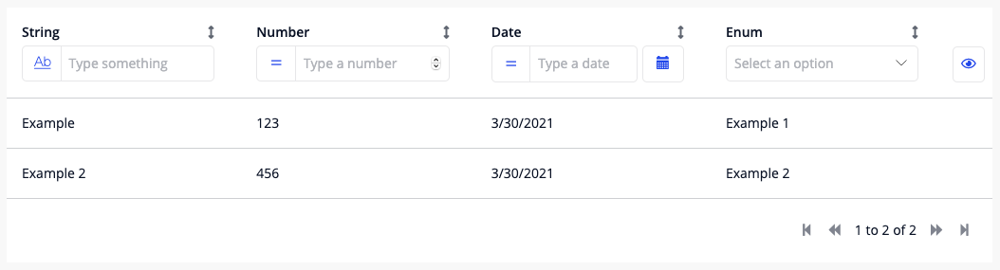

### 1.2 Advanced Options

The data grid has an option to enable advanced options. When toggle this option on, it enables numerous features to customize your data grid:

* Pagination type
* Pagination position
* Empty list option
* Dynamic row and cell class
* Column capabilities
* Custom configuration

## 3 Capabilities

In the new data grid, you are able to choose how users can iterate within the grid. We offer:

### 3.1 Sorting

Enables the header to be clickable, when clicking it will switch between ascending, descending and no sorting. This functionality can be noted according to the arrows on the right side.

* Arrow up: ascending sorting applied
* Arrow down: descending sorting applied
* Double-sided arrow: no sorting is applied

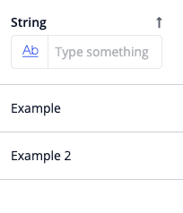
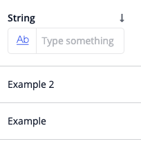
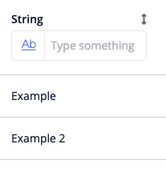

### 3.2 Resizing

Enables the header to be resizable by dragging the handle on the right side of a header.

Example of the handle indicating the column is resizable:

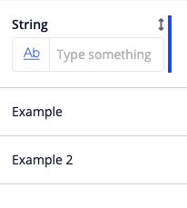

### 3.3 Reordering

Enables the header to be reordered by dragging and dropping in another column. When dragging, a black handle indicates where the column can be dropped.

Example of reordering in progress:


### 3.4 Hiding

Enables a column to be hidden. When this option is enabled for any column, a button with an eye icon will appear on the right side of the data grid like the example below, it contains all the columns **hidden by default** or enabled to be hidden. When de-selecting, the column will not be visible in the grid anymore.

Example of hiding button containing columns to be hidden:

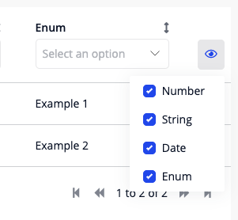

{}
When a column is marked as “Yes, hidden by default” it will render differently in Structure mode and Design mode (Studio Pro) and in Studio to indicate that the column is hidden. **When running the application, the column will in fact be hidden by default**.
{}

Example containing a column with “Yes, hidden by default” in Structure mode:

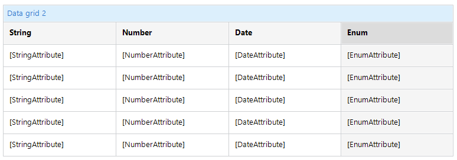

Example containing a column with “Yes, hidden by default” in Design mode and Studio:

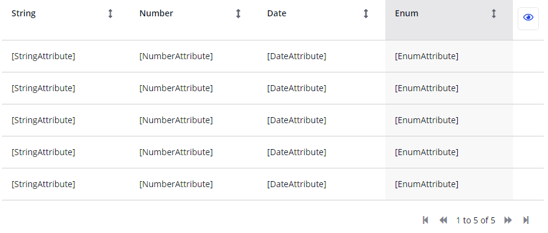

## 4 Pagination

In the new data grid we offer 2 types of pagination:

### 4.1 Paging Buttons

This option will render the default buttons as the previous data grid. When the data source is uncountable (like entities in data hub) the last page button will not be available, also the counting. The pagging can be positioned above or below the grid.


### 4.2 Virtual Scrolling 

This option forces the data grid to show a fixed amount of items (defined in the page size option) within a scrollable container, when the user reaches the bottom of the scrollable container it fetches more items automatically.

## 5 Columns

In the new Data grid you can choose what you want to render into the columns. It can be an attribute, dynamic text or even a combination of widgets (custom content). To choose what you want to render, open a column in the column list and select the appropriate option according to your necessity.

Example of column properties:

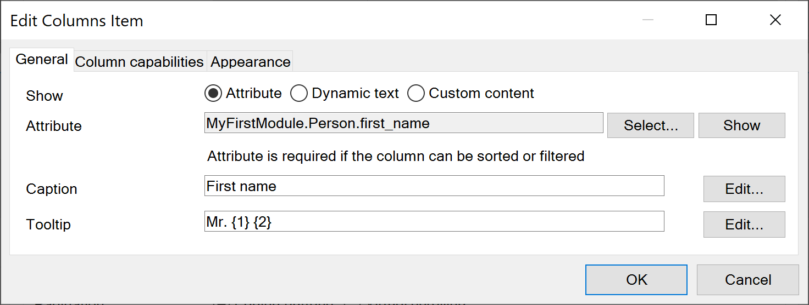

### 5.2 Attribute

Renders the value of a selected attribute

### 5.3 Dynamic Text

Render a text templated string which can contain text combined with attributes.

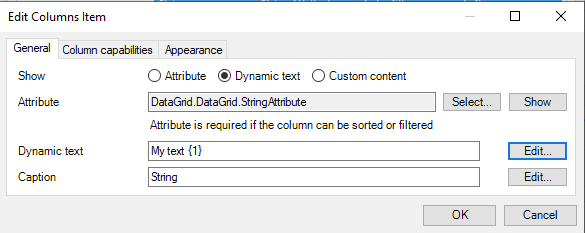

### 5.4 Custom Content

Allows user to drop widgets into the data grid and use the column attribute value to show custom content. When selecting this option, please note you will have dropzones to use your widgets inside.

Example of custom content using new Badge widget in Structure mode:

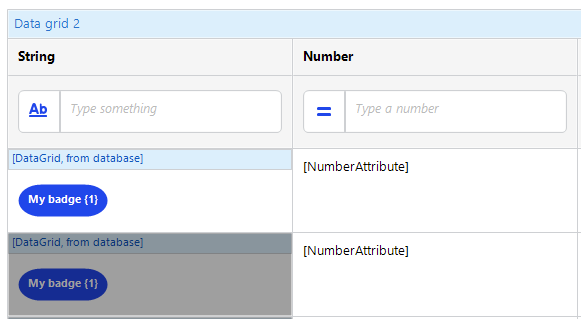

### 5.5 Column Width

You can define how each cell will be rendered in the data grid, we offer three choices:

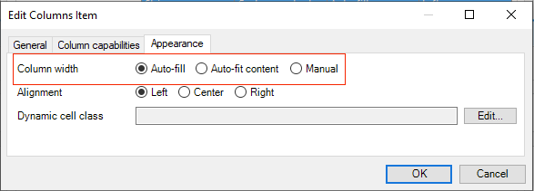

* **Auto-fill** — With this option it will auto define the width of your column, if all columns are using auto-fill, it will divide evenly the same width, if another column is configured with auto-fit or manual, it will fill the available space.
* **Auto-fit** — Content With this option it will calculate the width of your column based on the content of each row.
* **Manual** — With this option you will manually define the size of your column based of flexbox grow values, for more information, please [check here](https://www.w3.org/TR/css-flexbox-1/).

### 5.6 Alignment

You can choose how the content inside your columns will be aligned. We offer 3 choices: Left, center and right.

{}
This will also change the alignment of your header.
{}

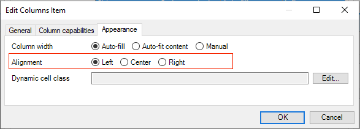

### 5.7 Dynamic Cell Class

In the new data grid we offer an option to dynamically apply a CSS class in a specific cell. You can achieve this by adding an expression based on the column value (attribute), like the example below:

In this example we check the value of `StringAttribute` and then apply the class `.my-name-class` if the attribute is equal to `my name` to the cell.

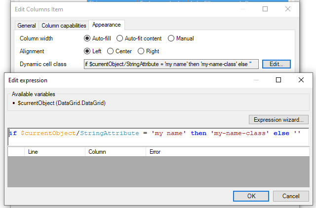

## 6 Rows

This section defines option for the rows of the grid.

### 6.1 Empty List Message

This option defines what users can see when the data grid doesn't have a value to be presented or when a filter is applied without results. When this option is defined as custom you can place widgets right above the rows in a dropzone. Please check example below:

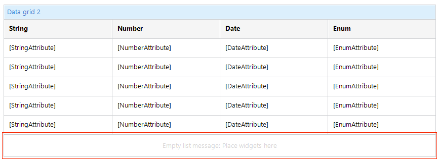

### 6.2 Dynamic Row Class

This option allows users to dynamically apply a CSS class in a specific row. This option will apply for the entire row the same class. You can achieve this by adding an expression based on the column value (attribute), like the example below:

{}
If you have a dynamic cell class being applied it will have precedence over the row class.
{}

In this example we check the value of `StringAttribute and` then apply the class `.my-name-class` if the attribute is equal to `my name` to the row.

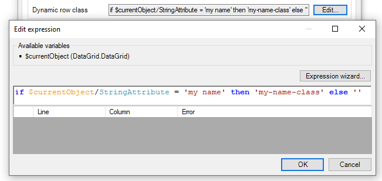

## 7 Events

The new data grid can trigger some events while iterating with it.

### 7.1 On Click Action

Triggers an actions (nanoflow, microflow, show page, etc) when the user clicks in one of the rows. It also adds a pointer cursor to each like to represents it is clickable. This function also comply with accessibility and can be reachable by using your keyboard.

## 8 Filters

The new data grid offers a set of filters to be used in combination of the data grid. To be able to use filters you need to check the option “_Show column filters_”. When this option is checked it will appear in each column header a dropzone where you can place your desired filter widget.

{}
The type of your selected attribute should match the filter type. Example: A “Text filter” should be used for a String attribute.
{}

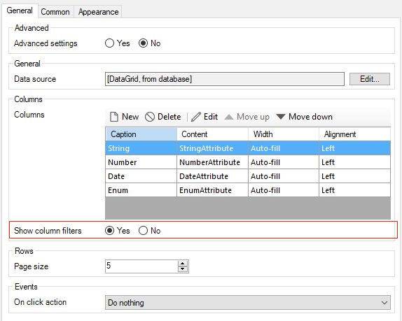

Example of dropzones for filters in Structure mode:


### 8.1 Date Filter

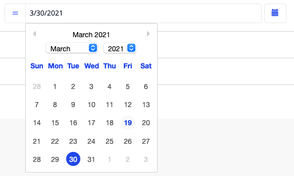

It allows users to match date attributes based on these predefined criteria:

* Greater than
* Greater than or equal
* Equal
* Not equal
* Smaller than
* Smaller than or equal

You can select your filter criteria in the settings of Date Filter.

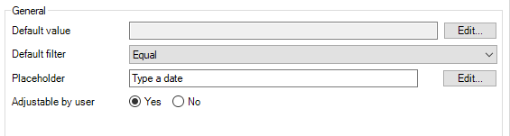

When “_Adjustable by user_” is defined as **No** it will not render the option to choose the filter type in the widget.

Example of available filter types for Date Filter:

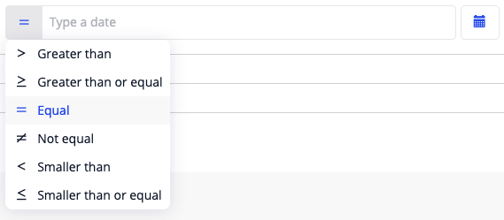

Example of Date Filter with “_Adjustable by user_” set as **No**:

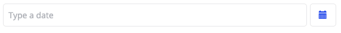

You can also define the default value of the widget which will be predefined as initial value when opening your data grid page.

### 8.2 Drop-down Filter

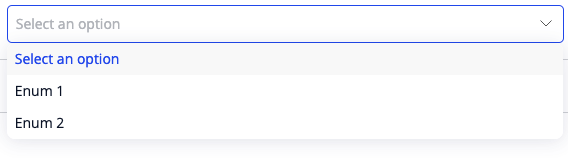

It allows users to match enumeration values or a predefined string attribute. To configure the available option when you press the drop-down filter, you need to manually add them in the option list.

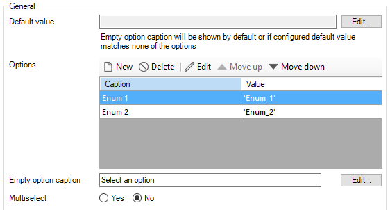

When adding a new option, the following properties are required:

* **Caption** — The text being rendered for each option in the drop-down
* **Value** — The corresponding value that will be compared, if a value is being compared with an enumeration, it should match exactly the enumeration value. This property allows the usage of expression (you can use conditionals to apply dynamic values)

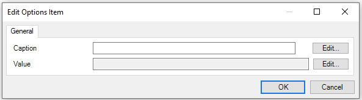

This widget also allows making multiple selections by selecting **Multiselect** in the settings. Multiple selections can look like this:

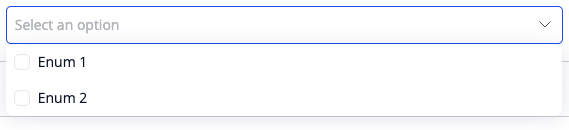

You can also define the empty option caption, which will be rendered as the first item if **Multiselect** if set as **No**. It allows users to clean the filter if pressed.

### 8.3 Number Filter


It allows users to match date attributes based on these predefined criteria:

* Greater than
* Greater than or equal
* Equal
* Not equal
* Smaller than
* Smaller than or equal

You can select your filter criteria in the settings of Number filter.


When “_Adjustable by user_” is defined as **No** it will not render the option to choose the filter type in the widget.

Example of available filter types for Number Filter:

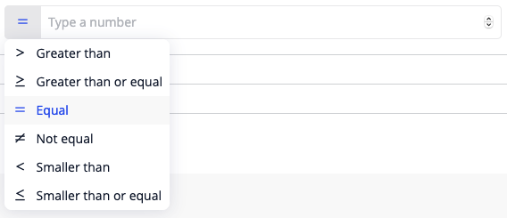

Example of Number Filter with “_Adjustable by user_” set as **No**:

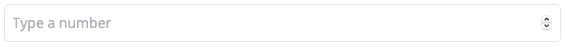

You can also define the default value of the widget which will be predefined as initial value when opening your data grid page.

To have a better control of when the filter will be applied we offer a “_Apply after (ms)_“ option under “_On change behavior_” group. This option will just trigger the filter after a predefined period of time while typing. By default, we suggest 500ms.

### 8.4 Text Filter

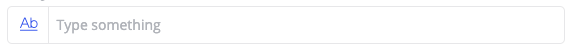

It allows users to match date attributes based on these predefined criteria:

* Contains
* Starts with
* Ends with
* Greater than
* Greater than or equal
* Equal
* Not equal
* Smaller than
* Smaller than or equal

You can select your filter criteria in the settings of Text filter.

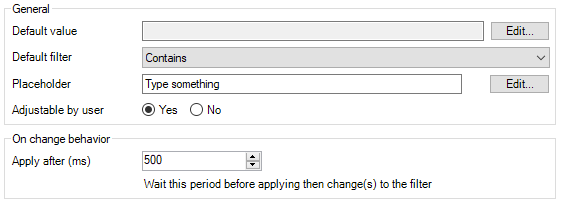

When “_Adjustable by user_” is defined as **No** it will not render the option to choose the filter type in the widget.

Example of available filter types for Text Filter:

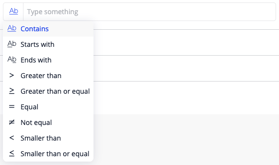

Example of Text Filter with “_Adjustable by user_” set as **No**:


You can also define the default value of the widget which will be predefined as initial value when opening your data grid page.

To have a better control of when the filter will be applied we offer a “_Apply after (ms)_“ option under “_On change behavior_” group. This option will just trigger the filter after a predefined period of time while typing. By default, we suggest 500ms.

## 9 Configuration

You can define an attribute to store the current configuration of the data grid, in this way, if you re-open your page the current sorted columns, order and hidden columns will remain the same as the previous state. To set this option, you need to select a `String` attribute with `Unlimited` as its size as the attribute in the data grid Personalization tab in Studio Pro or Configuration in Studio.

{}
If the desired `String` attribute does not contain `Unlimited` in its size, the Data grid will not be able to save all the configuration as expected.
{}

Example of unlimited string attribute:

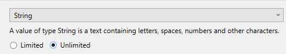

In order to select an attribute you need to surround the new data grid with a data view, which will allow you to select an attribute. You can also define an action when the attribute be updated with the new configurations. 

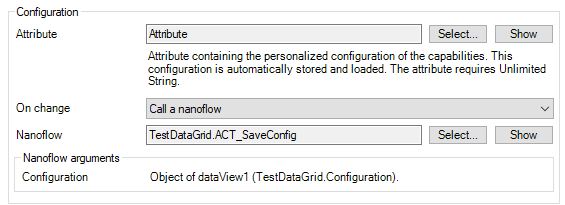

## 10 Performance

The performance of the new data grid can be affected if sorting or filtering are enabled. At this version of the data grid 2 (version 1.1.0) we retrieve all the available values to do the sorting or filtering while running the widget.

## 11 Troubleshooting

When using the data grid 2.0 with XPath as data source, there will appear an error when the data source returns more than 1000 objects. Please use a microflow in this case with the limit on the retrieve.

If you are using Atlas 2.x and you can't upgrade to Atlas 3 at this moment, please replace the line 3 `cssFiles` with the following code in the file `theme/settings.json`:

```json
"cssFiles": [ 
    "styles/web/css/main.css", 
    "theme.compiled.css" 
],
```
