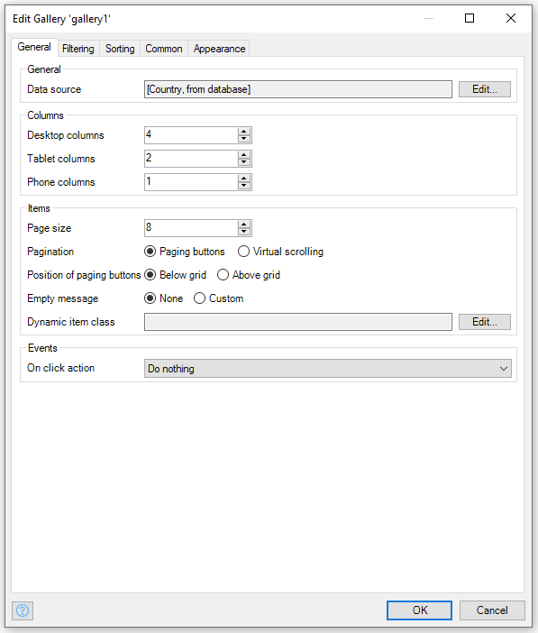
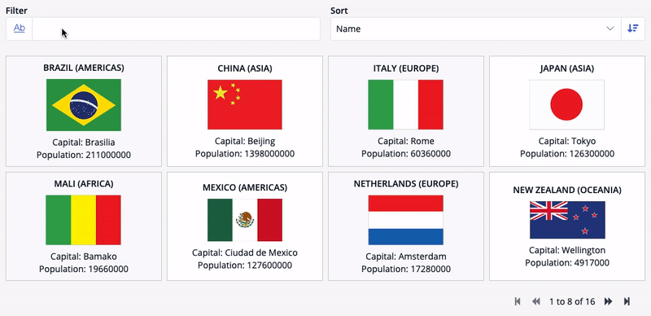
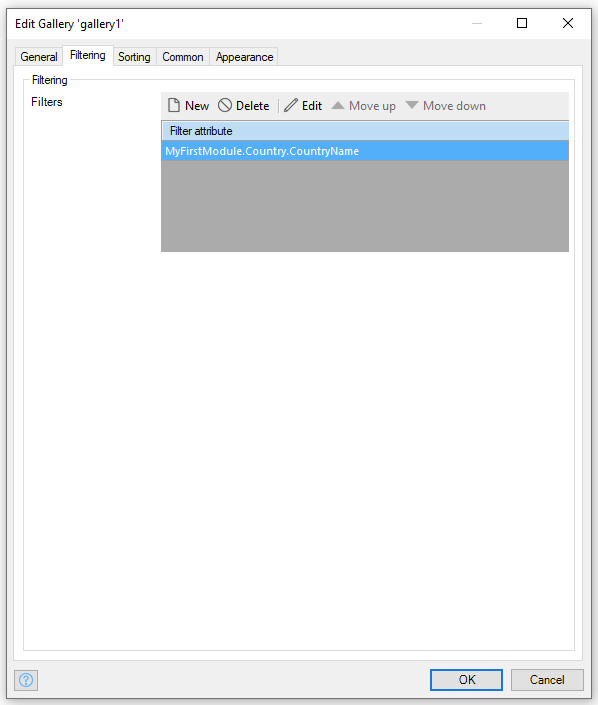
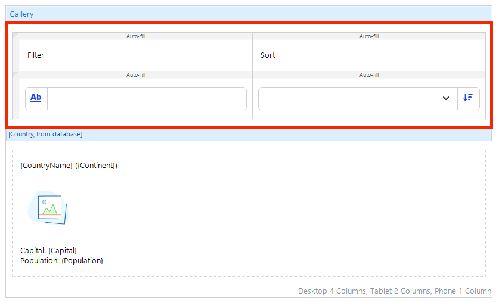
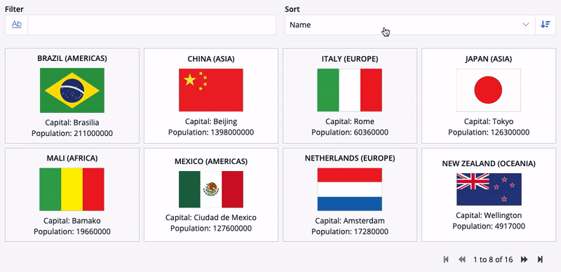
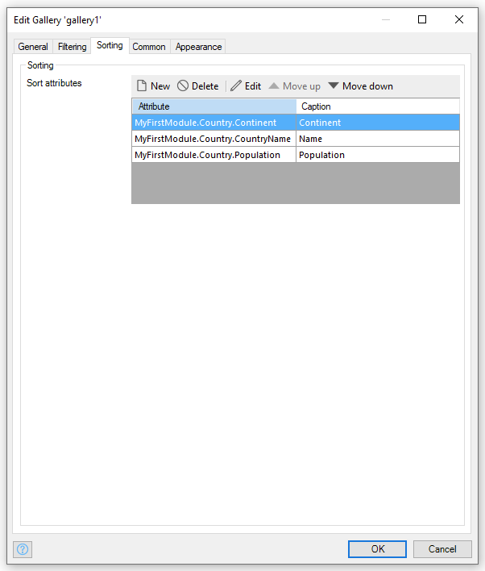

## 1 Introduction

The [Gallery](https://marketplace.mendix.com/link/component/xxx) widget, a replacement for both the template grid and listview, can be used to build beautiful lists and grids across all your device types (desktop, tablet and mobile). Featuring the same filtering and sorting as seen in the [Data Grid 2](https://marketplace.mendix.com/link/component/116540), combine with the options to vary the number of columns per device type, the Gallery widget gives you the power to create amazing grid and list experiences for every user.

Here is an example of Gallery using filters:

## 2 Configuration

We provide several options to be defined in the Gallery widget, here are the general options:

### 2.1 Data source

Data source is the source of the data being presented in the Gallery. You can select data from Database, Association, Microflow, Nanoflow or Xpath.

### 2.2 Columns

We provide a mechanism that auto applies a different amount of columns based on the device being used. In the gallery widget you can select columns for Desktops, Tablets or Phone/Mobile.

### 2.3 Items

In the items group you can define the properties related to the items being presented.

#### 2.3.1 Page size

Defines the amount of data being show for each page, or the limit to be presented when using virtual scrolling.

#### 2.3.2 Pagination

You can choose between Paging buttons (button being presented below or above the grid) and virtual scrolling (mechanism that auto-loads the data when reaching the bottom of the scrollbar). 

#### 2.3.3 Position of paging buttons

This option is only available when `Pagination` is marked as `Paging buttons` and defines its position related to the grid items.

#### 2.3.4 Empty message

When this option is defined as custom it will show a composable region that you can place widgets to be presented when no items are available to be shown as well as when the filter does not return any data.

#### 2.3.5 Dynamic item class

In the new Gallery widget we offer an option to dynamically apply a CSS class in a specific item. You can achieve this by adding an expression based on the item values (attributes) like the example below.

In this example we check the value of `CountryName` and then apply the class `.my-custom-class` if the attribute is equal to `Spain` to the items:

### 2.4 Events

The new Gallery widget can trigger some events while iterating with it.

#### 2.4.1 On Click Action

Triggers an action (such as a nanoflow, microflow, or Show page action) when the end-user clicks in one of the items. It also adds a pointer cursor to signal that it is clickable. This function also complies with accessibility features and can be reached using only the keyboard.

## 3. Filtering

In order to enable filtering within the gallery items you need to select the desired attributes to be filtered in the `Filtering tab`. You can select attributes of the following types:

- Auto number
- Boolean
- Date & time
- Decimal
- Enumeration
- Hashed string
- Integer
- Long
- String

The attributes selected here will be used for the matching filter placed inside the composable region. When using multiple attribute the filters will auto-select the matching attributes and then combine in an `OR expression` the desired filter value. Make sure you just have 1 filter widget for each type, example `Text Filter` and `Number Filter`.

{}
If a filter is being used and its type doesn't match with any selected attribute it will throw an error requesting you to select the correct filter widget.
{}

Example of filtering configuration:

Here is an example of Text filter being used in the composable region combined with a Drop-down sort:

For more information about filters, please check [Data Grid 2 - Filters](data-grid-2#7-filters)

## 4. Sorting

In the new Gallery widget is possible to add sorting widgets to the composable region and use them based on the configurations available in the `Sorting tab`. In order to make the attributes available for the filter widgets you need to select an attribute and define its name to be shown in the filter.

{}
If you have a sorting applied in the datasource of the gallery it will pre-select the value in the drop-down filter if it matches the selection made in the configurations and override the filter selected in the datasource in case you have more options defined. 
{}

### 4.1 Dropdown-sort

We provide an out-of-the-box widget to use combined with Gallery, the dropdown-sort. The drop-down sort widget just needs to be placed inside a composable region of the Gallery after defining the sorting attributes in the `Sorting tab` of the Gallery in order to be able to work.

The widget also provides 2 options to be set:
- Empty option caption: Value to be used when no value is selected;
- Screen reader caption: Value to be announced by screen readers when using assistive technology.

## 5. Troubleshooting

The new Gallery widget uses [CSS Grid](https://developer.mozilla.org/en-US/docs/Web/CSS/CSS_Grid_Layout) as its base for styling. If you need to combine rows or columns you can achieve it using the following helper classes in the `Dynamic item class`:
- `widget-gallery-column-span-1` until `widget-gallery-column-span-12`: it merges column spaces pushing items to a new row when the selected amount is reached for each platform;
- `widget-gallery-row-span-1` until `widget-gallery-row-span-12`: it merges rows spaces pushing items into new columns or rows when needed.
