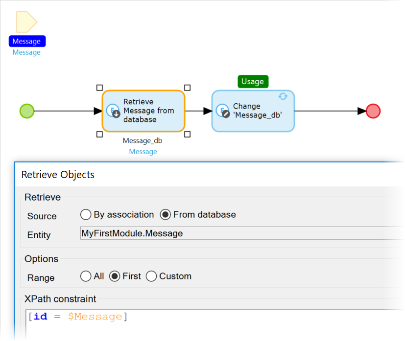

## 1 Introduction

The [Pusher](https://appstore.home.mendix.com/link/app/107957/) module allows you to trigger a microflow or nanoflow directly from the server on the client app. This means it is triggered from the other session, without waiting for end-users to interact with the page.

In the standard situation, updates in the client are triggered by a user interaction, by timed actions, or by data-grid refresh time. For information not created by the same user session that needs to be updated immediately in the client app, the Mendix core product does not support a viable option to accomplish this. As an alternative, you need need to refresh the page constantly with timers or constant clicking. This is not user-friendly, and it is not preferred when scaling.

With this module, you can create a notify event on the server that directly causes an action in the client application. The event is based on a persistable object that is available in the server and the client page. From a microflow, the notify action will send a message to every listening widget that is listening to the same object and the action name.

{}
The listening widget can only listen when the page is active, so the widget cannot be used to send a notification when the user has navigated away.
{}

### 1.1 Typical Use Cases

* Asynchronous refreshes
* Notifications
* Chat function

### 1.2 Dependencies

* External service [Pusher](https://pusher.com/) – the module is built around the Pusher [Channels](https://pusher.com/channels) product; Pusher is a paid service, but there is a generous [free Sandbox plan](https://pusher.com/channels/pricing):

	| Detail | Sandbox |
	| --- | --- |
	| Price | Free |
	| Connections | 100 Max |
	| Number of channels | Unlimited |
	| Messages | 200k / Day |
	| Support | Limited |
	| Protection | SSL |

## 2 Setting Up the Pusher App

To set up the necessary Pusher app, follow these steps:

1. Sign up at [Pusher](https://dashboard.pusher.com/accounts/sign_up).
2. From the dashboard, create an app
3. On the **Channels Apps** page, select the new app. The keys are shown in **App Keys**.
4.  Copy the key information into the following **Pusher** module constants:
	* `app_id` – `Pusher_App_ID`
	* `key` –` Pusher_Key`
	* `secret` – `Pusher_Secret`
	* `cluster` – `Pusher_Cluster`

{}
Make sure you have different apps (keys) created for each app and environment (development, acceptance, and production). When the credentials are shared, messages could go across environments and have unwanted side effects. The configuration can also be set per developer via **Project settings** > **Edit** configuration > [Constants](https://docs.mendix.com/refguide/configuration#constants).
{}

## 3 Configuration

To use this module after importing it from the App Store, follow these steps:

1. Add the **Pusher User** [module role](/refguide/module-security#module-role) to the relevant app project security [user role](/refguide/security#user-role).
2. Update the constants in the **Configuration** folder with the keys of the app.
3.  Create a microflow to execute the **Notify** action with the following input parameters:
	* Key settings
	* **Action name** same as configured in the widget
	* The context object of the widget
4. Place the widget in a page within a [data view](/refguide/data-view), where the context should match the parameter object.
5.  In the **Action list**, add an action in which the **Action name** matches the action name parameter provided in the **Notify** action.
6.  Select a microflow or nanoflow the execute the action.

This diagram describes updating an object via the Notify action:

### 3.1 Refresh Microflow

You can use a microflow to retrieve data that is changed by other users as long is it committed and the transaction has finished.

The `$Message` variable contains the object in the session state. With the `[id = $Message]` XPath query, the object is retrieved from the database. The changes action only does a refresh in the client, which triggers a refresh update on the client page.

### 3.2  Security 

The notify messages are sent to anybody who is listening. 

A message will contain limited data (entity name, ID, changed date, notifier user name). To send a notify message, it is required to have the private key that is stored on the server in the `NotifyListen.secret` constant. This secret should not be shared with anybody. The listening widget will use the public `NotifyListen.key` to receive a signal and perform the action as the logged-in user.

An addition authentication request is made to the Mendix REST server via `<host>/rest/pusher/key` and `<host>/rest/pusher/auth`. Only when successful is the user allowed to access the lists. The service will only allow a logged-in user with the **NotifyListen.User** module role to listen when the user has entity access to the object of the data in which the the widget is placed.
