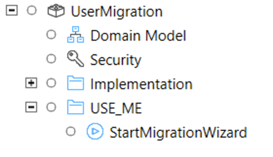
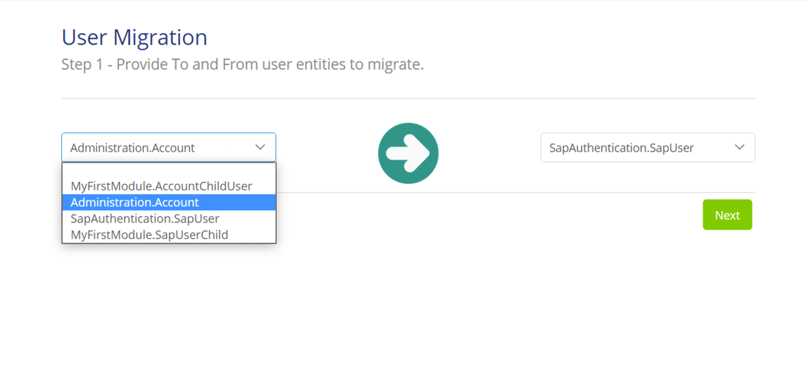
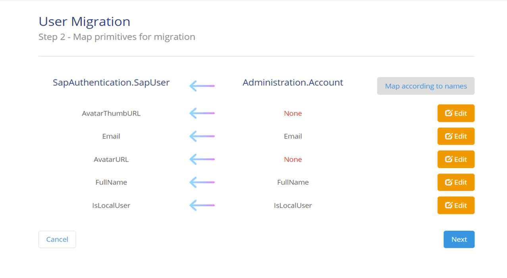
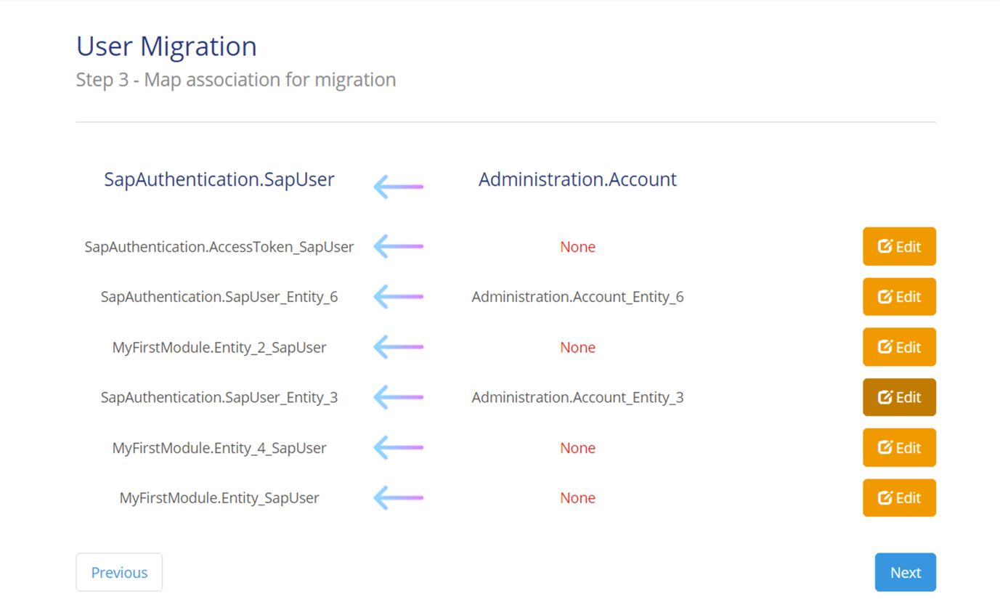
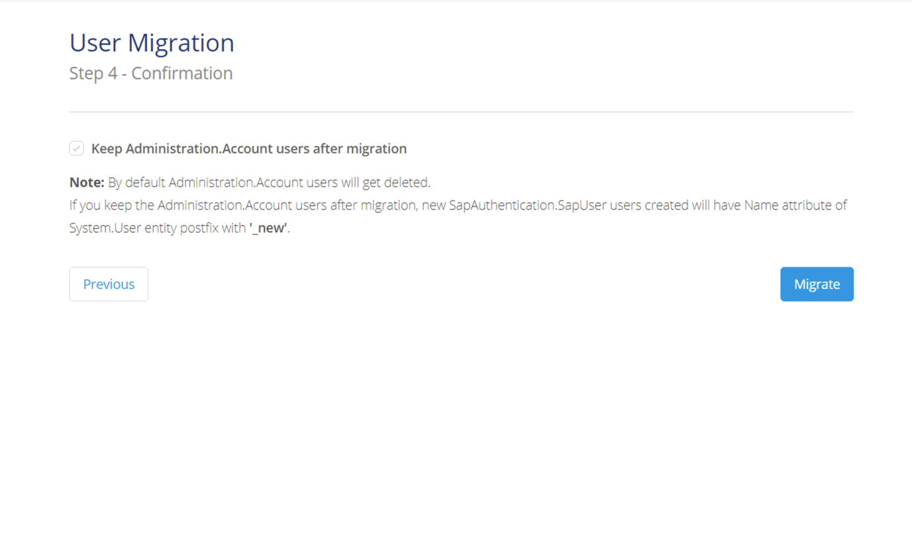

## 1 Introduction

Use the [User Migration](https://marketplace.mendix.com/link/component/118015) module to migrate users between any two User entities that have a generalization System.User. This allows you to implement a different user management module and migrate all the existing users of your app to it.

This is a one-time admin activity required to be run just after deployment of the application.

## 2 Prerequisites

To perform a user migration, you need the following prerequisites:

* A copy of the User Migration module imported into your app – see the instructions in [How To Use Marketplace Content in Studio Pro](/appstore/general/app-store-content) for more details
* An existing user management module using an entity with the generalization `System.User`
* A new user management module which also uses an entity with the generalization `System.User`
* Add all attributes and associations that you want to migrate to the Domain Model of the new user management module
* Add the microflow `StartMigrationWizard` in the **USE_ME** section of the **UserMigration** module to the navigation or pages which can be accessed by administrators of the app

    

## 3 Migrating Users

To migrate your users, you need to do the following. For the examples, assume that you are migrating users from the default Mendix user management module, `Administration` to an SAP-specific module, `SapAuthentication`:

{}
You should migrate your users immediately after first deploying the app containing the new user management functionality. Until you do this, your existing users will not be able to sign in to the app.

If you have specializations of the user entities you are migrating, you must migrated the specializations first followed by the main account entity. For example, if you have specialized your `Account` entity into `CompanyA_Account` and `CompanyB_Account`, you must migrate `CompanyA_Account` and `CompanyB_Account` into their related specializations of your new account entity (for example `CompanyA_NewAccount`) before migrating `Account`.
{}

1. Sign in to your app with the default administrator account.

2. Run the microflow *StartMigrationWizard* from wherever it has been placed in the administration functions of the app.

3. Select the user entity being used by the old user management module. The dropdown list will show only entities which have a generalization of `System.User`. In our example, this is `Authentication.Account`.

    

4. Select the user entity being used by the new user management module. In our example, this is `SapAuthentication.SapUser`.

5. Click **Map according to names** to map attributes with the same names. This means, for example, that data in the `Email` attribute in `Authentication.Account` will be migrated to the `Email` attribute in `SapAuthentication.SapUser`.

    

6. Edit any mappings which are missing or incorrect using the **Edit** buttons.

    {}Attributes must be of same type.{}

7. Click **Next**.

8. Click **Edit** next to set up any associations from the old entity that you want to migrate to the new entity.

    {}As with the new attributes, the new associations must already exist in the Domain Model for the new user management module and must have the same multiplicity and ownership as the association they are being mapped from.{}

    

9. Click **Next**.

10. Check **Keep … users after migration** to keep the existing user in the old account entity after migration. The message will contain the name of the entity which will be retained, for example `Administration.Account`.

    {}If you keep the old users after migration, the new user created will have the `_new` postfix for the *Name* attribute of `System.User`, since `System.User/Name` must be  unique.{}

    

11. Click **Migrate**.

Your users have now been migrated to the new user management module and can sign in using their existing credentials.
