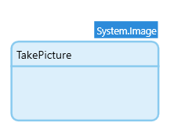
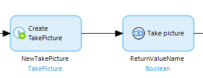
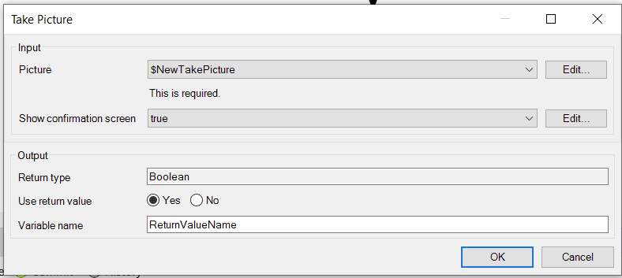
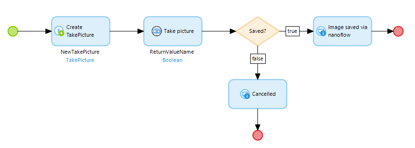

The [Web Actions](https://appstore.home.mendix.com/link/app/114337/) module contains the following actions:

| Category | Action |
| --- | --- |
| Focus next | Moves the keyboard focus to the next element that can be focused. |
| Focus previous | Moves the keyboard focus to the previous element that can be focused. |
| Scroll to | Scrolls the window to make a targeted element visible. For this action, you need to provide a target selector. This target could be an element containing a class (for example, `.mx-class-name`, `.my-class-name`), an HTML element (for example, `td`, `div`, `a`), or an element ID (for example, `#my-element-id`).  |
| Set focus | Sets the focus to the element found with the selector. The element should be able to hold focus like a link, button, or input. For this action, you need to provide a target selector. This target could be an element containing a class (for example, `.mx-class-name`, `.my-class-name`), an HTML element (for example, `td`, `div`, `a`), or an element ID (for example, `#my-element-id`). |
| Take picture | Allows users to take a picture from the back and front camera in a web or PWA app. |

## 1 How to use

### Take picture

For the take picture action you will need to create an entity that extends `System.Image` entity. Following the example below.

Next step is drag and drop the Take picture action from Studio Pro toolbar to your nanoflow like the example below. For that you need to pass an object for the action.

In the action you need to select which object are you passing to the action to fill with the image properties. 

We also provide an option to show a confirmation screen where users can either choose to accept or retake the picture,

The value returned from the action is a `Boolean` so in the end of the execution you can check if the picture was taken or not following the example below.

