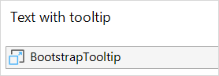

## 1 Introduction

The [Bootstrap Tooltip](https://appstore.home.mendix.com/link/app/1939/) widget adds a tooltip to a user-defined field that contains help text or extra information.

### 1.1 Typical Usage Scenario

* Add help text to an input field that is visible upon focus
* Add informative text for buttons that is visible upon hovering

### 1.2 Feature

* Based on Bootstrap's *tooltip.js*

## 2 Installation

To install, import the Bootstrap Tooltip widget into your app project and add the widget on a page. Locate the widget as close to the target element as possible (preferably next to it).     

When an element has a tooltip attached to it and needs to be conditionally visible, put both the element and the tooltip together in a container and apply the visibility conditions to the container instead of the element:

## 3 Configuration

You can configure the properties below to determine how the widget will behave in your application.

### 3.1 Appearance Tab

* **Target element classname** – the class name of the field to which you want to attach the tooltip
* **Render HTML** – selecting **Yes** renders the tooltip content as HTML
* **Tooltip position** – the location of the tooltip relative to the field
* **Tooltip mode** – when to show the tooltip

### 3.2 Data Source Tab

* **Default text** – the text displayed when no data source microflow is defined
* **Tooltip source microflow** – the microflow that returns the text to be displayed in the tooltip

## 4 Developing This App Store Component

To start development on this widget, follow these steps:

1. Clone the [mendix / BootstrapTooltip](https://github.com/mendix/BootstrapTooltip) repository.
2. Make sure you have [Node.js](https://nodejs.org/en/) installed on your computer.
3. Open a terminal in the root directory of the project.
4. To install all the project dependencies, execute the following command in the terminal: `npm install`.
5. In order to test the widget with one of the supplied test projects, run the following command to generate and include an *.mpk* file in every test project (and in a **dist** folder): `npm start`. This command will also watch the source code files. When changes to these files have been saved, a new *.mpk* file will be generated and included in the **dist** folder and in every test project. The **dist** folder will also contain an unpacked version of the *.mpk*. The source files in the **deployment** folder of the test projects will also be updated, so that it only takes a refresh in the browser to view your changes.
6. To keep the source code formatting uniform across the project, run the following command to format all the project source files (XML files are not supported): `npm run prettier:fix`.
7. To release the widget in the Mendix App Store, run the following command to build the widget: `npm run build`. This command will optimize the source code for the production environment and generate a new *.mpk* that will be included in the **dist** folder and in every test project. The **dist** folder will also contain an unpacked version of the *.mpk*. The source files in the **deployment** folder of the test projects will also be updated, so that it only takes a refresh in the browser to check your production code.
