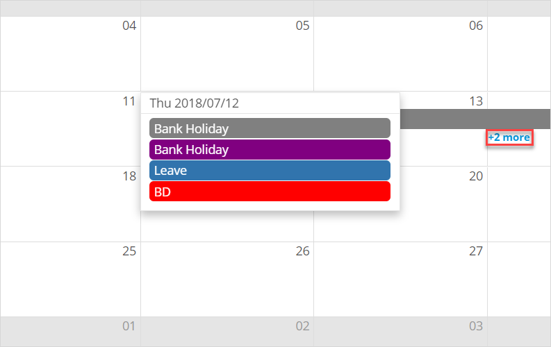
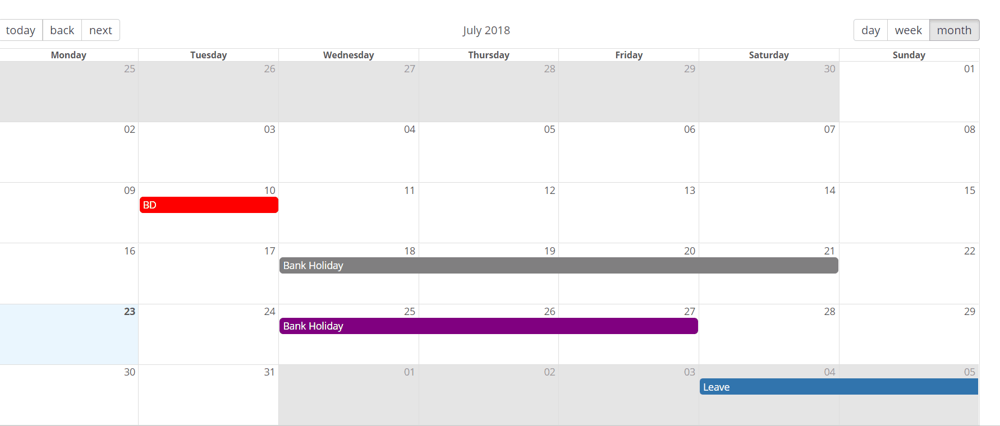

## 1 Introduction

The [Calendar](https://appstore.home.mendix.com/link/app/107954/) widget can be used to display and manage calendar events.

### 1.1 Features

* Add and edit calendar events
* Drag and drop calendar events
* Change calendar event colors
* Retrieve events based on selected date ranges

### 1.2 Demo App Project

For a demo app project that has been deployed with this widget, see [here](https://reactcalendar.mxapps.io).

## 2 Basic Configuration

1. Place the widget in a data form within the context of an event entity.
2. On the **Data source** tab, configure the calendar event to retrieve from a data source by **Context**, **Database** (via **XPath**), **Microflow** (via **Microflow**), or **Nanoflow** (via  **Nanoflow**).
3. Select the **Event entity**.
4. Select attributes to provide the event title, start date, end date, and color. Select a Boolean attribute to determine whether the event should be considered all day.
5. If you configured the **Microflow** data source, consider setting up **Refresh data source on view** by selecting **Yes** and adding a constraint based on the **View start attribute** and **View end attribute** (for example, `End > $CalenderView/StartAttribute` and `Start < $CalenderView/EndAttribute]`). if configured, when navigating the calendar, only events between the **View start attribute** and **View end attribute** dates will be retrieved.
6. On the **View** tab, select **Standard** for a view with a day, week, and month only. To set a custom toolbar, select **Custom**. The **Month** is the default initial selected view.
7. Configure the optional **Start date attribute** if necessary.
8.  Leave **Show truncated events** set to **Yes** to show events in an overlay when you click the **+ {number} more** link on a calendar item:

	

9. On the **Events** tab, there are three types of events:
	* On-click events for clicking a calendar event/day slot
	* On-create events (for which **Enable create** must be selected on the **View** tab)
	* On-change events for dragging-and-dropping and event resizing

	

## 3 Developing This App Store Component

We are actively maintaining this widget. Please report any issues or suggestions for improvement at [mendixlabs/calendar](https://github.com/mendixlabs/calendar/issues).

