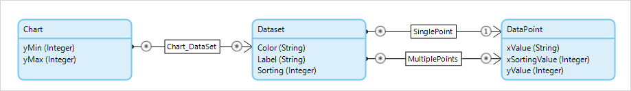

## 1 Introduction

The [ChartJS](https://appstore.home.mendix.com/link/app/1712/) widget is a wrapper for the [Chart.js](https://www.chartjs.org/) library.

## 2 Configuration

The data for this widget is retrieved through a data-source microflow. The assumption here is that all aggregation of data is done in the microflow, and non-persistable objects are sent back to the widget.

We suggest using the following domain model:

However, you can create your own domain model as long as it matches the widget's data-source requirements.

### 2.1 Chart Data Source

* The data source is a microflow that returns an object of the same entity as the **Chart** entity
* **yMin** – for setting the minimum value on which the Y-axis starts
* **yMax** – for setting the maximum value on which the Y-axis starts

### 2.2 Dataset

* **Dataset** entity – the reference set that connects the **Chart** entity to the dataset  or **Series** entity
	* This entity is used to display multiple lines or bars, or in the case of the Pie and Doughnut charts, it will define the different values that are shown
* **Label** attribute – contains the label for the dataset that is used in the tooltip and the legend
* **Color** attribute (in Hex) – contains the color for the dataset line or bar in Hexidecimal (for example, **#1f6ab3**)
* **Sorting** – contains the sorting value for the dataset (so you can configure your dataset sorting separately from the labels)

### 2.3 DataPoint

* **DataPoint** entity – the reference set that connects the **Dataset** entity to the **DataPoint** entity
	* This entity contains the values for each point in the dataset
	* This is a reference set for the Line, Bar, StackedBar, and Radar charts
	* This is a reference for the Pie, Doughnut, DoubleDoughnut, and Polar charts
* **xValue** attribute – contains the X value for the data point
* **xSortingValue** attribute – contains the X sorting value for the data point
* **yValue** attribute – contains the Y value for the data point

## 3 Behavior

* **Onclick** microflow – executed when any part of the actual chart (not the legend) is clicked and passes the data view context object along

## 4 Settings

All the settings for this widget match the original Chart.js settings. These settings are documented in the [Chart.js](https://www.chartjs.org/docs/latest/) documentation.
