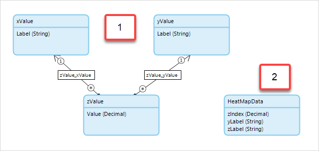

## 1 Introduction

The [Charts](https://appstore.home.mendix.com/link/app/105695/) widget enables plotting and comparing your data across different charts.

These are the available charts:

* Column chart
* Line chart
* Pie chart
* Area chart
* Bar chart
* Time series chart
* Heat chart
* Bubble chart

### 1.1 Demo App Project

For a demo app project that has been deployed with these widgets, see [here](https://charts102.mxapps.io).

## 2 Basic Configuration

### 2.1 Line Chart {#line-chart}

A **Line chart** (scatter chart) should have one or more series, each displaying commonly grouped data points.

A series' data can be retrieved from the database, by a microflow, or from a REST endpoint:

1. Place the widget in a page within the context of an entity.
2. Select the either **Static** or **Dynamic** for the **Series**.
3. Select a **Data entity** for the chart values.
4. Select the **Data source**:
	* If the **Data source** selected is **Database**, optionally change the **XPath constraint**
	* If the **Data source** selected is **Microflow,** select a **Microflow** that returns the series values
	* If the **Data source** selected is **REST endpoint**, enter the **REST URL**
5. If you set a **Dynamic** series, this will retrieve all the chart series in one configuration. Add configurations for them on the **Dynamic series** tab.

{}
The line chart's X-axis provides support for dates, and thus the line chart can be configured as a [time series chart](#time-series).
{}

### 2.2 Area Chart

The **Area chart** has data properties identical to those of the [Line chart](#line-chart).

### 2.3 Column Chart {#column-chart}

The **Column chart** has data properties identical to those of the [Line chart](#line-chart). However, there is no support for the **Date and time** data type.

### 2.4 Bar Chart

The **Bar chart** has data properties identical to those of the [Column chart](#column-chart). 

### 2.5 Pie Chart {#pie-chart}

Unlike the chart types above, the **Pie chart** requires no series. 

These are the properties for configuring Pie chart data:

* **Data source** tab
	* **Entity** (required) – the entity from which the data values will be retrieved
* **Data points** tab
	* **Name attribute** (required) – the attribute that contains the data point captions
	* **Value attribute ** (required) – the attribute that contains the data point values
	* **Color attribute ** (required) – the attribute that contains the data point colors
	* **Sort attribute** – the attribute to use for sorting the X-axis data

### 2.6 Time Series Chart {#time-series}

The **Time series chart** is a specialised version of the [Line chart](#line-chart), focusing on the X-axis dates. Therefore, it has data properties identical to those of the line chart.

### 2.7 Heat Map

The **Heat map** should be configured with required horizontal, vertical, and data attributes.

The sample domain model could be either of the two configurations below:



### 2.8 Bubble chart

The **Bubble chart** has data properties identical to those of the the [Line chart](#line-chart). However, the **Bubble size data** attribute is required, as it contains and determines the size of the bubble.

## 3 Advanced Configuration

The charts in this widget are based on the [mendixlabs/charts](https://github.com/mendixlabs/charts/issues) library. As such, the widget provides support for advanced users to extend or overwrite the basic settings by adding the chart properties as JSON.

To enable this feature, go to the **Mode** option in the **Advanced** properties tab. For the [Line chart](#line-chart) and [Column chart](#column-chart), each series has its own **Advanced** tab for specialized configurations.

The available advanced options and their usage are described below.

### 3.1 Layout Options for All Charts

The layout options control the general appearance of a chart. Common options include `title`, `showlegend`, `xaxis`,  and `yaxis`. 

```
{
  "showlegend": true,
  "legend": {
    "orientation": "h",
    "y": "auto"
  }
}
```

### 3.2 Configurations Options for All Charts

Configuration options control the appearance of a chart beyond the layout options. Common options include `displayModeBar` and `doubleClick`.

```
{
  "displayModeBar": true,
  "doubleClick": true,
  "displaylogo": false
}
```

For more details, see the [Addvanced Configuration Settings](https://raw.githubusercontent.com/mendixlabs/charts/v1.4.4/AdvancedCheatSheet.md).

### 3.3 Data Options for the Pie Chart

On the [Pie chart](#pie-chart), the data options control the appearance of the pie circle beyond the general layout options. Options include `hole`, `name`, and `marker`.

```
{
  "hole": 0.5
}
```

For more details, see the [Addvanced Configuration Settings](https://raw.githubusercontent.com/mendixlabs/charts/v1.4.4/AdvancedCheatSheet.md).

### 3.4 Series Options for the Line and Column Charts

The series options control the appearance of a specific series on the [Line chart](#line-chart) and [Column chart](#column-chart). Options include `line color` and `line shape`.

For the full Plotly API reference, see [JavaScript Figure Reference](https://plot.ly/javascript/reference/).

### 3.5 Theme-Based Advanced Configuration

The settings above can also be added in a global context via the **theme** folder of your Mendix app project root directory.

Add a *.json* file named *com.mendix.charts* to the **theme** folder. The JSON should be in the following format:

```
{
  "layout": {
    // Add shared layout options here (for all charts)
  },
  "configuration": {
    // Add shared configuration options here (for all charts)
  },
  "charts": {
    "LineChart": {
      "layout": {
        // Add line chart only layout options here
      },
      "data": {
        // Add line chart only data options here
      },
      "configuration": {
          // Add line chart only configuration options here
      }
    },
    "AreaChart": {
      // Same arrangement as the line chart
    },
    "BubbleChart": {
      // Same arrangement as the line chart
    },
    "TimeSeries": {
      // Same arrangement as the line chart
    },
    "ColumnChart": {
      // Same arrangement as the line chart
    },
    "BarChart": {
      // Same arrangement as the line chart
    },
    "PieChart": {
      // Same arrangement as the line chart
    },
    "HeatMap": {
      // Same arrangement as the line chart
    }
  }
}
```

{}
Use this with caution, as the configs set up here shall be applied to every instance of the charts in your application. Only the advanced configurations set up in the widget itself have a higher precendence.
{}

## 4 Developing This App Store Component

For details on development, see [Development](https://raw.githubusercontent.com/mendixlabs/charts/v1.4.4/Development.md).

We are actively maintaining this widget. Please report any issues or suggestions for improvement at [mendixlabs/charts](https://github.com/mendixlabs/charts/issues).

## 5 Read More

* [How to Fine-Tune a Chart with Advanced Settings](https://docs.mendix.com/howto/front-end/charts-advanced-tuning)
* [How to Create a Basic Chart](https://docs.mendix.com/howto/front-end/charts-basic-create)
* [How to Use a Chart with a REST Data Source](https://docs.mendix.com/howto/front-end/charts-basic-rest)
* [How to Create a Dynamic Series Chart](https://docs.mendix.com/howto/front-end/charts-dynamic-series)
* [How to Use the Charts Theme](https://docs.mendix.com/howto/front-end/charts-theme)
