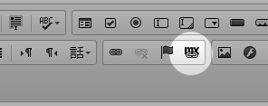
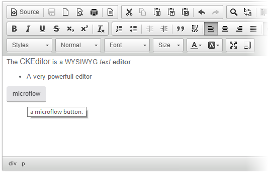
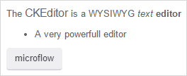
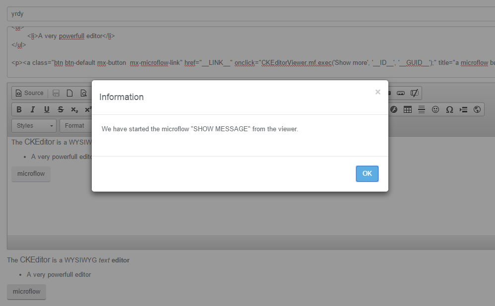

## 1 Introduction

The [CKEditor](https://appstore.home.mendix.com/link/app/1715/) gives you a full version of the CKEditor with an extra button that allows you to create microflow links inside your HTML output:

A recommended alternative editor that is also platform-supported is the [Rich Text](https://appstore.home.mendix.com/link/app/74889/) widget.

### 1.1 Typical Usage Scenarios

Use this widget to add a full WYSIWYG editor for your entity attributes. You can also add links to HTML that, when clicked, run microflows.

## 2 Description

The CKEditor widget comes with the CKEditor viewer. This viewer enables reformatting links to microflow links with the following conditions:

* The viewer needs an entity and attribute where it can get the HTML code
* You can style the link as a button or just text
* Within the widget, you can configure the label placed in the link button
	* This label can be configured in the viewer to execute a microflow, which will get the entity from the viewer widget

### 2.1 Examples

This is an example of the editor:

This is that example as an end-result in Mendix:

And here is the example of someone clicking the **microflow** button:

