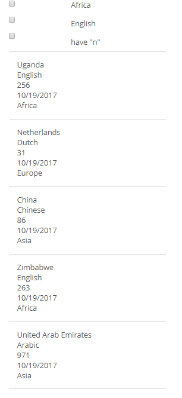
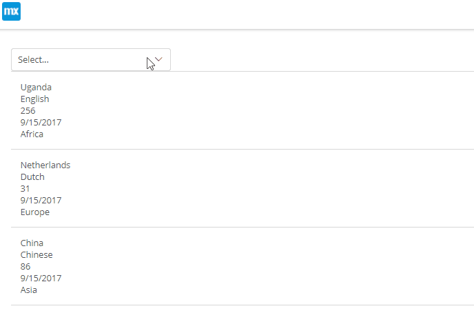
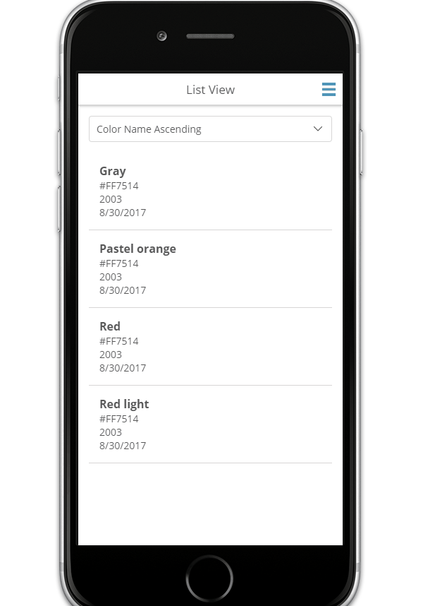
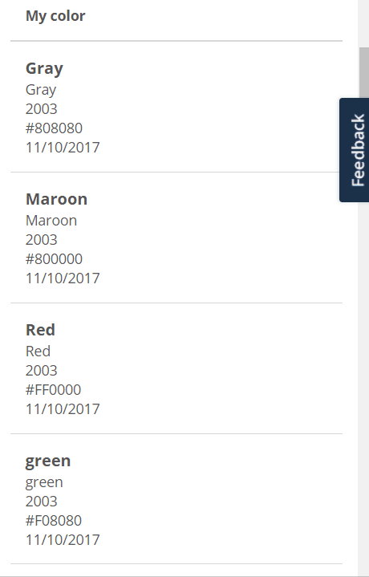
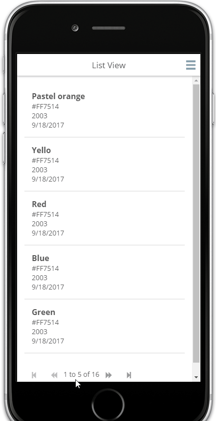
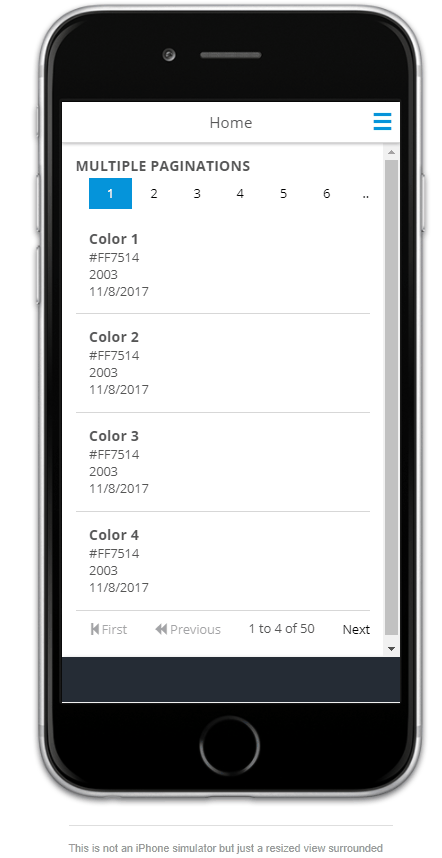
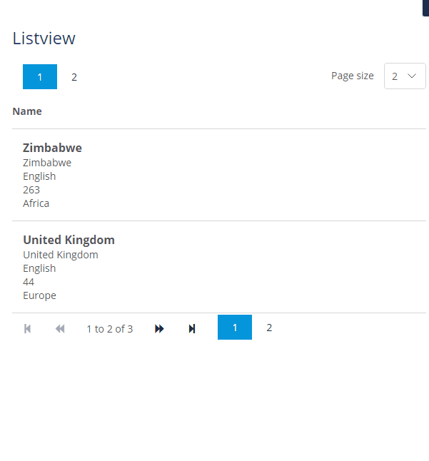
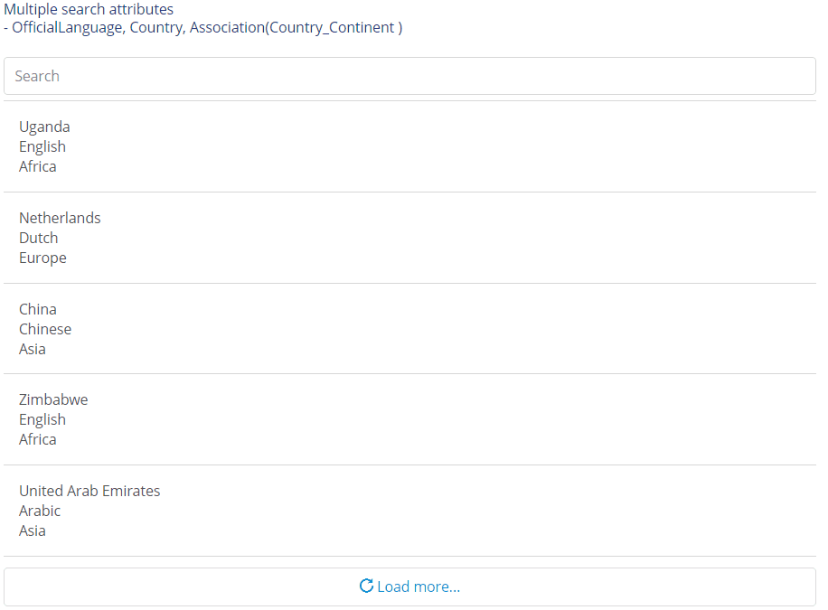

## 1 Introduction

The [List View Controls](https://marketplace.mendix.com/link/component/105694/) enable filtering and searching a list view with the database and XPath data sources.

These are the available list view widgets:

* [Check box filter](#check-box-filter) – filters a list view with various constraints when checked or unchecked
* [Drop-down filter](#drop-down-filter) – filters a list view with various options that can be selected from a drop-down
* [Drop-down sort](#drop-down-sort) – adds an interactive sort to your list view.
* [Header sort](#header-sort) – add sorting behavior to the headers of a list view.
* [Pagination](#pagination) – adds bootstrap like paging to a list view and page numbers similar to in-built data grid
* [Text box search](#text-box-search) – adds an interactive search box to all of your list view

{}

If an entity in a list view has an attribute populated by a microflow, it will cause an error.

{}

## 2 Check Box Filter Widget {#check-box-filter}

This widget enables filtering a list view at runtime with various constraints.

### 2.1 Features

* Filter items by attribute
* Filter items by XPath
* Configure filter actions when the widget is checked or unchecked
* Set a checked check box as default
* Support for multiple filters on the same list view

### 2.2 Configuration

* **General** tab
	* **List view with entity** – the entity name for the target list view
* **Checked** and **Unchecked** tabs
	* **Filter** – start setting up the filter actions to be applied when the widget is checked or unchecked
		* **Attribute** – select an attribute and input an attribute value by which to filter
			* **Boolean** data type – use a `true` or `false` string
			* **Enumeration** data type – use the enumeration name/key (not **caption**)
		* **XPath** – input a constraint by which to filter (**none** is for an empty option which resets the filter then selected)

{}
The widget connects to the first list view it finds from within its parent container and outer wards.
{}

### 2.3 Example

{}

{}

## 3 Drop-Down Filter Widget {#drop-down-filter}

When placed above a list view, this widget enables filtering the list view at runtime with various options that can be selected from a drop-down menu.

### 3.1 Features

* Filter items by an attribute
* Filter items by XPath
* Select a filter from a list of options
* Set a default filter option

### 3.2 Configuration

* **General** tab
	* **List view with entity** – the entity name for the target list view
	* **Filter options** > **New** – only one empty filter option should be selected
		* **None** – an empty option that resets the filter then selected; this does not require a caption
		* **Attribute** – select an attribute and input a value by which to filter
		* **XPath** – input a constraint by which to filter

### 3.3 Example

{}

{}

## 4 Drop-Down Sort Widget {#drop-down-sort}

This widget adds an interactive sort to your list view. It supports sorting on a single field, similar to the built-in list view sort capabilities.

### 4.1 Features

* Sort through a single field
* Specify an option to sort list view items on load (if multiple defaults are selected, the widget will select the first one)

### 4.2 Configuration

* **Data source** tab
	* **List view with entity** – select the **entity** property of the list widget you want to sort; this entity must be the one used on the list view.
	* **Sort attributes** – select the attribute on the list widget entity to be sorted

### 4.3 Example

{}

{}


## 5 Header Sort Widget {#header-sort}

This is an example of the header sort widget:

{}

{}

## 6 Pagination Widget {#pagination}

With this widget, you can add Bootstrap-like paging to your list view, similar to the built-in data grid. This widget also supports page numbers.

### 6.1 Features

* **Custom** tab > **Items** editor > **Text** tab – text that can be added to pagination in combination with the follow place holders: `{firstItem} {lastItem} {totalItems} {currentPageNumber} {totalPages}`
* **Page size** tab – this feature limits the number of items on the list view

### 6.2 Configuration

* **Appearance** tab
	* **Hide unused paging** – specify if the buttons should be hidden when they are not needed (for example, when the records are few)
	* **Paging style** – specify how the buttons should look:
		* **Default** – shows the pagination with the looks similar to Mendix data grid paging
		* **Page number buttons** – shows the pagination as numbers with the default set to seven
		* **Custom** – allows the pagination to be configured to look the way one desires

### 6.3 Examples

* Lower pagination:
	
	{}
	
	{}
  
* Multiple paginations:

	{}
	
	{}

* Page size:
	
	{}
	
	{}
	
## 7 Text Box Search Widget {#text-box-search}

Add an interactive search box to all of your list views with this widget. This supports searching on a single field, similar to the built-in list view search capabilities.

### 7.1 Features

* Search through a single field with single and multiple attributes
* Open the search in default

### 7.2 Configuration

* **General** tab
	* **List view with entity** – select an entity that matches the list view entity
	* **Attributes** – select the attributes to be used in the text search

### 7.3 Sample

{}

{}

## 8 Developing This Marketplace Component

### 8.1 Prerequisites

* [Git](https://git-scm.com/book/en/v2/Getting-Started-Installing-Git)
* [npm](https://www.npmjs.com/)
* [webpack-cli](https://www.npmjs.com/package/webpack-cli)
* [grunt cli](https://github.com/gruntjs/grunt-cli)
* [karma cli](https://www.npmjs.com/package/karma-cli)

### 8.2 Developing

1. Fork and clone the [mendix/list-view-controls](https://github.com/mendix/list-view-controls) repository. The code is in Typescript.
2. Set up the development environment by running `npm install`.
3. Create a folder named *dist* in the app root.
4. Create a Mendix test app in the *dist* folder and rename its root folder to *dist/MxTestApp*, or get the test app from [mendix/list-view-controls/releases](https://github.com/mendix/list-view-controls/releases/). Changes to the widget code will be automatically pushed to this test app.
5. To automatically compile, bundle, and push code changes to the running test app, run `npm start`.
6. To run the app unit tests with code coverage (results can be found at `dist/testresults/coverage/index.html`), run: `npm run test:unit`.
7. Run the unit test continuously during development via `npm run test:dev`.
8. Run the end-to-end test during development via `npm run test:e2e:dev`.

### 8.3 Scripts

While developing, you will probably rely mostly on `npm start`. However, there are additional scripts at your disposal:

| npm run `<script>` | Description |
| --- | --- |
| start | Builds the app, monitors the source and config for changes, and rebuilds. |
| test | Runs lint, builds, unit tests with Karma, generates a coverage report, deploys, and runs end-to-end test. |
| test:dev | Runs Karma and watches for changes to re-run tests. Does not generate coverage reports. |
| test:unit | Runs unit tests with Karma and generates a coverage report. |
| test:e2e  | Runs end-to-end tests with remote. |
| test:e2e:dev | Runs end-to-end tests locally on localhost:8080. |
| deploy | Uses the latest widget build to update the Mendix app and updates the application to the Mendix node. |
| build:prod | Builds a widget optimized for production. |
| build:dev | Builds a widget optimized for debugging. |
| lint | Lints all *.js* files. |
| lint:fix | Lints and fixes all *.ts* files. |

### 8.4 CI & Remote Testing

To enable continuous integration services, copy the *node_modules/mendix-widget-build-script/dist/localSettings.js* file to your app root, and update the settings to run the update deployment from the local source. Do not forget to exclude this file in the *.gitignore* file, as it contains sensitive data.

```
exports.settings = {
    appName: "appName",
    key: "xxxxxxxx-xxxx-xxxx-xxxxx-xxxxxxxxxxxx",
    password: "secret",
    projectId: "xxxxxxxx-xxxx-xxxx-xxxxx-xxxxxxxxxxxx",
    user: "ci@example.com"
};
```

For more information, see [Mendix widget build script](https://github.com/FlockOfBirds/mendix-widget-build-script).
