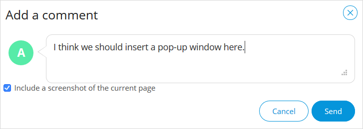

## 1 Introduction

The [Mendix Feedback](https://marketplace.mendix.com/link/component/199/) widget allows end-users of your application to directly submit feedback into your app. The feedback widget is fully integrated with the [Feedback](/developerportal/collaborate/feedback) page in the Developer Portal, where you can review feedback and convert it into [user stories](/developerportal/collaborate/stories) to improve your app.

The Mendix Feedback widget is easy to set up and automatically attaches additional information to each submitted issue such as the user's name, role, active form, browser version, and screen resolution.

### 1.1 Typical Usage Scenario

* Gathering feedback from end-users in an acceptance or production environment
* Reducing the length of the feedback loop

### 1.2  Features

* Gathers detailed information about the client state
  
### 1.3 Limitations

* Only usable in combination with Mendix apps

## 2 Using the Widget

The Feedback widget can be used for a variety of purposes, which are described below.

### 2.1 Submitting Feedback on an App

When you click the **Feedback** icon, the Mendix Platform first checks if you are signed in. If you are already signed in, you will be in **Feedback Mode** right away. If you are not signed in, you will need to either **Sign in to Mendix** or **Continue as a guest** to enter feedback mode:

Once you are in feedback mode, you can click anywhere on the screen to leave a comment:

And voila! A screenshot of the current page is created automatically, which you can choose to attach to your feedback. After clicking **Send**, your feedback will go straight to the [Feedback](/developerportal/collaborate/feedback) page of the app in the Developer Portal.

When you have left your feedback, you need to exit the feedback mode by clicking this button:

{}
For details on how to see all the feedback you have submitted, see the [Feedback](//developerportal/community-tools/mendix-profile/#feedback) section of *Mendix Profile*.
{}

### 2.2 Editing the App

Clicking the **Edit** icon opens the app page in [Mendix Studio](/studio/). If you have permissions to edit the app, you can start editing and collaborating right away.

### 2.3 Viewing the App

When you click the **Mobile view**  icon, a pop-up window is displayed that enables viewing your app on a mobile device:

You can access this mobile view by installing the [Mendix Mobile app](https://play.google.com/store/apps/details?id=com.mendix.SprintrMobile) and then scanning the QR code in the pop-up window. 

### 2.4 Sharing the App

When you click the **Share** icon on the widget, a pop-up window appears for sharing your app via **Email**:

{}
{}

You can add as many email addresses as you like and email your app to colleagues for further collaboration and feedback.

### 2.5 Switching Between Apps {#app-switcher}

When you click the **App Switcher** button, a pop-up window appears with a list of other Mendix SSO-enabled apps that you have access to:

{}
{}

When you click an app, you are redirected to it.

{}
This feature is available when the following conditions are met: 

* You have configured the widget to show the App Switcher (for details, see the [Configuring the Widget](#configuring) section below) 
* Your app uses [Mendix SSO](/developerportal/deploy/mendix-sso)
{}

## 3 Adding & Configuring the Widget

You should use the latest version of the Mendix Feedback widget, as it will provide the most up-to-date features for leaving feedback and communicating with the [Team](/developerportal/collaborate/team).

### 3.1 Adding the Widget to Your app

To ensure you have the latest version of the widget included in your app, follow these steps:

1.  Download the latest version of the [Mendix Feedback](https://marketplace.mendix.com/link/component/199/) widget from the Marketplace. You are strongly encouraged to use version 8.2.1 or above of the widget.
2.  When the widget is included in your app, ensure that it is added to the homepage of the application. Open the homepage from your app's **App** > **Navigation**:

	

3.  If the widget has not been added automatically, add it to the desired page or layout by selecting **Add widget** > **Add-on widgets** > **Feedback & Collaboration Widget** and dropping it into a position in the page:

	

{}
You can place the widget on any form in your app, but it needs to be placed on only one form. When the end-user accesses that form, the widget will remain in the browser until the session is expired. This means you only need to place the widget on the home form. You can use this mechanism to limit the feedback to certain user roles as well. To do that, just place the widget on their home forms but not on the home form of other users.
{}

### 3.2 Configuring the Widget {#configuring}

You can configure the widget for certain actions in your app (for example, to allow screenshots, to hide the Mendix logo, and to hide the **Share** button). All the configuration properties are explained on the various tabs of the properties dialog box for the widget.

The feedback feature requires the following properties to be set:

* **Project** tab > **App ID** – the unique identifier of your app available in your app's [General Settings](/developerportal/collaborate/general-settings) in the Developer Portal
* **Advanced** tab > **Feedback server location** – the URL of the Developer Portal server (usually `https://sprintr.home.mendix.com`)

For the best user experience, your are strongly encouraged to apply Mendix SSO to your app and connect the [Mendix SSO](/appstore/modules/mendix-sso) module to version 8.2.1 or above of the Mendix Feedback widget. For version 8.1.0 or above of the widget, you need to set the following:

*  **MendixSSO Authentication** tab > **Decrypted Token Entity** – select the entity **DecryptedToken** from the Mendix SSO module
*  **MendixSSO Authentication** tab > **Decrypted Token Value** – after selecting **Decrypted Token Entity**, select the **Value** attribute from it
*  **MendixSSO Authentication** tab > **ID token provider** – select the **DS_GetCurrentIdToken** microflow from the Mendix SSO module

The result should look like this:

{}
If Mendix SSO is applied and the above **MendixSSO Authentication** settings are configured correctly, the end-user can leave feedback without having to enter their name and email address. If you are not using the Mendix SSO module and are using other SSO solutions instead, you should configure the settings in the **Custom Authentication** tab. In this tab, you can provide a microflow that should return a valid user name and email when the end-user is signed in with your authentication solution. The Feedback widget will then go directly into feedback mode. If the end-user is not signed in (meaning, the **User Object Provider** microflow returns an empty user name or an invalid email address), the end-user will have to manually enter their name and email address when they leave feedback.
{}

The [app switcher](#app-switcher) feature requires the [Mendix SSO](/appstore/modules/mendix-sso) module to be implemented and the following property to be set:

* **Advanced** tab > **Show App Switcher button** – set to **Yes**

You can also configure the widget for certain actions in your app, for example:

* **Project** tab > **Allow screenshots**
* **Project** tab > **Hide Mendix logo**
* **Collaboration** tab > **Share button**

## 4 Troubleshooting

### 4.1 Upgrading the Widget from Desktop Modeler 7 to Studio Pro 8

If you are trying to upgrade your Mendix Feedback widget from version 7 to version 8, [Studio Pro](/refguide/) will not recognize the current configuration of this widget. Add the Mendix Feedback widget into your page again and configure it accordingly. Then delete the old one.

### 4.2 MPK Error

If you encounter the following issue, you need to delete the old *.mpk* file in the **/widgets/FeedbackWidget.mpk**  folder of your app:

