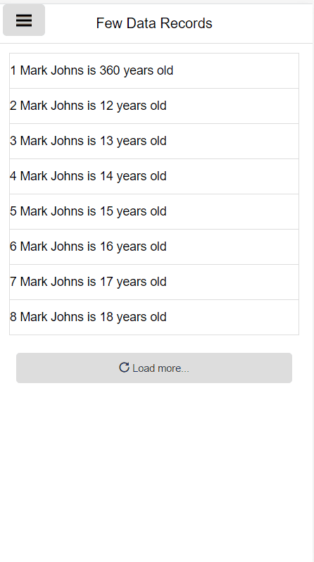

## 1 Introduction

The [Pull to Refresh](https://appstore.home.mendix.com/link/app/47782/) widget enables the end-user to pull down on mobile apps to trigger a page refresh or a synchronization for offline apps.

### 1.1 Features

* Overlay with icon and message shown when pulling down
* Refresh current page when online
* Works when offline and re-syncs when back online
* Message for pull, release, and reload
* Cancel refresh when swiping up
* Does not interfere with scroll behavior

### 1.2 Limitations

* When refreshing a page, the list view does not keep **Load more** items
* Only works when app is scrolled to top

### 1.3 Demo App Project

For a demo app project that has been deployed with this widget, see [here](https://pulltorefresh.mxapps.io).

## 2 Usage

To use this widget, follow these steps:

1. Place the widget on a page or layout.
2.  Add the following on the **Display** tab:
	* **Text when pulling down**
	* **Release to refresh text**
	* **Text when refreshing**
3. In the client, pull down the page until the **Release to refresh text** appears in order to refresh the page.

## 3 Developing This App Store Component

We are actively maintaining this widget. Please report any issues or suggestions for improvement at [mendixlabs/pull-to-referesh](https://github.com/mendixlabs/pull-to-refresh/issues).
