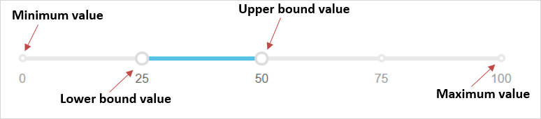
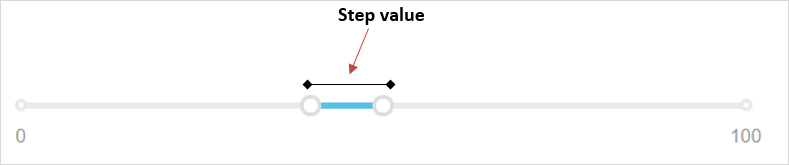

## 1 Introduction

The [Range Slider](https://appstore.home.mendix.com/link/app/52704/) widget can be used to change the range of values using a slider.

### 1.1 Features

* Adjust lower bound and upper bound values on the slider
* Execute a microflow when a slider value is changed or clicked
* Show or hide a tooltip upon hover
* Render range slider with different Bootstrap colors

### 1.2 Demo App Project

For a demo app project that has been deployed with this widget, see [here](https://rangeslider.mxapps.io/).

## 2 Configuration

On the **Data source** tab, configure these properties:

* **Range minimum attribute** – the attribute that contains the minimum slider value; if not provided, the **Default minimum value** is used
* **Range maximum attribute** – the attribute that contains the maximum slider value; if not provided, the **Default maximum value** is used
* **Selected minimum attribute** – the attribute that contains the minimum bound slider value
* **Selected maximum attribute** – the attribute that contains the maximum bound slider value

## 3 Usage

### 3.1 Two Values vs. One Value

The Range Slider widget allows you to set two values between two bounds (the minimum value and maximum value). However, if only one value needs to be set between two bounds, you should use the [Slider](https://appstore.home.mendix.com/link/app/48786/) widget instead.

### 3.2 Sample Slider

In Studio Pro, place the widget in the context of an object that has attributes for the maximum value, minimum value, lower bound value, and upper bound value. The maximum and minimum values determine the range within which the range slider values can be adjusted.

The step value determines the next point to shift to when sliding (meaning, the interval between points or numbers):

For the step value, the difference between the maximum value and the minimum value should be divisible by 2 (as in, `(maximumValue - minimumValue) % 2 = 0`).

## 4 Developing This App Store Component

To contribute to the development of this widget, follow these steps:

1. Install following:
	* [Git](https://git-scm.com/book/en/v2/Getting-Started-Installing-Git)
	* [npm](https://www.npmjs.com/)
	* [webpack-cli](https://www.npmjs.com/package/webpack-cli)
	* [grunt-cli](https://github.com/gruntjs/grunt-cli)
	* [karma-cli](https://www.npmjs.com/package/karma-cli)

2. Fork and clone the [mendixlabs/range-slider](https://github.com/mendixlabs/range-slider.git) repository. The code is in Typescript. 
3. Set up the development environment by running `npm install`.
4. Create a folder named *dist* in the project root.
5. Create a Mendix test project in the *dist* folder and rename its root folder to *dist/MxTestProject*, or get the test project from [mendixlabs/range-slider](https://github.com/MendixLabs/range-slider/releases/latest). Changes to the widget code will be automatically pushed to this test project.
6. To automatically compile, bundle, and push code changes to the running test project, run `grunt`.
6. To run the project unit tests with code coverage (results can be found at `dist/testresults/coverage/index.html`), run: `npm test`
7. Run the test continuously during development via `karma start`.

We are actively maintaining this widget. Please report any issues or suggestions for improvement at [mendixlabs/range-slider](https://github.com/mendixlabs/range-slider/issues).
