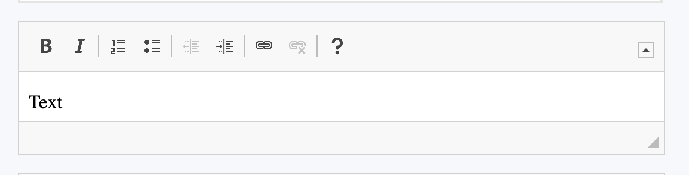
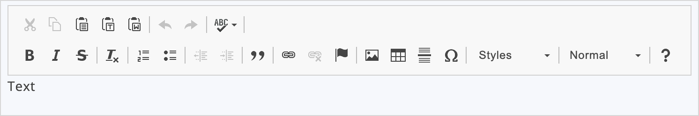
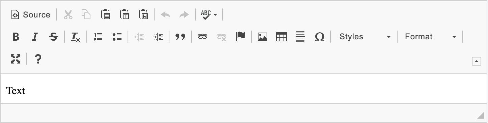
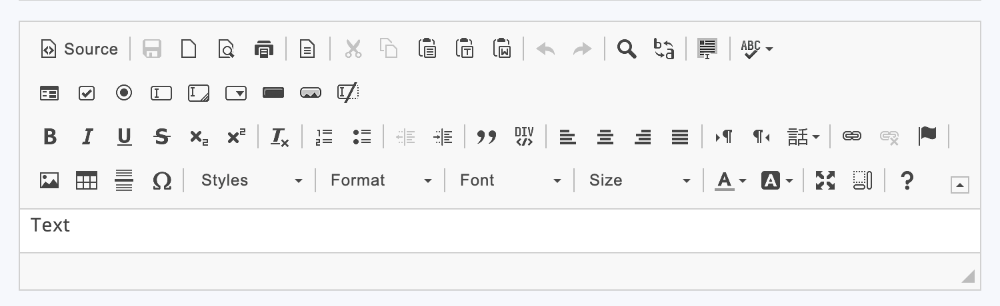

## 1 Introduction

The [Rich Text](https://marketplace.mendix.com/link/component/74889/) widget enables rich inline and toolbar text editing.

### 1.1 Features

* Format selected text
* HTML output of formatted text
* Show editor options either on a toolbar or as a bubble
* Use the toolbar tab to select which editor preset you want to show
	* **Basic** - This package contains plugins suitable for quick input fields.
	* **Standard** - This package contains plugins that can be used for creating standards-compliant content.
	* **Full** - This heavier package contains plenty of plugins suitable for various different needs.
	* **Custom** - The simplest way to configure the toolbar as you want.
* Input and display text is sanitized
* Use **Enter and Shift+Enter** mode to configure how you want to wrap your content
	* Paragraph (`
`)
	* Break lines (` `)
	* Blocks (`
`)
* Use highlight code feature to insert rich code fragments and see a live preview with highlighted syntax.
* Use advanced filter content to allow or disallow elements in your rich text or use auto configuration.

## 2 Configuration

Place the widget in a data view, list view, or template grid with a data source that has a string attribute. Then, select the **Value attribute** that contains the editable text.

### 2.1 General tab

* **Editor style** - choose wheater you want it to be as a toolbar or inline
	* Defatult: **Toolbar**
	
	* Inline
	
* **Data source** - should be a string value
* **Sanitize content** - clean your content from untrusted strings
	* Default: **Yes**
* **Read-only style** - defines how you want your editor look when the value is disabled (works when *editablity* set to *never* or *condition* returns false)
	* Rich text - only text will be visible
	* Bordered - text will be visible within a frame
	* Bordered toolbar - editor will be visible as normal but editing actions and content will be disabled

### 2.2 Toolbar tab

* **Presets** - select which editor preset you want to show
	* Basic
	
	* Standard
	
	* Full
	
	* Custom - when custom you can choose between *basic* and *advanced* configurations
		* Basic - allows you to use groups defined in [Toolbar group](https://ckeditor.com/docs/ckeditor4/latest/features/toolbarconcepts.html#toolbar-groups-configuration)
		* Advanced - allows you to use groups configured ["Item by Item"](https://ckeditor.com/docs/ckeditor4/latest/features/toolbarconcepts.html#item-by-item-configuration)

### 2.3 Advanced tab

* **Enter mode** - allows you to configure how your content will be wrapped when you press *return* button
	* Paragraph (`
`)
	* Break lines (` `)
	* Blocks (`
`)
* **Shift enter mode** - same as **enter mode** only valid when you use *shift* + *return*
* **Spellchecker** - provides inline spelling and grammar checking
* **Enable code highlight** - allows you to configure your *code sections* in the text
* **Advanced content filtering** - define your own configuration for html sanitization
	* Default: **Auto** - editor will take care of that
	* Custom - define which tags you want to allow or disallow
		* Allowed content - put tags here which you want to allow
		* Disallowed content - put tags here which you want to remove

## 3 Usage

All the hot keys defined in previous documentation work here as well

## 4 Previous Versions' Documentation

### Widgets below v2.0.0

### 1.1 Features

* Format selected text
* HTML output of formatted text
* Show editor options either on a toolbar or as a bubble
* Use the custom option to select which editing options you want to show
* Input and display text is sanitized

## 2 Configuration

Place the widget in a data view, list view, or template grid with a data source that has a string attribute. Then, select the **Value attribute** that contains the editable text.

The input and output is sanitized. All unsupported HTML tags and JavaScript is removed for security reasons. The following are supported:

* Tags: `h1`, `h2`, `h3`, `h4`, `h5`, `h6`, `p`, `br`, `a`, `ul`, `li`, `ol`, `s`, `u`, `em`, `pre`, `strong`, `blockquote`, `span`
* Attributes:
	* For all tags: `class`, `style`
	* `a` tag: `href`, `name`, `target`
* Schemes: `http`, `https`, `ftp`, `mailto`

{}
To be fully secure, all user HTML input should be sanitized on the server side too. This could be done with the XSSSanitize action found in the [Community Commons](/appstore/modules/community-commons-function-library). When the option 'Sanitize content' is set to 'false' server side sanitating is required before showing any HTML content.
{}

## 3 Usage

The following keyboard shortcuts can be used when editing:

* <kbd>Ctrl</kbd> + <kbd>B</kbd> – bold
* <kbd>Ctrl</kbd> + <kbd>I</kbd>– italicize
* <kbd>Ctrl</kbd> + <kbd>U</kbd> – underline
* <kbd>Ctrl</kbd> + <kbd>Z</kbd> – undo
* <kbd>Ctrl</kbd> + <kbd>Y</kbd> – redo
* <kbd>Ctrl</kbd> + <kbd>C</kbd> – copy
* <kbd>Ctrl</kbd> + <kbd>V</kbd> – paste
* <kbd>-</kbd> + <kbd>space</kbd> – start list
* <kbd>tab</kbd> – indent the content when <kbd>tab</kbd> is configured to indent from the widget XML; otherwise, move the focus to the next element
