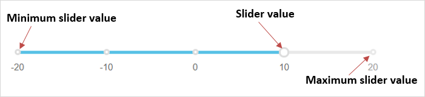
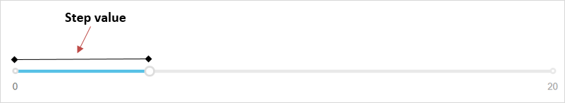

## 1 Introduction

The [Slider](https://appstore.home.mendix.com/link/app/48786/) widget can be used to change a number value using a slider.

### 1.1 Features

* Adjust the slider value
* Execute a microflow when a slider value is changed or clicked
* Show a tooltip on hover
* Render slider with different bootstrap colors

### 1.2 Demo App Project

For a demo app project that has been deployed with this widget, see [here](https://slider.mxapps.io/).

## 2 Properties

* **Value attribute** – the selected value on the slider
* **Range minimum attribute** – the attribute that contains the minimum slider value; if not provided, **Default minimum value** is used
* **Range maximum attribute** – the attribute that contains the maximum slider value; if not provided, **Default maximum value** is used

## 3 Usage

The slider enables setting a value between two bounds (minimum value and maximum value). However, if there are two values that need to be set between two bounds, using the [Range Slider](range-slider) widget is recommended..

In Studio Pro, place the widget in the context of an object that has attributes for a maximum value, minimum value, and value. The maximum and minimum values determine the range within which the slider value can be adjusted. The step value determines the next point to shift to when sliding (meaning, it is the interval between two points or numbers).

When choosing the step value, the difference between the maximum value and the minimum value should be divisible by 2 (meaning, `(maximumValue - minimumValue) % 2 = 0`).

## 4 Developing This App Store Component

To contribute to the development of this widget, follow these steps:

1. Install the following:
	* [Git](https://git-scm.com/book/en/v2/Getting-Started-Installing-Git)
	* [npm](https://www.npmjs.com/)
	* [webpack-cli](https://www.npmjs.com/package/webpack-cli)
	* [grunt-cli](https://github.com/gruntjs/grunt-cli)
	* [karma-cli](https://www.npmjs.com/package/karma-cli)
2. Fork and clone the [mendixlabs/slider](https://github.com/mendixlabs/slider) repository. The code is in Typescript.
3. Set up the development environment by running `npm install`.
4. Create a folder named *dist* in the project root.
5. Create a Mendix test project in the *dist* folder and rename its root folder to *dist/MxTestProject*, or get the test project from [mendixlabs/slider](https://github.com/mendixlabs/slider/releases/latest). Changes to the widget code will be automatically pushed to this test project.
6. To automatically compile, bundle, and push code changes to the running test project, run `grunt`.
7. To run the project unit tests with code coverage (results can be found at `dist/testresults/coverage/index.html`), run: `npm test`.
8. Run the unit test continuously during development via `karma start`.

We are actively maintaining this widget. Please report any issues or suggestions for improvement at [mendixlabs/slider](https://github.com/mendixlabs/slider/issues).

## 5 Read More

* [Native Styling](https://docs.mendix.com/refguide/native-styling-refguide)
